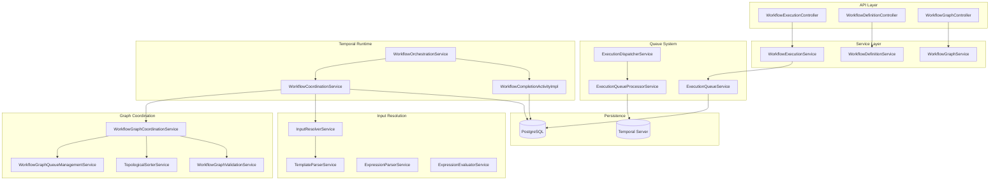
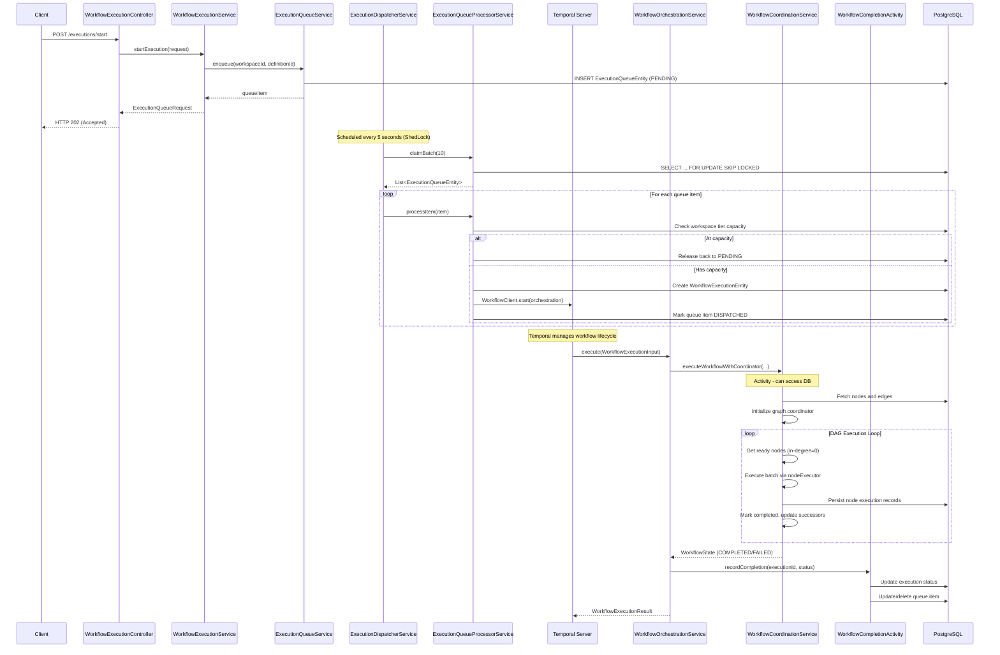
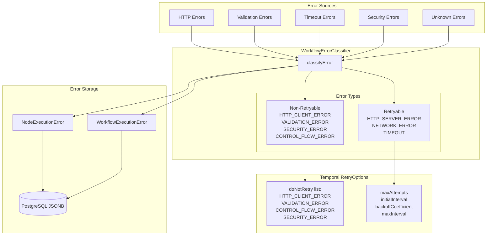

# Riven Core Workflow Engine - Architectural Analysis

> Generated: 2026-01-24
> Purpose: Comprehensive architectural documentation of the workflow execution engine

---

## Table of Contents

1. [High-Level System Overview](#1-high-level-system-overview)
2. [Workflow Execution Flow (End-to-End)](#2-workflow-execution-flow-end-to-end)
3. [Queue Management System](#3-queue-management-system)
4. [Temporal Integration Layer](#4-temporal-integration-layer)
5. [DAG Graph Coordination](#5-dag-graph-coordination)
6. [Node Execution Architecture](#6-node-execution-architecture)
7. [Input Resolution & Template System](#7-input-resolution--template-system)
8. [Execution Context & Data Flow](#8-execution-context--data-flow)
9. [Error Handling & Classification](#9-error-handling--classification)
10. [Complete Service Dependency Graph](#10-complete-service-dependency-graph)
11. [Current Limitations Analysis](#11-current-limitations-analysis)
12. [Summary Table: Service Responsibilities](#12-summary-table-service-responsibilities)

---

## 1. High-Level System Overview



---

## 2. Workflow Execution Flow (End-to-End)



---

## 3. Queue Management System

```mermaid
flowchart TB
    subgraph "Queue States"
        PENDING[PENDING]
        CLAIMED[CLAIMED]
        DISPATCHED[DISPATCHED]
        COMPLETED[COMPLETED]
        FAILED[FAILED]
    end

    subgraph "ExecutionQueueService"
        EQ_ENQUEUE[enqueue]
        EQ_CLAIM[markClaimed]
        EQ_DISPATCH[markDispatched]
        EQ_FAIL[markFailed]
        EQ_RELEASE[releaseToPending]
        EQ_RECOVER[recoverStaleItems]
    end

    subgraph "ExecutionDispatcherService"
        ED_PROCESS[processQueue<br/>@Scheduled 5s<br/>@SchedulerLock]
        ED_RECOVER[recoverStaleItems<br/>@Scheduled 60s]
    end

    subgraph "ExecutionQueueProcessorService"
        EQP_CLAIM[claimBatch<br/>SKIP LOCKED]
        EQP_PROCESS[processItem<br/>REQUIRES_NEW]
        EQP_DISPATCH[dispatchToTemporal]
    end

    EQ_ENQUEUE --> PENDING
    PENDING --> EQP_CLAIM
    EQP_CLAIM --> CLAIMED
    CLAIMED --> EQP_PROCESS
    EQP_PROCESS --> EQP_DISPATCH
    EQP_DISPATCH --> DISPATCHED
    DISPATCHED --> COMPLETED
    DISPATCHED --> FAILED

    CLAIMED -->|Crash recovery| EQ_RECOVER
    EQ_RECOVER --> PENDING

    CLAIMED -->|At capacity| EQ_RELEASE
    EQ_RELEASE --> PENDING

    ED_PROCESS --> EQP_CLAIM
    ED_RECOVER --> EQ_RECOVER
```

### Purpose & Why

| Service | Purpose | Why |
|---------|---------|-----|
| **ExecutionQueueService** | Manages queue state transitions and persistence | Decouples execution requests from dispatch, enabling async processing |
| **ExecutionDispatcherService** | Scheduled job that polls queue | Uses ShedLock for distributed locking across pods |
| **ExecutionQueueProcessorService** | Processes individual items with isolated transactions | `REQUIRES_NEW` ensures partial failures don't rollback entire batch |

---

## 4. Temporal Integration Layer

```mermaid
flowchart TB
    subgraph "Spring Configuration"
        TWC[TemporalWorkerConfiguration]
        TRCP[WorkflowRetryConfigurationProperties]
    end

    subgraph "Temporal Workflow (Deterministic)"
        WOS[WorkflowOrchestrationService]
        WOS_EXEC[execute method]
        WOS_SIDE[Workflow.sideEffect<br/>for config snapshot]
    end

    subgraph "Temporal Activities (Spring Beans)"
        WCS[WorkflowCoordinationService<br/>@Service]
        WCA[WorkflowCompletionActivityImpl<br/>@Service]
    end

    subgraph "Activity Interfaces"
        WC_INT[WorkflowCoordination<br/>@ActivityInterface]
        WCAI[WorkflowCompletionActivity<br/>@ActivityInterface]
    end

    subgraph "Temporal Infrastructure"
        WF[WorkerFactory]
        WSS[WorkflowServiceStubs]
        WC[WorkflowClient]
    end

    TWC --> WF
    TWC --> WSS
    WSS --> WC

    WF -->|registerWorkflowImplementationFactory| WOS
    WF -->|registerActivitiesImplementations| WCS
    WF -->|registerActivitiesImplementations| WCA

    WOS --> WOS_EXEC
    WOS_EXEC --> WOS_SIDE
    WOS_SIDE -->|frozen config| WC_INT
    WOS_EXEC --> WCAI

    WCS -.->|implements| WC_INT
    WCA -.->|implements| WCAI

    TRCP --> TWC
```

### Purpose & Why

| Component | What | Why | How |
|-----------|------|-----|-----|
| **WorkflowOrchestrationService** | Temporal Workflow - Orchestrates DAG execution, manages workflow lifecycle | Temporal workflows must be deterministic; uses `sideEffect()` for config | Delegates all I/O to activities |
| **WorkflowCoordinationService** | Spring Bean Activity - Executes nodes, manages state, persists results | Activities can perform non-deterministic operations (DB, HTTP) | Injects Spring services via constructor |
| **WorkflowCompletionActivityImpl** | Spring Bean Activity - Records final workflow status | Separates completion logic from main orchestration | Updates execution and queue entities |

---

## 5. DAG Graph Coordination

```mermaid
flowchart TB
    subgraph "WorkflowGraphCoordinationService"
        WGCS_EXEC[executeWorkflow]
        WGCS_VAL[Validate DAG]
        WGCS_SORT[Verify topological order]
        WGCS_INIT[Initialize state machine]
        WGCS_LOOP[Execution loop]
    end

    subgraph "WorkflowGraphValidationService"
        WGVS_VAL[validate]
        WGVS_CYCLE[Cycle detection]
        WGVS_EDGE[Edge validation]
        WGVS_CONN[Connectivity check]
    end

    subgraph "WorkflowGraphTopologicalSorterService"
        WGTS_SORT[sort]
        WGTS_KAHN[Kahn's algorithm]
    end

    subgraph "WorkflowGraphQueueManagementService"
        WGQMS_INIT[initialize]
        WGQMS_READY[getReadyNodes]
        WGQMS_MARK[markNodeCompleted]
        WGQMS_MORE[hasMoreWork]

        IN_DEGREE[In-degree Map]
        READY_Q[Ready Queue]
        ADJ_LIST[Adjacency List]
    end

    subgraph "State Machine"
        STATE[WorkflowState]
        TRANS[StateTransition]

        INIT_PHASE[INITIALIZING]
        EXEC_PHASE[EXECUTING_NODES]
        COMP_PHASE[COMPLETED]
        FAIL_PHASE[FAILED]
    end

    WGCS_EXEC --> WGCS_VAL
    WGCS_VAL --> WGVS_VAL
    WGVS_VAL --> WGVS_CYCLE
    WGVS_VAL --> WGVS_EDGE
    WGVS_VAL --> WGVS_CONN

    WGCS_EXEC --> WGCS_SORT
    WGCS_SORT --> WGTS_SORT
    WGTS_SORT --> WGTS_KAHN

    WGCS_EXEC --> WGCS_INIT
    WGCS_INIT --> WGQMS_INIT
    WGQMS_INIT --> IN_DEGREE
    WGQMS_INIT --> READY_Q
    WGQMS_INIT --> ADJ_LIST

    WGCS_EXEC --> WGCS_LOOP
    WGCS_LOOP --> WGQMS_READY
    WGCS_LOOP --> WGQMS_MARK
    WGCS_LOOP --> WGQMS_MORE

    WGCS_LOOP --> TRANS
    TRANS --> STATE

    INIT_PHASE --> EXEC_PHASE
    EXEC_PHASE --> EXEC_PHASE
    EXEC_PHASE --> COMP_PHASE
    EXEC_PHASE --> FAIL_PHASE
```



### Purpose & Why

| Service | Purpose | Why | How |
|---------|---------|-----|-----|
| **WorkflowGraphCoordinationService** | Main orchestrator for DAG execution | Pull-based scheduling enables maximum parallelism | Gets ready nodes, executes batch, marks completed, repeats |
| **WorkflowGraphQueueManagementService** | Tracks node dependencies | In-degree tracking enables efficient dependency resolution | Maintains in-degree map, ready queue, adjacency list |
| **WorkflowGraphValidationService** | Validates DAG before execution | Prevents runtime failures from invalid graphs | Cycle detection, edge validation, connectivity check |
| **State Machine** | Tracks execution progress | Immutable state pattern ensures predictable transitions | StateTransition.apply() produces new WorkflowState |

---

## 6. Node Execution Architecture

```mermaid
flowchart TB
    subgraph "Polymorphic Node System"
        WN[WorkflowNode<br/>Runtime DTO]
        WNC[WorkflowNodeConfig<br/>sealed interface]
    end

    subgraph "Node Types"
        TRIGGER[WorkflowTriggerConfig]
        ACTION[WorkflowActionConfig]
        CONTROL[WorkflowControlConfig]
        UTILITY[WorkflowUtilityConfig]
        HUMAN[WorkflowHumanInteractionConfig]
        FUNC[WorkflowFunctionConfig]
    end

    subgraph "Action Implementations"
        CREATE[WorkflowCreateEntityActionConfig]
        UPDATE[WorkflowUpdateEntityActionConfig]
        DELETE[WorkflowDeleteEntityActionConfig]
        QUERY[WorkflowQueryEntityActionConfig]
        HTTP[WorkflowHttpRequestActionConfig]
    end

    subgraph "Trigger Implementations"
        ENTITY_EV[WorkflowEntityEventTriggerConfig]
        WEBHOOK[WorkflowWebhookTriggerConfig]
        SCHEDULE[WorkflowScheduleTriggerConfig]
        FUNC_TRIG[WorkflowFunctionTriggerConfig]
    end

    subgraph "Control Implementations"
        CONDITION[WorkflowConditionControlConfig]
    end

    subgraph "Service Provider"
        NSP[NodeServiceProvider]
        SNSP[SpringNodeServiceProvider]
    end

    WN --> WNC
    WNC -.->|sealed subtypes| TRIGGER
    WNC -.->|sealed subtypes| ACTION
    WNC -.->|sealed subtypes| CONTROL
    WNC -.->|sealed subtypes| UTILITY
    WNC -.->|sealed subtypes| HUMAN
    WNC -.->|sealed subtypes| FUNC

    ACTION --> CREATE
    ACTION --> UPDATE
    ACTION --> DELETE
    ACTION --> QUERY
    ACTION --> HTTP

    TRIGGER --> ENTITY_EV
    TRIGGER --> WEBHOOK
    TRIGGER --> SCHEDULE
    TRIGGER --> FUNC_TRIG

    CONTROL --> CONDITION

    NSP -.->|implemented by| SNSP
    SNSP -->|provides| CREATE
    SNSP -->|provides| UPDATE
    SNSP -->|provides| DELETE
    SNSP -->|provides| QUERY
    SNSP -->|provides| HTTP
```



### Purpose & Why

| Component | What | Why | How |
|-----------|------|-----|-----|
| **WorkflowNodeConfig** | sealed interface defining node execution contract | Polymorphic dispatch without type switching | Each subtype implements `execute(context, inputs, services)` |
| **NodeServiceProvider** | Lazy service lookup for node execution | Nodes can request Spring services on-demand | `services.service<EntityService>()` pattern |

---

## 7. Input Resolution & Template System

```mermaid
flowchart TB
    subgraph "Template Flow"
        RAW[Raw Config<br/>with templates]
        PARSED[ParsedTemplate]
        RESOLVED[Resolved Values]
    end

    subgraph "InputResolverService"
        IRS_RESOLVE[resolve<br/>single value]
        IRS_RESOLVEALL[resolveAll<br/>recursive]
        IRS_PATH[resolveTemplatePath]
        IRS_EMBED[resolveEmbeddedTemplates]
    end

    subgraph "TemplateParserService"
        TPS_PARSE[parse]
        TPS_DETECT[Detect {{ }}]
        TPS_EXTRACT[Extract path segments]
    end

    subgraph "Data Registry"
        DR[WorkflowExecutionContext.dataRegistry]
        NED[NodeExecutionData]
        OUTPUT[Node Output Map]
    end

    RAW --> TPS_PARSE
    TPS_PARSE --> TPS_DETECT
    TPS_DETECT --> TPS_EXTRACT
    TPS_EXTRACT --> PARSED

    PARSED --> IRS_RESOLVE
    IRS_RESOLVE --> IRS_PATH
    IRS_RESOLVE --> IRS_EMBED

    IRS_PATH --> DR
    DR --> NED
    NED --> OUTPUT

    IRS_PATH --> RESOLVED
    IRS_EMBED --> RESOLVED

    IRS_RESOLVEALL -->|recursively| IRS_RESOLVE
```

### Template Resolution Algorithm

```
Template: {{ steps.fetch_leads.output.email }}
  |
1. Parse path: ["steps", "fetch_leads", "output", "email"]
2. Validate "steps" prefix
3. Lookup "fetch_leads" in dataRegistry
4. Check node status == COMPLETED
5. Navigate: output -> email
6. Return resolved value
```

### Purpose & Why

| Service | Purpose | Why | How |
|---------|---------|-----|-----|
| **InputResolverService** | Resolves templates against data registry | Enables data flow between nodes | Recursive map/list traversal with template detection |
| **TemplateParserService** | Parses template syntax | Separates parsing from resolution logic | Detects `{{ }}` patterns, extracts path segments |

---

## 8. Execution Context & Data Flow

```mermaid
flowchart LR
    subgraph "Node A"
        A_EXEC[Execute]
        A_OUT[Output: {email: 'a@b.com'}]
    end

    subgraph "Data Registry"
        REG[dataRegistry: Map<String, NodeExecutionData>]
        REG_A["'node_a' -> NodeExecutionData"]
    end

    subgraph "Node B (depends on A)"
        B_CONFIG[Config:<br/>to: '{{ steps.node_a.output.email }}']
        B_RESOLVE[InputResolver]
        B_RESOLVED[Resolved:<br/>to: 'a@b.com']
        B_EXEC[Execute]
    end

    A_EXEC --> A_OUT
    A_OUT --> REG_A
    REG_A --> REG

    B_CONFIG --> B_RESOLVE
    REG --> B_RESOLVE
    B_RESOLVE --> B_RESOLVED
    B_RESOLVED --> B_EXEC
```

---

## 9. Error Handling & Classification



### Purpose & Why

| Component | Purpose | Why |
|-----------|---------|-----|
| **WorkflowErrorClassifier** | Categorizes exceptions | Different errors need different handling (retry vs. fail) |
| **Temporal doNotRetry** | Prevents retrying non-transient failures | Saves resources, fails fast on deterministic errors |

---

## 10. Complete Service Dependency Graph

```mermaid
flowchart TB
    subgraph "Controllers"
        WEC[WorkflowExecutionController]
        WDC[WorkflowDefinitionController]
        WGC[WorkflowGraphController]
    end

    subgraph "Execution Services"
        WES[WorkflowExecutionService]
        EQS[ExecutionQueueService]
        EDS[ExecutionDispatcherService]
        EQPS[ExecutionQueueProcessorService]
    end

    subgraph "Definition Services"
        WDS[WorkflowDefinitionService]
        WGS[WorkflowGraphService]
    end

    subgraph "Temporal Services"
        WOS[WorkflowOrchestrationService]
        WCS[WorkflowCoordinationService]
        WCA[WorkflowCompletionActivityImpl]
    end

    subgraph "Coordinator Services"
        WGCS[WorkflowGraphCoordinationService]
        WGQMS[WorkflowGraphQueueManagementService]
        WGTS[TopologicalSorterService]
        WGVS[WorkflowGraphValidationService]
    end

    subgraph "Resolution Services"
        IRS[InputResolverService]
        TPS[TemplateParserService]
        EPS[ExpressionParserService]
        EES[ExpressionEvaluatorService]
        ECS[EntityContextService]
    end

    subgraph "Cross-Cutting"
        ATS[AuthTokenService]
        AS[ActivityService]
        NSP[SpringNodeServiceProvider]
    end

    subgraph "Repositories"
        WDUR[WorkflowDefinitionRepository]
        WNR[WorkflowNodeRepository]
        WER[WorkflowEdgeRepository]
        WEXR[WorkflowExecutionRepository]
        EQR[ExecutionQueueRepository]
    end

    WEC --> WES
    WDC --> WDS
    WGC --> WGS

    WES --> EQS
    WES --> WEXR
    WES --> AS
    WES --> ATS

    EDS --> EQS
    EDS --> EQPS

    EQPS --> EQS
    EQPS --> WEXR
    EQPS --> WDUR
    EQPS --> EQR

    WOS --> WCS
    WOS --> WCA

    WCS --> WGCS
    WCS --> IRS
    WCS --> NSP
    WCS --> WNR
    WCS --> WER

    WCA --> WEXR
    WCA --> EQR

    WGCS --> WGQMS
    WGCS --> WGTS
    WGCS --> WGVS

    IRS --> TPS

    WDS --> WDUR
    WDS --> AS
    WDS --> ATS

    WGS --> WNR
    WGS --> WER
    WGS --> AS
    WGS --> ATS
```



---

## 11. Current Limitations Analysis

### 11.1 Execution Model Limitations

| Limitation | Impact | Code Reference | Severity |
|------------|--------|----------------|----------|
| **Sequential batch execution** | Nodes in same batch execute sequentially, not truly parallel | `WorkflowCoordinationService.kt:105` - TODO comment | Medium |
| **No child workflow parallelism** | Can't spawn parallel sub-workflows | Comment: "Can use Temporal child workflows" | Medium |
| **Single activity for all nodes** | All nodes execute in one activity call | `WorkflowOrchestrationService.kt:77` | Low |

### 11.2 Control Flow Limitations

| Limitation | Impact | Code Reference | Severity |
|------------|--------|----------------|----------|
| **No loops** | Cannot iterate over collections | `WorkflowGraphCoordinationService.kt:17` - TODO | High |
| **No switch/case** | Only binary conditions | TODO: "Full Conditional Branching" | High |
| **No parallel branches** | Can't explicitly fork/join | Design limitation | Medium |
| **No sub-workflow calls** | Workflows can't compose | Architecture gap | Medium |

### 11.3 Data Flow Limitations

| Limitation | Impact | Code Reference | Severity |
|------------|--------|----------------|----------|
| **Template-only expressions** | Can't do complex transformations | `InputResolverService.kt` | Medium |
| **No array indexing** | Can't access `{{ steps.node.output.items[0] }}` | Parser limitation | Medium |
| **Missing payload mapping** | `WorkflowCreateEntityActionConfig.kt:79` TODO | High |
| **No expression arithmetic** | Can't compute values inline | ExpressionEvaluator limitation | Low |

### 11.4 Error Handling Limitations

| Limitation | Impact | Code Reference | Severity |
|------------|--------|----------------|----------|
| **No partial failure recovery** | One node failure = workflow failure | `WorkflowCoordinationService.kt:118` | High |
| **No error branches** | Can't route to error handlers | Architecture gap | High |
| **Limited retry context** | Retry count not propagated to error details | `WorkflowOrchestrationService.kt:180` | Low |
| **No dead-letter queue** | Failed workflows not routed for analysis | Design gap | Medium |

### 11.5 Human Interaction Limitations

| Limitation | Impact | Code Reference | Severity |
|------------|--------|----------------|----------|
| **No workflow pausing** | Human approval not implemented | `WorkflowHumanInteractionConfig` stub | High |
| **No signal handling** | Can't externally trigger workflow events | Architecture gap | High |
| **No timeout escalation** | No SLA enforcement for approvals | Design gap | Medium |

### 11.6 Scalability Limitations

| Limitation | Impact | Code Reference | Severity |
|------------|--------|----------------|----------|
| **Single default queue** | No tenant isolation | `TemporalWorkerConfiguration.kt:54` | Medium |
| **Fixed batch size** | Not adaptive to load | `ExecutionDispatcherService.kt:35` | Low |
| **No rate limiting per workspace** | Fair-use not enforced | Capacity check is coarse | Medium |
| **Mutable queue service state** | `WorkflowGraphQueueManagementService` not thread-safe | Service holds state | Medium |

### 11.7 Observability Limitations

| Limitation | Impact | Code Reference | Severity |
|------------|--------|----------------|----------|
| **No distributed tracing** | Can't correlate across services | No OpenTelemetry | Medium |
| **Limited metrics** | No Prometheus/metrics exposure | Design gap | Medium |
| **No workflow history API** | Can't query Temporal history | Not implemented | Low |

---

## 12. Summary Table: Service Responsibilities

| Service | What | Why | Communication |
|---------|------|-----|---------------|
| **WorkflowExecutionService** | Queue execution requests, query status | Decouples request from dispatch | -> ExecutionQueueService |
| **ExecutionQueueService** | Manage queue state (CRUD) | Centralize queue operations | -> PostgreSQL |
| **ExecutionDispatcherService** | Poll and dispatch queue items | Scheduled processing with ShedLock | -> ExecutionQueueProcessorService |
| **ExecutionQueueProcessorService** | Process individual items, dispatch to Temporal | Isolated transactions per item | -> Temporal, PostgreSQL |
| **WorkflowOrchestrationService** | Temporal workflow - orchestrate activities | Deterministic, durable execution | -> Activities |
| **WorkflowCoordinationService** | Execute DAG, manage node lifecycle | Activity with DB access | -> GraphCoordinationService |
| **WorkflowGraphCoordinationService** | DAG execution loop | Pull-based parallel scheduling | -> QueueManagementService |
| **WorkflowGraphQueueManagementService** | Track in-degrees, ready queue | Efficient dependency resolution | Internal state |
| **InputResolverService** | Resolve `{{ }}` templates | Enable data flow between nodes | -> TemplateParserService |
| **WorkflowCompletionActivityImpl** | Record final status | Cleanup queue, update execution | -> PostgreSQL |

---

## File Statistics

| Layer | Files | Approx Lines |
|-------|-------|--------------|
| Services | 13 | ~3,000 |
| Engine (orchestration/coordination) | 11 | ~2,039 |
| Models/DTOs | ~30 | ~1,978 |
| Entities | 7 | ~608 |
| Controllers | 3 | ~541 |
| Repositories | 7 | ~460 |
| Enums | 10 | ~96 |
| Configuration | 4 | ~205 |
| Deserializers | 1 | 8,022 |
| Tests | 13 | ~5,979 |
| **TOTAL** | **~99** | **~23,000+** |

---

## Key File Locations

### Core Services
- `service/workflow/WorkflowExecutionService.kt` - Execution lifecycle
- `service/workflow/ExecutionQueueService.kt` - Queue management
- `service/workflow/ExecutionDispatcherService.kt` - Scheduled dispatch
- `service/workflow/ExecutionQueueProcessorService.kt` - Item processing

### Temporal Integration
- `service/workflow/engine/WorkflowOrchestrationService.kt` - Temporal workflow
- `service/workflow/engine/coordinator/WorkflowCoordinationService.kt` - Main activity
- `service/workflow/engine/completion/WorkflowCompletionActivityImpl.kt` - Completion activity

### Graph Coordination
- `service/workflow/engine/coordinator/WorkflowGraphCoordinationService.kt` - DAG orchestration
- `service/workflow/engine/coordinator/WorkflowGraphQueueManagementService.kt` - In-degree tracking
- `service/workflow/engine/coordinator/WorkflowGraphValidationService.kt` - DAG validation

### Node Execution
- `models/workflow/node/WorkflowNode.kt` - Runtime node DTO
- `models/workflow/node/config/WorkflowNodeConfig.kt` - Sealed config interface
- `models/workflow/node/config/actions/*.kt` - Action implementations

### Configuration
- `configuration/workflow/TemporalWorkerConfiguration.kt` - Worker setup
- `configuration/workflow/WorkflowRetryConfigurationProperties.kt` - Retry config
