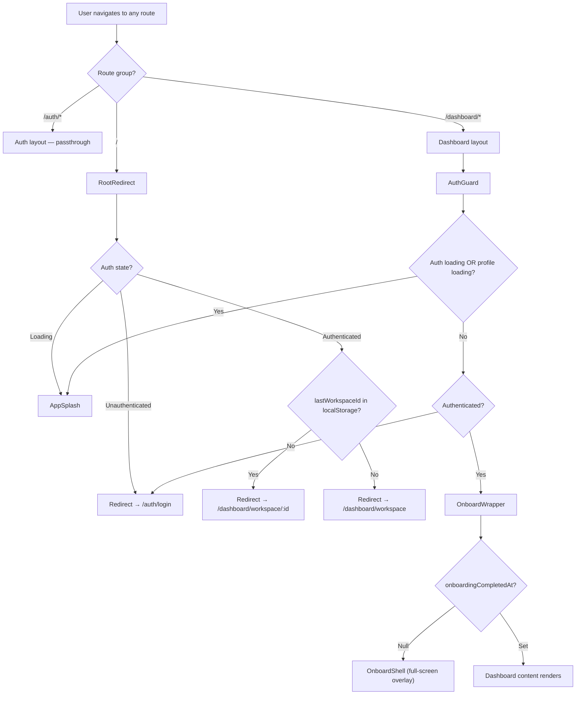

---
tags:
  - architecture/frontend
Created: 2026-03-15
Updated: 2026-03-15
---
# Frontend Design — Auth Guard & App Shell

---

## Overview

The auth guard and app shell layer controls what users see while authentication resolves and ensures unauthenticated users never reach dashboard routes. This is a cross-cutting concern that affects every dashboard page — it determines the loading experience, the redirect logic, and the composition order of layout wrappers (auth → onboarding → content). Standardising this prevents inconsistent loading states and redirect races.

---

## Current Approach

Authentication state is provided by `AuthProvider` (Supabase adapter) at the root layout level. Route protection is handled entirely client-side — there is no Next.js middleware. Three components collaborate to manage the auth lifecycle:

1. **AppSplash** — branded loading screen shown while auth/profile state resolves
2. **AuthGuard** — wrapper that gates dashboard routes, redirecting unauthenticated users
3. **RootRedirect** — root page (`/`) component that routes users based on auth state

The dashboard layout composes these with the onboarding wrapper:

```
AuthGuard → OnboardWrapper → IconRailProvider → (IconRail, SubPanel, DashboardContent)
```

---

## Conventions

### Do

- Use `AuthGuard` as the outermost wrapper in the dashboard layout — it must resolve before any dashboard content renders
- Show `AppSplash` during all auth-resolution phases to prevent layout flash
- Use `useProfile()` inside `AuthGuard` to ensure user data is available before rendering children
- Check `onboardingCompletedAt` via `OnboardWrapper`, not inside `AuthGuard`
- Use localStorage `lastWorkspaceId` for smart redirects from root page

### Don't

- Do not add `middleware.ts` for auth redirects — the intentional decision is client-side auth gating
- Do not render dashboard content while auth or profile is still loading — always show AppSplash
- Do not check onboarding status in AuthGuard — separation of concerns: AuthGuard handles auth, OnboardWrapper handles onboarding
- Do not redirect from multiple places for the same route — consolidate redirect logic

---

## Architecture

### Component Flow



### AppSplash

A branded loading screen displayed during auth resolution. Features:

- Riven logo with `scale(0.8) → scale(1)` entrance animation (0.4s ease-out)
- Animated progress bar that fills to 70% over 2.4s (ease-in-out), giving perceived progress without a real progress signal
- Centered layout with dark background

This component is stateless — it renders the same animation every time. Parent components control when to show/hide it.

### AuthGuard

Wraps the entire dashboard layout. Resolution sequence:

1. **Auth loading** (`loading` from `useAuth()`) — show AppSplash
2. **No session** — redirect to `/auth/login`, show AppSplash during redirect
3. **Session exists, profile loading** (`isLoading` or `isLoadingAuth` from `useProfile()`) — show AppSplash
4. **Session + profile ready** — fade in children with Framer Motion opacity transition

Key implementation details:
- Uses `redirectingRef` to prevent redirect loops (only redirects once)
- Waits for profile data before rendering children so that `OnboardWrapper` and downstream components can rely on `user` being available
- Fade-in animation (0.3s) on children prevents visual jarring after splash

### RootRedirect

Mounted at `/` (root page). Handles the entry-point routing decision:

- While auth is loading → AppSplash
- If unauthenticated → redirect to `/auth/login`
- If authenticated → redirect to saved workspace or `/dashboard/workspace`
- Uses `router.replace()` for all redirects (no back-button to root)

### Dashboard Layout Composition

```typescript
// app/dashboard/layout.tsx (server component)
<AuthGuard>
  <OnboardWrapper>
    <IconRailProvider>
      <IconRail />
      <SubPanel />
      <DashboardContent>
        <AppNavbar />
        {children}
      </DashboardContent>
    </IconRailProvider>
  </OnboardWrapper>
</AuthGuard>
```

The layout is a server component. All wrappers are client components that use `"use client"`. This composition order ensures:

1. Auth resolves first (AuthGuard)
2. Onboarding check happens with user data available (OnboardWrapper)
3. Navigation renders only for authenticated, onboarded users

---

## Integration Points

| Dependency | Relationship |
| ---------- | ------------ |
| `AuthProvider` / `useAuth()` | Provides session, user, and loading state consumed by AuthGuard and RootRedirect |
| `useProfile()` | Query hook that fetches user profile; AuthGuard waits for this before rendering children |
| [[Onboarding Flow]] | OnboardWrapper checks `onboardingCompletedAt` and overlays the onboarding shell |
| `WorkspaceStore` | RootRedirect reads `lastWorkspaceId` from localStorage for smart redirect |
| Supabase Auth | Underlying auth provider; session exchange happens via `/api/auth/token/callback` |

---

## Key Decisions

| Decision | Rationale | Alternatives Rejected |
| -------- | --------- | --------------------- |
| Client-side auth gating (no middleware.ts) | Supabase session is client-side; middleware would require server-side token validation adding complexity | Next.js middleware with cookie-based auth |
| AppSplash as shared loading state | Single branded experience during all auth resolution phases prevents layout flash | Per-component loading spinners, Suspense boundaries |
| AuthGuard waits for profile query | Downstream components (OnboardWrapper) need user data; loading profile inside AuthGuard prevents waterfall | Loading profile separately in OnboardWrapper |
| OnboardWrapper separate from AuthGuard | Separation of concerns — auth gating and onboarding gating are independent decisions | Single combined guard component |
| Replace navigation for redirects | Prevents `/` from appearing in browser history back stack | Push navigation |

---

## Recent Changes

| Date | Change | Feature/ADR |
| ---- | ------ | ----------- |
| 2026-03-15 | Added AppSplash component as shared loading screen | [[Onboarding Flow]] |
| 2026-03-15 | AuthGuard refactored to wait for profile query before rendering | [[Onboarding Flow]] |
| 2026-03-15 | OnboardWrapper added to dashboard layout composition | [[Onboarding Flow]] |
| 2026-03-15 | RootRedirect extracted as dedicated component | [[Onboarding Flow]] |
