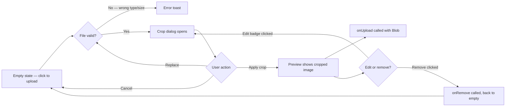

---
tags:
  - status/implemented
  - priority/medium
  - architecture/design
  - architecture/feature
  - architecture/frontend
Created: 2026-03-15
Updated: 2026-03-15
Domains:
  - "[[User]]"
  - "[[Workspace]]"
Backend-Feature: "[[]]"
Pages:
  - "[[riven/docs/frontend-design/dashboard/Onboarding Flow]]"
---
# Quick Frontend Design: Avatar Uploader

## What & Why

A reusable avatar upload component with an integrated crop dialog. Users select an image file, crop it to a circle in a modal, and receive a cropped `Blob` for upload. This replaces the previous `AvatarUploader.tsx` (PascalCase) with a redesigned version that adds crop support, configurable validation, and proper blob lifecycle management. Used in the onboarding profile and workspace steps, and available for any future avatar upload needs.

---

## User Flow



---

## Components

| Component | Responsibility | Shared Deps |
| --------- | -------------- | ----------- |
| `AvatarUploader` (`components/ui/avatar-uploader.tsx`) | File selection, validation, state management (empty/uploaded), edit/remove actions. Renders circular avatar with edit badge overlay. | `Avatar`, `Button` from shadcn |
| `AvatarCropDialog` (`components/ui/avatar-crop-dialog.tsx`) | Modal with `react-easy-crop` for circular cropping, zoom slider (1-3×), replace file button, apply/cancel actions. Dark themed (zinc palette). | `Dialog`, `Slider`, `Button` from shadcn; `react-easy-crop` |
| `getCroppedImage` (`components/ui/crop-utils.ts`) | Pure utility — takes image source + crop area, returns a `Promise<Blob>`. Draws to canvas, outputs max 256×256 JPEG at 0.85 quality. | None |

---

## State & Data

**Queries/Mutations:**

None — the avatar uploader is a purely client-side component. The resulting `Blob` is passed up via `onUpload` callback. Consumers (e.g., onboarding store) are responsible for attaching the blob to their API submission.

**State Ownership:**

| State | Location | Purpose |
| ----- | -------- | ------- |
| `cropDialogOpen` | Local (AvatarUploader) | Controls crop dialog visibility |
| `imageSrc` | Local (AvatarUploader) | Data URL of selected file for crop dialog |
| `error` | Local (AvatarUploader) | Validation error message |
| `crop`, `zoom`, `croppedAreaPixels` | Local (AvatarCropDialog) | Crop tool state |
| `previewUrl` | Local (AvatarUploader) | Object URL of cropped blob for display |
| Avatar blob | Consumer store (e.g., `onboard.store`) | Cropped blob for API submission |

---

## Key Interactions & States

**Validation:** Configurable via `validation` prop — `maxSize` (bytes), `allowedTypes` (MIME strings), `errorMessage` (override). Validation runs on initial file select and on "Replace" within the crop dialog.

**Blob lifecycle:** Object URLs created via `URL.createObjectURL()` are revoked on component unmount and when a new image replaces the old one. This prevents memory leaks during onboarding where users may upload/re-upload multiple times.

**Props interface:**

```typescript
interface AvatarUploaderProps {
  onUpload: (blob: Blob) => void;       // called with cropped blob
  onRemove?: () => void;                // called when user removes avatar
  imageURL?: string | null;             // external preview URL (e.g., existing avatar)
  title?: string;                       // label text
  validation?: {
    maxSize?: number;                   // max file size in bytes
    allowedTypes?: string[];            // MIME types (e.g., ['image/jpeg', 'image/png'])
    errorMessage?: string;              // custom validation error text
  };
}
```

**Crop output:** Always 256×256 JPEG at 0.85 quality, regardless of input format or dimensions. Circular crop mask in dialog is visual only — the output blob is a square image (consumers apply `rounded-full` for circular display).

---

## Tasks

- [x] AvatarUploader component with file picker and validation
- [x] AvatarCropDialog with react-easy-crop integration
- [x] getCroppedImage canvas utility
- [x] Blob URL memory leak prevention
- [x] Integration with onboarding profile and workspace steps
