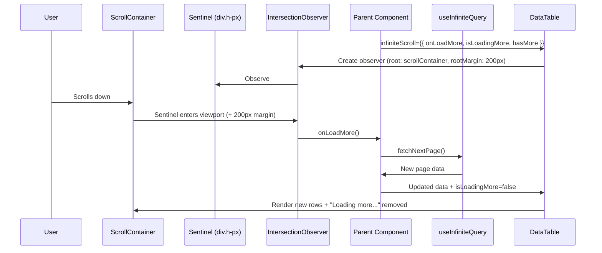
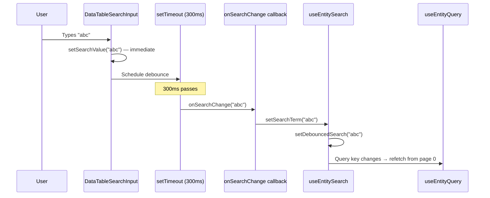

---
tags:
  - architecture/frontend
Created: 2026-03-18
Updated: 2026-03-18
---
# Frontend Design — Data Table Infrastructure

---

## Overview

The DataTable is the primary data display component in Riven. It started as a client-side table with sorting, filtering, and drag-drop. The entity query feature introduced server-side concerns — infinite scroll pagination, server-side search, and server-side sorting — that must coexist with the existing client-side features without breaking them. This document covers the cross-cutting patterns that any feature can use when wiring a DataTable to a paginated server-side API.

---

## Current Approach

The DataTable is a composable system built on TanStack Table, `@dnd-kit`, and a Zustand store. It lives in `components/ui/data-table/` and exposes configuration through typed props rather than requiring consumers to interact with TanStack Table directly.

**Key files:**

| File | Purpose |
| ---- | ------- |
| `data-table.tsx` | Orchestrator — initializes TanStack Table, composes sub-components, manages DnD and infinite scroll |
| `data-table.types.ts` | Shared type definitions for all configuration interfaces |
| `data-table-provider.tsx` | Zustand store + React context for cross-component state |
| `data-table.store.ts` | Store definition (table instance, selection, search, edit state) |
| `data-table-schema.tsx` | Schema-driven wrapper that auto-generates columns/filters from a `Schema` definition |
| `components/data-table-search-input.tsx` | Debounced search input with server-side mode support |
| `components/data-table-toolbar.tsx` | Toolbar layout: search + filter + actions |
| `components/data-table-body.tsx` | Row rendering with DnD integration |
| `components/data-table-header.tsx` | Column headers with sort indicators and DnD |

**Two consumption modes:**

1. **Direct** — Consumer builds columns, filters, and search config manually, passes them as props to `DataTable`. Used by `EntityDataTable`.
2. **Schema-driven** — Consumer passes a `Schema` object to `SchemaDataTable` or `EnhancedSchemaDataTable`, which auto-generates columns, filters, and search config. Used for simpler data displays.

---

## Conventions

### Do

- Use `InfiniteScrollConfig` for any paginated server-side data — it handles the sentinel element, IntersectionObserver lifecycle, and loading state display
- Use `ServerSideSortingConfig` when sorting must happen on the backend — it disables `getSortedRowModel` and delegates sorting state to the parent
- Set `SearchConfig.serverSide = true` when the search term should be sent to an API rather than applied as a client-side global filter
- Keep the `onSearchChange` callback stable (wrapped in `useCallback` or a stable setter) to prevent unnecessary re-renders from the debounce effect
- Provide a `scrollContainerClassName` with a max-height constraint so the sentinel can trigger within the scrollable area, not at the page bottom
- Use the `entityKeys`-style query key factory pattern so that search/filter/sort state in the query key automatically resets pagination when it changes

### Don't

- Do not mix server-side and client-side sorting on the same table — if `serverSideSorting.enabled` is true, TanStack's built-in sort model is skipped entirely
- Do not debounce inside your search hook if using `DataTableSearchInput` — the component owns the 300ms debounce timer via `useEffect` + `setTimeout`
- Do not pass `InfiniteScrollConfig` until the initial query has resolved — check `hasNextPage !== undefined` before creating the config to avoid premature sentinel registration
- Do not put the sentinel outside the scroll container — the IntersectionObserver uses `root: scrollContainer` so the sentinel must be a child of that container

---

## Architecture

### Infinite Scroll

The DataTable implements infinite scroll with a sentinel element and IntersectionObserver:



**Implementation details:**

- The sentinel is a `div` with `h-px` (1px height) and `aria-hidden="true"`, rendered after the table inside the scroll container
- `rootMargin: '200px'` triggers the fetch 200px before the user reaches the bottom, creating a seamless loading experience
- The observer is disconnected and recreated when `hasMore`, `isLoadingMore`, or `onLoadMore` change
- While `isLoadingMore` is true, a "Loading more..." indicator appears above the sentinel
- When `hasMore` becomes false, the sentinel is not rendered and the observer is not created

**Consumer wiring pattern (entity example):**

```typescript
const infiniteScrollConfig: InfiniteScrollConfig | undefined = useMemo(
  () =>
    hasNextPage !== undefined
      ? {
          onLoadMore: fetchNextPage,
          isLoadingMore: isFetchingNextPage,
          hasMore: hasNextPage ?? false,
        }
      : undefined,
  [fetchNextPage, hasNextPage, isFetchingNextPage],
);
```

### Server-Side Sorting

When `serverSideSorting` is provided and `enabled`, the DataTable:

1. Skips `getSortedRowModel()` — rows render in the order the API returns them
2. Uses `serverSideSorting.sorting` as the controlled sorting state
3. Calls `serverSideSorting.onSortingChange` when the user clicks a column header
4. The parent converts the TanStack `SortingState` to the API's sort format and includes it in the query key

```typescript
interface ServerSideSortingConfig {
  enabled: boolean;
  sorting: SortingState;
  onSortingChange: (sorting: SortingState) => void;
}
```

**Conversion utility (entity example):**

```typescript
function sortingStateToOrderBy(sorting: SortingState): OrderByClause[] | undefined {
  if (sorting.length === 0) return undefined;
  return sorting.map((sort) => ({
    attributeId: sort.id,
    direction: sort.desc ? SortDirection.Desc : SortDirection.Asc,
  }));
}
```

### Server-Side Search

The `SearchConfig` interface supports both client-side and server-side search through a single component:

```typescript
interface SearchConfig<T> {
  enabled: boolean;
  searchableColumns: string[];
  placeholder?: string;
  debounceMs?: number;        // default: 300
  disabled?: boolean;
  onSearchChange?: (value: string) => void;
  serverSide?: boolean;       // when true, skips client-side globalFilterFn
}
```

**Debounce flow:**



When `serverSide` is true:
- The `DataTableSearchInput` still debounces the input (300ms default)
- After debounce, it calls `onSearchChange` but does **not** set a global filter on the TanStack Table instance
- The parent hook receives the debounced value and includes it in the query key
- Result count display is hidden (client-side count is meaningless for server-side search)

When `serverSide` is false (default):
- After debounce, both `onSearchChange` and `setGlobalFilter` are called
- TanStack Table's built-in `globalFilterFn` filters rows client-side
- Result count is displayed

### Type Definitions

The shared types in `data-table.types.ts` define the configuration surface:

| Type | Purpose |
| ---- | ------- |
| `SearchConfig<T>` | Search input configuration with server-side toggle |
| `InfiniteScrollConfig` | Sentinel-based infinite scroll with load state |
| `ServerSideSortingConfig` | Controlled sorting delegated to parent |
| `FilterConfig<T>` / `ColumnFilter<T>` | Column filter definitions with type-specific options |
| `ColumnEditConfig<TData, TCellValue, TValue>` | Render-prop edit configuration per column |
| `EditRenderProps<TData, TCellValue>` | Props passed to custom edit renderers |
| `RowSelectionConfig<TData>` | Selection with action component slot |
| `RowActionsConfig<TData>` / `RowAction<TData>` | Per-row action menu configuration |
| `ColumnResizingConfig` | Column width resize mode |
| `ColumnOrderingConfig` | DnD column reordering |
| `ActionColumnConfig` | Drag handle and checkbox visibility |
| `ColumnDisplayMeta` | Header metadata (required, unique, protected badges) |

Module augmentation extends TanStack Table's `ColumnMeta`:

```typescript
declare module '@tanstack/react-table' {
  interface ColumnMeta<TData, TValue> {
    edit?: ColumnEditConfig<TData, TValue>;
    displayMeta?: ColumnDisplayMeta;
  }
}
```

---

## Integration Points

| Dependency | Relationship |
| ---------- | ------------ |
| TanStack Table | Core table engine — column definitions, sorting, filtering, row model |
| `@dnd-kit/core` + `@dnd-kit/sortable` | Drag-drop for row reordering and column reordering |
| Zustand (DataTable store) | Cross-component state — table instance, selection, search value, edit state |
| `useInfiniteQuery` (TanStack Query) | Consumers use this for paginated data; DataTable consumes the flattened result via `InfiniteScrollConfig` |
| [[Entity Data Table]] | Primary consumer of infinite scroll, server-side search, and server-side sorting |
| `SchemaDataTable` / `EnhancedSchemaDataTable` | Schema-driven consumers that auto-generate client-side config |

---

## Key Decisions

| Decision | Rationale | Alternatives Rejected |
| -------- | --------- | --------------------- |
| Sentinel-based IntersectionObserver for infinite scroll | Zero-dependency, declarative, works within any scroll container. No scroll event listeners, no throttling needed | Scroll position calculation with `scrollTop`/`scrollHeight`, virtualized list (react-window) |
| 200px rootMargin on observer | Prefetches before user reaches bottom, eliminating visible loading gaps in most cases | No margin (visible gap), larger margin (premature fetches) |
| Debounce owned by `DataTableSearchInput`, not by consumer hooks | Single debounce location prevents double-debouncing. Component controls the timer and calls `onSearchChange` after delay | Consumer-side debounce (risk of double debounce), no debounce (too many API calls) |
| `serverSide` flag on `SearchConfig` rather than a separate component | Same visual component for both modes. Toggle a boolean to switch behavior. Prevents UI divergence between server and client search | Separate `ServerSearchInput` component, higher-order component wrapper |
| Controlled sorting via `ServerSideSortingConfig` rather than intercepting TanStack sort | Clean separation. When server-side, TanStack sort model is fully disabled. No risk of client-side sort fighting server order | Middleware approach, custom sort plugin |
| Config types in `data-table.types.ts` with module augmentation | Single source of truth for all table-related types. Module augmentation extends TanStack's `ColumnMeta` without forking | Inline types in component files, wrapper types around TanStack |

---

## Recent Changes

| Date | Change | Feature/ADR |
| ---- | ------ | ----------- |
| 2026-03-18 | Added `InfiniteScrollConfig` type and sentinel-based IntersectionObserver | [[Entity Data Table]] |
| 2026-03-18 | Added `ServerSideSortingConfig` type and controlled sorting mode | [[Entity Data Table]] |
| 2026-03-18 | Added `serverSide` flag to `SearchConfig` | [[Entity Data Table]] |
| 2026-03-18 | Added "Loading more..." indicator for infinite scroll | [[Entity Data Table]] |
