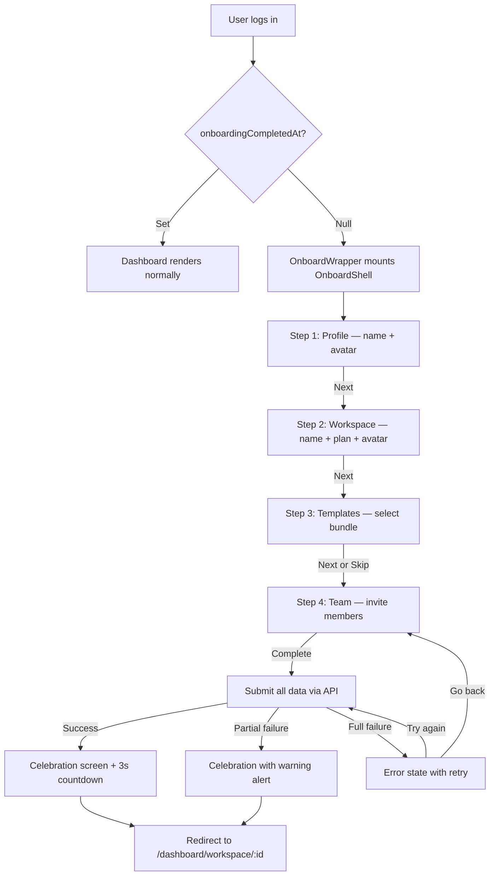

---
tags:
  - status/implemented
  - priority/high
  - architecture/design
  - architecture/feature
  - architecture/frontend
Created: 2026-03-15
Updated: 2026-03-15
Domains:
  - "[[Workspace]]"
  - "[[User]]"
Backend-Feature: "[[riven/docs/system-design/feature-design/3. Active/Declarative Manifest Catalog and Consumption Pipeline]]"
Pages:
  - "[[Dashboard Layout]]"
---
# Frontend Feature: Onboarding Flow

---

## 1. Overview

### Problem Statement

New users who sign up land directly in an empty dashboard with no workspace, no profile details, and no context. There is no guided path to set up the foundational objects (profile, workspace) needed to use the platform, and no way to discover starter templates or invite teammates during initial setup.

### Proposed Solution

A full-screen, multi-step onboarding wizard that overlays the dashboard for users who haven't completed onboarding. The wizard collects profile details, workspace configuration, optional template selection, and optional team invites — then submits everything in a single API call. A split-panel layout pairs each form step with a live-updating preview, connected by a cinematic camera-pan animation.

### Success Criteria

- [x] New users see the onboarding overlay before accessing the dashboard
- [x] Profile and workspace steps are required; templates and team steps are skippable
- [x] Live preview updates in real-time as the user fills in form fields
- [x] Single API call submits all onboarding data (profile, workspace, templates, invites)
- [x] Partial failures (some templates/invites fail) are surfaced without blocking completion
- [x] After completion, user is redirected to their new workspace with a celebration screen
- [x] Users who have already completed onboarding bypass the overlay entirely

---

## 2. User Flows

### Primary Flow



### Alternate Flows

- **Skip optional steps:** Steps 3 (Templates) and 4 (Team) show a "Skip" button. Skipping advances to the next step without storing data for that step.
- **Back navigation:** Every step except step 1 shows a "Back" button. Direction state drives animation direction (forward/backward slide).
- **Avatar upload:** Selecting an avatar opens a crop dialog. The cropped blob is stored in the Zustand store and submitted as multipart data alongside the JSON payload.
- **Template deselection:** Clicking an already-selected bundle deselects it. A "Clear selection" button also deselects.

---

## 3. Information Architecture

### Data Displayed

| Data Element | Source | Priority | Display Format |
| ------------ | ------ | -------- | -------------- |
| User display name | Form input / auth metadata | Primary | Text input, preview card |
| User avatar | File upload + crop | Primary | Circular image or initials |
| User email | Auth session | Secondary | Preview card only |
| Workspace name | Form input | Primary | Text input, preview card |
| Workspace plan | Form selection | Primary | Button group, badge in preview |
| Workspace avatar | File upload + crop | Secondary | Circular image or initials |
| Template bundles | `GET /api/templates/bundles` | Primary | Card grid with expand |
| Bundle templates | Nested in bundle response | Secondary | List within expanded bundle |
| Team invites | Form input (dynamic list) | Primary | Email + role rows |

### Grouping & Sorting

Data is grouped by onboarding step. Bundles are displayed in API return order. Invites are displayed in insertion order.

### Visual Hierarchy

1. **Form panel (left 40%)** — active input area, draws primary focus
2. **Preview panel (right 60%)** — live-updating visual feedback, provides context
3. **Navigation controls** — fixed at bottom of form panel
4. **Progress indicator** — top of form panel, shows step position

---

## 4. Component Design

### Component Tree

```
OnboardWrapper (context/onboard-handler.tsx)
└── OnboardProvider (context/onboard-provider.tsx)
    └── OnboardShell (components/onboard-shell.tsx)
        ├── OnboardFormPanel (components/onboard-form-panel.tsx)
        │   ├── OnboardProgress
        │   ├── OnboardStepForm (router)
        │   │   ├── ProfileStepForm (components/forms/profile-step-form.tsx)
        │   │   ├── WorkspaceStepForm (components/forms/workspace-step-form.tsx)
        │   │   ├── TemplateStepForm (components/forms/template-step-form.tsx)
        │   │   └── TeamStepForm (components/forms/team-step-form.tsx)
        │   └── OnboardNavControls (components/onboard-nav-controls.tsx)
        ├── OnboardPreviewPanel (components/onboard-preview-panel.tsx)
        │   └── OnboardCameraCanvas (components/onboard-camera-canvas.tsx)
        │       ├── ProfilePreview (components/previews/profile-preview.tsx)
        │       ├── WorkspacePreview (components/previews/workspace-preview.tsx)
        │       ├── TemplatesPreview (components/previews/templates-preview.tsx)
        │       └── TeamPreview (components/previews/team-preview.tsx)
        └── OnboardCelebration (components/onboard-celebration.tsx)
```

### Component Responsibilities

#### OnboardWrapper

- **Responsibility:** Gate that checks `user?.onboardingCompletedAt`. Renders `OnboardShell` inside `OnboardProvider` when onboarding is incomplete, otherwise renders children (dashboard).
- **Props:** `children: ReactNode`

#### OnboardShell

- **Responsibility:** Full-screen overlay layout. Orchestrates the two-panel split and switches to celebration view on submission success. Prefetches bundles via `useBundles()`.
- **Props:** None (reads store via hooks)

#### OnboardFormPanel

- **Responsibility:** Left panel containing progress indicator, animated step form, navigation controls, and submission loading/error states.
- **Props:** None

#### OnboardPreviewPanel

- **Responsibility:** Right panel with dot-pattern background and camera canvas. Hidden on mobile. Includes dev-only debug controls.
- **Props:** None

#### OnboardStepForm

- **Responsibility:** AnimatePresence router that maps current step ID to the correct form component. Applies directional slide animation.
- **Props:** None (reads `currentStep` and `direction` from store)

#### OnboardCameraCanvas

- **Responsibility:** Animates horizontal pan between preview sections using a 3-phase zoom-out → pan → zoom-in sequence. Measures container width for responsive section sizing.
- **Props:** None

#### OnboardNavControls

- **Responsibility:** Renders Back, Skip, and Next/Complete buttons based on step config. Triggers form validation before advancing. Initiates submission on final step.
- **Props:** None

#### OnboardCelebration

- **Responsibility:** Post-submission success screen. Shows workspace info, setup summary, partial failure warnings, and a 3-second countdown to redirect.
- **Props:** None (reads `submissionResponse` from store)

### Shared Component Reuse

| Component | Source | Purpose |
| --------- | ------ | ------- |
| AvatarUploader | `components/ui/avatar-uploader.tsx` | Profile and workspace avatar upload with crop |
| Input | `components/ui/input.tsx` | Display name fields |
| Button | `components/ui/button.tsx` | Navigation, plan selection, invite actions |
| Select | `components/ui/select.tsx` | Role selection in team step |
| Skeleton | `components/ui/skeleton.tsx` | Loading states for bundles |
| Alert | `components/ui/alert.tsx` | Partial failure warnings |

---

## 5. State Management

### Zustand Store (`onboard.store.ts`)

The onboarding flow uses a dedicated Zustand store following the factory + context + provider pattern.

**State shape:**

```typescript
interface OnboardState {
  currentStep: number;                              // 0-3
  direction: 'forward' | 'backward';               // animation direction
  validatedData: Record<string, unknown>;           // validated data keyed by step ID
  liveData: Record<string, unknown>;                // real-time preview data keyed by step ID
  formTrigger: (() => Promise<boolean>) | null;     // registered form validation trigger
  submissionStatus: 'idle' | 'loading' | 'error' | 'success';
  submissionResponse: CompleteOnboardingResponse | null;
  profileAvatarBlob: Blob | null;
  workspaceAvatarBlob: Blob | null;
}

interface OnboardActions {
  goNext: () => void;
  goBack: () => void;
  skip: () => void;
  setStepData: (stepId: string, data: unknown) => void;
  setLiveData: (stepId: string, data: unknown) => void;
  registerFormTrigger: (fn: () => Promise<boolean>) => void;
  clearFormTrigger: () => void;
  setSubmissionStatus: (status: SubmissionStatus) => void;
  setSubmissionResponse: (response: CompleteOnboardingResponse) => void;
  setProfileAvatarBlob: (blob: Blob | null) => void;
  setWorkspaceAvatarBlob: (blob: Blob | null) => void;
  reset: () => void;
}
```

**Selector hooks exported from provider:**

| Hook | Returns | Purpose |
| ---- | ------- | ------- |
| `useOnboardStore(selector)` | `T` | Generic selector |
| `useOnboardStoreApi()` | `OnboardStoreApi` | Direct store API access |
| `useOnboardStepState()` | `{ currentStep, direction }` | Step position and animation direction |
| `useOnboardLiveData(stepId)` | `T \| undefined` | Typed live data for a specific step |
| `useOnboardNavigation()` | `{ goNext, goBack, skip }` | Navigation actions |
| `useOnboardFormControls()` | Form control actions | Register/clear form trigger, set data |
| `useOnboardSubmission()` | Submission state + actions | Status, response, reset |

### Server State (TanStack Query)

| Query/Mutation | Key | Stale Time | Invalidated By |
| -------------- | --- | ---------- | -------------- |
| `useBundles` | `['bundles']` | 10 min | — |
| `useCompleteOnboardingMutation` | — | — | Invalidates `['userProfile']` on success |

### URL State

None. The onboarding flow is an overlay — it does not use URL segments or search params.

### Local State (React)

| State | Owner Component | Purpose |
| ----- | --------------- | ------- |
| `form` (react-hook-form) | Each step form | Per-step form validation and field state |
| `invites` array | TeamStepForm | Dynamic invite list (local before submission) |
| `selectedBundleKey` | TemplateStepForm | Bundle toggle selection |
| Blob object URLs | ProfileStepForm, WorkspaceStepForm | Avatar preview display (revoked on unmount) |

---

## 6. Data Fetching

### Endpoints Consumed

| Endpoint | Method | Purpose |
| -------- | ------ | ------- |
| `/api/templates/bundles` | GET | Fetch available template bundles for step 3 |
| `/api/templates` | GET | Fetch template summaries for bundle preview |
| `/api/onboarding/complete` | POST (multipart) | Submit all onboarding data |

### Query/Mutation Hooks

**`useBundles()`** — Fetches bundles and templates in parallel. Returns `{ bundles, templates, isLoading, isLoadingAuth, error }`. Enabled only when session is available. `staleTime: 10 min`, `gcTime: 30 min`, `retry: 2`.

**`useCompleteOnboardingMutation()`** — Calls `OnboardingService.completeOnboarding()` with assembled payload + avatar blobs. Updates store submission status on each lifecycle event. Invalidates `['userProfile']` on success to ensure `onboardingCompletedAt` is refreshed.

### Optimistic Updates

None. The onboarding submission is a one-shot operation — optimistic updates are not applicable.

### Loading & Skeleton Strategy

- **Bundles loading:** 2×3 grid of `Skeleton` cards (rounded corners, simulating bundle layout)
- **Submission loading:** Form panel replaces content with centered spinner + "Setting up your workspace..." text
- **Initial auth loading:** Handled by parent `AuthGuard` → `AppSplash`

---

## 7. Interaction Design

### Keyboard Shortcuts

None. Standard tab navigation through form fields.

### Drag & Drop

None.

### Modals & Drawers

| Trigger | Modal | Dismiss |
| ------- | ----- | ------- |
| Click avatar / edit badge | `AvatarCropDialog` | Cancel button, Apply button, backdrop click |

### Inline Editing

None. All editing happens through form fields.

### Bulk Selection

None. Template selection is single-select (one bundle at a time).

### Context Menus

None.

---

## 8. Responsive & Accessibility

### Breakpoint Behavior

| Breakpoint | Layout Change |
| ---------- | ------------- |
| Desktop (md+) | Two-panel: form (40%) + preview (60%) side-by-side |
| Mobile (<md) | Form panel only, preview panel hidden |

### Accessibility

- **ARIA roles/labels:** Form fields use standard label associations via react-hook-form
- **Keyboard navigation order:** Linear tab through form fields → nav buttons
- **Screen reader considerations:** Step progress communicated via text ("Step 1 of 4")
- **Focus management:** Auto-focus on first form field per step
- **Color contrast:** Plan badges and role badges use sufficient contrast via Tailwind semantic tokens

---

## 9. Error, Empty & Loading States

| State | Condition | Display | User Action |
| ----- | --------- | ------- | ----------- |
| Loading (auth) | Session resolving | AppSplash with progress bar | Wait |
| Loading (bundles) | Bundles query in flight | Skeleton grid in template step | Wait |
| Loading (submission) | POST in flight | Spinner + "Setting up your workspace..." | Wait |
| Empty (bundles) | No bundles returned | Empty state message | Skip step |
| Submission error | API returns error | Error message + "Go back" / "Try again" | Retry or navigate back |
| Partial failure | Some templates/invites failed | Celebration screen with warning alert | Acknowledge and continue |
| Validation error | Form field invalid | Inline field error messages | Fix and retry |

---

## 10. Implementation Tasks

### Foundation

- [x] Zustand store with factory + context + provider pattern
- [x] Step configuration with component mapping and camera positions
- [x] OnboardWrapper gate checking `onboardingCompletedAt`
- [x] API factory functions for onboarding and templates endpoints
- [x] Service layer with payload assembly

### Core

- [x] OnboardShell two-panel layout
- [x] Profile step form with avatar upload and name input
- [x] Workspace step form with plan selection
- [x] Template step form with bundle fetching and selection
- [x] Team step form with dynamic invite list
- [x] Live preview components for all 4 steps
- [x] Camera canvas animation system
- [x] Form validation with trigger registration pattern
- [x] Complete onboarding mutation with error handling
- [x] Celebration screen with countdown redirect

### Polish

- [x] Directional slide animations on step transitions
- [x] Avatar blob URL cleanup on unmount
- [x] Partial failure warning display
- [x] Skeleton loading states for bundles
- [x] Dev-only debug controls in preview panel
- [x] Initials + palette color fallback for avatars

---

## Related Documents

- [[riven/docs/frontend-design/architecture/Auth Guard & App Shell]] — Dashboard auth flow that gates onboarding
- [[riven/docs/frontend-design/architecture/Avatar Uploader]] — Shared crop dialog used by profile and workspace steps
- [[riven/docs/system-design/feature-design/3. Active/Declarative Manifest Catalog and Consumption Pipeline]] — Backend template/bundle system consumed in step 3

---

## Changelog

| Date | Author | Change |
| ---- | ------ | ------ |
| 2026-03-15 | Claude | Initial draft from onboarding branch implementation |
