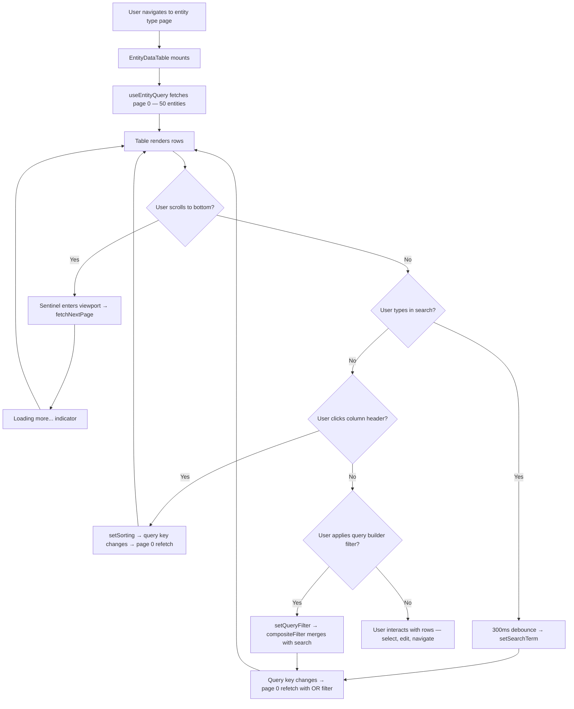

---
tags:
  - status/implemented
  - priority/high
  - architecture/design
  - architecture/feature
  - architecture/frontend
Created: 2026-03-18
Updated: 2026-03-18
Domains:
  - "[[Entities]]"
Backend-Feature: "[[Entity Querying]]"
Pages:
  - "[[Dashboard Layout]]"
---
# Frontend Feature: Entity Data Table

---

## 1. Overview

### Problem Statement

The entity data table previously loaded all entities for a type in a single client-side fetch. For entity types with hundreds or thousands of instances, this meant slow initial load, excessive memory use, and no ability to search or filter without downloading the entire dataset. Users had no way to sort or search entities without client-side iteration over every row.

### Proposed Solution

Replace the single-fetch `useEntities` hook with a paginated `useEntityQuery` hook backed by the backend's `POST /api/entities/query` endpoint. The table loads 50 entities per page, automatically fetches more via infinite scroll (IntersectionObserver sentinel), and supports server-side search (OR across text attributes), server-side sorting (via `OrderByClause`), and composable filter trees via the `EntityQueryBuilder`. All query parameters are encoded in the TanStack Query key so that any change to search, filter, or sort state automatically resets pagination and refetches from page 0.

### Success Criteria

- [x] Entity table loads first 50 entities on mount, not the full dataset
- [x] Scrolling to the bottom fetches the next page without user interaction
- [x] Typing in the search input triggers server-side search across all STRING attributes
- [x] Clicking a column header triggers server-side sorting
- [x] Query builder filters are composed with search into a single `QueryFilter` tree
- [x] Changing search, filter, or sort resets pagination to page 0
- [x] Stale data remains visible during refetch (no blank flash)
- [x] Inline cell editing, column reordering, and row selection continue to work

---

## 2. User Flows

### Primary Flow



### Alternate Flows

- **Empty state:** No entities match → table shows "No {type.plural} found." message. Search and filter controls remain active.
- **Error state:** Query fails → toast notification "Failed to load entities: {message}". Table shows error message.
- **Draft mode:** User clicks "+ New {type.singular}" footer → search clears, draft row appears at top. Infinite scroll and search are disabled during draft mode.
- **Inline edit:** User clicks a cell → form opens in-cell. Save triggers `EntityService.saveEntity()` and invalidates the query cache.
- **Bulk delete:** User selects rows via checkboxes → action bar appears with delete. Delete invalidates entity query keys.

---

## 3. Information Architecture

### Data Displayed

| Data Element | Source | Priority | Display Format |
| ------------ | ------ | -------- | -------------- |
| Attribute values | Entity payload, keyed by attribute ID | Primary | Formatted by DataType/DataFormat (dates, currencies, URLs, booleans as badges) |
| Relationship links | Entity payload, relationship ID key | Primary | Badge chips with icon + label, linked to target entity page |
| Entity identifier | Derived from `entity.identifierKey` payload | Primary | Used as display name in action bars and toasts |
| Column headers | EntityType schema property labels + icons | Secondary | Icon + label in header cell |
| Column metadata | Schema constraints (required, unique, protected) | Tertiary | Visual indicators in header popover |

### Grouping & Sorting

Entities are displayed in a flat list. Default sort is server-determined (insertion order). Users can click column headers to toggle server-side ascending/descending sort on any attribute column. Relationship columns do not support sorting (`enableSorting: false`).

### Visual Hierarchy

1. **Entity type header** — name and description at top
2. **Toolbar** — search input (left), query builder filter button (right), add button
3. **Table rows** — primary data area, scrollable with infinite loading
4. **Footer** — "+ New {singular}" button for draft mode entry

---

## 4. Component Design

### Component Tree

```
EntityDataTable (tables/entity-data-table.tsx)
├── EntityTypeHeader (ui/entity-type-header.tsx)
├── DataTableProvider (ui/data-table/data-table-provider.tsx)
│   └── DataTable (ui/data-table/data-table.tsx)
│       ├── DataTableToolbar
│       │   ├── DataTableSearchInput — server-side, 300ms debounce
│       │   └── EntityQueryBuilder — composable filter tree UI
│       ├── DataTableSelectionBar
│       │   └── EntityActionBar — bulk delete
│       ├── DataTableHeader — sortable column headers
│       ├── DataTableBody — entity rows + optional draft row
│       │   ├── DraggableRow × N
│       │   │   └── EditableCell × M (per attribute/relationship)
│       │   └── EntityDraftRow (conditional)
│       └── Sentinel (div.h-px) — IntersectionObserver trigger
├── ColumnHeaderPopover — per-column settings
├── ColumnVisibilityPopover — show/hide columns
├── AttributeFormModal — add/edit attribute definitions
└── DeleteDefinitionModal — delete attribute/relationship definitions
```

### Component Responsibilities

#### EntityDataTable

- **Responsibility:** Top-level orchestrator. Owns search state (`useEntitySearch`), sorting state, query filter state, and infinite query. Wires everything into `DataTable` props. Manages modal state for column editing.
- **Props:**

```typescript
interface Props extends ClassNameProps {
  entityType: EntityType;
  workspaceId: string;
}
```

- **Shared components used:** [[Data Table Infrastructure]]
- **Children:** DataTableProvider, DataTable, ColumnHeaderPopover, AttributeFormModal, DeleteDefinitionModal

#### useEntityQuery

- **Responsibility:** Infinite pagination hook. Builds composite filter from search + query builder, converts sorting state to `OrderByClause[]`, calls `EntityService.queryEntities()`. Returns standard `useInfiniteQuery` result.
- **Configuration:** Page size 50, max 10 pages cached, `staleTime: 5min`, `gcTime: 10min`, `keepPreviousData` for smooth transitions.

#### useEntitySearch

- **Responsibility:** Holds `searchTerm` (for input display) and `debouncedSearch` (for query key). Does not own the timer — debouncing is delegated to `DataTableSearchInput` (300ms). Provides `clearSearch()` for draft mode entry.

#### EntityQueryBuilder

- **Responsibility:** Composable filter tree UI. Converts between `FilterGroupState` (internal) and `QueryFilter` (API). Supports attribute conditions (per SchemaType operators), relationship conditions (exists, count, target matches), and nested AND/OR groups.

### Shared Component Reuse

| Component | Source | Purpose |
| --------- | ------ | ------- |
| DataTable | `components/ui/data-table/` | Table rendering, DnD, selection, inline edit, infinite scroll |
| DataTableSearchInput | `components/ui/data-table/components/` | Debounced search with server-side mode |
| Form | `components/ui/form.tsx` | Wraps react-hook-form for column config |
| Button | `@riven/ui/button` | Toolbar actions, footer "New" button |
| Badge | `@riven/ui/badge` | Relationship links, boolean values, array items |
| Tooltip | `components/ui/tooltip.tsx` | Header action buttons |
| IconCell | `components/ui/icon/icon-cell.tsx` | Attribute/relationship icons in headers and cells |

---

## 5. State Management

### Server State (TanStack Query)

| Query/Mutation | Key | Stale Time | Invalidated By |
| -------------- | --- | ---------- | -------------- |
| `useEntityQuery` | `['entities', workspaceId, typeId, 'query', { search?, filter?, orderBy? }]` | 5 min | Save entity, delete entities, attribute changes |
| `useEntityTypes` | `['entityTypes', workspaceId]` | 5 min | Type schema changes |
| `useEntityType` | `['entityType', key, workspaceId]` | 5 min | Type schema changes |

Query keys are generated by the `entityKeys` factory:

```typescript
entityKeys.entities.query(workspaceId, typeId, search?, filter?, orderBy?)
```

The `query` key includes search, filter, and sort state as a trailing object. When any of these change, TanStack Query treats it as a new query and fetches from page 0. `keepPreviousData` ensures the old data remains visible during the transition.

### URL State

None. Search, filter, and sort state are ephemeral — they reset on navigation. This is intentional for the initial implementation.

### Local State (React)

| State | Owner Component | Purpose |
| ----- | --------------- | ------- |
| `searchTerm` / `debouncedSearch` | `useEntitySearch` (via EntityDataTable) | Input display value and debounced query key value |
| `sorting: SortingState` | EntityDataTable | TanStack Table sorting state, converted to `OrderByClause[]` |
| `queryFilter: QueryFilter` | EntityDataTable | Filter tree from EntityQueryBuilder |
| `activePopoverColumnId` | EntityDataTable | Which column header popover is open |
| `attributeDialogOpen` / `editingDefinition` | EntityDataTable | Attribute form modal state |
| `isDraftMode` | EntityProvider (Zustand) | Whether a draft row is being created |

---

## 6. Data Fetching

### Endpoints Consumed

| Endpoint | Method | Backend Feature Section | Purpose |
| -------- | ------ | ----------------------- | ------- |
| `/api/entities/query` | POST | [[Entity Querying]] | Paginated entity query with filter + sort |
| `/api/entities` | POST | — | Save/update entity (inline edit) |
| `/api/entities` | DELETE | — | Bulk delete selected entities |

### Query/Mutation Hooks

**`useEntityQuery(options)`** — Wraps `useInfiniteQuery`. Accepts `workspaceId`, `entityTypeId`, `debouncedSearch`, `searchableAttributeIds`, `queryFilter`, and `sorting`. Internally calls `buildCompositeFilter()` to merge search and filter, and `sortingStateToOrderBy()` to convert sorting state. Enabled only when `session`, `workspaceId`, and `entityTypeId` are all present.

**Filter composition logic:**

```
Search only     → OR(CONTAINS on each STRING attribute)
Filter only     → QueryFilter as-is
Search + Filter → AND(search OR-group, queryFilter)
Neither         → undefined (no filter)
```

### Optimistic Updates

None for the query itself. Inline edit mutations use `queryClient.invalidateQueries` to refetch after save. The `keepPreviousData` option on the infinite query ensures smooth visual transitions during invalidation.

### Loading & Skeleton Strategy

- **Initial load:** Table shows "Loading entities..." empty message while `isPending` is true
- **Next page loading:** "Loading more..." text below the table while `isFetchingNextPage` is true
- **Stale refetch:** Table applies `opacity-70` class while `isPlaceholderData` is true, showing old data at reduced opacity during refetch

---

## 7. Interaction Design

### Keyboard Shortcuts

| Shortcut | Action | Scope |
| -------- | ------ | ----- |
| Enter | Commit cell edit | Active cell |
| Escape | Cancel cell edit | Active cell |
| Tab | Move to next editable cell | Active cell |
| Shift+Tab | Move to previous editable cell | Active cell |
| Arrow keys | Navigate between cells | Table focus |

### Drag & Drop

- **Row reordering:** Drag handle (grip icon) on hover, vertical axis restricted
- **Column reordering:** Drag column headers, horizontal axis restricted
- Both use `@dnd-kit/core` with `closestCenter` collision detection

### Modals & Drawers

| Trigger | Modal | Dismiss |
| ------- | ----- | ------- |
| Header popover → "Edit properties" | `AttributeFormModal` | Cancel, Save, backdrop |
| Header popover → "Delete" | `DeleteDefinitionModal` | Cancel, Confirm, backdrop |
| "+" button in end-of-header | `AttributeFormModal` (new) | Cancel, Save, backdrop |

### Inline Editing

All attribute and relationship columns support inline editing. Activation: click on cell. Each column has a `ColumnEditConfig` with:
- `createFormInstance` — builds a react-hook-form with zod validation per attribute schema
- `render` — render-prop pattern, uses `createAttributeRenderer` / `createRelationshipRenderer`
- `isEqual` — custom equality check per SchemaType to detect actual changes
- Save: form validates → `EntityService.saveEntity()` → cache invalidation

### Bulk Selection

Checkbox column with `hover-or-selected` visibility. Select individual rows or all via header checkbox. Selection triggers `EntityActionBar` with bulk delete. Selection clears on filter change (`clearOnFilterChange: true`).

### Context Menus

None. Per-row actions are exposed through row action menus (three-dot button).

---

## 8. Responsive & Accessibility

### Breakpoint Behavior

| Breakpoint | Layout Change |
| ---------- | ------------- |
| Desktop (md+) | Full table with all visible columns, horizontal scroll if needed |
| Mobile (<md) | Table maintains structure with horizontal scroll |

The table uses `min-w-0` and a scrollable container with `max-h-[calc(100dvh-18rem)]` to prevent layout overflow.

### Accessibility

- **ARIA roles/labels:** Table uses semantic `<table>`, `<thead>`, `<tbody>`, `<tr>`, `<th>`, `<td>` elements. Sentinel is `aria-hidden="true"`.
- **Keyboard navigation order:** Search input → filter button → table headers → table cells → footer button
- **Screen reader considerations:** "Add property" and "Column settings" buttons have `sr-only` labels
- **Focus management:** Inline edit focuses the form field on activation, returns focus on commit/cancel
- **Color contrast:** Uses Tailwind semantic tokens (muted-foreground, primary, destructive)

---

## 9. Error, Empty & Loading States

| State | Condition | Display | User Action |
| ----- | --------- | ------- | ----------- |
| Loading (initial) | `isPending` true | "Loading entities..." empty message | Wait |
| Loading (next page) | `isFetchingNextPage` true | "Loading more..." below table | Wait |
| Stale refetch | `isPlaceholderData` true | Table at 70% opacity with old data | Wait |
| Empty | Zero entities returned | "No {type.plural} found." | Create via footer button |
| Query error | `isError` true | Toast "Failed to load entities: {message}" + error empty message | Fix filter/retry |
| Save error | Inline edit mutation fails | Toast error from mutation hook | Retry edit |
| Draft mode | `isDraftMode` active | Draft row at top, search disabled | Complete or cancel draft |

---

## 10. Implementation Tasks

### Foundation

- [x] `entityKeys` query key factory with `query()` key including search/filter/sort
- [x] `EntityService.queryEntities()` with `QueryFilterToJSON` recursion workaround
- [x] `QueryFilterType`, `FilterValueKind`, `RelationshipFilterType` discriminator enums
- [x] `useEntitySearch` hook for search term state management
- [x] `sortingStateToOrderBy()` conversion utility

### Core

- [x] `useEntityQuery` infinite query hook with `buildCompositeFilter()`
- [x] `buildSearchFilter()` — OR across STRING attributes with CONTAINS
- [x] `EntityDataTable` wiring: search → sorting → filter → infinite query → DataTable
- [x] `InfiniteScrollConfig` integration with DataTable sentinel
- [x] `ServerSideSortingConfig` integration with DataTable
- [x] `SearchConfig.serverSide` mode in DataTableSearchInput
- [x] `generateSearchConfigFromEntityType()` — derive searchable attribute IDs from schema

### Polish

- [x] `keepPreviousData` for smooth transitions during query key changes
- [x] Opacity reduction on `isPlaceholderData` for visual feedback
- [x] Draft mode clears search on entry
- [x] Toast notification for query errors
- [x] `getNextPageParam` with page-count-based offset calculation
- [x] Max 10 pages cached to bound memory

---

## Gotchas

### QueryFilterToJSON Infinite Recursion

The OpenAPI-generated `QueryFilterToJSON` has mutual recursion between discriminated union variants. `OrToJSON` spreads `...QueryFilterToJSONTyped(value, true)` which ignores the `ignoreDiscriminator` flag and dispatches back to `OrToJSON`, causing a stack overflow.

**Workaround:** `EntityService.queryEntities()` passes a filter-free `EntityQueryRequest` to the generated API method (avoiding `QueryFilterToJSON`), then overrides the request body with a manually-serialized version that includes the filter as a plain object. The discriminator enums (`QueryFilterType`, `FilterValueKind`) use uppercase values matching the backend's `@JsonTypeName` annotations.

### Debounce Ownership

`useEntitySearch` does not own a debounce timer. The `DataTableSearchInput` component applies a 300ms debounce via `setTimeout` in a `useEffect`, then calls `onSearchChange` which maps to `setSearchTerm` in `useEntitySearch`. This means the hook's `debouncedSearch` updates synchronously when `setSearchTerm` is called — the "debounced" naming refers to the fact that it only receives values after the input's debounce fires.

---

## Related Documents

- [[Entity Querying]] — Backend entity query API consumed by this feature
- [[Data Table Infrastructure]] — Shared infinite scroll, server-side sort, and search primitives
- [[Auth Guard & App Shell]] — Dashboard auth gating that wraps entity routes

---

## Changelog

| Date | Author | Change |
| ---- | ------ | ------ |
| 2026-03-18 | Claude | Initial draft from entity-query-ui branch implementation |
