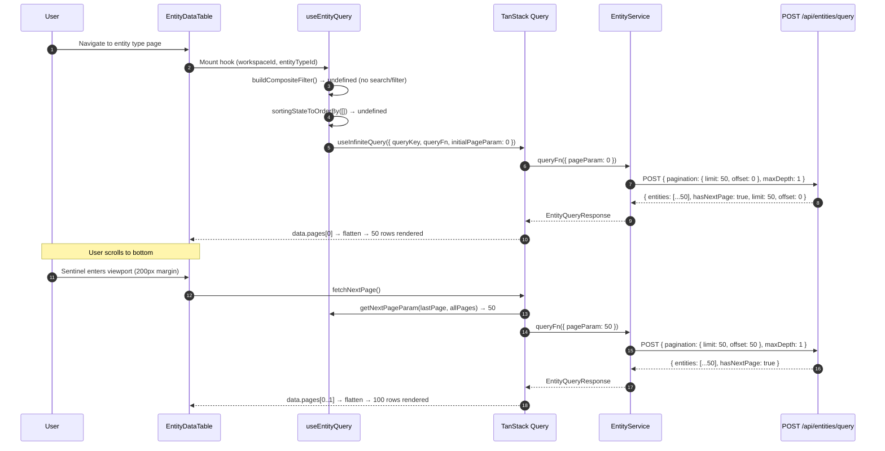
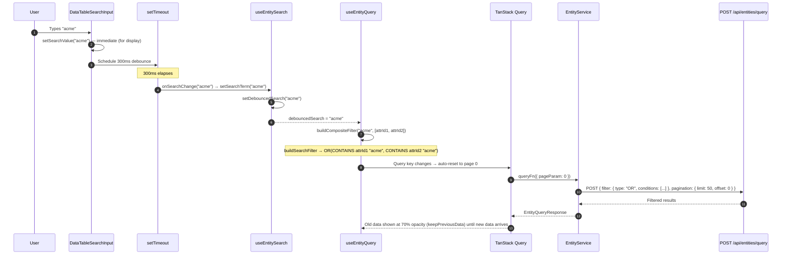

---
tags:
  - flow/user-facing
  - flow/active
  - architecture/flow
  - architecture/frontend
Created: 2026-03-18
Updated: 2026-03-18
Critical: false
Domains:
  - "[[Entities]]"
---
# Flow: Entity Query Pipeline

---

## Overview

The entity query pipeline is the data-fetching backbone of the [[Entity Data Table]]. It translates user interactions (searching, sorting, filtering) into paginated API calls against `POST /api/entities/query`, manages an infinite scroll cache of entity pages, and feeds flattened row data into TanStack Table. Understanding this flow is essential for debugging query behavior, extending filter capabilities, or adapting the pattern for other paginated features.

---

## Trigger

| Trigger Type | Source | Condition |
| --- | --- | --- |
| Page navigation | User navigates to entity type page | `EntityDataTable` mounts with `workspaceId` + `entityTypeId` |
| Search input | User types in search box | 300ms debounce fires → `debouncedSearch` updates |
| Sort click | User clicks a column header | `sorting` state changes |
| Filter change | User modifies EntityQueryBuilder | `queryFilter` state changes |
| Scroll | User scrolls near the bottom of the table | IntersectionObserver sentinel enters viewport |

**Entry Point:** `useEntityQuery` hook in `EntityDataTable`

---

## Preconditions

- Authenticated session available (`!!session && !loading`)
- `workspaceId` and `entityTypeId` resolved from route params
- `EntityType` loaded (schema, relationships, column configuration)

---

## Actors

| Actor | Role in Flow |
| --- | --- |
| User | Triggers search, sort, filter, and scroll interactions |
| `EntityDataTable` | Orchestrates state, passes config to hooks and DataTable |
| `useEntityQuery` | Builds composite filter, manages infinite query lifecycle |
| `EntityService.queryEntities` | Serializes request and calls the API (with ToJSON workaround) |
| `DataTableSearchInput` | Owns the 300ms debounce timer for search |
| Backend `/api/entities/query` | Executes filter tree, paginates, sorts, returns `EntityQueryResponse` |
| TanStack Query | Manages cache, pagination state, background refetch |

---

## Flow Steps

### Happy Path — Initial Load + Infinite Scroll



### Happy Path — Search



---

## Step-by-Step Breakdown

### 1. State Collection

- **Component:** `EntityDataTable`
- **Action:** Collects three independent pieces of query state: `debouncedSearch` from `useEntitySearch`, `sorting` from local `SortingState`, `queryFilter` from `EntityQueryBuilder` callback
- **Output:** Three values passed as options to `useEntityQuery`

### 2. Filter Composition (`buildCompositeFilter`)

- **Component:** `useEntityQuery` (exported pure function)
- **Action:** Merges search term and query builder filter into a single `QueryFilter` tree
- **Input:** `debouncedSearch`, `searchableAttributeIds`, `queryFilter`
- **Logic:**

```
if search present:
  searchFilter = buildSearchFilter(search, attributeIds)
    → for each STRING attribute: { type: ATTRIBUTE, attributeId, operator: CONTAINS, value: { kind: LITERAL, value: search } }
    → if 1 attribute: use single condition
    → if N attributes: wrap in { type: OR, conditions: [...] }

if searchFilter AND queryFilter:
  return { type: AND, conditions: [searchFilter, queryFilter] }
if searchFilter only:
  return searchFilter
if queryFilter only:
  return queryFilter
if neither:
  return undefined
```

- **Output:** `QueryFilter | undefined`

### 3. Sort Conversion (`sortingStateToOrderBy`)

- **Component:** `useEntityQuery` (exported pure function)
- **Action:** Converts TanStack Table `SortingState` to backend `OrderByClause[]`
- **Input:** `SortingState` — array of `{ id: string, desc: boolean }`
- **Output:** `OrderByClause[]` — array of `{ attributeId: string, direction: ASC | DESC }`, or `undefined` if empty

### 4. Query Key Construction

- **Component:** `entityKeys.entities.query()`
- **Action:** Builds a deterministic cache key that includes all query parameters
- **Key structure:**

```typescript
['entities', workspaceId, typeId, 'query', {
  ...(search ? { search } : {}),
  ...(filter ? { filter } : {}),
  ...(orderBy ? { orderBy } : {}),
}]
```

- **Critical behavior:** When any query parameter changes (search, filter, or sort), the trailing object changes → TanStack Query treats this as a **new query** → pagination resets to `initialPageParam: 0` → fresh fetch from page 0. This is the mechanism that ensures search/filter/sort changes always start from the beginning.

### 5. Infinite Query Execution

- **Component:** `useInfiniteQuery` (TanStack Query)
- **Configuration:**

| Option | Value | Purpose |
| --- | --- | --- |
| `initialPageParam` | `0` | First page starts at offset 0 |
| `getNextPageParam` | `(lastPage, allPages) => lastPage.hasNextPage ? allPages.length * 50 : undefined` | Calculates next offset from page count |
| `maxPages` | `10` | Caps cache at 500 entities (10 × 50) to bound memory |
| `placeholderData` | `keepPreviousData` | Shows old data during query key transitions |
| `staleTime` | `5 min` | Prevents refetch on re-mount within 5 minutes |
| `gcTime` | `10 min` | Keeps inactive cache for 10 minutes |
| `refetchOnWindowFocus` | `false` | Prevents refetch on tab switch |
| `refetchOnMount` | `false` | Prevents refetch on component re-mount |
| `enabled` | `!!session && !loading && !!workspaceId && !!entityTypeId` | Guards against unauthenticated or incomplete state |

### 6. Service Layer (`EntityService.queryEntities`)

- **Component:** `EntityService` (static class)
- **Action:** Calls `POST /api/entities/query` with pagination + optional filter
- **Request shape:**

```typescript
{
  pagination: { limit: 50, offset: pageParam, orderBy?: [...] },
  includeCount: false,
  maxDepth: 1,
  filter?: QueryFilter   // the composite filter tree
}
```

- **QueryFilterToJSON workaround:** The generated `QueryFilterToJSON` has infinite mutual recursion. `OrToJSON` calls `QueryFilterToJSONTyped` which dispatches back to `OrToJSON` → stack overflow. The service bypasses this by:
  1. Building the full request object as a plain TypeScript object (filter included)
  2. Passing a **filter-free** request to the generated `api.queryEntitiesRaw()` (so `QueryFilterToJSON` is never called)
  3. Providing an `initOverrides` callback that replaces the request body with the full object (filter included) — since plain objects serialize to JSON without the recursive ToJSON path

```typescript
const safeRequest = { pagination, includeCount: false, maxDepth: 1 }; // no filter
const response = await api.queryEntitiesRaw(
  { workspaceId, entityTypeId, entityQueryRequest: safeRequest },
  filter
    ? async () => ({ body: request } as RequestInit)  // full request with filter
    : undefined,
);
```

- **Output:** `EntityQueryResponse` with `{ entities, hasNextPage, limit, offset, totalCount? }`

### 7. Response Handling & Row Transformation

- **Component:** `EntityDataTable`
- **Action:** Flattens all pages into a single entity array, then transforms to row objects

```typescript
// Flatten pages
const entities = data?.pages.flatMap((page) => page.entities) ?? [];

// Transform to rows (via useEntityTableData → transformEntitiesToRows)
// Each entity becomes an EntityRow:
{
  _entityId: entity.id,
  _isDraft: false,
  _entity: entity,
  [attributeId]: payload.value,          // for attributes
  [relationshipId]: payload.relations,   // for relationships
}
```

- **Output:** `EntityRow[]` passed to DataTable as `initialData`

---

## Data Transformations

| Step | Input Shape | Output Shape | Transformation |
| --- | --- | --- | --- |
| Search → Filter | `string` + `string[]` (search term + attribute IDs) | `QueryFilter` (OR tree) | Each attribute gets a CONTAINS condition, wrapped in OR |
| Sort → OrderBy | `SortingState` (`{ id, desc }[]`) | `OrderByClause[]` (`{ attributeId, direction }[]`) | Map `id` → `attributeId`, `desc` → `DESC`/`ASC` |
| Filter composition | `searchFilter?` + `queryFilter?` | `QueryFilter` (AND tree) | AND-wrap when both present, pass-through when single |
| API response → Pages | `EntityQueryResponse` | `InfiniteData<EntityQueryResponse>` | TanStack Query appends each response as a page |
| Pages → Entities | `InfiniteData<EntityQueryResponse>` | `Entity[]` | `flatMap(page => page.entities)` |
| Entities → Rows | `Entity[]` | `EntityRow[]` | Flatten payload map into flat key-value row object |

---

## Pagination Deep Dive

### Offset-Based Pagination

The backend uses offset/limit pagination. Each page request specifies:

```
Page 0: { limit: 50, offset: 0 }   → entities 1–50
Page 1: { limit: 50, offset: 50 }  → entities 51–100
Page 2: { limit: 50, offset: 100 } → entities 101–150
```

`getNextPageParam` determines the next offset:

```typescript
function getNextPageParam(
  lastPage: EntityQueryResponse,
  allPages: EntityQueryResponse[],
): number | undefined {
  if (!lastPage.hasNextPage) return undefined;  // no more pages
  return allPages.length * ENTITY_PAGE_SIZE;     // next offset = pageCount × 50
}
```

When `getNextPageParam` returns `undefined`, TanStack Query sets `hasNextPage = false` and the sentinel element is removed from the DOM.

### Memory Bounding

`maxPages: 10` caps the cache at 10 pages (500 entities). When page 11 is fetched, TanStack Query evicts page 0 from the front. This prevents unbounded memory growth for entity types with thousands of instances.

The user can still scroll through all entities — they just won't all be in memory simultaneously. If the user scrolls back to evicted pages, TanStack Query will refetch them.

### Page Reset on Query Change

When search, filter, or sort changes:

1. The query key's trailing object changes (different search/filter/orderBy)
2. TanStack Query sees this as a **new query** (different key = different cache entry)
3. It starts fresh from `initialPageParam: 0`
4. `keepPreviousData` shows the old cache entry's data at 70% opacity while the new page 0 loads
5. Once page 0 arrives, the old data is replaced

This means the user never sees a blank table during transitions — they see stale data dimmed, then fresh data appears.

### Infinite Scroll Mechanics

The DataTable renders a 1px sentinel `div` after the table rows inside the scroll container. An IntersectionObserver watches this sentinel with `rootMargin: '200px'`:

```
┌─────────────────────────────┐
│  Scroll container           │
│  ┌───────────────────────┐  │
│  │  Row 1                │  │
│  │  Row 2                │  │
│  │  ...                  │  │
│  │  Row 47               │  │
│  │  Row 48  ◄── visible  │  │
│  └───────────────────────┘  │
│  ─ ─ ─ 200px margin ─ ─ ─  │  ← sentinel enters this zone
│  [sentinel div, h-px]       │
└─────────────────────────────┘
```

- When the sentinel enters the viewport (+ 200px margin above), `onLoadMore()` fires
- While `isLoadingMore` is true, "Loading more..." appears and the observer skips (early return)
- When `hasMore` becomes false, the sentinel is not rendered and the observer disconnects
- The observer recreates whenever `hasMore`, `isLoadingMore`, or `onLoadMore` changes

The 200px margin ensures the next page is usually fetched before the user reaches the bottom, creating a seamless scroll experience for most scroll speeds.

---

## Search Deep Dive

### Searchable Attribute Discovery

`generateSearchConfigFromEntityType()` scans the entity type's schema properties and collects all attributes where `schema.type === DataType.String`. This includes protected fields (like the identifier field) — all STRING attributes participate in search.

```typescript
// Returns: ['attr-uuid-1', 'attr-uuid-2', ...] (all STRING attribute IDs)
const searchableColumns = generateSearchConfigFromEntityType(entityType);
```

### Debounce Chain

The debounce is intentionally split across two components to separate concerns:

```
User types → DataTableSearchInput.searchValue (immediate, for input display)
          → setTimeout(300ms)
          → onSearchChange(value) callback
          → useEntitySearch.setSearchTerm(value)
          → setDebouncedSearch(value) — this feeds the query key
          → query key changes → TanStack Query refetches
```

`useEntitySearch` does **not** own a timer. It receives already-debounced values from the search input. The hook's `debouncedSearch` field updates synchronously when `setSearchTerm` is called — the "debounced" name reflects that it only receives values after the input component's timer fires.

**Why split?** The `DataTableSearchInput` component is shared across all tables (client-side and server-side). It always debounces because rapid keystroke filtering is expensive in both modes. Having the component own the timer means consumer hooks don't need to coordinate their own timers, and there's no risk of double-debouncing.

### Search Filter Construction

`buildSearchFilter()` creates an OR tree of CONTAINS conditions:

```
User searches "acme" on an entity type with STRING attributes [Name, Email, Notes]:

{
  type: "OR",
  conditions: [
    { type: "ATTRIBUTE", attributeId: "name-uuid",  operator: "CONTAINS", value: { kind: "LITERAL", value: "acme" } },
    { type: "ATTRIBUTE", attributeId: "email-uuid", operator: "CONTAINS", value: { kind: "LITERAL", value: "acme" } },
    { type: "ATTRIBUTE", attributeId: "notes-uuid", operator: "CONTAINS", value: { kind: "LITERAL", value: "acme" } },
  ]
}
```

Special case: if only one STRING attribute exists, the OR wrapper is omitted — the single CONTAINS condition is returned directly.

### Filter Merging

When both search and query builder filters are active:

```
Search filter:    OR(name CONTAINS "acme", email CONTAINS "acme")
Builder filter:   AND(status = "active", created > "2026-01-01")

Composite:        AND(
                    OR(name CONTAINS "acme", email CONTAINS "acme"),
                    AND(status = "active", created > "2026-01-01")
                  )
```

The top-level AND ensures both constraints are satisfied. The backend flattens nested AND/AND when executing.

---

## Query Builder Filter Composition

The `EntityQueryBuilder` component maintains internal `FilterGroupState` and converts it to `QueryFilter` on change:

### Internal State Model

```typescript
interface FilterGroupState {
  id: string;
  logicalOperator: 'and' | 'or';
  conditions: (FilterConditionState | FilterGroupState)[];  // recursive
}

interface FilterConditionState {
  id: string;
  type: 'attribute' | 'relationship';
  attributeId?: string;           // for attribute conditions
  relationshipId?: string;         // for relationship conditions
  operator?: FilterOperator;
  value?: unknown;
  relationshipConditionType?: 'exists' | 'notExists' | 'countMatches' | 'targetMatches';
  countOperator?: FilterOperator;  // for countMatches
  countValue?: number;             // for countMatches
  targetFilter?: FilterGroupState; // for targetMatches (recursive)
}
```

### Operator Availability per SchemaType

| SchemaType | Available Operators |
| --- | --- |
| Text, Email, URL, Phone | is, is not, contains, does not contain, starts with, ends with, is empty, is not empty |
| Number, Currency, Percentage, Rating | is, is not, >, >=, <, <=, is empty, is not empty |
| Date, Datetime | is, is not, >, >=, <, <=, is empty, is not empty |
| Select | is, is not, is any of, is none of, is empty, is not empty |
| MultiSelect | contains, does not contain, is empty, is not empty |
| Checkbox | is |
| Object, FileAttachment, Location | is empty, is not empty |

### Relationship Filter Types

| Type | Meaning | Additional Fields |
| --- | --- | --- |
| `exists` | Relationship has at least one link | None |
| `notExists` | Relationship has no links | None |
| `countMatches` | Number of links matches a condition | `countOperator`, `countValue` |
| `targetMatches` | Target entities match a nested filter | `targetFilter` (recursive `FilterGroupState`) |

### State → QueryFilter Conversion

`filterGroupStateToQueryFilter()` recursively converts the internal state to the API's `QueryFilter` format:

1. Iterate conditions, convert each (recursing into sub-groups)
2. Filter out incomplete conditions (`isConditionComplete` check)
3. If 0 complete conditions → return `undefined` (no filter applied)
4. If 1 complete condition → return it directly (no wrapping)
5. If 2+ conditions → wrap in `{ type: AND/OR, conditions: [...] }`

The inverse function `queryFilterToFilterGroupState()` hydrates the UI from a saved `QueryFilter`.

---

## Discriminator Enums and Serialization

The backend uses Jackson `@JsonTypeName` annotations with UPPERCASE values (`ATTRIBUTE`, `OR`, `AND`). The OpenAPI generator maps these to PascalCase in the TypeScript discriminated union:

```typescript
// Generated type (PascalCase discriminators)
type QueryFilter = { type: 'And' } & And
                 | { type: 'Attribute' } & Attribute
                 | { type: 'Or' } & Or
                 | ...
```

When constructing filters in application code, we use custom enums with the raw UPPERCASE values that the backend expects:

```typescript
// Custom enums (uppercase, matching @JsonTypeName)
enum QueryFilterType {
  Attribute = 'ATTRIBUTE',
  And = 'AND',
  Or = 'OR',
  Relationship = 'RELATIONSHIP',
  IsRelatedTo = 'IS_RELATED_TO',
}

enum FilterValueKind {
  Literal = 'LITERAL',
  Template = 'TEMPLATE',
}
```

This works because the `EntityService` bypasses the generated `QueryFilterToJSON` serializer (which would use PascalCase) and sends the filter as a plain object where our UPPERCASE enum values pass through directly to JSON.

---

## Failure Modes

### API Error

| Failure | Cause | Detection | User Experience | Recovery |
| --- | --- | --- | --- | --- |
| Query returns 4xx/5xx | Invalid filter, server error | `isError` on infinite query | Toast "Failed to load entities: {message}" + error empty state | Fix filter, retry automatically on next interaction |

### Empty Results

| Failure | Cause | Detection | User Experience | Recovery |
| --- | --- | --- | --- | --- |
| Zero entities | No data or filter too restrictive | `entities.length === 0` after flatten | "No {type.plural} found." message | Clear search/filters, create via footer button |

### QueryFilterToJSON Stack Overflow

| Failure | Cause | Detection | User Experience | Recovery |
| --- | --- | --- | --- | --- |
| `RangeError: Maximum call stack size exceeded` | Using generated `queryEntitiesRaw` without the body override when filter contains OR/AND | Stack trace in console | Blank table, no data loaded | Already mitigated by the `initOverrides` workaround in `EntityService.queryEntities` |

---

## Alternative Paths

### No Search, No Filter, No Sort

**Condition:** User hasn't interacted with any query controls

**Steps:** `buildCompositeFilter` returns `undefined`, `sortingStateToOrderBy` returns `undefined`. The API receives only `{ pagination: { limit: 50, offset: 0 }, maxDepth: 1 }` — effectively a "get all" paginated query.

### Search Cleared During Draft Mode

**Condition:** User clicks "+ New" footer button

**Steps:** `clearSearch()` sets both `searchTerm` and `debouncedSearch` to `''` immediately (no debounce delay). Query key changes to remove search → refetch with no search filter. Draft row appears at top of fresh results.

### Single Searchable Attribute

**Condition:** Entity type has only one STRING attribute

**Steps:** `buildSearchFilter` returns a single ATTRIBUTE CONTAINS condition without an OR wrapper. The composite filter has one fewer nesting level.

---

## Components Involved

| Component | Role | Can Block Flow |
| --- | --- | --- |
| `EntityDataTable` | State orchestrator, mounts hooks | Yes — if it doesn't mount, nothing fetches |
| `useEntityQuery` | Filter composition, infinite query | Yes — query won't run if `enabled` conditions fail |
| `useEntitySearch` | Search state holder | No — default empty search is valid |
| `EntityService.queryEntities` | API call with ToJSON workaround | Yes — network failure blocks data |
| `DataTableSearchInput` | Debounce timer | No — search is optional |
| `EntityQueryBuilder` | Filter tree UI | No — filter is optional |
| `entityKeys.entities.query` | Cache key factory | Yes — wrong key = stale data or cache miss |

---

## Related

- [[Entity Data Table]] — Feature design covering the full component hierarchy and UX
- [[Data Table Infrastructure]] — Shared infinite scroll, search, and sorting primitives
- [[Entity Querying]] — Backend feature design for the query API

---

## Gotchas & Tribal Knowledge

> [!warning] QueryFilterToJSON Recursion
> Never pass a filter-containing request through the generated API methods without the `initOverrides` workaround. The generated `QueryFilterToJSON` → `OrToJSON` → `QueryFilterToJSONTyped` → `OrToJSON` cycle causes an instant stack overflow. If the OpenAPI generator is upgraded and fixes this, the workaround in `EntityService.queryEntities` can be simplified to pass the filter directly.

> [!warning] Debounce Ownership
> Do not add a debounce timer to `useEntitySearch`. The `DataTableSearchInput` already debounces at 300ms. Adding another timer would create a 600ms delay with no benefit. If you need to adjust debounce timing, change `SearchConfig.debounceMs`.

> [!warning] Query Key Sensitivity
> The composite filter object is included directly in the query key. TanStack Query uses deep structural comparison for key matching. This means any change to the filter tree — even reordering conditions — creates a new query and resets pagination. This is correct behavior, but be aware that toggling the query builder open/closed should **not** produce a filter change if no conditions were modified.

> [!warning] Discriminator Casing
> The generated TypeScript types use PascalCase discriminators (`'And'`, `'Attribute'`, `'Or'`), but the API expects UPPERCASE (`'AND'`, `'ATTRIBUTE'`, `'OR'`). The custom `QueryFilterType` enum uses the correct UPPERCASE values. When constructing filters, always use the enum — never use string literals like `'And'`.

---

## Changelog

| Date | Change | Reason |
| --- | --- | --- |
| 2026-03-18 | Initial draft | Document entity query pipeline from entity-query-ui branch |
