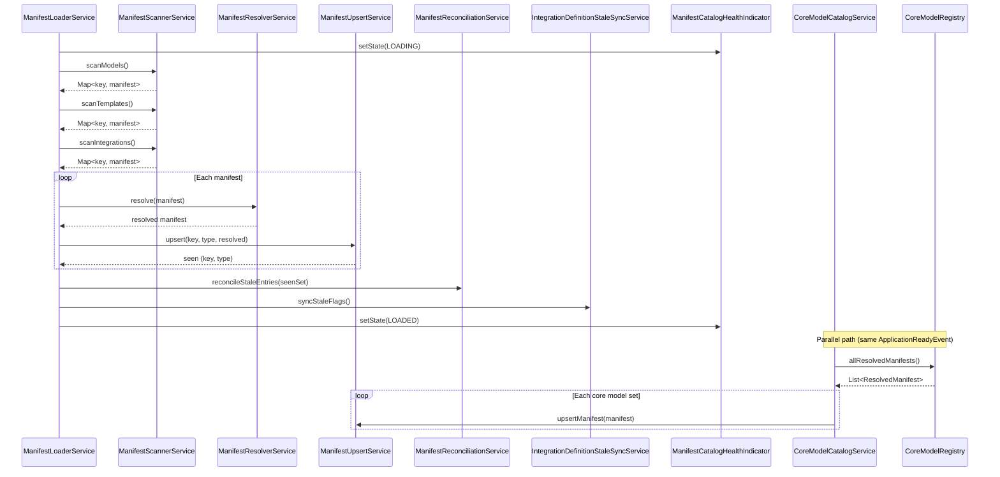

---
tags:
  - flow/background
  - architecture/flow
  - domain/catalog
Domains:
  - "[[riven/docs/system-design/domains/Catalog/Catalog]]"
Created: 2026-03-06
---
# Flow: Manifest Loading Pipeline

## Overview

Background startup flow that populates the manifest catalog from classpath JSON files. Runs once on application startup via `ApplicationReadyEvent`, loading models, templates, and integrations from classpath JSON files, plus Kotlin-defined core model objects into the `manifest_catalog` table and its child tables.

---

## Trigger

`ApplicationReadyEvent` fired by Spring Boot after context initialization.

## Entry Point

[[2. Areas/2.1 Startup & Content/Riven/2. System Design/domains/Catalog/Manifest Pipeline/ManifestLoaderService]]

---

## Steps

1. **ManifestLoaderService** spawns a background thread and sets health indicator to LOADING
2. **ManifestScannerService** scans the classpath for models, templates, and integrations, validating each against JSON Schema
3. For each scanned manifest, **ManifestResolverService** resolves `$ref` references, applies `extends` merges, and normalizes relationships
4. For each resolved manifest, **ManifestUpsertService** persists the manifest in a single transaction (SHA-256 hash check, delete-reinsert if changed)
5. **ManifestReconciliationService** marks unseen entries as stale and un-stales entries that reappeared
6. **IntegrationDefinitionStaleSyncService** propagates stale flags from catalog to `integration_definitions`
7. **ManifestLoaderService** sets health indicator to LOADED (or FAILED on error)
8. **CoreModelCatalogService** (parallel path) — on ApplicationReadyEvent, iterates over CoreModelRegistry.allResolvedManifests() and calls ManifestUpsertService.upsertManifest() for each core model set. Individual failures logged and skipped.

---

## Failure Modes

| What Fails | Impact | Recovery |
|---|---|---|
| Individual manifest parse/resolve fails | Manifest skipped, others continue loading | Fix manifest JSON, restart application |
| Entire pipeline fails | Health indicator reports FAILED | Check logs, fix root cause, restart |
| Missing `$ref` in template | Template resolution fails, template skipped | Ensure referenced model exists on classpath |
| Database unavailable during upsert | Pipeline fails, health reports FAILED | Restore database connectivity, restart |

---

## Components Involved

- [[2. Areas/2.1 Startup & Content/Riven/2. System Design/domains/Catalog/Manifest Pipeline/ManifestLoaderService]]
- [[2. Areas/2.1 Startup & Content/Riven/2. System Design/domains/Catalog/Manifest Pipeline/ManifestScannerService]]
- [[2. Areas/2.1 Startup & Content/Riven/2. System Design/domains/Catalog/Manifest Pipeline/ManifestResolverService]]
- [[2. Areas/2.1 Startup & Content/Riven/2. System Design/domains/Catalog/Manifest Pipeline/ManifestUpsertService]]
- [[2. Areas/2.1 Startup & Content/Riven/2. System Design/domains/Catalog/Manifest Pipeline/ManifestReconciliationService]]
- [[2. Areas/2.1 Startup & Content/Riven/2. System Design/domains/Catalog/Manifest Pipeline/IntegrationDefinitionStaleSyncService]]
- [[2. Areas/2.1 Startup & Content/Riven/2. System Design/domains/Catalog/Manifest Pipeline/ManifestCatalogHealthIndicator]]
- [[CoreModelCatalogService]]
- [[CoreModelRegistry]]
