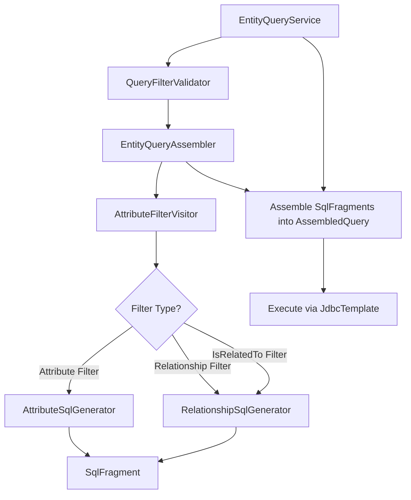

---
tags:
  - architecture/subdomain
  - domain/entity
Created: 2026-02-08
Domains:
  - "[[riven/docs/system-design/domains/Entities/Entities]]"
---
# Subdomain: Querying

## Overview

Provides a pipeline for querying entities with complex filters on normalized attribute values (via EXISTS subqueries against `entity_attributes` table) and relationships. The pipeline validates filters, generates parameterized SQL, traverses filter ASTs, and assembles complete queries with workspace isolation and pagination.

### Query Pipeline

```mermaid
flowchart TD
    A[QueryFilterValidator] --> B[EntityQueryAssembler]
    B --> C[AttributeFilterVisitor]
    C --> D{Filter Type?}
    D -->|Attribute Filter| E[AttributeSqlGenerator]
    D -->|Relationship Filter| F[RelationshipSqlGenerator]
    D -->|IsRelatedTo Filter| F
    E --> G[SqlFragment]
    F --> G
    B --> H[Assemble SqlFragments into AssembledQuery]
    I[EntityQueryService] --> A
    I --> H
    H --> J[Execute via JdbcTemplate]
```

The query pipeline flow:
1. **QueryFilterValidator** validates filter structure and operator compatibility
2. **EntityQueryAssembler** coordinates the assembly process
3. **AttributeFilterVisitor** traverses the filter AST
4. **AttributeSqlGenerator** generates EXISTS/NOT EXISTS subqueries for attribute filters against `entity_attributes` table
5. **RelationshipSqlGenerator** generates EXISTS subqueries for relationship filters
5b. **RelationshipSqlGenerator** also generates bidirectional EXISTS subqueries for IsRelatedTo filters (cross-definition existence checks)
6. SQL fragments combine into **AssembledQuery** (paired data/count queries)
7. **EntityQueryService** executes the assembled queries via JdbcTemplate

## Components

| Component | Purpose | Type |
| --------- | ------- | ---- |
| [[2. Areas/2.1 Startup & Content/Riven/2. System Design/domains/Entities/Querying/EntityQueryService]] | Query entry point, delegates to pipeline, executes SQL | Service |
| [[2. Areas/2.1 Startup & Content/Riven/2. System Design/domains/Entities/Querying/EntityQueryAssembler]] | Assembles complete parameterized queries from filter output | Service |
| [[2. Areas/2.1 Startup & Content/Riven/2. System Design/domains/Entities/Querying/QueryFilterValidator]] | Validates filter structure and operator compatibility | Service |
| [[2. Areas/2.1 Startup & Content/Riven/2. System Design/domains/Entities/Querying/AttributeFilterVisitor]] | Traverses filter AST, dispatches to SQL generators | Service |
| [[2. Areas/2.1 Startup & Content/Riven/2. System Design/domains/Entities/Querying/AttributeSqlGenerator]] | Generates EXISTS/NOT EXISTS subqueries for attribute filters against `entity_attributes` | Component |
| [[2. Areas/2.1 Startup & Content/Riven/2. System Design/domains/Entities/Querying/RelationshipSqlGenerator]] | Generates EXISTS subqueries for relationship filters | Component |
| [[2. Areas/2.1 Startup & Content/Riven/2. System Design/domains/Entities/Querying/SqlFragment]] | Value object for SQL clause + parameter pairs | Data Class |
| [[2. Areas/2.1 Startup & Content/Riven/2. System Design/domains/Entities/Querying/ParameterNameGenerator]] | Unique parameter name generation for query tree | Utility |
| [[2. Areas/2.1 Startup & Content/Riven/2. System Design/domains/Entities/Querying/AssembledQuery]] | Value object holding paired data/count queries | Data Class |

## Technical Debt

| Issue | Impact | Effort |
| ----- | ------ | ------ |
| Cross-type attribute validation partially addressed | Nested relationship filters skip attribute validation (skip rather than validate against wrong type). Full cross-type validation requires loading target schemas. | Low |

---

## Recent Changes

| Date | Change | Feature/ADR |
| ---- | ------ | ----------- |
| 2026-02-08 | Subdomain overview created with pipeline diagram | [[02-01-PLAN]] |
| 2026-02-21 | Query pipeline updated with FORWARD/INVERSE direction support. EntityQueryService now loads relationship definitions for direction resolution. RelationshipSqlGenerator accepts QueryDirection parameter. | Entity Relationships |
| 2026-03-01 | Added IS_RELATED_TO filter support — new QueryFilter.IsRelatedTo variant, bidirectional EXISTS generation in RelationshipSqlGenerator, pass-through in AttributeFilterVisitor, no-op in QueryFilterValidator | Entity Connections |
| 2026-03-09 | AttributeSqlGenerator rewritten — JSONB operators (`@>`, `->`, `->>`) replaced with EXISTS/NOT EXISTS subqueries against normalized `entity_attributes` table. ObjectMapper dependency removed. EntityQueryService now hydrates query results with attributes via EntityAttributeService. | Entity Attributes Normalization |
