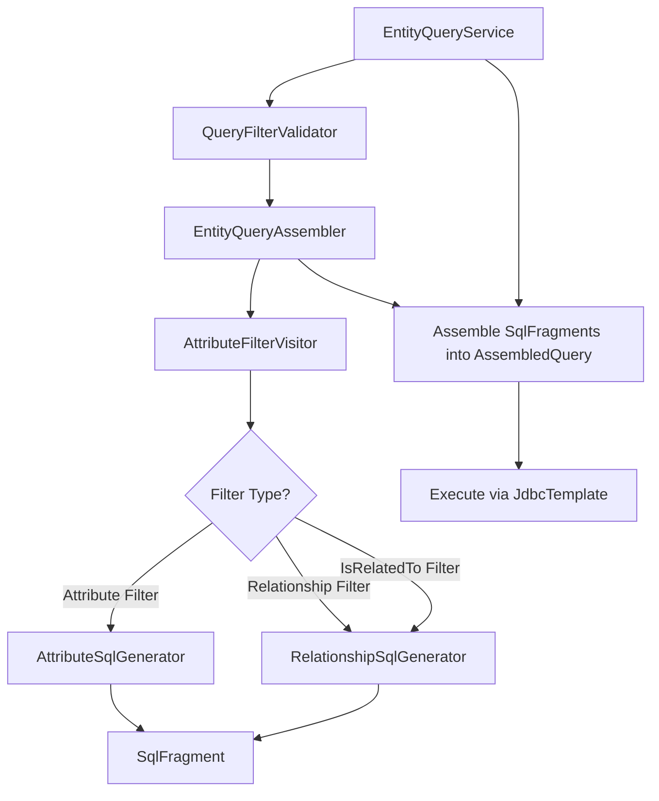

---
tags:
  - architecture/subdomain
  - domain/entity
Created: 2026-02-08
Domains:
  - "[[Entities]]"
---
# Subdomain: Querying

## Overview

Provides a pipeline for querying entities with complex filters on JSONB attributes and relationships. The pipeline validates filters, generates parameterized SQL, traverses filter ASTs, and assembles complete queries with workspace isolation and pagination.

### Query Pipeline

The query pipeline flow:
1. **QueryFilterValidator** validates filter structure and operator compatibility
2. **EntityQueryAssembler** coordinates the assembly process
3. **AttributeFilterVisitor** traverses the filter AST
4. **AttributeSqlGenerator** generates SQL for JSONB attribute filters
5. **RelationshipSqlGenerator** generates EXISTS subqueries for relationship filters
5b. **RelationshipSqlGenerator** also generates bidirectional EXISTS subqueries for IsRelatedTo filters (cross-definition existence checks)
6. SQL fragments combine into **AssembledQuery** (paired data/count queries)
7. **EntityQueryService** executes the assembled queries via JdbcTemplate

## Components

| Component | Purpose | Type |
| --------- | ------- | ---- |
| [[EntityQueryService]] | Query entry point, delegates to pipeline, executes SQL | Service |
| [[EntityQueryAssembler]] | Assembles complete parameterized queries from filter output | Service |
| [[QueryFilterValidator]] | Validates filter structure and operator compatibility | Service |
| [[AttributeFilterVisitor]] | Traverses filter AST, dispatches to SQL generators | Service |
| [[AttributeSqlGenerator]] | Generates SQL for JSONB attribute filters | Component |
| [[RelationshipSqlGenerator]] | Generates EXISTS subqueries for relationship filters | Component |
| [[SqlFragment]] | Value object for SQL clause + parameter pairs | Data Class |
| [[ParameterNameGenerator]] | Unique parameter name generation for query tree | Utility |
| [[AssembledQuery]] | Value object holding paired data/count queries | Data Class |

## Technical Debt

| Issue | Impact | Effort |
| ----- | ------ | ------ |
| Cross-type attribute validation partially addressed | Nested relationship filters skip attribute validation (skip rather than validate against wrong type). Full cross-type validation requires loading target schemas. | Low |

---

## Recent Changes

| Date | Change | Feature/ADR |
| ---- | ------ | ----------- |
| 2026-02-08 | Subdomain overview created with pipeline diagram | [[02-01-PLAN]] |
| 2026-02-21 | Query pipeline updated with FORWARD/INVERSE direction support. EntityQueryService now loads relationship definitions for direction resolution. RelationshipSqlGenerator accepts QueryDirection parameter. | Entity Relationships |
| 2026-03-01 | Added IS_RELATED_TO filter support — new QueryFilter.IsRelatedTo variant, bidirectional EXISTS generation in RelationshipSqlGenerator, pass-through in AttributeFilterVisitor, no-op in QueryFilterValidator | Entity Connections |
