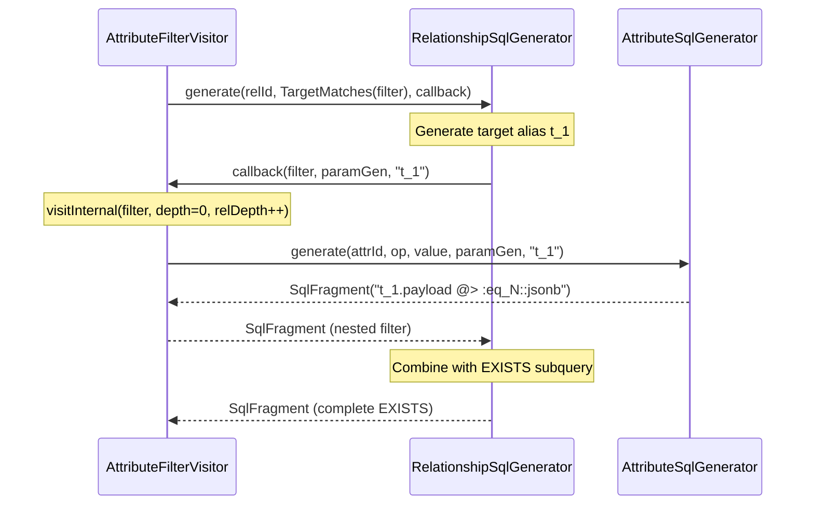

---
tags:
  - component/active
  - layer/service
  - architecture/component
Created: 2026-02-08
Updated: 2026-02-08
Domains:
  - "[[Entities]]"
---
Part of [[Querying]]

# RelationshipSqlGenerator

---

## Purpose

Generates parameterized EXISTS/NOT EXISTS subqueries for filtering entities by their relationships, converting RelationshipFilter variants into PostgreSQL EXISTS subqueries correlated to the outer entity query.

---

## Responsibilities

**This component owns:**
- Converting RelationshipFilter conditions to PostgreSQL EXISTS/NOT EXISTS subqueries
- Generating unique table aliases (`r_N`, `t_N`) for relationship and target entity tables
- Supporting nested filter processing via callback pattern (avoids circular dependencies)
- Handling 4 filter variants: Exists, NotExists, TargetEquals, TargetMatches, TargetTypeMatches
- Generating OR-branched type predicates for polymorphic relationship filters
- Soft-delete filtering on relationships (`r.deleted = false`)
- Omitting workspace isolation in subqueries (enforced at root only)

**Explicitly NOT responsible for:**
- Validating filter structure or relationship IDs (delegated to validation layer)
- Executing queries (delegated to query executor)
- Managing ParameterNameGenerator lifecycle (caller provides shared instance)
- Visiting nested filters directly (uses callback to maintain separation of concerns)
- Adding workspace_id filtering in subqueries (intentionally omitted)

---

## Dependencies

### Internal Dependencies

|Component|Purpose|Coupling|
|---|---|---|
|[[SqlFragment]]|Immutable container for SQL with parameters|High|
|[[ParameterNameGenerator]]|Generates unique parameter names and alias counters|High|
|[[QueryFilter]]|Filter model for nested filter processing|Medium|

### External Dependencies

|Service/Library|Purpose|Failure Impact|
|---|---|---|
|Spring Framework|Dependency injection via @Component|Cannot instantiate component|

### Injected Dependencies

```kotlin
@Component
class RelationshipSqlGenerator
// No constructor dependencies
```

---

## Consumed By

|Component|How It Uses This|Notes|
|---|---|---|
|[[AttributeFilterVisitor]]|Calls generate() for each RELATIONSHIP filter node|Main consumer - provides nestedFilterVisitor callback|

---

## Public Interface

### Key Methods

#### `generate(relationshipId: UUID, condition: RelationshipFilter, paramGen: ParameterNameGenerator, entityAlias: String = "e", nestedFilterVisitor: ((QueryFilter, ParameterNameGenerator, String) -> SqlFragment)? = null): SqlFragment`

- **Purpose:** Generates a SQL fragment for filtering by a relationship condition
- **When to use:** For each relationship filter in a filter tree
- **Side effects:** Increments paramGen counter for aliases and parameters (pure function otherwise)
- **Throws:**
  - UnsupportedOperationException if CountMatches condition is encountered
  - UnsupportedOperationException if TargetMatches/TargetTypeMatches lacks nestedFilterVisitor
  - IllegalArgumentException if TargetEquals receives invalid UUIDs
- **Returns:** SqlFragment with parameterized EXISTS/NOT EXISTS subquery SQL and bound values

**Parameters:**
- `relationshipId`: UUID of the relationship definition (maps to `relationship_field_id` column)
- `condition`: RelationshipFilter variant (Exists, NotExists, TargetEquals, TargetMatches, TargetTypeMatches)
- `paramGen`: Generator for unique parameter names and table aliases (shared across query tree)
- `entityAlias`: Table alias for the entity being filtered (default "e" for root entity, "t_N" for nested)
- `nestedFilterVisitor`: Optional lambda for processing nested filters inside TargetMatches/TargetTypeMatches
  - Signature: `(filter: QueryFilter, paramGen: ParameterNameGenerator, entityAlias: String) -> SqlFragment`
  - Required for TargetMatches and TargetTypeMatches
  - Not needed for Exists, NotExists, TargetEquals

**Condition dispatch:**
```kotlin
when (condition) {
    is RelationshipFilter.Exists -> generateExists(...)
    is RelationshipFilter.NotExists -> generateNotExists(...)
    is RelationshipFilter.TargetEquals -> generateTargetEquals(...)
    is RelationshipFilter.TargetMatches -> generateTargetMatches(..., visitor)
    is RelationshipFilter.TargetTypeMatches -> generateTargetTypeMatches(..., visitor)
    is RelationshipFilter.CountMatches -> throw UnsupportedOperationException(...)
}
```

---

## Key Logic

### EXISTS Subquery Pattern

**Why EXISTS instead of JOINs:**

EXISTS subqueries are preferred over JOINs for relationship filtering because they:

1. **Short-circuit on first match** (semi-join optimization)
   - EXISTS stops scanning as soon as it finds one matching row
   - JOIN would continue scanning all matching rows

2. **Avoid row duplication**
   - Entity with 3 related entities: JOIN produces 3 rows, EXISTS produces 1
   - No need for DISTINCT to deduplicate results

3. **Compose cleanly with AND/OR logic**
   - EXISTS is a boolean predicate in WHERE clause
   - Multiple EXISTS can be combined with AND/OR naturally
   - JOINs require complex ON conditions to combine filters

4. **Work well with existing indexes**
   - Composite index on `(workspace_id, source_entity_id)` supports EXISTS lookup
   - PostgreSQL query planner optimizes correlated EXISTS efficiently

**Subquery structure:**

```sql
EXISTS (
    SELECT 1 FROM entity_relationships r_0
    WHERE r_0.source_entity_id = e.id          -- Correlated to outer query
      AND r_0.relationship_field_id = :rel_1   -- Filter by relationship type
      AND r_0.deleted = false                  -- Soft-delete exclusion
)
```

**Correlation:** `r_0.source_entity_id = e.id` correlates subquery to outer entity.

**SELECT 1:** Returns constant (EXISTS only cares about row existence, not values).

### Nested Filter Visitor Callback Pattern

**Why callback instead of direct dependency:**

The RelationshipSqlGenerator needs to process nested filters for TargetMatches and TargetTypeMatches conditions. However, filter processing is handled by AttributeFilterVisitor, which also depends on RelationshipSqlGenerator. This creates a circular dependency:

```
AttributeFilterVisitor --> RelationshipSqlGenerator
RelationshipSqlGenerator --> AttributeFilterVisitor  // CIRCULAR!
```

**Solution:** Callback lambda provided by caller:

Instead of holding a direct reference to the visitor, the `generate()` method accepts an optional `nestedFilterVisitor` lambda. The caller (AttributeFilterVisitor) provides this lambda to enable recursive filter processing:

```kotlin
// In AttributeFilterVisitor.visitRelationship():
val nestedVisitor: (QueryFilter, ParameterNameGenerator, String) -> SqlFragment =
    { nestedFilter, nestedParamGen, nestedEntityAlias ->
        visitInternal(
            nestedFilter,
            depth = 0,                           // Reset AND/OR depth
            relationshipDepth = relationshipDepth + 1,  // Increment relationship depth
            nestedParamGen,
            nestedEntityAlias
        )
    }

relationshipSqlGenerator.generate(
    relationshipId = filter.relationshipId,
    condition = filter.condition,
    paramGen = paramGen,
    entityAlias = entityAlias,
    nestedFilterVisitor = nestedVisitor
)
```

**Benefits:**
- No circular dependencies
- Separation of concerns (relationship SQL generation doesn't know about visitor internals)
- Caller controls depth tracking and recursion strategy
- Easier to test (can mock callback behavior)

**When callback is required:**
- TargetMatches (nested filter on related entity)
- TargetTypeMatches (nested filter on polymorphic related entity)

**When callback is NOT needed:**
- Exists (no nested filter)
- NotExists (no nested filter)
- TargetEquals (simple ID check, no filter)

### Alias Generation Strategy

**Unique aliases prevent SQL ambiguity at any nesting depth:**

Each subquery generates unique table aliases via ParameterNameGenerator to prevent SQL name collisions:

**Alias types:**
- Relationship table: `r_{counter}` (e.g., `r_0`, `r_3`, `r_7`)
- Target entity table: `t_{counter}` (e.g., `t_1`, `t_4`, `t_8`)

**How it works:**

```kotlin
val relAlias = "r_${paramGen.next("a")}"    // "r_0" (paramGen returns "a_0", extract counter)
val targetAlias = "t_${paramGen.next("a")}" // "t_1"
```

**Counter is shared across entire query tree:**

Since the same ParameterNameGenerator instance flows through all SQL generation (base conditions, filters, nested subqueries), aliases are guaranteed unique even in deeply nested scenarios:

```sql
-- Root query: e
EXISTS (
    SELECT 1 FROM entity_relationships r_0
    JOIN entities t_1 ON r_0.target_entity_id = t_1.id
    WHERE r_0.source_entity_id = e.id
      AND EXISTS (
          SELECT 1 FROM entity_relationships r_2
          JOIN entities t_3 ON r_2.target_entity_id = t_3.id
          WHERE r_2.source_entity_id = t_1.id  -- References parent subquery alias
            AND ...
      )
)
```

**Why unique aliases matter:**
- Prevents PostgreSQL error: "table name r_0 specified more than once"
- Allows nested subqueries to reference parent aliases unambiguously
- Enables correct correlation between subquery levels

### Workspace Isolation Omission

**Subqueries do NOT include workspace_id filtering:**

The root query (EntityQueryAssembler) adds `e.workspace_id = :ws_N` to the base WHERE clause. Relationship subqueries intentionally omit workspace filtering.

**Why workspace filtering is omitted:**

1. **FK constraints guarantee same-workspace references**
   - `entity_relationships.source_entity_id` → `entities.id`
   - `entity_relationships.target_entity_id` → `entities.id`
   - Both FKs enforce referential integrity
   - Relationships cannot reference entities in different workspaces

2. **Row Level Security (RLS) provides database-level safety**
   - RLS policies on `entities` and `entity_relationships` tables
   - Prevents cross-workspace data leakage at database level
   - Additional safety net even if application logic fails

3. **Simpler SQL with fewer redundant checks**
   - Adding `r.workspace_id = :ws_N` and `t.workspace_id = :ws_N` in every subquery bloats SQL
   - No security benefit (already enforced by FK + RLS)
   - Fewer parameters to bind, faster query parsing

**Where workspace isolation IS enforced:**
- Root query WHERE clause: `e.workspace_id = :ws_N` (EntityQueryAssembler)

**Where workspace isolation is NOT enforced:**
- Relationship subqueries (this component)
- Nested relationship subqueries (recursive calls)

---

## Filter Variant Implementations

### Exists: Has Any Related Entity

**SQL pattern:**
```sql
EXISTS (
    SELECT 1 FROM entity_relationships r_0
    WHERE r_0.source_entity_id = e.id
      AND r_0.relationship_field_id = :rel_1
      AND r_0.deleted = false
)
```

**Matches:** Entities with at least one related entity via this relationship (after soft-delete filtering).

**Parameters:**
- `a_N`: Alias counter (generates `r_0`)
- `rel_N`: Relationship ID

**Use case:** "Show me all Accounts that have a Client relationship"

---

### NotExists: Has No Related Entities

**SQL pattern:**
```sql
NOT EXISTS (
    SELECT 1 FROM entity_relationships r_0
    WHERE r_0.source_entity_id = e.id
      AND r_0.relationship_field_id = :rel_1
      AND r_0.deleted = false
)
```

**Matches:** Entities with zero related entities via this relationship.

**Parameters:** Same as Exists.

**Use case:** "Show me all Accounts with no Client relationship"

---

### TargetEquals: Related to Specific Entity IDs

**SQL pattern:**
```sql
EXISTS (
    SELECT 1 FROM entity_relationships r_0
    WHERE r_0.source_entity_id = e.id
      AND r_0.relationship_field_id = :rel_1
      AND r_0.target_entity_id IN (:te_2)
      AND r_0.deleted = false
)
```

**Matches:** Entities related to one of the specified entity IDs.

**Parameters:**
- `a_N`: Alias counter
- `rel_N`: Relationship ID
- `te_N`: List of UUID entity IDs

**Edge cases:**
- Empty list: Returns `SqlFragment("1 = 0", emptyMap())` (never matches)
- Invalid UUID strings: Throws IllegalArgumentException with list of invalid IDs

**Use case:** "Show me all Deals related to Client ABC or Client XYZ"

---

### TargetMatches: Related Entity Satisfies Filter

**SQL pattern:**
```sql
EXISTS (
    SELECT 1 FROM entity_relationships r_0
    JOIN entities t_1 ON r_0.target_entity_id = t_1.id AND t_1.deleted = false
    WHERE r_0.source_entity_id = e.id
      AND r_0.relationship_field_id = :rel_2
      AND r_0.deleted = false
      AND {nested filter SQL referencing t_1}
)
```

**Matches:** Entities related to an entity that satisfies the nested filter.

**JOIN required:** Must access target entity table to evaluate nested filter.

**Nested filter processing:**
1. Generate target entity alias: `t_N`
2. Call `nestedFilterVisitor(filter, paramGen, targetAlias)`
3. Visitor returns SqlFragment with SQL referencing `t_1.payload`
4. Append nested fragment to WHERE clause

**Parameters:**
- `a_N`: Alias counters (2 calls: `r_0`, `t_1`)
- `rel_N`: Relationship ID
- Plus parameters from nested filter fragment

**Use case:** "Show me all Deals related to a Client where Client.tier = 'Premium'"

---

### TargetTypeMatches: Polymorphic Relationship Filter

**SQL pattern:**
```sql
EXISTS (
    SELECT 1 FROM entity_relationships r_0
    JOIN entities t_1 ON r_0.target_entity_id = t_1.id AND t_1.deleted = false
    WHERE r_0.source_entity_id = e.id
      AND r_0.relationship_field_id = :rel_2
      AND r_0.deleted = false
      AND (
          (t_1.type_id = :ttm_type_3 AND {branch 1 filter SQL})
          OR
          (t_1.type_id = :ttm_type_4 AND {branch 2 filter SQL})
          OR
          (t_1.type_id = :ttm_type_5)  -- Branch with no filter
      )
)
```

**Matches:** Entities related to an entity whose type matches any branch AND satisfies that branch's optional filter.

**OR semantics across branches:** Any matching branch causes the condition to match.

**Branch processing:**
1. For each TypeBranch:
   - Generate type condition: `t.type_id = :ttm_type_N`
   - If branch has filter: call `nestedFilterVisitor(branch.filter, paramGen, targetAlias)`
   - Combine: `typeCondition.and(filterFragment)` OR just `typeCondition`
2. Reduce branches with OR: `branch1.or(branch2).or(branch3)`
3. Wrap in parentheses: `AND ({combined branches})`

**Parameters:**
- `a_N`: Alias counters
- `rel_N`: Relationship ID
- `ttm_type_N`: Entity type ID for each branch
- Plus parameters from branch filter fragments

**Edge case:** Empty branches list returns `SqlFragment("1 = 0", emptyMap())` (never matches).

**Use case:** "Show me all Tasks related to an Owner where Owner is (User with tier='Premium') OR (Team with size > 10)"

---

### CountMatches: Not Supported

**Throws:** `UnsupportedOperationException("CountMatches is not supported in this version. See v2 requirements REL-09.")`

**Why not supported:**
- Requires aggregation in subquery: `HAVING COUNT(*) > N`
- More complex SQL generation
- Deferred to v2 requirements

---

## Error Handling

### Errors Thrown

|Error/Exception|When|Expected Handling|
|---|---|---|
|UnsupportedOperationException|CountMatches condition encountered|Propagate to API layer - filter validation should prevent this|
|UnsupportedOperationException|TargetMatches/TargetTypeMatches without nestedFilterVisitor|Programming error - caller must provide callback|
|IllegalArgumentException|TargetEquals with invalid UUID strings|Propagate to API layer - return 400 Bad Request with invalid IDs|

### Errors Handled

|Error/Exception|Source|Recovery Strategy|
|---|---|---|
|Empty branches in TargetTypeMatches|Model validation missed edge case|Return ALWAYS_FALSE fragment (1=0)|
|Empty entityIds in TargetEquals|Model validation missed edge case|Return ALWAYS_FALSE fragment (1=0)|

---

## Gotchas & Edge Cases

> [!warning] Workspace Isolation is NOT in Subqueries
> Relationship subqueries do NOT include `workspace_id` filtering. Workspace isolation is enforced only at the root query level by EntityQueryAssembler.
>
> **Why:** FK constraints and RLS enforce workspace isolation at database level. Redundant checks in every subquery would bloat SQL without adding safety.
>
> **Impact:** Do not rely on subquery SQL containing workspace checks. If you extract subquery SQL for standalone use, you MUST add workspace filtering manually.

> [!warning] Nested Filter Visitor is Required for TargetMatches
> If you call `generate()` with TargetMatches or TargetTypeMatches condition but `nestedFilterVisitor = null`, the method throws UnsupportedOperationException.
>
> **Why:** Nested filters cannot be processed without a visitor callback (avoids circular dependencies).
>
> **Correct usage:**
> ```kotlin
> val visitor = { filter, paramGen, alias -> /* visit logic */ }
> generator.generate(relId, TargetMatches(filter), paramGen, nestedFilterVisitor = visitor)
> ```
>
> **Programming error if omitted** - not a user input issue.

> [!warning] TargetEquals Validates UUID Format
> TargetEquals converts string entity IDs to UUIDs. If any ID is invalid, the method throws IllegalArgumentException listing all invalid IDs.
>
> **Example error:**
> ```
> IllegalArgumentException: generateTargetEquals: invalid entity ID(s): [abc123, not-a-uuid]
> ```
>
> **Why:** Prevents SQL parameter binding errors when executor tries to bind non-UUID values.
>
> **Expected:** Filter validation layer should validate UUID format before reaching SQL generation.

> [!warning] Soft-Delete Filtering on Relationships
> All subqueries include `r.deleted = false` to exclude soft-deleted relationships.
>
> **Also filters deleted target entities:** JOIN condition includes `t.deleted = false` for TargetMatches and TargetTypeMatches.
>
> **Impact:** Deleted relationships and deleted entities are excluded from results. This is correct behavior but may surprise if manually inspecting database with soft-deleted rows.

> [!warning] TargetTypeMatches Requires At Least One Branch
> The TypeBranch model enforces `branches.isNotEmpty()` via `init` block. However, the generator also checks and returns ALWAYS_FALSE for empty lists (defense in depth).
>
> **Why check twice:** Model validation may be bypassed in tests or internal code paths. SQL generator is defensive.

### Known Limitations

- CountMatches not supported (deferred to v2)
- No support for aggregations in relationship filters (e.g., "has more than 5 Clients")
- No support for relationship metadata filtering (e.g., filter by relationship created_at)
- No support for bi-directional relationship traversal (source→target only, not target→source)
- TargetEquals does not support template expressions (requires UUID strings)

### Thread Safety / Concurrency

**Thread-safe** with Spring singleton:
- Singleton Spring bean shared across threads
- Stateless (no mutable fields)
- Each method call is independent
- No synchronization needed

**Concurrency model:**
- Safe for concurrent use across multiple requests
- Each generate() call is pure (no side effects except paramGen counter increment)

---

## Testing

### Unit Test Coverage

- **Location:** `src/test/kotlin/riven/core/service/entity/query/RelationshipSqlGeneratorTest.kt`
- **Key scenarios covered:**
  - Exists generates EXISTS subquery with correlation
  - NotExists generates NOT EXISTS subquery
  - TargetEquals converts entity IDs to UUIDs and uses IN
  - TargetEquals with empty list returns ALWAYS_FALSE
  - TargetEquals with invalid UUIDs throws IllegalArgumentException
  - TargetMatches calls nestedFilterVisitor with target alias
  - TargetMatches without visitor throws UnsupportedOperationException
  - TargetTypeMatches generates OR-branched type predicates
  - TargetTypeMatches with empty branches returns ALWAYS_FALSE
  - CountMatches throws UnsupportedOperationException
  - Unique aliases generated for nested subqueries

### How to Test Manually

1. Create RelationshipSqlGenerator
2. Create ParameterNameGenerator
3. Create mock nestedFilterVisitor (returns test SqlFragment)
4. Call generate() with test condition
5. Inspect returned SqlFragment:
   - SQL contains EXISTS/NOT EXISTS structure
   - Correlation condition references correct entity alias
   - Parameters map includes relationship ID and nested parameters
   - Unique aliases (r_N, t_N) used
6. Verify SQL syntax by running in PostgreSQL

---

## Related

- [[Querying]] - Parent subdomain
- [[AttributeFilterVisitor]] - Main consumer, provides callback
- [[AttributeSqlGenerator]] - Sibling generator for attributes
- [[SqlFragment]] - Immutable SQL container
- [[ParameterNameGenerator]] - Unique parameter name and alias generation

---

## Callback Pattern Diagram



---

## Changelog

|Date|Change|Reason|
|---|---|---|
|2026-02-08|Initial documentation|Phase 2 - Entities domain documentation (Plan 02-03)|
