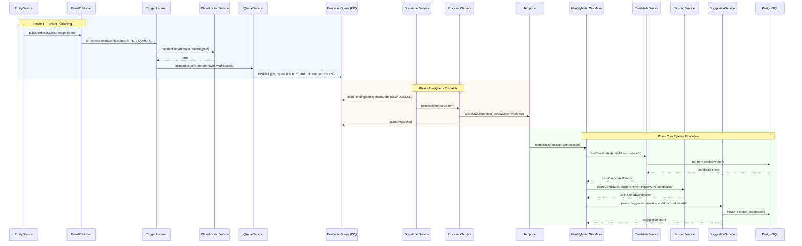

---
tags:
  - flow/background
  - architecture/flow
  - domain/identity-resolution
Domains:
  - "[[2. Areas/2.1 Startup & Content/Riven/2. System Design/domains/Identity Resolution/Identity Resolution]]"
Created: 2026-03-17
---

# Flow — Identity Match Pipeline

## Overview

End-to-end pipeline for detecting duplicate entities. Triggered when an entity is saved or updated with IDENTIFIER-classified attributes. Flows through event publishing, queue dispatch, Temporal workflow execution, and three pipeline activities (candidate finding, scoring, suggestion persistence).

## Trigger

Domain event — `IdentityMatchTriggerEvent` published by EntityService after entity save/update commit.

## Entry Point

`IdentityMatchTriggerListener` via `@TransactionalEventListener(phase = AFTER_COMMIT)`

## Steps

| Step | Component | Action |
|---|---|---|
| 1 | EntityService | Saves/updates entity and publishes `IdentityMatchTriggerEvent` via `ApplicationEventPublisher` |
| 2 | IdentityMatchTriggerListener | Receives event after transaction commits (`@TransactionalEventListener(AFTER_COMMIT)`) |
| 3 | IdentityMatchTriggerListener | Checks `EntityTypeClassificationService` for IDENTIFIER attributes on entity type |
| 4 | IdentityMatchTriggerListener | On update: checks if any IDENTIFIER attribute values changed (skips if unchanged) |
| 5 | IdentityMatchQueueService | `enqueueIfNotPending()` creates IDENTITY_MATCH job in execution_queue (deduplication via partial unique index) |
| 6 | IdentityMatchDispatcherService | Scheduled every 5s with ShedLock — picks up pending IDENTITY_MATCH jobs |
| 7 | IdentityMatchQueueProcessorService | Claims batch via `SKIP LOCKED`, processes each in `REQUIRES_NEW` transaction |
| 8 | IdentityMatchQueueProcessorService | Starts `IdentityMatchWorkflow` on Temporal (`identity.match` task queue, workflow ID: `identity-match-{entityId}`) |
| 9 | IdentityMatchCandidateService | Activity 1 — FindCandidates: runs two-phase pg_trgm query on IDENTIFIER attributes |
| 10 | IdentityMatchWorkflow | Short-circuit: if no candidates found, workflow returns 0 |
| 11 | IdentityMatchScoringService | Activity 2 — ScoreCandidates: computes weighted average scores, filters by threshold (0.5) |
| 12 | IdentityMatchWorkflow | Short-circuit: if no candidates above threshold, workflow returns 0 |
| 13 | IdentityMatchSuggestionService | Activity 3 — PersistSuggestions: creates/re-suggests match suggestions with canonical UUID ordering |
| 14 | IdentityMatchWorkflow | Returns suggestion count |

## Sequence Diagram

## Failure Modes

| What Fails | Phase | Impact | Recovery |
|---|---|---|---|
| EntityService save fails | 1 | No event published | Standard transaction rollback |
| Queue insert fails (duplicate) | 1 | Silently caught — item already pending | DataIntegrityViolationException caught, no-op |
| Dispatcher crash mid-batch | 2 | Claimed items become stale | `recoverStaleItems()` resets to PENDING after 5 minutes |
| Temporal start fails | 2 | Item released to PENDING or marked FAILED after 3 attempts | Retry via `releaseToPending` or permanent failure |
| Candidate query fails | 3 | Activity retries (3 attempts, exponential backoff 1s to 10s) | Temporal activity retry policy |
| Suggestion insert fails (constraint) | 3 | DataIntegrityViolationException caught — duplicate pair | Idempotent, returns null |

## Components Involved

- [[2. Areas/2.1 Startup & Content/Riven/2. System Design/domains/Identity Resolution/Matching Pipeline/IdentityMatchCandidateService]] — pg_trgm candidate finding
- [[2. Areas/2.1 Startup & Content/Riven/2. System Design/domains/Identity Resolution/Matching Pipeline/IdentityMatchScoringService]] — weighted scoring computation
- [[2. Areas/2.1 Startup & Content/Riven/2. System Design/domains/Identity Resolution/Matching Pipeline/IdentityMatchSuggestionService]] — suggestion persistence and re-suggestion
- EntityTypeClassificationService — IDENTIFIER attribute cache
- IdentityMatchQueueService — IDENTITY_MATCH job enqueueing
- IdentityMatchDispatcherService — scheduled queue polling
- IdentityMatchQueueProcessorService — per-item Temporal dispatch
- IdentityMatchTriggerListener — domain event listener
- IdentityMatchWorkflowImpl — Temporal workflow orchestration
- IdentityMatchActivitiesImpl — Temporal activity delegation
