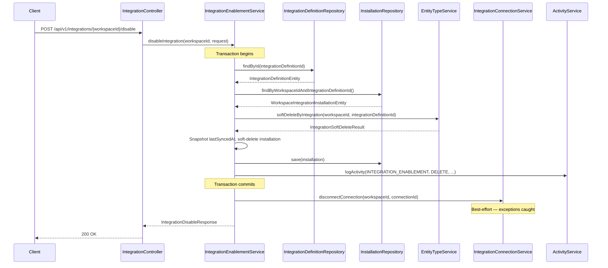

---
tags:
  - flow/user-facing
  - architecture/flow
  - domain/integration
Created: 2026-03-18
Domains:
  - "[[riven/docs/system-design/domains/Integrations/Integrations]]"
---
# Flow: Integration Disable

## Overview

User-facing flow triggered when a workspace admin disables a third-party integration. Soft-deletes all entity types and relationships created by the integration, disconnects the Nango connection, snapshots `lastSyncedAt` for gap recovery on re-enable, and soft-deletes the installation record. The Nango disconnect runs outside the main transaction to avoid holding a DB transaction during the external API call.

---

## Trigger

Workspace admin calls `POST /api/v1/integrations/{workspaceId}/disable` with a `DisableIntegrationRequest` containing the integration definition ID.

## Entry Point

[[2. Areas/2.1 Startup & Content/Riven/2. System Design/domains/Integrations/Enablement/IntegrationController]] → [[2. Areas/2.1 Startup & Content/Riven/2. System Design/domains/Integrations/Enablement/IntegrationEnablementService]].`disableIntegration()`

---

## Steps

1. **[[2. Areas/2.1 Startup & Content/Riven/2. System Design/domains/Integrations/Enablement/IntegrationController]]** validates the request body (`@Valid`) and delegates to [[2. Areas/2.1 Startup & Content/Riven/2. System Design/domains/Integrations/Enablement/IntegrationEnablementService]]
2. **[[2. Areas/2.1 Startup & Content/Riven/2. System Design/domains/Integrations/Enablement/IntegrationEnablementService]]** retrieves `userId` from JWT via `AuthTokenService`
3. **[[2. Areas/2.1 Startup & Content/Riven/2. System Design/domains/Integrations/Enablement/IntegrationEnablementService]]** loads the `IntegrationDefinitionEntity` via `findOrThrow`
4. **[[2. Areas/2.1 Startup & Content/Riven/2. System Design/domains/Integrations/Enablement/IntegrationEnablementService]]** finds the active installation — throws `NotFoundException` if integration is not enabled
5. **[[riven/docs/system-design/domains/Entities/Type Definitions/EntityTypeService]]** soft-deletes all entity types and relationships created by the integration via `softDeleteByIntegration(workspaceId, integrationDefinitionId)`
6. **[[2. Areas/2.1 Startup & Content/Riven/2. System Design/domains/Integrations/Enablement/IntegrationEnablementService]]** snapshots `lastSyncedAt` on the installation record for gap recovery on future re-enable
7. **[[2. Areas/2.1 Startup & Content/Riven/2. System Design/domains/Integrations/Enablement/IntegrationEnablementService]]** soft-deletes the installation record via `markDeleted()`
8. **[[riven/docs/system-design/domains/Workspaces & Users/User Management/ActivityService]]** logs the disable operation with integration slug and entity type count
9. Steps 2-8 commit as a single transaction (the `disableIntegrationTransactional()` method)
10. **[[riven/docs/system-design/domains/Integrations/Connection Management/IntegrationConnectionService]]** disconnects the Nango connection if one exists — runs outside the transaction. Catches all exceptions gracefully; disable succeeds even if Nango cleanup fails
11. **[[2. Areas/2.1 Startup & Content/Riven/2. System Design/domains/Integrations/Enablement/IntegrationEnablementService]]** returns `IntegrationDisableResponse` with soft-delete counts

---

## Failure Modes

| What Fails | Impact | Recovery |
|---|---|---|
| Integration definition not found | 404 NotFoundException, no side effects | Verify integration definition ID |
| Integration not enabled (no active installation) | 404 NotFoundException, no side effects | Integration is already disabled |
| Entity type soft-delete failure | Transaction rolls back, nothing is disabled | Fix underlying entity issue, retry |
| Nango disconnect failure | Disable succeeds locally — installation and entity types are soft-deleted. Nango connection may remain. | Manual Nango cleanup or retry disconnect |

---

## Components Involved

- [[2. Areas/2.1 Startup & Content/Riven/2. System Design/domains/Integrations/Enablement/IntegrationController]]
- [[2. Areas/2.1 Startup & Content/Riven/2. System Design/domains/Integrations/Enablement/IntegrationEnablementService]]
- [[riven/docs/system-design/domains/Integrations/Connection Management/IntegrationConnectionService]]
- [[riven/docs/system-design/domains/Entities/Type Definitions/EntityTypeService]]
- `IntegrationDefinitionRepository`
- `WorkspaceIntegrationInstallationRepository`
- [[riven/docs/system-design/domains/Workspaces & Users/User Management/ActivityService]]
