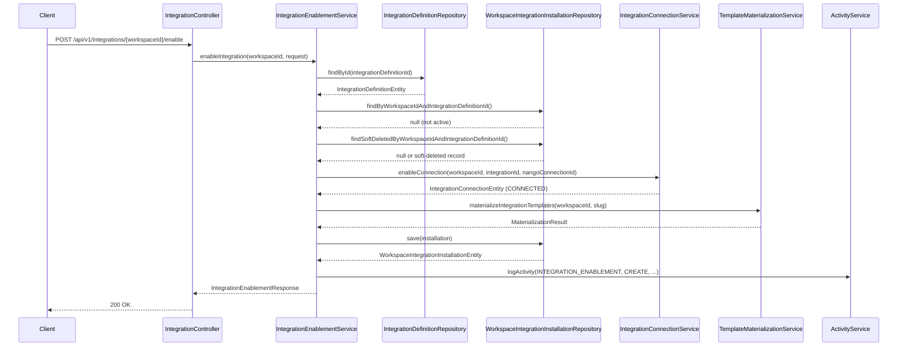

---
tags:
  - flow/user-facing
  - architecture/flow
  - domain/integration
Created: 2025-07-17
Domains:
  - "[[Integrations]]"
---
# Flow: Integration Enable

## Overview

User-facing flow triggered when a workspace admin enables a third-party integration. Validates the integration definition, creates or reconnects a Nango connection, materializes catalog templates into workspace-scoped entity types and relationships, and tracks the installation. The flow is idempotent — enabling an already-enabled integration returns the existing state without side effects.

---

## Trigger

Workspace admin calls `POST /api/v1/integrations/{workspaceId}/enable` with an `EnableIntegrationRequest` containing the integration definition ID, Nango connection ID, and optional sync configuration.

## Entry Point

[[IntegrationController]] -> [[IntegrationEnablementService]].`enableIntegration()`

---

## Steps

1. **[[IntegrationController]]** validates the request body (`@Valid`) and delegates to [[IntegrationEnablementService]]
2. **[[IntegrationEnablementService]]** loads the [[IntegrationDefinitionEntity]] from the repository via `findOrThrow`
3. **[[IntegrationEnablementService]]** checks for an existing active installation (idempotency guard) — returns early with zero-count response if already enabled
4. **[[IntegrationEnablementService]]** checks for a soft-deleted installation (re-enable path) — will restore rather than create if found
5. **[[IntegrationConnectionService]]** creates or reconnects the Nango connection via `enableConnection()` — new connections start as CONNECTED, disconnected connections are reconnected with the new Nango connection ID
6. **[[TemplateMaterializationService]]** materializes catalog templates into workspace entity types — loads manifest and catalog entity types, creates new types with deterministic UUID v3 attribute keys, restores soft-deleted types, skips already-existing types, then materializes relationships and target rules
7. **[[IntegrationEnablementService]]** creates or restores the [[WorkspaceIntegrationInstallationEntity]] record with sync config, preserving `lastSyncedAt` on re-enable for gap recovery
8. **[[ActivityService]]** logs the enable operation with integration slug and entity type count
9. **[[IntegrationEnablementService]]** returns `IntegrationEnablementResponse` with materialization counts (created, restored, relationships) and entity type summaries

---

## Failure Modes

| What Fails | Impact | Recovery |
|---|---|---|
| Integration definition not found | 404 NotFoundException, no side effects | Verify integration definition ID exists and is not stale |
| Already enabled (active installation exists) | Returns 200 with zero-count response (idempotent) | No action needed — integration is already active |
| Nango connection conflict (non-terminal state) | 409 ConflictException, no entity types created | Resolve existing connection state before retrying |
| Nango connection failure | Exception propagates, transaction rolls back — no entity types or installation created | Fix Nango connectivity, retry enable |
| Materialization failure | Partial state — Nango connection exists but entity types may be incomplete | Re-enable will idempotently fill in missing types; connection may need manual cleanup |
| Entity type creation failure | Transaction rolls back — all-or-nothing within the materialization step | Fix underlying entity type issue, retry enable |

---

## Components Involved

- [[IntegrationController]]
- [[IntegrationEnablementService]]
- [[IntegrationConnectionService]]
- [[TemplateMaterializationService]]
- [[IntegrationDefinitionRepository]]
- [[WorkspaceIntegrationInstallationRepository]]
- [[ActivityService]]
- [[EntityTypeRepository]]
- [[CatalogEntityTypeRepository]]
- [[ManifestCatalogRepository]]
