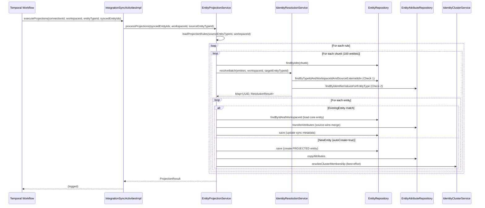

---
tags:
  - flow/background
  - flow/integration
  - architecture/flow
Created: 2026-03-29
Domains:
  - "[[riven/docs/system-design/domains/Integrations/Integrations]]"
  - "[[riven/docs/system-design/domains/Entities/Entities]]"
  - "[[riven/docs/system-design/domains/Identity Resolution/Identity Resolution]]"
---

# Flow - Entity Projection Pipeline

## Overview

Pass 3 of the integration sync workflow. After integration entities are synced and mapped (Passes 1-2), this flow projects them into core lifecycle entities. Runs as a Temporal activity — no JWT auth context.

## Trigger

`IntegrationSyncActivitiesImpl.executeProjections()` called by the Temporal sync workflow after Pass 2 completes.

## Entry Point

[[IntegrationSyncActivitiesImpl]]

## Sequence

## Steps

1. **[[IntegrationSyncActivitiesImpl]]** receives synced entity IDs from the Temporal sync workflow and delegates to `EntityProjectionService.processProjections()` with the workspace ID, source entity type ID, and entity ID list.

2. **[[EntityProjectionService]]** loads projection rules for the source entity type via [[ProjectionRuleRepository]]. Rules are matched by source type with system-level (NULL workspace) and workspace-specific rules combined. For each rule, entities are processed in chunks of 100.

3. **[[IdentityResolutionService]]** runs two-query resolution per chunk:
   - **Check 1 (External ID):** Batch `sourceExternalId` match on the target entity type via `EntityRepository.findByTypeIdAndWorkspaceIdAndSourceExternalIdIn()`. Matches across integration boundaries.
   - **Check 2 (Identifier Key):** For unmatched entities, queries IDENTIFIER-classified attribute values via `EntityAttributeRepository.findByIdentifierValuesForEntityType()` (native SQL with JSONB extraction). Detects and downgrades ambiguous matches.

4. **[[EntityProjectionService]]** routes each entity based on resolution result:
   - `ExistingEntity` — Updates the matched core entity: source-wins attribute merge via `transferAttributes()`, syncVersion guard to reject stale writes, `lastSyncedAt`/`syncVersion` metadata update, idempotent relationship link.
   - `NewEntity` + `autoCreate = true` — Creates a new `PROJECTED` entity: copies all attributes, creates relationship link, adds to identity cluster (best-effort via [[IdentityClusterService]]).
   - `NewEntity` + `autoCreate = false` — Skips with `SKIPPED_AUTO_CREATE_DISABLED`.

5. **[[IntegrationSyncActivitiesImpl]]** receives the [[ProjectionResult]] and logs the summary (created/updated/skipped/errors).

## Failure Modes

| What Fails | User Sees | Recovery |
|---|---|---|
| No projection rules for source type | All entities skipped (`result.skipped = N`) | Install rules via template materialization ([[riven/docs/system-design/domains/Integrations/Enablement/Enablement]]) |
| Identity resolution query fails | Entire batch errors | Temporal retry on next sync |
| Single entity projection fails | Error count incremented, other entities continue | Investigate via projection result details |
| Identity cluster assignment fails | Warning logged, projection succeeds | Cluster repaired by async matching pipeline ([[riven/docs/system-design/domains/Identity Resolution/Identity Resolution]]) |
| Stale syncVersion detected | Entity skipped (`SKIPPED_STALE_VERSION`) | Expected behavior — newer data already present |

## Components Involved

- [[IntegrationSyncActivitiesImpl]]
- [[EntityProjectionService]]
- [[IdentityResolutionService]]
- [[riven/docs/system-design/domains/Entities/Entity Management/EntityRepository]]
- [[riven/docs/system-design/domains/Entities/Entity Management/EntityAttributeRepository]]
- [[riven/docs/system-design/domains/Entities/Entity Management/EntityAttributeService]]
- [[IdentityClusterService]]
- [[ProjectionRuleRepository]]

## Related

- [[riven/docs/system-design/domains/Integrations/Data Sync/Data Sync]] — Passes 1-2 of sync pipeline
- [[riven/docs/system-design/domains/Integrations/Enablement/Enablement]] — Projection rule installation during template materialization
- [[riven/docs/system-design/domains/Identity Resolution/Identity Resolution]] — Async matching (distinct from ingestion-time resolution)
