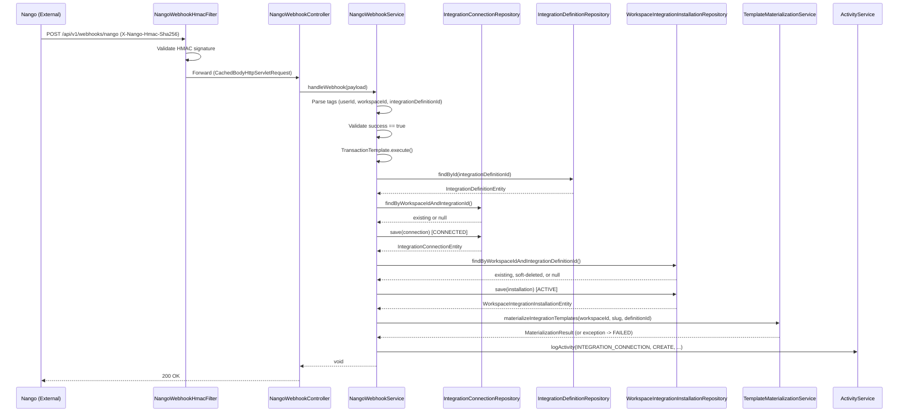

---
tags:
  - flow/background
  - architecture/flow
  - domain/integration
Created: 2026-03-18
Domains:
  - "[[Integrations]]"
---
# Flow: Auth Webhook

## Overview

Background flow triggered when Nango sends an auth webhook after a user completes OAuth in the Nango Connect UI. The webhook is HMAC-validated, then the service extracts workspace context from tags, creates or reconnects the integration connection, creates or restores the installation record, and triggers template materialization. This flow replaced the previous frontend-driven `POST /enable` endpoint as the sole connection creation path.

---

## Trigger

Nango sends a POST request to `/api/v1/webhooks/nango` with type `"auth"` after a user completes the OAuth flow in the Nango Connect UI. The frontend passes tags (userId, workspaceId, integrationDefinitionId) during OAuth initiation; Nango echoes them back in the webhook.

## Entry Point

[[NangoWebhookHmacFilter]] -> [[NangoWebhookController]] -> [[NangoWebhookService]].`handleWebhook()`

---

## Steps

1. **[[NangoWebhookHmacFilter]]** reads the raw request body, validates the `X-Nango-Hmac-Sha256` signature against the shared secret key using constant-time comparison. Rejects with 401 on invalid signature. Wraps request in `CachedBodyHttpServletRequest` for downstream body re-reading.
2. **[[NangoWebhookController]]** deserializes `NangoWebhookPayload` from the request body and delegates to [[NangoWebhookService]].`handleWebhook()`
3. **[[NangoWebhookService]]** routes to `handleAuthEvent()` based on `payload.type == "auth"`
4. **[[NangoWebhookService]]** parses and validates tags — extracts `userId`, `workspaceId`, `integrationDefinitionId` from `NangoWebhookTags`, validating each as a UUID
5. **[[NangoWebhookService]]** validates `connectionId` is present and `success == true`
6. **[[NangoWebhookService]]** opens a programmatic transaction via `TransactionTemplate`
7. **[[NangoWebhookService]]** loads the `IntegrationDefinitionEntity` — early returns if not found
8. **[[NangoWebhookService]]** creates or reconnects the connection — new connections start as `CONNECTED`, existing `DISCONNECTED`/`FAILED` connections are reconnected, already `CONNECTED` connections are handled idempotently
9. **[[NangoWebhookService]]** finds or creates the installation — checks active, then soft-deleted (restores), then creates new. All set to `ACTIVE` status
10. **[[TemplateMaterializationService]]** materializes catalog templates into workspace entity types — on failure, installation is set to `FAILED` but transaction still commits (connection preserved as `CONNECTED`)
11. **[[NangoWebhookService]]** logs connection activity via `ActivityService`
12. **[[NangoWebhookController]]** returns 200 OK to Nango

---

## Failure Modes

| What Fails | Impact | Recovery |
|---|---|---|
| HMAC signature invalid/missing | 401 returned to Nango, no processing | Verify Nango secret key configuration matches |
| Tags missing or malformed UUIDs | Early return, error logged, 200 returned to Nango | Check frontend tag configuration during OAuth initiation |
| Integration definition not found | Early return within transaction, error logged, 200 returned | Verify integration definition exists and is not stale |
| Connection creation/reconnection fails | Transaction rolls back, 200 returned to Nango | Investigate connection state; Nango may retry |
| Materialization fails | Installation set to FAILED, connection stays CONNECTED, transaction commits, 200 returned | Re-enable flow or manual intervention to retry materialization |
| Any unexpected exception | Caught by top-level try-catch in `handleWebhook()`, 200 returned | Check logs; Nango may retry delivery |

---

## Components Involved

- [[NangoWebhookHmacFilter]]
- [[NangoWebhookController]]
- [[NangoWebhookService]]
- [[TemplateMaterializationService]]
- `IntegrationConnectionRepository`
- `IntegrationDefinitionRepository`
- `WorkspaceIntegrationInstallationRepository`
- [[ActivityService]]
