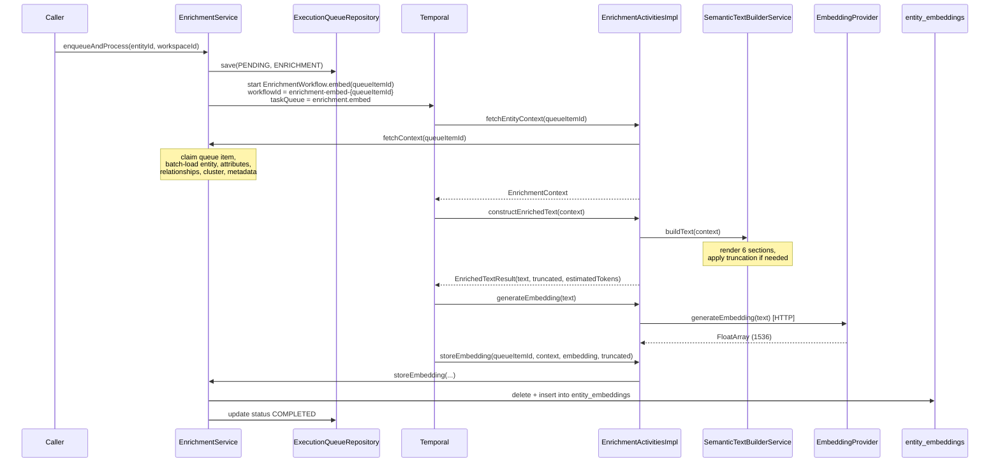

---
tags:
  - flow/active
  - flow/background
  - architecture/flow
Domains:
  - "[[riven/docs/system-design/domains/Knowledge/Knowledge]]"
  - "[[riven/docs/system-design/domains/Workflows/Workflows]]"
Created: 2026-04-10
---

Part of [[riven/docs/system-design/domains/Knowledge/Enrichment Pipeline/Enrichment Pipeline]]

# Flow: Entity Enrichment Pipeline

## Overview

End-to-end async pipeline that turns an entity into a stored vector embedding. Triggered by entity mutations, claimed by Temporal, processed through a four-step activity sequence (fetch context, construct text, generate embedding, store), with the result landing in `entity_embeddings` keyed for HNSW cosine similarity search.

---

## Trigger

Called by entity-lifecycle code after a create, update, or sync. INTEGRATION-source entities are silently skipped.

**Entry Point:** [[EnrichmentService]] — `enqueueAndProcess(entityId, workspaceId)`

---

## Steps

1. **[[EnrichmentService]]** — `enqueueAndProcess(entityId, workspaceId)` is the entry point. Skips INTEGRATION-source entities, otherwise writes a PENDING row to the execution queue.
2. **[[ExecutionQueueRepository]]** — persists the queue item with `status = PENDING` and `type = ENRICHMENT`.
3. **[[EnrichmentService]]** — dispatches `EnrichmentWorkflow.embed(queueItemId)` to Temporal with workflow ID `enrichment-embed-{queueItemId}` on task queue `enrichment.embed`.
4. **[[EnrichmentActivitiesImpl]]** — `fetchEntityContext(queueItemId)` delegates to `EnrichmentService.fetchContext`, which claims the queue item and batch-loads the entity, its attributes, relationships, cluster, and semantic metadata into an `EnrichmentContext`.
5. **[[EnrichmentActivitiesImpl]]** — `constructEnrichedText(context)` delegates to [[SemanticTextBuilderService]]`.buildText`, which renders the six-section semantic text and applies truncation when the text exceeds the 27,000-character budget.
6. **[[EnrichmentActivitiesImpl]]** — `generateEmbedding(text)` delegates to [[EmbeddingProvider]] over HTTP and receives a `FloatArray` of 1536 floats.
7. **[[EnrichmentActivitiesImpl]]** — `storeEmbedding(queueItemId, context, embedding, truncated)` delegates to `EnrichmentService.storeEmbedding`, which upserts into `entity_embeddings` via delete+insert and marks the queue row `COMPLETED`.

---

## Failure Modes

| What Fails | User Sees | Recovery |
|---|---|---|
| Embedding API HTTP error (401 / 5xx / timeout) | Embedding never lands; queue item stays CLAIMED | Temporal retries 3x with exponential backoff (2s, 4s, 8s, capped at 30s). If all attempts fail the workflow errors and `findStaleClaimedEnrichmentItems` reclaims after 1 minute. |
| Entity deleted between enqueue and fetch | `NotFoundException` from `fetchContext`, activity fails | Retried 3x (will keep failing); manual cleanup of stale queue rows is required. |
| Text exceeds 27,000 char budget | Embedding stored with `truncated = true` | Graceful — no failure. Truncation drops Section 6, then compacts 5, then 4, then reduces 3. |
| Embedding API returns empty data array | `IllegalStateException` from provider | Retried 3x — usually a transient provider bug. |
| INTEGRATION entity passed to `enqueueAndProcess` | Silent skip (no row in queue, no error) | Not an error — by design. |

---

## Components Involved

- [[EnrichmentService]]
- [[SemanticTextBuilderService]]
- [[EnrichmentWorkflow]]
- [[EnrichmentActivitiesImpl]]
- [[EmbeddingProvider]]
- [[EnrichmentClientConfiguration]]
- [[EntityEmbeddingEntity]]
- [[EntityEmbeddingRepository]]
- [[ExecutionQueueRepository]]
- [[TemporalWorkerConfiguration]]

---

## Gotchas

> [!warning] Fire-and-forget
> There is no caller-visible signal that enrichment completed. Downstream consumers must observe `entity_embeddings` directly or subscribe to a future "embedding ready" event.

- Workflow ID `enrichment-embed-{queueItemId}` provides Temporal-level deduplication. Re-dispatching the same queue item is safe.
- The `enrichment.embed` task queue is isolated specifically to prevent embedding-API latency from blocking workflow execution and identity matching. Do not consolidate it with other queues.
- Vector dimension is hard-coded to 1536 in both the schema and `@Array(length = 1536)`. Changing the embedding model to one with a different dimension requires a schema migration.

---

## Related

- [[Enrichment Pipeline]]
- [[Knowledge]]
- [[TemporalWorkerConfiguration]]
