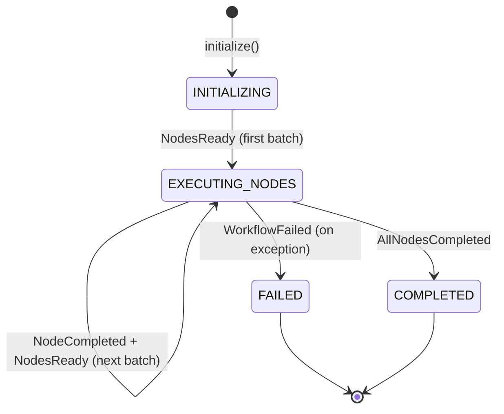
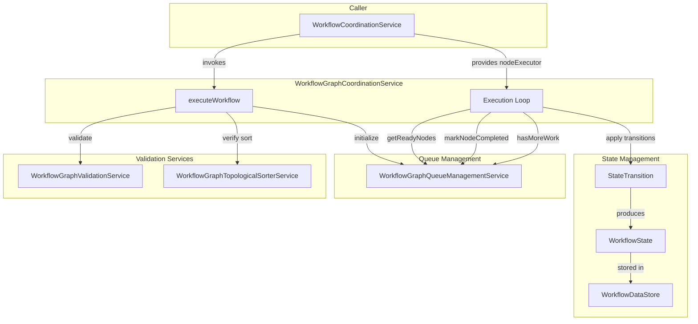

---
tags:
  - component/active
  - layer/service
  - architecture/component
Created: 2026-02-08
Updated: 2026-02-08
Domains:
  - "[[Workflows]]"
---
# WorkflowGraphCoordinationService

Part of [[Execution Engine]]

---

## Purpose

The DAG execution orchestrator that coordinates workflow node execution using a pull-based scheduling model with in-degree tracking. This service validates the DAG structure, initializes the execution state machine, and manages the execution loop that processes nodes in topological order with maximum parallelism.

---

## Responsibilities

**What this component owns:**
- DAG structure validation before execution
- Topological order verification
- Workflow state machine initialization and transitions
- Node execution loop with pull-based scheduling
- Batch retrieval of ready nodes (in-degree = 0)
- Marking nodes as completed and updating successor in-degrees
- Deadlock detection and incomplete execution validation
- Integration with WorkflowGraphQueueManagementService for dependency tracking

**Explicitly NOT responsible for:**
- Actual node execution (delegated to nodeExecutor lambda)
- DAG validation algorithms (delegated to WorkflowGraphValidationService)
- In-degree calculation or ready queue management (delegated to WorkflowGraphQueueManagementService)
- Node input resolution or template parsing (delegated to InputResolverService)
- Database persistence of node results (handled by caller)

---

## Dependencies

### Internal Dependencies

| Component | Purpose | Coupling |
|---|---|---|
| [[WorkflowGraphValidationService]] | Validates DAG structure (cycles, edges, connectivity) | High |
| [[WorkflowGraphTopologicalSorterService]] | Verifies topological order exists | Medium |
| [[WorkflowGraphQueueManagementService]] | Manages in-degree tracking and ready queue | High |

### External Dependencies

| Service/Library | Purpose | Failure Impact |
|---|---|---|
| None | Pure orchestration logic | - |

### Injected Dependencies

```kotlin
@Service
class WorkflowGraphCoordinationService(
    private val dagValidator: WorkflowGraphValidationService,
    private val workflowGraphTopologicalSorterService: WorkflowGraphTopologicalSorterService,
    private val workflowGraphQueueManagementService: WorkflowGraphQueueManagementService
)
```

---

## Consumed By

| Component | How It Uses This | Notes |
|---|---|---|
| [[WorkflowCoordinationService]] | Invokes executeWorkflow() to orchestrate DAG execution | Provides nodeExecutor lambda for actual execution |

---

## Public Interface

### Key Methods

#### `executeWorkflow(store: WorkflowDataStore, nodes: List<WorkflowNode>, edges: List<WorkflowEdgeEntity>, nodeExecutor: (List<WorkflowNode>) -> List<Pair<UUID, JsonValue>>)`

- **Purpose:** Main orchestration method that executes the entire DAG workflow
- **When to use:** Called by WorkflowCoordinationService to execute a workflow DAG
- **Side effects:**
  - Validates DAG structure (throws if invalid)
  - Initializes WorkflowGraphQueueManagementService state
  - Transitions workflow state through INITIALIZING → EXECUTING_NODES → COMPLETED/FAILED
  - Mutates WorkflowDataStore.state throughout execution
- **Throws:**
  - `WorkflowValidationException` if DAG structure is invalid
  - `WorkflowExecutionException` if node execution fails
  - `IllegalStateException` if deadlock detected or incomplete execution

```kotlin
fun executeWorkflow(
    store: WorkflowDataStore,
    nodes: List<WorkflowNode>,
    edges: List<WorkflowEdgeEntity>,
    nodeExecutor: (List<WorkflowNode>) -> List<Pair<UUID, JsonValue>>
) {
    // 1. Validate DAG structure
    val validationResult = dagValidator.validate(nodes, edges)
    if (!validationResult.valid) {
        throw WorkflowValidationException("Invalid workflow DAG: ${validationResult.errors.joinToString("; ")}")
    }

    // 2. Verify topological order exists
    workflowGraphTopologicalSorterService.sort(nodes, edges)

    // 3. Initialize active node queue
    workflowGraphQueueManagementService.initialize(nodes, edges)

    // 4. Execution loop: process nodes in topological order
    while (workflowGraphQueueManagementService.hasMoreWork()) {
        val readyNodes = workflowGraphQueueManagementService.getReadyNodes()

        // Transition state: nodes ready
        store.apply { state = StateTransition.apply(state, NodesReady(readyNodes.map { it.id }.toSet())) }

        // Execute batch in parallel
        val results = nodeExecutor(readyNodes)

        // Mark completed and transition state
        for ((nodeId, _) in results) {
            store.apply { state = StateTransition.apply(state, NodeCompleted(nodeId)) }
            workflowGraphQueueManagementService.markNodeCompleted(nodeId)
        }
    }

    // Finalize workflow
    store.apply { state = StateTransition.apply(state, AllNodesCompleted) }
}
```

---

## Key Logic

### Pull-Based Scheduling Model

The coordinator uses a pull-based approach for maximum parallelism:

1. **Get ready nodes** - Query queue for all nodes with in-degree = 0
2. **Execute batch** - Pass ready nodes to nodeExecutor lambda for parallel execution
3. **Mark completed** - Update state and decrement successor in-degrees
4. **Repeat** - Pull next batch until all nodes completed

This model enables:
- Maximum parallelism (all ready nodes execute concurrently)
- Dependency respect (nodes only execute after all dependencies complete)
- Deterministic execution order (topological ordering preserved)

### Execution Loop Pattern

```kotlin
while (workflowGraphQueueManagementService.hasMoreWork()) {
    // Get batch of ready nodes (in-degree = 0)
    val readyNodes = workflowGraphQueueManagementService.getReadyNodes()

    if (readyNodes.isEmpty()) {
        // Deadlock: nodes remain but none are ready
        throw IllegalStateException("Deadlock detected: ...")
    }

    // Transition: nodes ready for execution
    store.apply { state = StateTransition.apply(state, NodesReady(...)) }

    // Execute batch (caller handles parallelism)
    val results = nodeExecutor(readyNodes)

    // Mark each completed
    for ((nodeId, _) in results) {
        store.apply { state = StateTransition.apply(state, NodeCompleted(nodeId)) }
        workflowGraphQueueManagementService.markNodeCompleted(nodeId)
    }
}
```

### State Machine Transitions



### Node Executor Contract

The `nodeExecutor` lambda must implement:

```kotlin
// Input: List of nodes ready for execution (all dependencies satisfied)
// Output: List of (nodeId, output) pairs for completed nodes
// Behavior: Execute nodes in parallel, propagate exceptions for failures
(List<WorkflowNode>) -> List<Pair<UUID, JsonValue>>
```

Example implementation (from WorkflowCoordinationService):
```kotlin
val nodeExecutor: (List<WorkflowNode>) -> List<Pair<UUID, JsonValue>> = { readyNodes ->
    readyNodes.map { node ->
        val output = executeNode(node, store)
        Pair(node.id, output)
    }
}
```

### Validation Before Execution

Two layers of validation:
1. **DAG structure validation** - Checks cycles, connectivity, edge consistency, conditional branching
2. **Topological sort verification** - Confirms valid execution order exists

Both must pass before execution begins.

### Deadlock Detection

If execution loop reaches a state where:
- `hasMoreWork()` returns true (nodes remain)
- `getReadyNodes()` returns empty list (no nodes ready)

This indicates a deadlock (circular dependency that passed validation) and throws `IllegalStateException`.

### Completion Validation

After execution loop completes, verifies that `completedCount == nodes.size`. If not, throws `IllegalStateException` indicating a coordinator bug.

---

## Dependency Diagram



---

## Gotchas & Edge Cases

> [!warning] Empty Workflows
> Workflows with no nodes are valid and complete immediately with COMPLETED state. The execution loop is skipped entirely.

> [!warning] Deadlock Detection Limitation
> Deadlock detection relies on validation being correct. If validation has bugs, deadlocks could theoretically occur. The check provides a safety net but should never trigger in production.

> [!warning] Node Executor Must Propagate Exceptions
> If the nodeExecutor lambda catches exceptions and returns normally, the coordinator cannot detect failures. Exceptions must propagate to trigger FAILED state transition.

> [!warning] Sequential Batch Execution
> Current implementation executes nodes in each batch sequentially (TODO comment at line 105). True parallelism requires Temporal child workflows or Async/Promise patterns in the caller.

---

### Known Limitations

| Limitation | Impact | Severity | Code Reference |
|---|---|---|---|
| Sequential batch execution | Nodes in same batch execute sequentially, not truly parallel | Medium | Line 105 TODO comment |
| No loops | Cannot iterate over collections | High | Line 17 TODO |
| No switch/case | Only binary conditions via CONDITION nodes | High | TODO note |
| No sub-workflow calls | Workflows cannot compose | Medium | Design gap |
| No partial failure recovery | One node failure = entire workflow failure | High | Line 154 catch block |

---

### Thread Safety / Concurrency

This service is a Spring singleton but is NOT thread-safe. Each workflow execution should use a separate instance of WorkflowGraphQueueManagementService state (currently a singleton, which is a bug for concurrent executions).

> [!warning] Thread Safety Issue
> WorkflowGraphQueueManagementService is a singleton with mutable state. Concurrent workflow executions will interfere with each other. This service should either be request-scoped or the queue management service should be instantiated per execution.

---

## Technical Debt

| Issue | Impact | Effort | Ticket |
|---|---|---|---|
| Sequential batch execution | No true parallelism for ready nodes | High | TODO at line 105 |
| No loop support | Cannot iterate over collections | High | TODO at line 17 |
| No partial failure recovery | Failed node fails entire workflow | High | Design gap |
| WorkflowGraphQueueManagementService singleton | Thread safety issue for concurrent executions | High | Architecture issue |

---

## Testing

### Unit Test Coverage

- **Location:** `src/test/kotlin/riven/core/service/workflow/engine/coordinator/WorkflowGraphCoordinationServiceTest.kt` (if exists)
- **Key scenarios covered:**
  - Linear chain DAG execution
  - Diamond DAG with parallel branches
  - Empty workflow (no nodes)
  - Invalid DAG (cycle detection)
  - Disconnected components
  - Deadlock detection
  - State transitions throughout execution

### Integration Test Notes

Integration tests should verify:
- Real node execution via nodeExecutor lambda
- State machine transitions
- WorkflowDataStore mutation correctness
- Error propagation from nodeExecutor

### How to Test Manually

1. Create a workflow definition with multiple nodes and dependencies
2. Trigger workflow execution via API
3. Monitor logs for batch execution
4. Verify state transitions in database
5. Check that all nodes execute in correct order
6. Confirm final state is COMPLETED

---

## Related

- [[WorkflowCoordinationService]] - Caller that provides nodeExecutor implementation
- [[WorkflowGraphValidationService]] - DAG structure validation
- [[WorkflowGraphTopologicalSorterService]] - Topological order verification
- [[WorkflowGraphQueueManagementService]] - In-degree tracking and ready queue
- [[Execution Engine]] - Parent subdomain

---

## Changelog

| Date | Change | Reason |
|---|---|---|
| 2026-02-08 | Initial documentation | Phase 1 Plan 2 - Workflows domain component docs |
