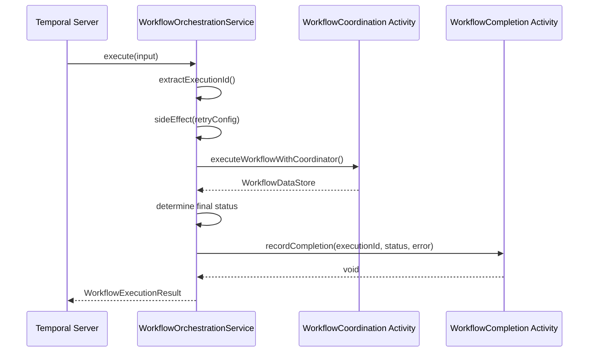
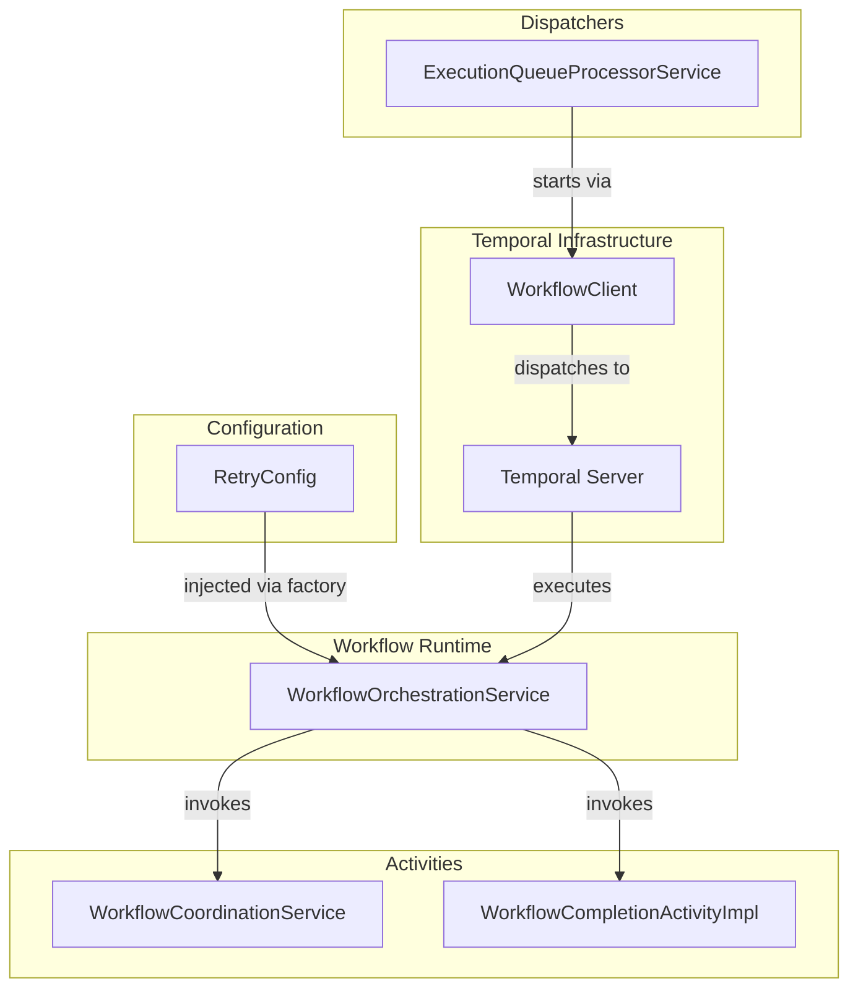

---
tags:
  - component/active
  - layer/service
  - architecture/component
Created: 2026-02-08
Updated: 2026-02-08
Domains:
  - "[[Workflows]]"
---
# WorkflowOrchestrationService

Part of [[Execution Engine]]

---

## Purpose

The Temporal Workflow implementation that orchestrates DAG-based workflow execution. This is the deterministic entry point for workflow execution, delegating all I/O operations to Temporal activities to maintain workflow determinism.

---

## Responsibilities

**What this component owns:**
- Workflow lifecycle orchestration (start, execute, complete/fail)
- Deterministic workflow execution using Temporal workflow patterns
- Activity stub creation with retry configuration
- Workflow execution result aggregation
- Final status determination and error handling
- Completion recording coordination

**Explicitly NOT responsible for:**
- Direct database access (delegated to activities)
- Node execution logic (delegated to WorkflowCoordination activity)
- DAG validation or topological sorting (delegated to coordinator services)
- Retry logic implementation (configured via Temporal RetryOptions)
- Queue management (handled by ExecutionQueueService)

---

## Dependencies

### Internal Dependencies

| Component | Purpose | Coupling |
|---|---|---|
| [[WorkflowCoordinationService]] | Activity that executes DAG nodes | High |
| [[WorkflowCompletionActivityImpl]] | Activity that records final status | Medium |
| RetryConfig | Frozen retry configuration from application.yml | Low |

### External Dependencies

| Service/Library | Purpose | Failure Impact |
|---|---|---|
| Temporal SDK | Workflow orchestration runtime | Workflow cannot execute |
| Temporal Server | Workflow state persistence | Complete failure |

### Injected Dependencies

```kotlin
// Injected via TemporalWorkerConfiguration.registerWorkflowImplementationFactory
// NOT a Spring bean - Temporal manages lifecycle
class WorkflowOrchestrationService(
    private val retryConfig: RetryConfig // From WorkflowRetryConfigurationProperties
) : WorkflowOrchestration
```

---

## Consumed By

| Component | How It Uses This | Notes |
|---|---|---|
| [[WorkflowExecutionQueueProcessorService]] | Starts workflow via Temporal WorkflowClient | Creates workflow with ID format `execution-{uuid}` |
| Temporal Server | Invokes execute() method when workflow starts | Temporal manages lifecycle |

---

## Public Interface

### Key Methods

#### `execute(input: WorkflowExecutionInput): WorkflowExecutionResult`

- **Purpose:** Main workflow entry point that orchestrates DAG execution
- **When to use:** Called by Temporal Server when workflow is started by ExecutionQueueProcessorService
- **Side effects:**
  - Invokes WorkflowCoordination activity for DAG execution
  - Invokes WorkflowCompletionActivity to record final status
  - Uses Workflow.sideEffect() to snapshot retry config for deterministic replay
- **Throws:** None directly - all activity failures are caught and converted to WorkflowExecutionResult

```kotlin
@WorkflowMethod
override fun execute(input: WorkflowExecutionInput): WorkflowExecutionResult {
    val executionId = extractExecutionId()
    val frozenRetryConfig = Workflow.sideEffect(RetryConfig::class.java) { retryConfig }

    val coordinationActivity = createCoordinationActivityStub(frozenRetryConfig)
    val completionActivity = createCompletionActivityStub()

    // Delegate to activity for DAG execution
    val store = coordinationActivity.executeWorkflowWithCoordinator(...)

    // Record completion
    completionActivity.recordCompletion(executionId, status, error)

    return WorkflowExecutionResult(executionId, status, nodeResults)
}
```

#### `extractExecutionId(): UUID`

- **Purpose:** Extracts execution UUID from Temporal workflow ID
- **When to use:** Called once at workflow start to identify the execution
- **Side effects:** Uses Workflow.sideEffect() for deterministic replay
- **Throws:** IllegalArgumentException if workflow ID format is invalid

```kotlin
private fun extractExecutionId(): UUID {
    return Workflow.sideEffect(UUID::class.java) {
        val workflowId = Workflow.getInfo().workflowId
        UUID.fromString(workflowId.substringAfter("execution-"))
    }
}
```

#### `createCoordinationActivityStub(retryConfig: RetryConfig): WorkflowCoordination`

- **Purpose:** Creates Temporal activity stub for DAG coordination with retry configuration
- **When to use:** Called once per workflow execution to create activity proxy
- **Side effects:** None
- **Throws:** None

```kotlin
private fun createCoordinationActivityStub(retryConfig: RetryConfig): WorkflowCoordination =
    Workflow.newActivityStub(
        WorkflowCoordination::class.java,
        ActivityOptions.newBuilder()
            .setStartToCloseTimeout(Duration.ofMinutes(5))
            .setRetryOptions(
                RetryOptions.newBuilder()
                    .setMaximumAttempts(retryConfig.maxAttempts)
                    .setInitialInterval(Duration.ofSeconds(retryConfig.initialIntervalSeconds))
                    .setBackoffCoefficient(retryConfig.backoffCoefficient)
                    .setMaximumInterval(Duration.ofSeconds(retryConfig.maxIntervalSeconds))
                    .setDoNotRetry(
                        "HTTP_CLIENT_ERROR",      // 4xx - client data won't change
                        "VALIDATION_ERROR",       // Schema validation - deterministic
                        "CONTROL_FLOW_ERROR",     // CONDITION deterministic failure
                        "SECURITY_ERROR"          // Auth errors - credentials won't change
                    )
                    .build()
            )
            .build()
    )
```

#### `createCompletionActivityStub(): WorkflowCompletionActivity`

- **Purpose:** Creates Temporal activity stub for completion recording
- **When to use:** Called once per workflow execution
- **Side effects:** None
- **Throws:** None

```kotlin
private fun createCompletionActivityStub(): WorkflowCompletionActivity =
    Workflow.newActivityStub(
        WorkflowCompletionActivity::class.java,
        ActivityOptions.newBuilder()
            .setStartToCloseTimeout(Duration.ofSeconds(30))
            .setRetryOptions(
                RetryOptions.newBuilder()
                    .setMaximumAttempts(3)
                    .setInitialInterval(Duration.ofSeconds(1))
                    .setBackoffCoefficient(2.0)
                    .setMaximumInterval(Duration.ofSeconds(10))
                    .build()
            )
            .build()
    )
```

#### `buildErrorFromFailedNodes(state: WorkflowState): WorkflowExecutionError?`

- **Purpose:** Constructs error object from failed node in workflow state
- **When to use:** Called when DAG execution completes but contains failed nodes
- **Side effects:** Uses Workflow.sideEffect() for timestamp generation
- **Throws:** None

#### `buildErrorFromException(e: ActivityFailure): WorkflowExecutionError`

- **Purpose:** Constructs error object from activity exception
- **When to use:** Called when activity fails after all retries exhausted
- **Side effects:** Uses Workflow.sideEffect() for timestamp generation
- **Throws:** None

---

## Key Logic

### Determinism Rules

This workflow MUST be deterministic for Temporal replay to work correctly:

**FORBIDDEN Operations (non-deterministic):**
- `UUID.randomUUID()` → Use `Workflow.randomUUID()`
- `System.currentTimeMillis()` → Use `Workflow.currentTimeMillis()`
- Direct database calls → Use activities
- HTTP requests → Use activities
- Spring bean injection → Use workflow factory pattern
- Standard logging → Use `Workflow.getLogger()`

**Required Patterns:**
- Configuration snapshotting via `Workflow.sideEffect()` for replay consistency
- All side effects delegated to activities
- Deterministic error handling and result aggregation

### Workflow Execution Flow



### Retry Configuration

Non-retryable error types (deterministic failures):
- `HTTP_CLIENT_ERROR` - 4xx errors indicate client data issues that won't change on retry
- `VALIDATION_ERROR` - Schema validation failures are deterministic
- `CONTROL_FLOW_ERROR` - Conditional node failures are deterministic
- `SECURITY_ERROR` - Authentication/authorization failures won't resolve automatically

Retryable errors (transient failures):
- `HTTP_SERVER_ERROR` - 5xx errors may resolve on retry
- `NETWORK_ERROR` - Connectivity issues may be transient
- `TIMEOUT` - May succeed with more time
- All other errors default to retryable

---

## Configuration

| Property | Purpose | Default | Environment-specific |
|---|---|---|---|
| `riven.workflow.retry.default.maxAttempts` | Maximum retry attempts for coordination activity | 3 | No |
| `riven.workflow.retry.default.initialIntervalSeconds` | Initial retry backoff | 1 | No |
| `riven.workflow.retry.default.backoffCoefficient` | Exponential backoff multiplier | 2.0 | No |
| `riven.workflow.retry.default.maxIntervalSeconds` | Maximum retry interval | 60 | No |

---

## Error Handling

### Errors Thrown

| Error/Exception | When | Expected Handling |
|---|---|---|
| None directly | Workflow catches all activity failures | Converted to WorkflowExecutionResult with FAILED status |

### Errors Handled

| Error/Exception | Source | Recovery Strategy |
|---|---|---|
| ActivityFailure | WorkflowCoordination activity | Build error from exception, mark workflow FAILED, record completion |
| Exception | WorkflowCompletion activity | Log error but don't fail workflow (result already determined) |

---

## Dependency Diagram



---

## Gotchas & Edge Cases

> [!warning] Determinism Violations
> Any non-deterministic operation will cause workflow replay to fail with a non-deterministic error. Always use Workflow.* methods for random values, timestamps, and logging.

> [!warning] Configuration Changes During Replay
> Workflow uses sideEffect() to snapshot retry configuration at workflow start. Changes to application.yml retry config will NOT affect in-flight workflows until they complete and new workflows start.

> [!warning] Not a Spring Bean
> This class is NOT managed by Spring. It's instantiated by Temporal's WorkerFactory via `registerWorkflowImplementationFactory`. Dependencies must be injected via the factory pattern, not Spring autowiring.

> [!warning] Completion Recording Failure
> If completion recording fails, the workflow result is still returned but the database may not reflect the final status. The workflow logs the error but does not fail - this prevents database issues from blocking workflow completion.

---

### Known Limitations

| Limitation | Impact | Severity |
|---|---|---|
| Single coordination activity call | All DAG execution happens in one activity - no child workflows for parallelism | Medium |
| No retry count in error details | Total retry count not easily accessible from ActivityFailure | Low |
| Fixed activity timeouts | StartToCloseTimeout is hardcoded to 5 minutes for coordination | Low |

---

### Thread Safety / Concurrency

Temporal workflows are single-threaded and deterministic. No concurrency concerns within the workflow itself. Temporal Server manages workflow execution and ensures replay safety.

---

## Technical Debt

| Issue | Impact | Effort | Ticket |
|---|---|---|---|
| Hardcoded activity timeouts | Cannot tune per-workflow | Low | - |
| Retry count not in error details | Limited observability | Low | Line 182 comment |
| Node name/type not in WorkflowState | Error messages show "Unknown" | Medium | Lines 151-152 comment |

---

## Testing

### Unit Test Coverage

- **Location:** `src/test/kotlin/riven/core/service/workflow/engine/WorkflowOrchestrationServiceTest.kt` (if exists)
- **Key scenarios covered:** Would require Temporal testing SDK

### Integration Test Notes

Temporal workflows require the Temporal Test Server or mocking framework for integration testing. Real integration tests would verify:
- Activity invocation with correct parameters
- Retry behavior for different error types
- Completion recording under various failure scenarios

### How to Test Manually

1. Start Temporal Server locally
2. Start the Riven Core application
3. Trigger workflow execution via API or queue
4. Monitor workflow in Temporal UI at `http://localhost:8080`
5. Verify workflow completes or fails with expected status
6. Check database for execution and queue records

---

## Related

- [[WorkflowCoordinationService]] - Main activity for DAG execution
- [[WorkflowCompletionActivityImpl]] - Completion recording activity
- [[WorkflowExecutionQueueProcessorService]] - Dispatches workflows to Temporal
- [[Execution Engine]] - Parent subdomain
- [[TemporalWorkerConfiguration]] - Worker registration and factory setup

---

## Changelog

| Date | Change | Reason |
|---|---|---|
| 2026-02-08 | Initial documentation | Phase 1 Plan 2 - Workflows domain component docs |
