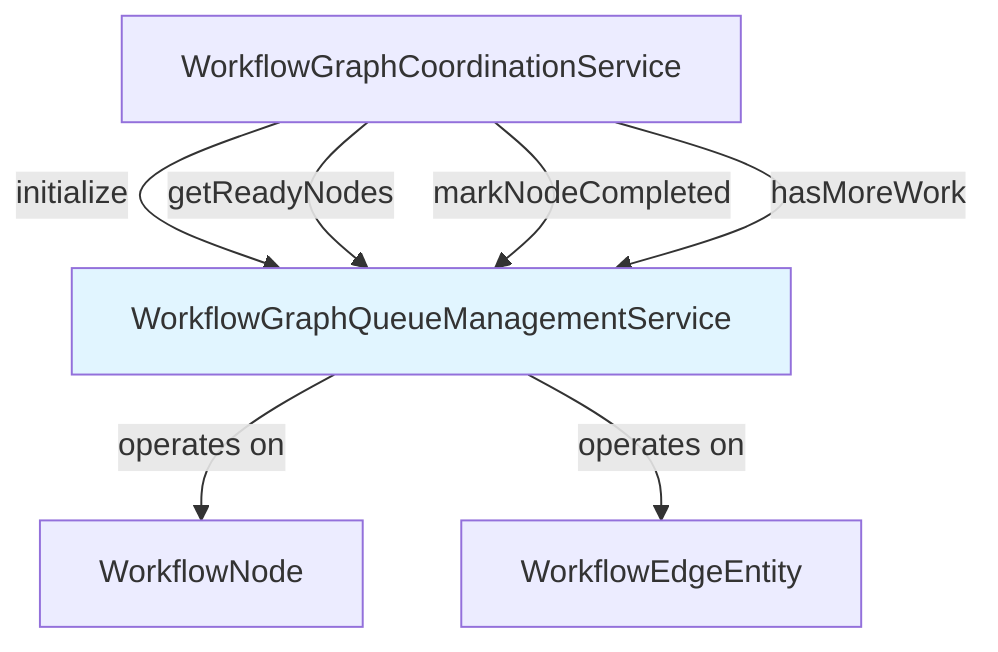

---
tags:
  - component/active
  - layer/service
  - architecture/component
Created: 2026-02-08
Updated: 2026-02-08
Domains:
  - "[[Workflows]]"
---
# WorkflowGraphQueueManagementService

Part of [[Graph Coordination]]

---

## Purpose

Manages the active execution queue for parallel workflow node scheduling by tracking in-degree (remaining dependencies), maintaining a ready queue of nodes with no dependencies, and updating successor nodes as dependencies complete. Enables pull-based parallel scheduling through batch retrieval of ready nodes.

---

## Responsibilities

**Explicitly responsible for:**
- Track remaining dependencies (in-degree) for each node during execution
- Maintain a FIFO queue of nodes ready for execution (in-degree = 0)
- Decrement successor in-degrees when nodes complete
- Enqueue successors that become ready after dependency completion
- Provide batch access to ready nodes for parallel execution
- Track completed nodes and detect when work is finished
- Provide debugging visibility into remaining/blocked nodes

**Explicitly NOT responsible for:**
- Executing nodes (handled by WorkflowCoordinationService)
- Validating graph structure or detecting cycles (handled by WorkflowGraphValidationService and WorkflowGraphTopologicalSorterService)
- Persisting execution state (handled by WorkflowCoordinationService)

---

## Dependencies

### Internal Dependencies

|Component|Purpose|Coupling|
|---|---|---|
|[[WorkflowNode]]|Runtime DTO representing executable nodes|Low - data class|
|[[WorkflowEdgeEntity]]|Persistence entity for directed edges|Low - data class|

### External Dependencies

|Service/Library|Purpose|Failure Impact|
|---|---|---|
|Spring Framework|@Service annotation for bean registration|No impact on functionality|

### Injected Dependencies

None - stateful service with no constructor dependencies.

---

## Consumed By

|Component|How It Uses This|Notes|
|---|---|---|
|[[WorkflowGraphCoordinationService]]|Calls initialize(), getReadyNodes(), markNodeCompleted(), hasMoreWork() in execution loop|Main consumer - drives DAG execution|

---

## Public Interface

### Key Methods

#### `initialize(nodes: List<WorkflowNode>, edges: List<WorkflowEdgeEntity>)`

- **Purpose:** Initialize the queue with workflow nodes and edges, clearing all existing state
- **When to use:** Before starting DAG execution (called once per workflow execution)
- **Side effects:** Clears all internal state (in-degree map, ready queue, completed set, node map, adjacency list) and repopulates from provided nodes/edges
- **Throws:** None

**Process:**
1. Clear all existing state
2. Build node lookup map (nodeId → WorkflowNode)
3. Initialize in-degree to 0 for all nodes
4. Build adjacency list (sourceNodeId → outgoing edges)
5. Calculate actual in-degrees from edges
6. Enqueue all nodes with in-degree 0

**Signature:**
```kotlin
fun initialize(nodes: List<WorkflowNode>, edges: List<WorkflowEdgeEntity>)
```

#### `getReadyNodes(): List<WorkflowNode>`

- **Purpose:** Returns all currently ready nodes and clears the ready queue (batch semantics)
- **When to use:** Repeatedly during DAG execution loop to get successive batches of ready nodes
- **Side effects:** Clears the ready queue after returning current batch
- **Throws:** None

**Batch Semantics:** This method returns ALL nodes currently ready for execution, allowing them to be processed in parallel. The ready queue is emptied after this call. Call repeatedly as nodes complete to get successive batches.

**Signature:**
```kotlin
fun getReadyNodes(): List<WorkflowNode>
```

**Returns:** List of nodes ready for execution (in-degree = 0), or empty list if none ready.

#### `markNodeCompleted(nodeId: UUID)`

- **Purpose:** Mark a node as completed and update successor nodes' in-degrees
- **When to use:** After a node completes execution successfully
- **Side effects:**
  - Adds node to completed set
  - Decrements in-degree of all successor nodes
  - Enqueues successors whose in-degree reaches 0
- **Throws:** `IllegalArgumentException` if node ID is not found in the graph

**Process:**
1. Add nodeId to completed set
2. Lookup outgoing edges for the node
3. For each successor:
   - Decrement its in-degree
   - If in-degree becomes 0, add to ready queue

**Signature:**
```kotlin
fun markNodeCompleted(nodeId: UUID)
```

#### `hasMoreWork(): Boolean`

- **Purpose:** Check if there is more work to be done in the workflow
- **When to use:** In DAG execution loop to determine if execution should continue
- **Side effects:** None
- **Throws:** None

**Logic:** Returns true if:
- The ready queue is not empty (nodes waiting to execute), OR
- There are nodes with in-degree > 0 (waiting for dependencies)

Returns false if all nodes are completed.

**Signature:**
```kotlin
fun hasMoreWork(): Boolean
```

#### `getRemainingNodes(): List<WorkflowNode>`

- **Purpose:** Returns nodes that have not completed and still have dependencies
- **When to use:** For debugging or error reporting to identify blocked nodes
- **Side effects:** None
- **Throws:** None

**Signature:**
```kotlin
fun getRemainingNodes(): List<WorkflowNode>
```

**Returns:** List of nodes with in-degree > 0 (waiting for dependencies).

---

## Key Logic

### Data Structures

The service maintains mutable state across the execution lifecycle:

| Data Structure | Type | Purpose |
|---|---|---|
| `inDegreeMap` | `MutableMap<UUID, Int>` | Tracks remaining dependencies for each node |
| `readyQueue` | `ArrayDeque<WorkflowNode>` | FIFO queue of nodes with in-degree 0 |
| `completedNodes` | `MutableSet<UUID>` | Set of completed node IDs |
| `nodeMap` | `MutableMap<UUID, WorkflowNode>` | O(1) lookup from node ID to node |
| `adjacencyList` | `MutableMap<UUID, MutableList<WorkflowEdgeEntity>>` | Maps source node to outgoing edges |

### In-Degree Tracking Algorithm

**Initialization:**
```
for each node:
  inDegree[node.id] = 0

for each edge:
  inDegree[edge.target] += 1

for each node where inDegree == 0:
  readyQueue.add(node)
```

**Completion Processing:**
```
markNodeCompleted(nodeId):
  completedNodes.add(nodeId)

  for each edge from nodeId:
    successor = edge.target
    inDegree[successor] -= 1

    if inDegree[successor] == 0:
      readyQueue.add(successor)
```

### Execution Loop Pattern

Typical usage in WorkflowGraphCoordinationService:
```kotlin
queueManagementService.initialize(nodes, edges)

while (queueManagementService.hasMoreWork()) {
  val batch = queueManagementService.getReadyNodes()

  for (node in batch) {
    executeNode(node)
    queueManagementService.markNodeCompleted(node.id)
  }
}
```

---

## Data Access

None - operates on in-memory state only. Does not access database.

---

## Flows Involved

|Flow|Role in Flow|
|---|---|
|[[Flow - Workflow Execution]]|Core participant - manages node scheduling during DAG execution|

---

## Error Handling

### Errors Thrown

|Error/Exception|When|Expected Handling|
|---|---|---|
|`IllegalArgumentException`|`markNodeCompleted()` called with unknown node ID|Programming error - should never happen in normal flow|

---

## Observability

### Log Events

None - this service is called frequently within execution loops. Errors propagate as exceptions.

---

## Gotchas & Edge Cases

> [!warning] Mutable State - Not Thread-Safe
> This service maintains mutable state across the workflow execution lifecycle. It is **not thread-safe** and must not be accessed concurrently by multiple threads. Each workflow execution should have its own instance, OR the caller must ensure serial access.

> [!warning] Stateful Service - Must Call initialize()
> This is a Spring bean but has stateful behavior. Call `initialize(nodes, edges)` before each workflow execution to reset state. Reusing the same instance without re-initialization will produce incorrect results.

### Known Limitations

- **Not thread-safe**: Designed for single-threaded use within Temporal activity context
- **Sequential batch execution**: While `getReadyNodes()` returns a batch for potential parallel execution, the current implementation in WorkflowGraphCoordinationService executes nodes sequentially
- **No persistence**: All state is in-memory. If the activity fails mid-execution, state is lost (Temporal handles retry at workflow level)

### Common Mistakes

- **Forgetting to call initialize()**: Results in empty ready queue and no work detected
- **Calling markNodeCompleted() before node actually completes**: Breaks dependency tracking and can cause successor nodes to execute prematurely
- **Concurrent access**: Service is not thread-safe; do not share across workflow executions

### Thread Safety / Concurrency

**Not thread-safe.** This service uses mutable data structures (`MutableMap`, `ArrayDeque`, `MutableSet`) without synchronization. Designed for single-threaded use within a Temporal activity execution context.

**Safe usage pattern:** Each Temporal workflow execution gets a fresh activity invocation, which uses the Spring bean instance serially. As long as activities are not shared across threads, this is safe.

---

## Testing

### Unit Test Coverage

- **Location:** Not documented in source
- **Key scenarios covered:**
  - Initialization with various graph shapes (linear, diamond, disconnected)
  - Ready node batch retrieval
  - In-degree updates after node completion
  - Detection of when work is complete
  - Handling of nodes with multiple predecessors

---

## Related

- [[WorkflowGraphCoordinationService]] — Main consumer; drives DAG execution using this queue
- [[WorkflowGraphTopologicalSorterService]] — Similar in-degree calculation for validation
- [[Graph Coordination]] — Parent subdomain

---

## Dependency Diagram



---

## Changelog

|Date|Change|Reason|
|---|---|---|
|2026-02-08|Initial documentation|Phase 1 Plan 3 - Component docs|
