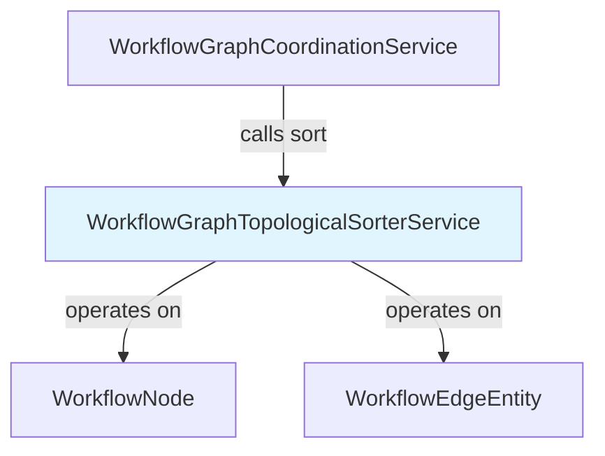

---
tags:
  - component/active
  - layer/service
  - architecture/component
Created: 2026-02-08
Updated: 2026-02-08
Domains:
  - "[[Workflows]]"
---
# WorkflowGraphTopologicalSorterService

Part of [[Graph Coordination]]

---

## Purpose

Determines the correct execution order for workflow nodes by performing topological sorting on the DAG using Kahn's algorithm. Provides O(V+E) cycle detection and enables parallel execution planning by identifying batches of nodes with no dependencies.

---

## Responsibilities

**Explicitly responsible for:**
- Sort workflow nodes in dependency order (dependencies before dependents)
- Detect cycles in the workflow graph and fail fast with descriptive errors
- Validate that all edge endpoints exist in the node list
- Calculate in-degree and adjacency lists for efficient graph traversal
- Provide deterministic ordering for nodes with no dependency relationship

**Explicitly NOT responsible for:**
- Executing nodes (handled by WorkflowCoordinationService)
- Managing execution state or tracking completion (handled by WorkflowGraphQueueManagementService)
- Graph validation beyond cycle detection (handled by WorkflowGraphValidationService)

---

## Dependencies

### Internal Dependencies

|Component|Purpose|Coupling|
|---|---|---|
|[[WorkflowNode]]|Runtime DTO representing executable nodes|Low - data class|
|[[WorkflowEdgeEntity]]|Persistence entity for directed edges|Low - data class|

### External Dependencies

|Service/Library|Purpose|Failure Impact|
|---|---|---|
|Spring Framework|@Service annotation for bean registration|No impact - stateless service|

### Injected Dependencies

None - stateless utility service with no constructor dependencies.

---

## Consumed By

|Component|How It Uses This|Notes|
|---|---|---|
|[[WorkflowGraphCoordinationService]]|Calls `sort()` before DAG execution to verify topological order|Used for validation, not for execution ordering|

---

## Public Interface

### Key Methods

#### `sort(nodes: List<WorkflowNode>, edges: List<WorkflowEdgeEntity>): List<WorkflowNode>`

- **Purpose:** Sort nodes in topological order using Kahn's algorithm
- **When to use:** Before workflow execution to verify DAG validity and get execution order
- **Side effects:** None - pure function
- **Throws:**
  - `IllegalStateException` if a cycle is detected in the graph
  - `IllegalArgumentException` if edges reference nodes not in the nodes list

**Signature:**
```kotlin
fun sort(nodes: List<WorkflowNode>, edges: List<WorkflowEdgeEntity>): List<WorkflowNode>
```

**Returns:** Nodes in topologically sorted order where all dependencies come before their dependents. For nodes with no dependency relationship, the order is non-deterministic but deterministically consistent for the same input.

---

## Key Logic

### Core Algorithm: Kahn's Topological Sort

Kahn's algorithm works by iteratively removing nodes with no dependencies:

**Algorithm Steps:**
1. **Build adjacency list**: Map each node to its outgoing edges (successors)
2. **Calculate in-degrees**: Count incoming edges for each node
3. **Initialize queue**: Add all nodes with in-degree 0 (start nodes)
4. **Process queue**:
   - Dequeue a node, add to result
   - For each successor, decrement in-degree
   - If successor in-degree becomes 0, add to queue
5. **Detect cycles**: If result size != node count, throw exception

**Pseudocode:**
```
inDegree = calculate_in_degrees(nodes, edges)
queue = nodes where inDegree == 0
result = []

while queue not empty:
  node = queue.dequeue()
  result.add(node)

  for each successor of node:
    successor.inDegree -= 1
    if successor.inDegree == 0:
      queue.enqueue(successor)

if result.size != nodes.size:
  throw CycleDetected

return result
```

**Time Complexity:** O(V + E) where V = number of nodes, E = number of edges
- Building adjacency list: O(E)
- Calculating in-degrees: O(E)
- Processing all nodes: O(V)
- Processing all edges: O(E)

**Space Complexity:** O(V + E)
- Adjacency list: O(E)
- In-degree map: O(V)
- Queue: O(V) worst case
- Result list: O(V)

### Why Kahn's Algorithm?

Advantages over DFS-based topological sort:
- **Early cycle detection**: identifies cycles as soon as all in-degree 0 nodes are processed
- **Parallel execution planning**: in-degree 0 nodes can run concurrently
- **Simpler to reason about**: iterative algorithm without recursion
- **Standard algorithm**: well-tested and proven correct

### Example Graph Patterns

**Linear Chain:**
```
A → B → C

Result: [A, B, C]
```

**Diamond DAG (parallel execution possible):**
```
    A
   / \
  B   C
   \ /
    D

Valid results (both correct):
- [A, B, C, D]
- [A, C, B, D]

Parallel batches:
- Batch 1: [A]
- Batch 2: [B, C] (can execute in parallel)
- Batch 3: [D]
```

**Cycle Detection:**
```
A → B → C → A  (cycle)

Throws: IllegalStateException("Cycle detected in workflow graph: 3 nodes unreachable")
```

---

## Data Access

None - this is a stateless utility service that operates on in-memory data structures.

---

## Flows Involved

|Flow|Role in Flow|
|---|---|
|[[Flow - Workflow Execution]]|Validation step before DAG execution|

---

## Error Handling

### Errors Thrown

|Error/Exception|When|Expected Handling|
|---|---|---|
|`IllegalStateException`|Cycle detected during topological sort|Workflow validation fails; execution aborted|
|`IllegalArgumentException`|Edge references non-existent node|Graph structure invalid; execution aborted|

**Cycle Detection Error Format:**
```kotlin
"Cycle detected in workflow graph: $unreachableCount nodes unreachable. " +
"Unreachable node IDs: $unreachableIds"
```

**Edge Validation Error Format:**
```kotlin
"Edge source node ${edge.sourceNodeId} not found in node list"
"Edge target node $targetId not found in node list"
```

---

## Observability

### Log Events

None - this is a utility service called frequently during validation. Errors propagate as exceptions.

---

## Gotchas & Edge Cases

> [!warning] Stateless Service
> This service maintains no state between calls. Each invocation of `sort()` is independent.

### Known Limitations

- **Non-deterministic ordering for independent nodes**: If nodes B and C both depend only on A, the order between B and C is not guaranteed (though it is deterministic for the same input).
- **No parallel batch output**: The service returns a flat list, not batches. Callers must identify parallel execution opportunities by tracking in-degrees separately.

### Thread Safety

**Thread-safe.** This service is stateless and uses only local variables. Multiple threads can call `sort()` concurrently without interference.

---

## Testing

### Unit Test Coverage

- **Location:** Not documented in source
- **Key scenarios covered:**
  - Linear chains (A → B → C)
  - Diamond DAGs (parallel branches)
  - Cycle detection (A → B → C → A)
  - Empty node list
  - Disconnected graphs
  - Invalid edge references

---

## Related

- [[WorkflowGraphCoordinationService]] — Uses this service for validation
- [[WorkflowGraphQueueManagementService]] — Implements similar in-degree tracking for execution
- [[Graph Coordination]] — Parent subdomain

---

## Dependency Diagram



---

## Changelog

|Date|Change|Reason|
|---|---|---|
|2026-02-08|Initial documentation|Phase 1 Plan 3 - Component docs|
