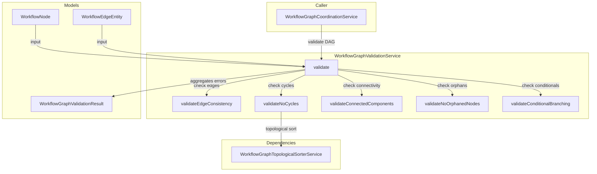

---
tags:
  - component/active
  - layer/service
  - architecture/component
Created: 2026-02-08
Updated: 2026-02-08
Domains:
  - "[[Workflows]]"
---
# WorkflowGraphValidationService

Part of [[Graph Coordination]]

---

## Purpose

Validates the structural integrity of workflow DAGs before execution, ensuring they form valid directed acyclic graphs with no cycles, disconnected components, or structural issues that would prevent correct execution. This service aggregates all validation errors rather than failing on the first issue, enabling users to fix multiple problems at once.

---

## Responsibilities

**What this component owns:**
- DAG structure validation (acyclic, connected, valid edges)
- Cycle detection using topological sort
- Connected component analysis via BFS traversal
- Edge consistency validation (all references exist)
- Conditional node branching validation (≥2 outgoing edges)
- Orphaned node detection
- Comprehensive error reporting with node IDs and counts

**Explicitly NOT responsible for:**
- Topological sorting algorithm implementation (delegated to WorkflowGraphTopologicalSorterService)
- DAG execution or state management
- Node execution logic or input resolution
- Database persistence of validation results

---

## Dependencies

### Internal Dependencies

| Component | Purpose | Coupling |
|---|---|---|
| [[WorkflowGraphTopologicalSorterService]] | Cycle detection via topological sort | High |

### External Dependencies

| Service/Library | Purpose | Failure Impact |
|---|---|---|
| None | Pure validation logic | - |

### Injected Dependencies

```kotlin
@Service
class WorkflowGraphValidationService(
    private val workflowGraphTopologicalSorterService: WorkflowGraphTopologicalSorterService
)
```

---

## Consumed By

| Component | How It Uses This | Notes |
|---|---|---|
| [[WorkflowGraphCoordinationService]] | Validates DAG before execution | Throws WorkflowValidationException if invalid |

---

## Public Interface

### Key Methods

#### `validate(nodes: List<WorkflowNode>, edges: List<WorkflowEdgeEntity>): WorkflowGraphValidationResult`

- **Purpose:** Validates complete DAG structure and returns aggregated results
- **When to use:** Called before workflow execution to ensure valid structure
- **Side effects:** None (pure validation)
- **Throws:** None - validation errors returned in result object

```kotlin
fun validate(nodes: List<WorkflowNode>, edges: List<WorkflowEdgeEntity>): WorkflowGraphValidationResult {
    val errors = mutableListOf<String>()

    // Empty graphs are valid
    if (nodes.isEmpty()) {
        return WorkflowGraphValidationResult(valid = true, errors = emptyList())
    }

    val nodeMap = nodes.associateBy { it.id }

    // Run all validation checks
    errors.addAll(validateEdgeConsistency(edges, nodeMap))
    if (errors.isNotEmpty()) {
        return WorkflowGraphValidationResult(valid = false, errors = errors)
    }

    errors.addAll(validateNoCycles(nodes, edges))
    errors.addAll(validateConnectedComponents(nodes, edges, nodeMap))
    errors.addAll(validateNoOrphanedNodes(nodes, edges, nodeMap))
    errors.addAll(validateConditionalBranching(nodes, edges, nodeMap))

    return WorkflowGraphValidationResult(
        valid = errors.isEmpty(),
        errors = errors
    )
}
```

**Return value:**
```kotlin
data class WorkflowGraphValidationResult(
    val valid: Boolean,
    val errors: List<String>
)
```

---

## Key Logic

### Validation Rules

| Rule | Purpose | Error Message Format |
|---|---|---|
| Edge Consistency | All edges reference existing nodes | "Edge {id} references non-existent source/target node {nodeId}" |
| No Cycles | Graph is acyclic (DAG property) | "Cycle detected in workflow graph: {count} nodes unreachable" |
| Connected Components | All nodes reachable from start nodes | "Disconnected components detected: {count} unreachable nodes ({ids})" |
| No Orphaned Nodes | All nodes with in-degree 0 are start nodes | Currently redundant with connected components check |
| Conditional Branching | CONDITION nodes have ≥2 outgoing edges | "Conditional node {id} must have at least 2 outgoing edges for true/false branches (found {count})" |

### Validation Execution Order

1. **Edge Consistency** - Fails fast if edges reference non-existent nodes (can't proceed with other checks)
2. **No Cycles** - Uses topological sort for O(V+E) cycle detection
3. **Connected Components** - BFS traversal from start nodes
4. **Orphaned Nodes** - Checks for nodes with in-degree 0 (currently no-op, covered by connected components)
5. **Conditional Branching** - Validates CONDITION control nodes

### Cycle Detection Algorithm

Uses topological sort as cycle detection mechanism:
- If topological sort succeeds → no cycles
- If topological sort throws exception → cycle exists

```kotlin
private fun validateNoCycles(nodes: List<WorkflowNode>, edges: List<WorkflowEdgeEntity>): List<String> {
    return try {
        workflowGraphTopologicalSorterService.sort(nodes, edges)
        emptyList() // No cycle detected
    } catch (e: IllegalStateException) {
        listOf(e.message ?: "Cycle detected in workflow graph")
    }
}
```

**Why topological sort for cycle detection?**
- O(V+E) time complexity (efficient)
- Already implemented for execution ordering
- Provides detailed error messages with unreachable node IDs

### Connected Components Algorithm

Uses BFS traversal to verify all nodes reachable from start nodes:

```kotlin
private fun validateConnectedComponents(
    nodes: List<WorkflowNode>,
    edges: List<WorkflowEdgeEntity>,
    nodeMap: Map<UUID, WorkflowNode>
): List<String> {
    // Calculate in-degrees to find start nodes
    val inDegree = nodes.associate { it.id to 0 }.toMutableMap()
    for (edge in edges) {
        val targetId = edge.targetNodeId ?: continue
        inDegree[targetId] = inDegree[targetId]!! + 1
    }

    // Find start nodes (in-degree 0)
    val startNodes = nodes.filter { inDegree[it.id] == 0 }

    // BFS from all start nodes
    val visited = mutableSetOf<UUID>()
    val queue = ArrayDeque<UUID>()
    startNodes.forEach { queue.add(it.id) }

    while (queue.isNotEmpty()) {
        val nodeId = queue.removeFirst()
        if (nodeId in visited) continue
        visited.add(nodeId)

        // Add successors to queue
        val successors = adjacencyList[nodeId] ?: emptyList()
        successors.forEach { if (it !in visited) queue.add(it) }
    }

    // Check if all nodes visited
    val unreachableNodes = nodes.filter { it.id !in visited }
    return if (unreachableNodes.isNotEmpty()) {
        listOf("Disconnected components detected: ${unreachableNodes.size} unreachable nodes (...)")
    } else {
        emptyList()
    }
}
```

### Conditional Branching Validation

CONDITION control nodes must have at least 2 outgoing edges (true/false branches):

```kotlin
private fun validateConditionalBranching(
    nodes: List<WorkflowNode>,
    edges: List<WorkflowEdgeEntity>,
    nodeMap: Map<UUID, WorkflowNode>
): List<String> {
    val outgoingEdgeCount = edges
        .groupBy { it.sourceNodeId }
        .mapValues { (_, edgeList) -> edgeList.size }

    val conditionalNodes = nodes.filter { node ->
        val config = node.config
        config is WorkflowControlConfig && config.subType == WorkflowControlType.CONDITION
    }

    for (node in conditionalNodes) {
        val edgeCount = outgoingEdgeCount[node.id] ?: 0
        if (edgeCount < 2) {
            errors.add("Conditional node ${node.id} must have at least 2 outgoing edges (...)")
        }
    }

    return errors
}
```

---

## Validation Examples

### Valid Linear Chain
```
A → B → C

Result: WorkflowGraphValidationResult(valid = true, errors = [])
```

### Valid Diamond DAG
```
    A
   / \
  B   C
   \ /
    D

Result: WorkflowGraphValidationResult(valid = true, errors = [])
```

### Invalid: Cycle
```
A → B → C → A

Result: WorkflowGraphValidationResult(
  valid = false,
  errors = ["Cycle detected in workflow graph: 3 nodes unreachable..."]
)
```

### Invalid: Disconnected Components
```
A → B    C → D  (two separate graphs)

Result: WorkflowGraphValidationResult(
  valid = false,
  errors = ["Disconnected components detected: 2 unreachable nodes (C, D)"]
)
```

### Invalid: Orphaned Node
```
A → B    C  (C has no incoming edges, not a start node)

Result: WorkflowGraphValidationResult(
  valid = false,
  errors = ["Disconnected components detected: 1 unreachable nodes (C)"]
)
```

### Invalid: Conditional Without Branches
```
A (CONDITION) → B  (only one outgoing edge)

Result: WorkflowGraphValidationResult(
  valid = false,
  errors = ["Conditional node A must have at least 2 outgoing edges for true/false branches (found 1)"]
)
```

---

## Dependency Diagram



---

## Gotchas & Edge Cases

> [!warning] Empty Graphs Are Valid
> Workflows with no nodes are considered valid and return `valid = true`. This enables no-op workflows or workflows that haven't been populated yet.

> [!warning] Fast Fail on Edge Consistency
> If edge consistency validation fails, subsequent checks are skipped. This prevents cascading errors from invalid graph structure.

> [!warning] Orphaned Node Check Is Redundant
> The orphaned node validation is currently a no-op because the connected components check already catches this case. It's kept for clearer error messages in the future.

---

### Known Limitations

| Limitation | Impact | Severity |
|---|---|---|
| No semantic validation | Doesn't validate node configurations or input mappings | Medium |
| No depth limit | Doesn't check DAG depth (could cause stack overflow in deep graphs) | Low |
| No width limit | Doesn't check fanout (could cause memory issues with massive parallelism) | Low |
| Redundant orphan check | Orphaned node check duplicates connected components logic | Low |

---

### Thread Safety / Concurrency

This service is stateless and thread-safe. All validation is performed on input parameters without mutating shared state.

---

## Technical Debt

| Issue | Impact | Effort | Ticket |
|---|---|---|---|
| Orphaned node check redundant | Code duplication with connected components | Low | Lines 254-277 comment |
| No semantic validation | Configuration errors not caught until execution | Medium | Design gap |
| No graph size limits | Could cause performance issues on massive graphs | Low | Design gap |

---

## Testing

### Unit Test Coverage

- **Location:** `src/test/kotlin/riven/core/service/workflow/engine/coordinator/WorkflowGraphValidationServiceTest.kt` (if exists)
- **Key scenarios covered:**
  - Valid linear chain
  - Valid diamond DAG
  - Valid complex DAG with multiple branches
  - Empty graph (valid)
  - Cycle detection
  - Disconnected components
  - Orphaned nodes
  - Invalid edge references
  - Conditional nodes with insufficient branches
  - Multiple validation errors simultaneously

### Integration Test Notes

Integration tests should verify:
- Real workflow definitions from database
- Complex DAG structures
- Error message clarity and usefulness

### How to Test Manually

1. Create workflow definition with various DAG structures
2. Trigger validation via API or service layer
3. Verify validation results match expected outcomes
4. Check error messages are clear and actionable
5. Test with invalid structures (cycles, disconnections, etc.)

---

## Related

- [[WorkflowGraphCoordinationService]] - Main consumer of validation
- [[WorkflowGraphTopologicalSorterService]] - Used for cycle detection
- [[Graph Coordination]] - Parent subdomain

---

## Changelog

| Date | Change | Reason |
|---|---|---|
| 2026-02-08 | Initial documentation | Phase 1 Plan 2 - Workflows domain component docs |
