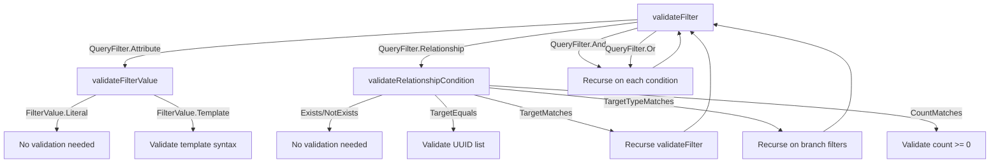

---
Created:
  - "[[Workflows]]"
Updated: 2026-02-09
---# WorkflowQueryEntityActionConfig

---

## Purpose

Queries entities by type with attribute and relationship filtering, supporting compound logic and nested relationship traversal.

---

## Responsibilities

- Configure query parameters (entity type, filters, pagination, projection)
- Validate recursive filter structure with compound AND/OR and nested relationships
- Validate template syntax in filter values
- Execute entity queries (NOT YET IMPLEMENTED - validation only)

**Explicitly NOT responsible for:**
- Query execution (planned but not implemented)
- Query optimization (delegated to future EntityQueryService)
- Result caching

---

## Dependencies

### Internal Dependencies

| Component | Purpose | Coupling |
|---|---|---|
| [[WorkflowNodeConfigValidationService]] | Validates template syntax and config fields | Medium |
| [[WorkflowNodeConfig]] | Sealed parent class for all node configurations | High |

### Cross-Domain Dependencies

| Component | Purpose | Coupling |
|---|---|---|
| [[EntityQuery]] (Entities domain) | Query model with filter definitions | High |
| [[QueryFilter]] (Entities domain) | Sealed class for attribute/relationship filters | High |
| [[RelationshipFilter]] (Entities domain) | Relationship condition types | High |

---

## Consumed By

| Component | How It Uses This | Notes |
|---|---|---|
| [[WorkflowNodeConfigRegistry]] | Discovers at startup via classpath scan | Auto-registration |
| [[WorkflowNode]] | Executes via `execute()` method | Throws NotImplementedError at runtime |

---

## Config Fields

| Field | Type | Required | Description |
|---|---|---|---|
| `query` | ENTITY_QUERY | Yes | Query definition with entity type and optional filters |
| `pagination` | JSON | No | Pagination (limit, offset) and ordering configuration |
| `projection` | JSON | No | Field selection for query results |
| `timeoutSeconds` | DURATION | No | Optional timeout override in seconds |

---

## JSON Examples

### Simple Attribute Filter (Status == "Active")

```json
{
  "version": 1,
  "type": "ACTION",
  "subType": "QUERY_ENTITY",
  "query": {
    "entityTypeId": "client-type-uuid",
    "filter": {
      "type": "ATTRIBUTE",
      "attributeId": "status-uuid",
      "operator": "EQUALS",
      "value": { "kind": "LITERAL", "value": "Active" }
    }
  }
}
```

### Compound Filter (Status == "Active" AND ARR > 100000)

```json
{
  "query": {
    "entityTypeId": "client-type-uuid",
    "filter": {
      "type": "AND",
      "conditions": [
        {
          "type": "ATTRIBUTE",
          "attributeId": "status-uuid",
          "operator": "EQUALS",
          "value": { "kind": "LITERAL", "value": "Active" }
        },
        {
          "type": "ATTRIBUTE",
          "attributeId": "arr-uuid",
          "operator": "GREATER_THAN",
          "value": { "kind": "LITERAL", "value": 100000 }
        }
      ]
    }
  }
}
```

### Relationship Filter (Projects Related to Specific Client)

```json
{
  "query": {
    "entityTypeId": "project-type-uuid",
    "filter": {
      "type": "RELATIONSHIP",
      "relationshipId": "client-relationship-uuid",
      "condition": {
        "type": "TARGET_EQUALS",
        "entityIds": ["{{ trigger.input.clientId }}"]
      }
    }
  }
}
```

### Nested Relationship Filter (Projects with Premium Clients)

```json
{
  "query": {
    "entityTypeId": "project-type-uuid",
    "filter": {
      "type": "RELATIONSHIP",
      "relationshipId": "client-relationship-uuid",
      "condition": {
        "type": "TARGET_MATCHES",
        "filter": {
          "type": "ATTRIBUTE",
          "attributeId": "client-tier-uuid",
          "operator": "EQUALS",
          "value": { "kind": "LITERAL", "value": "Premium" }
        }
      }
    }
  }
}
```

---

## Key Logic

### Recursive Filter Validation

The validation logic dispatches through three private methods based on filter structure:



#### 1. validateFilter(filter, path, validationService)

Dispatches based on `QueryFilter` sealed class type:

- **Attribute**: Validates the filter value (literal or template)
- **Relationship**: Validates the relationship condition
- **And**: Checks at least one condition exists, recursively validates each
- **Or**: Checks at least one condition exists, recursively validates each

#### 2. validateFilterValue(value, path, validationService)

Validates filter value based on `FilterValue` sealed class type:

- **Literal**: No validation (any value allowed)
- **Template**: Validates template syntax (e.g., `{{ steps.x.output.field }}`)

#### 3. validateRelationshipCondition(condition, path, validationService)

Validates relationship condition based on `RelationshipFilter` sealed class type:

- **Exists**: No validation
- **NotExists**: No validation
- **TargetEquals**: Validates list of entity IDs (each must be UUID or template)
- **TargetMatches**: Recursively validates nested filter
- **TargetTypeMatches**: Validates branches (each branch has optional filter)
- **CountMatches**: Validates count is non-negative

---

## Validation Rules

1. **entityTypeId**: Must be valid UUID (part of EntityQuery model)
2. **filter** (if provided): Recursive validation per diagram above
3. **pagination** (if provided):
   - `limit` must be non-negative
   - `offset` must be non-negative
4. **timeoutSeconds** (if provided): Must be non-negative

**Validation gaps:**
- Entity type existence in workspace not checked
- Attribute IDs not verified against entity type schema
- Relationship IDs not verified against relationship definitions
- Filter depth not limited (potential stack overflow)

---

## Error Handling

### Errors Thrown

| Error/Exception | When | Expected Handling |
|---|---|---|
| `NotImplementedError` | `execute()` called | Workflow execution fails, requires [[EntityQueryService]] implementation |

---

## Gotchas & Edge Cases

> [!warning] Execute Not Implemented
> The `execute()` method throws `NotImplementedError`. This node can only be **validated**, not executed. Workflows using QUERY_ENTITY will fail at runtime.
>
> **Implementation gap:** Requires `EntityQueryService` to:
> 1. Resolve template values in filters
> 2. Build query criteria from filter structure
> 3. Execute query against entity repository
> 4. Apply pagination and projection
> 5. Return results in expected format

### Cross-Domain Dependency

The `EntityQuery` model is imported from the Entities domain:

```kotlin
import riven.core.models.entity.query.EntityQuery
import riven.core.models.entity.query.filter.QueryFilter
import riven.core.models.entity.query.filter.RelationshipFilter
```

**Impact:** Changes to Entities domain query models break Workflows domain. This creates tight coupling between domains.

**Trade-off:** Query model is shared because entity querying logic belongs in Entities domain, not Workflows. Workflows orchestrate, Entities execute.

### Unlimited Filter Depth

No limit on recursive filter nesting. A deeply nested filter like:

```
AND → OR → AND → RELATIONSHIP(TARGET_MATCHES) → AND → ...
```

Could cause stack overflow during validation or execution.

**Mitigation:** The Entities domain's [[AttributeFilterVisitor]] documents separate depth limits for AND/OR nesting vs relationship traversal, but this config validator doesn't enforce them.

---

## Related

- [[Action Nodes]] — category-level overview of all action node types
- [[WorkflowNodeConfig]] — sealed parent class defining node configuration contract
- [[Entity Querying]] — Entities domain querying subsystem with execution logic
- [[AttributeFilterVisitor]] — Entities domain visitor with depth limit documentation
