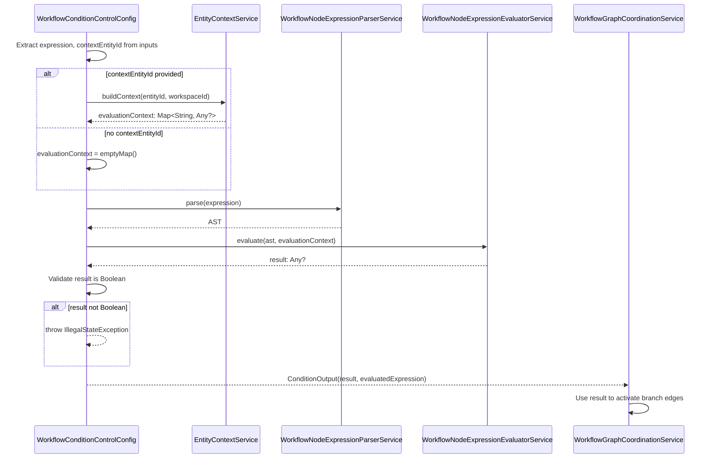

---
Created:
  - "[[Workflows]]"
Updated: 2026-02-09
---# WorkflowConditionControlConfig

---

## Purpose

Evaluates a SQL-like boolean expression to branch workflow execution, optionally loading entity data as evaluation context. This is the only implemented control flow node type.

---

## Responsibilities

- Configure condition expression and optional entity context for evaluation
- Validate expression syntax via [[WorkflowNodeExpressionParserService]]
- Execute expression evaluation via [[WorkflowNodeExpressionEvaluatorService]]
- Load entity context via [[EntityContextService]] when contextEntityId provided
- Return ConditionOutput with boolean result for DAG branching decisions

**Explicitly NOT responsible for:**
- Graph traversal or edge activation (handled by [[WorkflowGraphCoordinationService]])
- Expression parsing implementation (delegated to [[WorkflowNodeExpressionParserService]])
- Entity data retrieval (delegated to [[EntityContextService]])

---

## Dependencies

### Internal Dependencies

| Component | Purpose | Coupling |
|-----------|---------|----------|
| [[WorkflowNodeExpressionParserService]] | Parses SQL-like expression into AST for validation and execution | High |
| [[WorkflowNodeExpressionEvaluatorService]] | Evaluates parsed AST against context data | High |
| [[EntityContextService]] | Builds entity data map for expression evaluation context | Medium |
| [[WorkflowNodeConfigValidationService]] | Validates config fields (required strings, UUIDs, durations) | Low |

---

## Consumed By

| Component | How It Uses This | Notes |
|-----------|------------------|-------|
| [[WorkflowGraphCoordinationService]] | Reads ConditionOutput.result to determine branch activation | DAG coordinator uses boolean result to decide which edges to follow |
| [[WorkflowNodeConfigRegistry]] | Discovers and registers at startup | Via reflection on sealed class hierarchy |

---

## Config Fields

| Field | Type | Required | Description |
|-------|------|----------|-------------|
| `expression` | TEMPLATE | Yes | SQL-like expression that must evaluate to boolean |
| `contextEntityId` | UUID | No | Entity ID to load as evaluation context (template-enabled) |
| `timeoutSeconds` | DURATION | No | Optional timeout override in seconds |

### JSON Configuration Example

```json
{
  "version": 1,
  "type": "CONTROL_FLOW",
  "subType": "CONDITION",
  "expression": "entity.status == 'active' && entity.balance > 0",
  "contextEntityId": "{{ steps.fetch_account.output.entityId }}"
}
```

---

## Output

Returns `ConditionOutput` with:

| Field | Type | Description |
|-------|------|-------------|
| `result` | Boolean | Expression evaluation result (used for DAG branching) |
| `evaluatedExpression` | String | Resolved expression string (after template resolution) |

---

## Key Logic

### Expression Evaluation Flow



### Expression Syntax

Supports SQL-like syntax for boolean expressions:

**Comparison operators:**
- `==`, `!=` — Equality/inequality
- `<`, `>`, `<=`, `>=` — Numeric comparison

**Logical operators:**
- `&&` — Logical AND
- `||` — Logical OR
- `!` — Logical NOT

**Property access:**
- `entity.field` — Top-level field
- `entity.field.nested` — Nested property access

**Literals:**
- `'string'` — String literals (single quotes)
- `123`, `45.67` — Numeric literals
- `true`, `false` — Boolean literals
- `null` — Null literal

**Example expressions:**
- `entity.status == 'active'`
- `entity.balance > 100 && entity.verified == true`
- `entity.tags.contains('premium') || entity.score >= 80`

### DAG Coordination

The `result` boolean in ConditionOutput is consumed by [[WorkflowGraphCoordinationService]] to determine which branch edges to activate:

1. Condition node executes and returns ConditionOutput
2. DAG coordinator reads ConditionOutput.result
3. Edges with condition filters reference this node's output
4. Edges matching `result == true` or `result == false` are activated accordingly

This is the primary integration point between condition evaluation and workflow graph traversal.

---

## Validation Rules

| Field/Input | Rule | Error |
|-------------|------|-------|
| `expression` | Non-blank string | "expression cannot be blank" |
| `expression` | Valid syntax (parseable) | "Invalid expression syntax: {parser error}" |
| `contextEntityId` | Valid UUID or template if provided | "contextEntityId must be valid UUID or template" |
| `timeoutSeconds` | Non-negative if provided | "timeoutSeconds must be non-negative" |

**Validation process:**
1. Check expression not blank
2. Attempt to parse expression with [[WorkflowNodeExpressionParserService]]
3. Validate contextEntityId format (UUID or template syntax)
4. Validate timeout is non-negative

**Runtime validation:**
- After expression evaluation, verify result is Boolean type
- If result is not Boolean, throw IllegalStateException with descriptive message

---

## Gotchas & Edge Cases

> [!warning] Expression Result Type Enforcement
>
> **Boolean validation at runtime:** The expression is expected to return a boolean, but this is NOT enforced at parse time — only after evaluation. If the expression evaluates to a non-boolean value (e.g., string, number, null), execute() throws IllegalStateException: "CONDITION expression must evaluate to boolean, got: {type}". This can happen with expressions like `entity.status` (returns string) instead of `entity.status == 'active'` (returns boolean).

> [!warning] Entity Context Optionality
>
> **Context-dependent expressions:** Expressions can reference `entity.field` only when `contextEntityId` is provided. If contextEntityId is null or not provided, the evaluation context is an empty map, and any property access like `entity.status` will fail during evaluation. Design expressions to match the context configuration.

> [!warning] Only Implemented Control Type
>
> **Limited control flow options:** CONDITION is the ONLY implemented control flow node type. The WorkflowControlType enum defines SWITCH, LOOP, PARALLEL, DELAY, and MERGE types, but these are enum-only placeholders with no corresponding config classes. Use condition nodes for all branching logic.

---

## Related

- [[Control Flow Nodes]] — category-level overview of all control types
- [[WorkflowNodeConfig]] — sealed parent class
- [[WorkflowControlConfig]] — parent sealed interface
- [[WorkflowNodeExpressionParserService]] — expression syntax parser
- [[WorkflowNodeExpressionEvaluatorService]] — expression evaluator
- [[WorkflowGraphCoordinationService]] — DAG coordinator that consumes ConditionOutput
- [[EntityContextService]] — entity data loader
