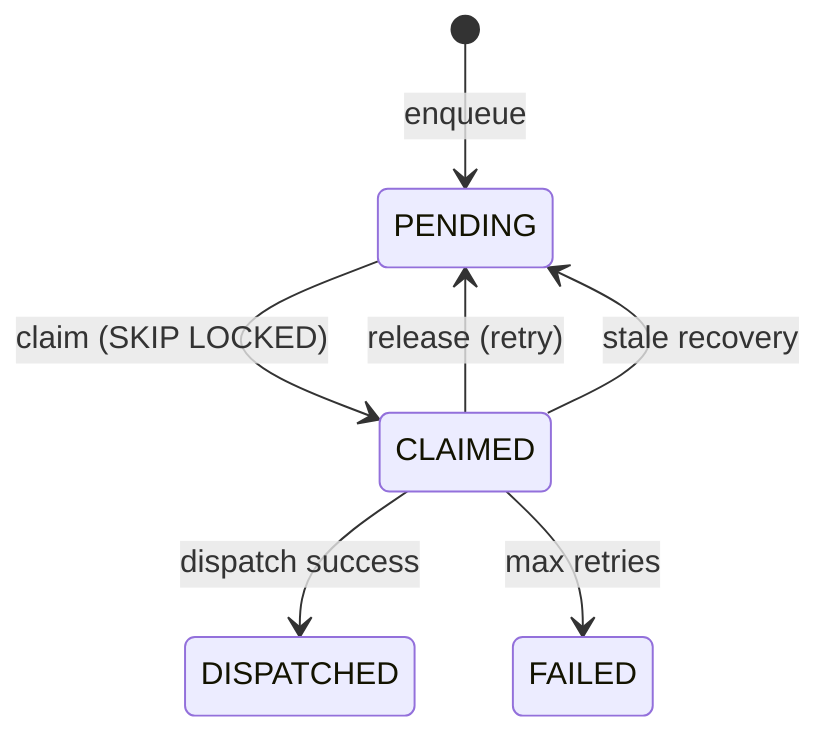

---
tags:
  - component/active
  - layer/entity
  - architecture/component
Created: 2026-02-09
Updated: 2026-03-17
Domains:
  - "[[Workflows]]"
---
Part of [[Queue Management]]

# ExecutionQueueEntity

---

## Purpose

Generic execution queue table supporting multiple job types via discriminator. Does NOT extend AuditableEntity (system infrastructure, not user-facing). Table: `execution_queue`.

---

## Key Fields

| Field | Type | Notes |
|-------|------|-------|
| id | UUID, PK | `@GeneratedValue(strategy = GenerationType.UUID)` |
| workspaceId | UUID, FK to workspaces | Workspace scope |
| jobType | ExecutionJobType enum | WORKFLOW_EXECUTION, IDENTITY_MATCH |
| entityId | UUID?, FK to entities | Used by IDENTITY_MATCH jobs, null for WORKFLOW_EXECUTION |
| workflowDefinitionId | UUID?, FK to workflow_definitions | Used by WORKFLOW_EXECUTION jobs |
| executionId | UUID?, mutable | Set after WorkflowExecutionEntity creation |
| status | ExecutionQueueStatus | PENDING, CLAIMED, DISPATCHED, FAILED |
| createdAt | ZonedDateTime | Default NOW |
| claimedAt | ZonedDateTime? | Set on CLAIMED transition |
| dispatchedAt | ZonedDateTime? | Set on DISPATCHED transition |
| attemptCount | Int | Default 0, incremented on retry/failure |
| lastError | String? | Error message on failure |
| input | JSONB? | Job-specific input payload |

---

## State Machine

PENDING -> CLAIMED -> DISPATCHED (or FAILED). CLAIMED -> PENDING on retry or stale recovery.

---

## Database Indexes

| Index | Columns | Notes |
|-------|---------|-------|
| idx_execution_queue_workspace | (workspace_id, status) | Query pending items by workspace |
| uq_execution_queue_pending_identity_match | UNIQUE (workspace_id, entity_id, job_type) WHERE status='PENDING' AND entity_id IS NOT NULL | Deduplicates pending identity match jobs |

---

## Job Type Routing

| Job Type | Claimed By | Capacity Check | Dispatch Target |
|----------|-----------|----------------|-----------------|
| WORKFLOW_EXECUTION | WorkflowExecutionQueueProcessorService via `claimPendingExecutions()` | Workspace tier concurrent limit | Temporal workflows.default queue |
| IDENTITY_MATCH | IdentityMatchQueueProcessorService via `claimPendingIdentityMatchJobs()` | N/A | Temporal identity.match queue |

---

## Mapping

`toModel()` converts to `ExecutionQueueRequest` domain model.

---

## Gotchas & Edge Cases

> [!warning] FOR UPDATE SKIP LOCKED
> Uses native queries with `FOR UPDATE SKIP LOCKED` for concurrent-safe claiming. Each job type has separate claim queries filtered by the `job_type` column.

> [!warning] Partial Unique Index
> The deduplication unique index (`uq_execution_queue_pending_identity_match`) only applies to IDENTITY_MATCH jobs where `entity_id` is relevant. WORKFLOW_EXECUTION jobs do not have this deduplication constraint.

> [!warning] Not AuditableEntity
> Does not extend AuditableEntity — this is system infrastructure managed by dispatchers, not user-created data. Has its own `createdAt` field but no `updatedAt`, `createdBy`, or soft-delete support.

---

## Related

- [[WorkflowExecutionQueueService]] — State transition operations
- [[WorkflowExecutionQueueProcessorService]] — Claims and processes WORKFLOW_EXECUTION items
- [[IdentityMatchQueueProcessorService]] — Claims and processes IDENTITY_MATCH items
- [[ExecutionQueueRepository]] — JPA repository
