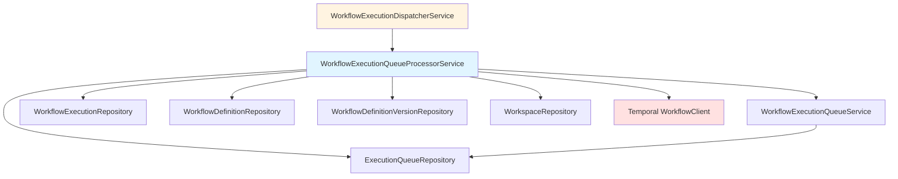

---
tags:
  - component/active
  - layer/service
  - architecture/component
Created: 2026-02-08
Updated: 2026-02-08
Domains:
  - "[[Workflows]]"
---
Part of [[Queue Management]]

# WorkflowExecutionQueueProcessorService

---

## Purpose

Processes individual queue items in isolated transactions, checking workspace capacity and dispatching available executions to Temporal. Ensures that row locks are released immediately after each item completes and failures in one item don't affect others.

---

## Responsibilities

**This component owns:**
- Claiming batches of pending execution queue items via SKIP LOCKED
- Processing individual queue items in isolated REQUIRES_NEW transactions
- Checking workspace tier capacity limits before dispatch
- Creating or reusing WorkflowExecutionEntity records
- Dispatching executions to Temporal workflow engine
- Handling dispatch errors and retry logic
- Marking queue items as dispatched, failed, or released back to pending

**Explicitly NOT responsible for:**
- Scheduling the queue processing (handled by WorkflowExecutionDispatcherService)
- Distributed locking across instances (handled by ShedLock in dispatcher)
- Executing the workflow logic (handled by Temporal)
- Managing the WorkflowDataStore or node state

---

## Dependencies

### Internal Dependencies

|Component|Purpose|Coupling|
|---|---|---|
|[[WorkflowExecutionQueueService]]|Queue item state transitions (markClaimed, markDispatched, markFailed, releaseToPending)|High|
|[[WorkflowExecutionRepository]]|CRUD operations for WorkflowExecutionEntity, counting active executions|High|
|[[WorkflowDefinitionRepository]]|Loading workflow definitions for dispatch|Medium|
|[[ExecutionQueueRepository]]|Claiming pending items via SKIP LOCKED query|High|
|[[WorkflowDefinitionVersionRepository]]|Loading workflow version for node ID extraction|Medium|
|[[WorkspaceRepository]]|Loading workspace to check tier capacity|Medium|

### External Dependencies

|Service/Library|Purpose|Failure Impact|
|---|---|---|
|Temporal WorkflowClient|Starting workflow executions|Queue item marked failed after MAX_ATTEMPTS|
|Spring Transaction Management|REQUIRES_NEW transaction isolation|Processing cannot proceed|
|PostgreSQL|Row-level locking with SKIP LOCKED|Processing cannot proceed|

### Injected Dependencies

```kotlin
@Service
class WorkflowExecutionQueueProcessorService(
    private val workflowExecutionQueueService: WorkflowExecutionQueueService,
    private val workflowExecutionRepository: WorkflowExecutionRepository,
    private val workflowDefinitionRepository: WorkflowDefinitionRepository,
    private val executionQueueRepository: ExecutionQueueRepository,
    private val workflowDefinitionVersionRepository: WorkflowDefinitionVersionRepository,
    private val workspaceRepository: WorkspaceRepository,
    private val workflowClient: WorkflowClient,
    private val logger: KLogger
)
```

---

## Consumed By

|Component|How It Uses This|Notes|
|---|---|---|
|[[WorkflowExecutionDispatcherService]]|Calls claimBatch() to get pending items, then processItem() for each|Dispatcher orchestrates the batch loop|

---

## Public Interface

### Key Methods

#### `claimBatch(size: Int): List<ExecutionQueueEntity>`

- **Purpose:** Atomically claim a batch of pending executions using SKIP LOCKED
- **When to use:** Called by dispatcher at the start of each processing cycle
- **Side effects:** Updates claimed items' status in database, locks rows until transaction commits
- **Throws:** Database exceptions if query fails
- **Transaction:** Runs in its own transaction, releases locks when method returns

```kotlin
@Transactional
fun claimBatch(size: Int): List<ExecutionQueueEntity>
```

#### `processItem(item: ExecutionQueueEntity)`

- **Purpose:** Process a single queue item in an isolated transaction (checks capacity, dispatches to Temporal)
- **When to use:** Called by dispatcher for each claimed item
- **Side effects:** May create WorkflowExecutionEntity, start Temporal workflow, update queue item status
- **Throws:** Catches all exceptions internally, handles via error logic
- **Transaction:** REQUIRES_NEW - fully isolated from other items and caller

```kotlin
@Transactional(propagation = Propagation.REQUIRES_NEW)
fun processItem(item: ExecutionQueueEntity)
```

#### `processQueueItem(item: ExecutionQueueEntity)` (private)

- **Purpose:** Core processing logic - marks claimed, checks capacity, dispatches if available
- **When to use:** Called internally by processItem()
- **Side effects:** Updates queue item status, may start Temporal workflow
- **Throws:** Exceptions propagate to processItem() error handler

**Processing flow:**
1. Mark item as CLAIMED
2. Load workspace and check tier capacity
3. If at capacity: release back to PENDING for later retry
4. If capacity available: dispatch to Temporal

#### `dispatchToTemporal(item: ExecutionQueueEntity)` (private)

- **Purpose:** Create/reuse execution entity and start Temporal workflow
- **When to use:** Called when workspace has capacity available
- **Side effects:** Creates WorkflowExecutionEntity, persists execution ID to queue item, starts Temporal workflow
- **Throws:** Exceptions if workflow definition not found, version not found, or Temporal start fails

**Dispatch flow:**
1. Load workflow definition and version
2. Extract node IDs from workflow graph
3. Get or create WorkflowExecutionEntity (reuse if retry scenario)
4. Persist execution ID to queue item BEFORE starting Temporal
5. Start Temporal workflow with WorkflowExecutionInput
6. Mark queue item as DISPATCHED

#### `getOrCreateExecution(item: ExecutionQueueEntity, workflowVersionId: UUID): WorkflowExecutionEntity` (private)

- **Purpose:** Reuse existing execution on retry, or create new execution
- **When to use:** Called during dispatch to get execution entity
- **Side effects:** Creates WorkflowExecutionEntity if new, updates existing to RUNNING if retry
- **Throws:** None

**Logic:**
- If item.executionId is set: load existing execution, update status to RUNNING, reset error
- If execution not found or ID not set: create new WorkflowExecutionEntity with RUNNING status

#### `handleProcessingError(item: ExecutionQueueEntity, error: Exception)` (private)

- **Purpose:** Handle errors during processing (decide retry vs fail)
- **When to use:** Called by processItem() catch block
- **Side effects:** Updates queue item status to FAILED or releases to PENDING
- **Throws:** None

**Logic:**
- If attemptCount >= MAX_ATTEMPTS (3): mark FAILED permanently
- Otherwise: release to PENDING for retry

---

## Key Logic

### Core Algorithm / Business Rules

**Queue Item Processing Flow:**

```
1. Claim batch (SKIP LOCKED)
   └─> Short transaction, releases locks immediately

2. For each item (REQUIRES_NEW transaction per item):
   a. Mark CLAIMED
   b. Load workspace
   c. Check tier capacity
      ├─> At capacity: releaseToPending()
      └─> Available: dispatchToTemporal()
          ├─> Load workflow definition & version
          ├─> Get or create execution entity
          ├─> Persist execution ID to queue item
          ├─> Start Temporal workflow
          └─> Mark DISPATCHED

3. Error handling:
   ├─> attemptCount < MAX_ATTEMPTS: releaseToPending()
   └─> attemptCount >= MAX_ATTEMPTS: markFailed()
```

### Capacity Check Logic

Workspace tier determines maximum concurrent workflows:

```kotlin
val tier = WorkspaceTier.fromPlan(workspace.plan)
val activeCount = workflowExecutionRepository.countActiveByWorkspace(workspaceId)

if (activeCount >= tier.maxConcurrentWorkflows) {
    // At capacity - release back to pending
    workflowExecutionQueueService.releaseToPending(item)
    return
}
```

**Tier limits:**
- FREE: 1 concurrent execution
- PRO: 5 concurrent executions
- ENTERPRISE: 20 concurrent executions

### Retry and Execution Reuse Logic

On retry scenarios (when item.executionId is already set):

1. Load existing WorkflowExecutionEntity
2. Reset status to RUNNING, clear error, update startedAt
3. Reuse the same execution ID for Temporal workflow

This ensures:
- Execution history is preserved across retries
- Temporal workflow ID remains consistent
- Database foreign keys remain valid

If Temporal start fails:
- Delete the execution entity to avoid orphans
- Re-throw exception to trigger retry logic
- Next retry will create a new execution entity

---

## Data Access

### Entities Owned

_This component is NOT the source of truth for any entities - it coordinates between queue and execution entities._

|Entity|Operations|Notes|
|---|---|---|
|[[ExecutionQueueEntity]]|Read, Update (via WorkflowExecutionQueueService)|Updates status transitions only|
|[[WorkflowExecutionEntity]]|Create, Read, Update, Delete|Creates on dispatch, deletes on Temporal start failure|

### Queries

|Query|Purpose|Performance Notes|
|---|---|---|
|claimPendingExecutions(size)|Claim batch via SKIP LOCKED|FOR UPDATE SKIP LOCKED prevents lock contention|
|countActiveByWorkspace(workspaceId)|Check capacity before dispatch|Indexed on workspace_id + status|
|findById (various entities)|Load workflow definitions, versions, workspace|Standard PK lookups|

---

## Configuration

|Property|Purpose|Default|Environment-specific|
|---|---|---|---|
|`riven.workflow.engine.enabled`|Enable/disable workflow engine|`true`|Yes|
|`MAX_ATTEMPTS`|Max dispatch retry attempts|`3`|No (constant)|

---

## Error Handling

### Errors Thrown

_This component catches all exceptions internally in processItem()._

|Error/Exception|When|Expected Handling|
|---|---|---|
|Database exceptions|Queries fail|Propagate to caller, ShedLock will retry on next schedule|
|Temporal start failure|WorkflowClient.start() fails|Caught, execution deleted, item released or failed based on attempt count|

### Errors Handled

|Error/Exception|Source|Recovery Strategy|
|---|---|---|
|Workspace not found|WorkspaceRepository|Mark queue item as FAILED|
|Workflow definition not found|WorkflowDefinitionRepository|Mark queue item as FAILED|
|Workflow version not found|WorkflowDefinitionVersionRepository|Mark queue item as FAILED|
|Temporal start failure|WorkflowClient|Delete execution entity, release to PENDING or mark FAILED based on attempts|
|Any other exception during processing|Various|Release to PENDING or mark FAILED based on attempts|

---

## Observability

### Key Metrics

|Metric|Type|What It Indicates|
|---|---|---|
|Queue item processing rate|Counter|Throughput of dispatcher|
|Items at capacity (released)|Counter|Workspaces hitting tier limits|
|Dispatch failures|Counter|Temporal connectivity or configuration issues|
|Retry count distribution|Histogram|How often items require retries|

### Log Events

|Event|Level|When|Key Fields|
|---|---|---|---|
|Workspace at capacity|INFO|activeCount >= tier limit|workspaceId, activeCount, tier limit|
|Dispatching queue item|INFO|Before Temporal start|queue item ID, workflow definition ID|
|Dispatched execution|INFO|After successful Temporal start|execution ID, queue item ID|
|Failed to start Temporal workflow|ERROR|WorkflowClient.start() throws|queue item ID, exception|
|Error processing queue item|ERROR|processItem() catches exception|queue item ID, exception|
|Workspace not found|WARN|Workspace lookup returns null|workspaceId, queue item ID|
|Execution not found for retry|WARN|item.executionId set but entity missing|executionId, queue item ID|

---

## Gotchas & Edge Cases

> [!warning] REQUIRES_NEW Transaction Isolation
> Each queue item is processed in a REQUIRES_NEW transaction. This means:
> - Row locks are released immediately when processItem() completes
> - Failures in one item don't roll back other items in the batch
> - Changes in processItem() commit even if dispatcher's outer transaction fails
> - Be careful not to create partially-committed state across multiple entities

> [!warning] SKIP LOCKED Row Claiming
> The claimBatch() method uses `FOR UPDATE SKIP LOCKED` to prevent lock contention:
> - Multiple dispatcher instances can safely run in parallel
> - Each instance claims different rows without blocking
> - If all rows are locked, query returns empty list (no waiting)
> - Claimed rows remain locked until transaction commits

> [!warning] Execution ID Must Be Persisted BEFORE Temporal Start
> The execution ID is written to the queue item BEFORE starting the Temporal workflow:
> - If Temporal start succeeds but app crashes, retry can find the execution
> - If Temporal start fails, execution entity is deleted but ID remains on queue item
> - Next retry creates a new execution entity (old ID is overwritten)

> [!warning] Capacity Check Race Condition
> There's a small window between capacity check and dispatch where another execution could start:
> - Capacity check happens in one transaction
> - Temporal workflow start happens after
> - In rare cases, workspace might exceed tier limit by 1-2 executions briefly
> - This is acceptable as it's self-correcting (next items released until capacity drops)

### Known Limitations

- Fixed MAX_ATTEMPTS (3) - not configurable per workspace or workflow
- Capacity check is workspace-level only (no per-user quotas)
- No priority queue support (all items processed FIFO)
- Batch size is controlled by dispatcher, not configurable here

### Thread Safety / Concurrency

**Thread-safe** when used correctly:
- Each processItem() call runs in its own transaction (REQUIRES_NEW)
- No shared mutable state between calls
- All dependencies are Spring-managed singletons (stateless)

**Concurrency model:**
- Multiple dispatcher instances can run across cluster (ShedLock prevents overlap)
- Within one instance, items processed sequentially in loop
- Each item's transaction is independent

---

## Testing

### Unit Test Coverage

- **Location:** `src/test/kotlin/riven/core/service/workflow/queue/WorkflowExecutionQueueProcessorServiceTest.kt`
- **Key scenarios covered:**
  - Successful dispatch with capacity available
  - Capacity check releases item when at limit
  - Retry reuses existing execution entity
  - Execution created when retry but entity missing
  - Temporal start failure deletes execution and triggers retry
  - Max attempts reached marks item as failed
  - Workspace not found marks item as failed

### Integration Test Notes

Integration tests should verify:
- SKIP LOCKED prevents multiple instances claiming same item
- REQUIRES_NEW transaction isolation (one failure doesn't roll back others)
- Temporal workflow actually starts with correct input
- Execution entity created with correct status

### How to Test Manually

1. Enable workflow engine: `riven.workflow.engine.enabled=true`
2. Create workflow definition in database
3. Enqueue execution via API or direct repository insert
4. Verify dispatcher claims and processes item (check logs)
5. Verify Temporal workflow started (check Temporal UI)
6. Verify execution entity created with RUNNING status

---

## Related

- [[Queue Management]] - Parent subdomain
- [[WorkflowExecutionDispatcherService]] - Orchestrates batch processing loop
- [[WorkflowExecutionQueueService]] - State transition operations
- [[WorkflowOrchestrationService]] - Temporal workflow that executes after dispatch

---

## Dependency Diagram



---

## Changelog

|Date|Change|Reason|
|---|---|---|
|2026-02-08|Initial documentation|Phase 1 - Workflows domain documentation|
