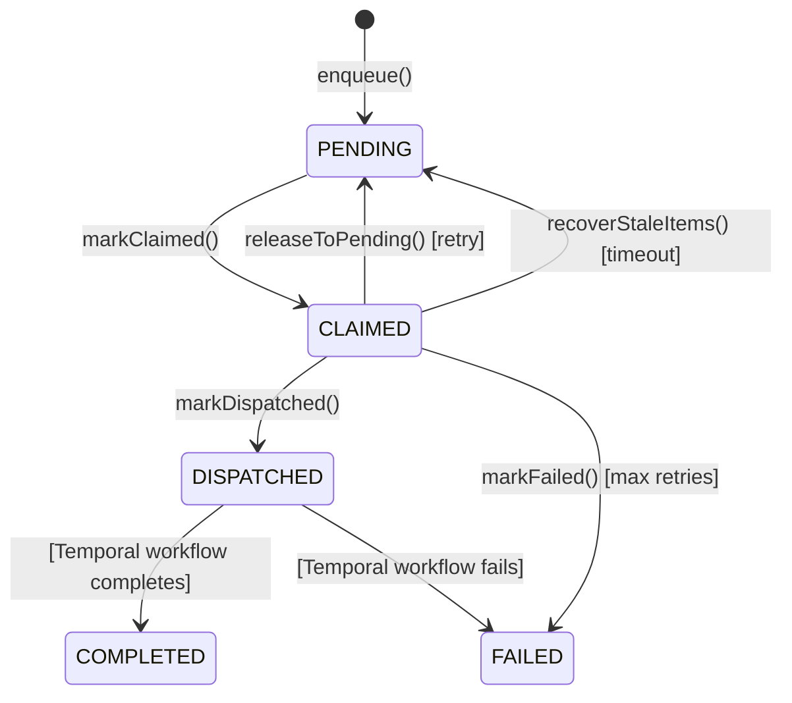
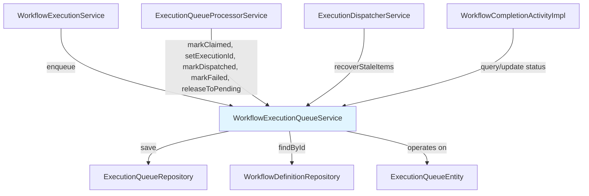

---
tags:
  - component/active
  - layer/service
  - architecture/component
Created: 2026-02-08
Updated: 2026-02-08
Domains:
  - "[[Workflows]]"
---
# WorkflowExecutionQueueService

Part of [[Queue Management]]

---

## Purpose

Manages the workflow execution queue persistence layer, handling state transitions for queue items as they move from PENDING → CLAIMED → DISPATCHED → COMPLETED/FAILED. Provides transactional guarantees for queue operations and recovery mechanisms for stale claimed items.

---

## Responsibilities

**Explicitly responsible for:**
- Enqueue new workflow execution requests with PENDING status
- Validate workflow definition exists and belongs to workspace before enqueueing
- Manage queue state transitions (PENDING, CLAIMED, DISPATCHED, FAILED)
- Record timestamps for each state transition (createdAt, claimedAt, dispatchedAt)
- Associate queue items with WorkflowExecutionEntity IDs
- Track attempt counts and error messages for failed items
- Release claimed items back to PENDING for retry
- Recover stale claimed items (claimed but not dispatched within timeout)
- Query pending queue counts by workspace

**Explicitly NOT responsible for:**
- Dispatching to Temporal (handled by WorkflowExecutionDispatcherService and WorkflowExecutionQueueProcessorService)
- Claiming queue items via SELECT FOR UPDATE SKIP LOCKED (handled by WorkflowExecutionQueueProcessorService)
- Scheduled polling (handled by WorkflowExecutionDispatcherService)
- Creating or managing WorkflowExecutionEntity (handled by WorkflowExecutionQueueProcessorService)

---

## Dependencies

### Internal Dependencies

|Component|Purpose|Coupling|
|---|---|---|
|[[ExecutionQueueRepository]]|JPA repository for queue persistence|High - direct data access|
|[[WorkflowDefinitionRepository]]|Validate workflow definition on enqueue|Medium - validation only|
|[[ExecutionQueueEntity]]|Queue item entity|High - domain model|
|[[ExecutionQueueStatus]]|Enum for queue states|Low - shared enum|

### External Dependencies

|Service/Library|Purpose|Failure Impact|
|---|---|---|
|Spring Data JPA|@Transactional, repository support|Critical - no persistence without it|
|PostgreSQL|Queue item storage|Critical - entire queue system fails|
|KotlinLogging|Structured logging|Low - observability only|

### Injected Dependencies

```kotlin
@Service
class WorkflowExecutionQueueService(
    private val executionQueueRepository: ExecutionQueueRepository,
    private val workflowDefinitionRepository: WorkflowDefinitionRepository,
    private val logger: KLogger
)
```

---

## Consumed By

|Component|How It Uses This|Notes|
|---|---|---|
|[[WorkflowExecutionService]]|Calls `enqueue()` when API receives execution request|Entry point from REST API|
|[[WorkflowExecutionQueueProcessorService]]|Calls `markClaimed()`, `markDispatched()`, `setExecutionId()`, `markFailed()`, `releaseToPending()`|State transitions during processing|
|[[WorkflowExecutionDispatcherService]]|Calls `recoverStaleItems()` on scheduled recovery job|Stale claim cleanup|
|[[WorkflowCompletionActivityImpl]]|May query or update queue status on completion|Temporal activity completion|

---

## Public Interface

### Key Methods

#### `enqueue(workspaceId: UUID, workflowDefinitionId: UUID, params: JsonObject?): ExecutionQueueEntity`

- **Purpose:** Enqueue a workflow execution request with PENDING status
- **When to use:** When API receives a request to execute a workflow
- **Side effects:**
  - Validates workflow definition exists
  - Validates workflow belongs to workspace
  - Inserts ExecutionQueueEntity with PENDING status
  - Logs enqueueing action
- **Throws:**
  - `NotFoundException` if workflow definition not found
  - `SecurityException` if workflow doesn't belong to workspace

**Signature:**
```kotlin
@Transactional
fun enqueue(
    workspaceId: UUID,
    workflowDefinitionId: UUID,
    params: JsonObject? = null
): ExecutionQueueEntity
```

**Returns:** Created queue entity with ID and PENDING status.

#### `markClaimed(entity: ExecutionQueueEntity): ExecutionQueueEntity`

- **Purpose:** Mark queue item as CLAIMED after being selected via SKIP LOCKED
- **When to use:** Immediately after ExecutionQueueProcessorService claims items from queue
- **Side effects:**
  - Sets status to CLAIMED
  - Records claimedAt timestamp
  - Persists to database
- **Throws:** None

**Signature:**
```kotlin
@Transactional
fun markClaimed(entity: ExecutionQueueEntity): ExecutionQueueEntity
```

#### `setExecutionId(entity: ExecutionQueueEntity, executionId: UUID): ExecutionQueueEntity`

- **Purpose:** Associate queue item with a WorkflowExecutionEntity ID
- **When to use:** After creating/loading WorkflowExecutionEntity but before starting Temporal workflow
- **Side effects:**
  - Sets executionId field
  - Persists to database
- **Throws:** None

**Note:** This ensures the execution can be reused on retry if Temporal start fails.

**Signature:**
```kotlin
@Transactional
fun setExecutionId(entity: ExecutionQueueEntity, executionId: UUID): ExecutionQueueEntity
```

#### `markDispatched(entity: ExecutionQueueEntity): ExecutionQueueEntity`

- **Purpose:** Mark queue item as DISPATCHED after successful Temporal workflow start
- **When to use:** After Temporal WorkflowClient.start() succeeds
- **Side effects:**
  - Sets status to DISPATCHED
  - Records dispatchedAt timestamp
  - Persists to database
- **Throws:** None

**Signature:**
```kotlin
@Transactional
fun markDispatched(entity: ExecutionQueueEntity): ExecutionQueueEntity
```

#### `markFailed(entity: ExecutionQueueEntity, error: String): ExecutionQueueEntity`

- **Purpose:** Mark queue item as FAILED (permanent failure or max retries reached)
- **When to use:** When execution cannot proceed due to non-retryable error or retry exhaustion
- **Side effects:**
  - Sets status to FAILED
  - Increments attemptCount
  - Records error message in lastError
  - Persists to database
- **Throws:** None

**Signature:**
```kotlin
@Transactional
fun markFailed(entity: ExecutionQueueEntity, error: String): ExecutionQueueEntity
```

#### `releaseToPending(entity: ExecutionQueueEntity): ExecutionQueueEntity`

- **Purpose:** Release a claimed item back to PENDING for retry
- **When to use:** When dispatch fails but retry is possible (transient error)
- **Side effects:**
  - Sets status to PENDING
  - Clears claimedAt timestamp
  - Increments attemptCount
  - Persists to database
- **Throws:** None

**Signature:**
```kotlin
@Transactional
fun releaseToPending(entity: ExecutionQueueEntity): ExecutionQueueEntity
```

#### `recoverStaleItems(timeoutMinutes: Int = 5): Int`

- **Purpose:** Recover items claimed but not dispatched within timeout (crash recovery)
- **When to use:** On scheduled job (every 60 seconds in ExecutionDispatcherService)
- **Side effects:**
  - Queries for CLAIMED items older than timeout
  - Releases each to PENDING
  - Logs warning with count
- **Throws:** None

**Signature:**
```kotlin
@Transactional
fun recoverStaleItems(timeoutMinutes: Int = 5): Int
```

**Returns:** Number of items recovered.

#### `getPendingCount(workspaceId: UUID): Int`

- **Purpose:** Get pending queue count for a workspace
- **When to use:** For dashboard/monitoring, capacity checks
- **Side effects:** None (read-only)
- **Throws:** None

**Signature:**
```kotlin
@Transactional(readOnly = true)
fun getPendingCount(workspaceId: UUID): Int
```

---

## Key Logic

### Queue State Machine



### State Transition Details

| Transition | Trigger | Method | Fields Updated |
|---|---|---|---|
| → PENDING | API request | `enqueue()` | status, createdAt |
| PENDING → CLAIMED | Dispatcher claims via SKIP LOCKED | `markClaimed()` | status, claimedAt |
| CLAIMED → DISPATCHED | Temporal workflow started | `markDispatched()` | status, dispatchedAt |
| CLAIMED → PENDING | Dispatch failed (retryable) | `releaseToPending()` | status, claimedAt=null, attemptCount++ |
| CLAIMED → PENDING | Stale claim timeout | `recoverStaleItems()` | status, claimedAt=null, attemptCount++ |
| CLAIMED → FAILED | Dispatch failed (permanent) | `markFailed()` | status, attemptCount++, lastError |

### Validation Rules

|Field/Input|Rule|Error|
|---|---|---|
|workflowDefinitionId|Must exist in database|`NotFoundException`|
|workspaceId|Workflow definition must belong to workspace|`SecurityException`|

---

## Data Access

### Entities Owned

|Entity|Operations|Notes|
|---|---|---|
|[[ExecutionQueueEntity]]|CRUD|Primary responsibility - queue item lifecycle|

### Queries

|Query|Purpose|Performance Notes|
|---|---|---|
|`executionQueueRepository.save()`|Persist state transitions|Indexed by id (primary key)|
|`workflowDefinitionRepository.findById()`|Validate definition on enqueue|Indexed by id (primary key)|
|`executionQueueRepository.countByWorkspaceIdAndStatus()`|Get pending count|Should have composite index on (workspaceId, status)|
|`executionQueueRepository.findStaleClaimedItems()`|Recovery query|Should have index on (status, claimedAt)|

> [!warning] SELECT FOR UPDATE SKIP LOCKED
> This service does NOT perform the SKIP LOCKED claim query. That logic is in `ExecutionQueueProcessorService.claimBatch()`. This service only updates state after claims are made.

---

## Flows Involved

|Flow|Role in Flow|
|---|---|
|[[Flow - Workflow Execution]]|Entry point - enqueues execution requests|
|[[Flow - Queue Processing]]|Core participant - manages queue state throughout processing lifecycle|

---

## Configuration

None - uses default Spring transaction settings.

---

## Error Handling

### Errors Thrown

|Error/Exception|When|Expected Handling|
|---|---|---|
|`NotFoundException`|Workflow definition not found on enqueue|HTTP 404 to client|
|`SecurityException`|Workflow doesn't belong to workspace|HTTP 403 to client|

### Errors Handled

None - this service propagates exceptions to callers. Transaction rollback is handled by Spring `@Transactional`.

---

## Observability

### Log Events

|Event|Level|When|Key Fields|
|---|---|---|
|Enqueueing workflow|INFO|On `enqueue()`|definition, workspace|
|Enqueued execution|INFO|After successful save|queue id|
|Recovering stale items|WARN|On `recoverStaleItems()` if items found|count, timeout|

**Example Log Output:**
```
INFO  Enqueueing workflow execution: definition=abc-123, workspace=xyz-789
INFO  Enqueued execution: id=queue-456
WARN  Recovering 3 stale claimed items (claimed > 5 minutes ago)
```

---

## Gotchas & Edge Cases

> [!warning] SKIP LOCKED Pattern
> Queue claiming uses PostgreSQL's `SELECT ... FOR UPDATE SKIP LOCKED` pattern to prevent contention between dispatcher pods. This service does NOT implement that query - it only updates state after claims are made. See `WorkflowExecutionQueueProcessorService.claimBatch()` for the actual claiming logic.

> [!warning] Execution ID Set Before Dispatch
> `setExecutionId()` is called AFTER creating WorkflowExecutionEntity but BEFORE starting the Temporal workflow. This ensures that if Temporal start fails, the retry can reuse the same execution entity rather than creating duplicates.

### Known Limitations

- **No max retry limit enforcement**: This service increments `attemptCount` but does not enforce a max retry limit. That logic is in `ExecutionQueueProcessorService`.
- **No queue priority**: Items are processed FIFO based on creation time, no priority queue support.
- **No rate limiting per workspace**: Pending count can be queried, but this service doesn't enforce workspace-level rate limits.

### Common Mistakes

- **Calling markDispatched() before Temporal start**: Can cause queue item to be marked dispatched but workflow never actually started. Always call AFTER successful `WorkflowClient.start()`.
- **Not handling transaction rollback**: If caller's transaction rolls back, queue state changes are also rolled back. Ensure transactional boundaries are correct.

### Thread Safety / Concurrency

**Thread-safe.** All public methods are annotated with `@Transactional`, providing transaction isolation. Multiple threads/pods can call these methods concurrently. Database-level locking (via SKIP LOCKED) prevents race conditions during claiming.

---

## Technical Debt

|Issue|Impact|Effort|Ticket|
|---|---|---|---|
|No max retry enforcement in this service|Logic duplicated in processor service|Low - consolidate in one place|TBD|
|No dead-letter queue for permanently failed items|Failed items sit in queue forever|Medium - add DLQ table|TBD|

---

## Testing

### Unit Test Coverage

- **Location:** Not documented in source
- **Key scenarios covered:**
  - Enqueue with valid/invalid workflow definition
  - State transitions (PENDING → CLAIMED → DISPATCHED)
  - Retry flow (CLAIMED → PENDING)
  - Stale claim recovery
  - Security validation (workspace ownership)

---

## Related

- [[WorkflowExecutionQueueProcessorService]] — Consumes this service for state transitions during processing
- [[WorkflowExecutionDispatcherService]] — Calls recovery logic
- [[WorkflowExecutionService]] — Entry point from API
- [[Queue Management]] — Parent subdomain

---

## Dependency Diagram



---

## Changelog

|Date|Change|Reason|
|---|---|---|
|2026-02-08|Initial documentation|Phase 1 Plan 3 - Component docs|
