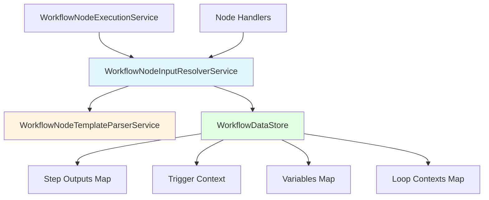

---
tags:
  - component/active
  - layer/service
  - architecture/component
Created: 2026-02-08
Updated: 2026-02-08
Domains:
  - "[[Workflows]]"
---
Part of [[State Management]]

# WorkflowNodeInputResolverService

---

## Purpose

Resolves template references in node configurations against the workflow datastore, enabling data flow between workflow nodes. Implements the `{{ path.to.data }}` template syntax that allows nodes to access outputs from previous nodes, trigger context, variables, and loop state.

---

## Responsibilities

**This component owns:**
- Parsing template syntax `{{ root.segment.path }}` in node input configurations
- Routing resolution based on root segment (steps, trigger, variables, loops)
- Traversing nested properties using dot notation
- Resolving embedded templates within strings (e.g., `"Hello {{ steps.user.name }}"`)
- Gracefully handling missing data (returns null, logs warnings)
- Throwing exceptions for invalid syntax or unrecognized root segments

**Explicitly NOT responsible for:**
- Template parsing (delegated to WorkflowNodeTemplateParserService)
- Managing the WorkflowDataStore (read-only consumer)
- Executing nodes or managing workflow state
- Type coercion or validation of resolved values

---

## Dependencies

### Internal Dependencies

|Component|Purpose|Coupling|
|---|---|---|
|[[WorkflowNodeTemplateParserService]]|Parses template syntax, extracts paths|High|
|[[WorkflowDataStore]]|Read-only access to workflow state (steps, trigger, variables, loops)|High|

### External Dependencies

|Service/Library|Purpose|Failure Impact|
|---|---|---|
|Kotlin Logging (KLogger)|Logging warnings for missing data|None (graceful degradation)|

### Injected Dependencies

```kotlin
@Service
class WorkflowNodeInputResolverService(
    private val workflowNodeTemplateParserService: WorkflowNodeTemplateParserService,
    private val logger: KLogger
)
```

---

## Consumed By

|Component|How It Uses This|Notes|
|---|---|---|
|[[WorkflowNodeExecutionService]]|Resolves node input configurations before execution|Critical path - node can't execute without resolved inputs|
|Various Node Handlers|Resolve dynamic values from workflow state|Each handler may call resolve() or resolveAll()|

---

## Public Interface

### Key Methods

#### `resolve(templateOrValue: Any?, dataStore: WorkflowDataStore): Any?`

- **Purpose:** Resolve a single value that may contain a template
- **When to use:** When you have a single input value to resolve
- **Side effects:** None (read-only)
- **Throws:** IllegalArgumentException for invalid template syntax or unrecognized root segment
- **Returns:** Resolved value from datastore, or original value if not a template, or null if data not found

```kotlin
fun resolve(
    templateOrValue: Any?,
    dataStore: WorkflowDataStore
): Any?
```

**Resolution logic:**
1. If value is not String: return as-is
2. Parse template syntax
3. If not a template: return raw value
4. If embedded template: resolve and substitute each template
5. If exact template: resolve path from datastore

#### `resolveAll(config: Map<String, Any?>, dataStore: WorkflowDataStore): Map<String, Any?>`

- **Purpose:** Recursively resolve all templates in a configuration map
- **When to use:** When resolving entire node input configurations
- **Side effects:** None (read-only)
- **Throws:** IllegalArgumentException for invalid template syntax
- **Returns:** New map with all templates resolved to values

```kotlin
fun resolveAll(
    config: Map<String, Any?>,
    dataStore: WorkflowDataStore
): Map<String, Any?>
```

**Recursive resolution:**
- Walks nested maps and lists
- Resolves String templates
- Preserves structure (nested maps remain nested)
- Passes through primitives unchanged

#### `resolveTemplatePath(path: List<String>, dataStore: WorkflowDataStore): Any?` (private)

- **Purpose:** Resolve a template path from the datastore
- **When to use:** Called internally by resolve() after parsing
- **Side effects:** None (read-only)
- **Throws:** IllegalArgumentException for empty path or invalid root segment
- **Returns:** Resolved value from datastore, or null if not found

**Root segment routing:**
- `steps` → resolveStepsPath()
- `trigger` → resolveTriggerPath()
- `variables` → resolveVariablesPath()
- `loops` → resolveLoopsPath()

#### `resolveStepsPath(path: List<String>, dataStore: WorkflowDataStore): Any?` (private)

- **Purpose:** Resolve path under "steps" prefix (node outputs)
- **When to use:** Template like `{{ steps.fetch_leads.output.email }}`
- **Side effects:** None (read-only)
- **Throws:** IllegalArgumentException if path missing node name
- **Returns:** Value from node output, or null if node not completed or field missing

**Format:** `steps.<nodeName>[.output].<field>...`
- Node name is required
- "output" segment is optional (backward compatibility)
- Traverses nested properties using dot notation
- Only resolves from COMPLETED nodes

#### `resolveTriggerPath(path: List<String>, dataStore: WorkflowDataStore): Any?` (private)

- **Purpose:** Resolve path under "trigger" prefix (workflow trigger context)
- **When to use:** Template like `{{ trigger.entity.name }}`
- **Side effects:** None (read-only)
- **Throws:** IllegalStateException if trigger not set
- **Returns:** Value from trigger context, or null if field missing

**Format:** `trigger.<property>...`

#### `resolveVariablesPath(path: List<String>, dataStore: WorkflowDataStore): Any?` (private)

- **Purpose:** Resolve path under "variables" prefix (user-defined variables)
- **When to use:** Template like `{{ variables.counter }}`
- **Side effects:** None (read-only)
- **Throws:** IllegalArgumentException if path missing variable name
- **Returns:** Variable value, or null if variable not set

**Format:** `variables.<name>[.<nestedProperty>...]`

#### `resolveLoopsPath(path: List<String>, dataStore: WorkflowDataStore): Any?` (private)

- **Purpose:** Resolve path under "loops" prefix (loop iteration context)
- **When to use:** Template like `{{ loops.processItems.currentItem.id }}`
- **Side effects:** None (read-only)
- **Throws:** IllegalArgumentException if path missing loop ID
- **Returns:** Loop context value, or null if loop not active

**Format:** `loops.<loopId>.<property>`
- Available properties: currentIndex, currentItem, totalItems, loopId

#### `resolveEmbeddedTemplates(parsed: ParsedTemplate, dataStore: WorkflowDataStore): String?` (private)

- **Purpose:** Resolve embedded templates within a larger string
- **When to use:** Template like `"Welcome to {{ trigger.entity.name }}"`
- **Side effects:** None (read-only)
- **Throws:** None (returns null on resolution failure)
- **Returns:** String with all templates replaced by resolved values, or null if any resolution fails

**Substitution:**
- Finds all `{{ }}` templates in string
- Resolves each template
- Converts resolved value to String (primitives only)
- Replaces placeholder with string value

#### `traverseProperty(current: Any?, segment: String, fullPath: List<String>): Any?` (private)

- **Purpose:** Helper to traverse a property on a value
- **When to use:** Called during path traversal
- **Side effects:** None (read-only)
- **Throws:** None (returns null on error)
- **Returns:** Property value, or null if not accessible

**Handles:**
- Map traversal: `current[segment]`
- Null values: return null
- Non-map values: log warning, return null

---

## Key Logic

### Core Algorithm / Business Rules

**Template Resolution Flow:**

```
1. Parse template syntax
   ├─> Not a template? Return raw value
   ├─> Embedded templates? Resolve each and substitute
   └─> Exact template? Continue to step 2

2. Extract path segments
   └─> Example: "{{ steps.fetch_leads.output.email }}"
       └─> ["steps", "fetch_leads", "output", "email"]

3. Route by root segment
   ├─> "steps" → resolveStepsPath()
   ├─> "trigger" → resolveTriggerPath()
   ├─> "variables" → resolveVariablesPath()
   ├─> "loops" → resolveLoopsPath()
   └─> Unknown → throw IllegalArgumentException

4. Traverse nested properties
   └─> For each segment after root:
       ├─> If current is Map: get segment value
       ├─> If current is null: return null
       └─> If current is other type: log warning, return null

5. Return resolved value
   └─> May be any type: String, Number, Boolean, Map, List, null
```

### Template Types

**Exact Templates:**
- Input: `"{{ steps.fetch_leads.output.email }}"`
- Returns resolved value as-is (any type)
- Example: `"user@example.com"`

**Embedded Templates:**
- Input: `"Welcome to {{ trigger.entity.name }}"`
- Resolves each template and replaces in string
- Returns final string with substitutions
- Example: `"Welcome to Acme Corp"`

**Multiple Embedded Templates:**
- Input: `"Hello {{ steps.user.name }}, you have {{ steps.inbox.count }} messages"`
- Resolves all templates
- Substitutes each placeholder
- Example: `"Hello John, you have 5 messages"`

### Supported Root Prefixes

|Prefix|Purpose|Example|Data Source|
|---|---|---|---|
|`steps`|Access completed node outputs|`{{ steps.nodeName.output.field }}`|dataStore.getStepOutput()|
|`trigger`|Access trigger context|`{{ trigger.entity.fieldName }}`|dataStore.getTrigger()|
|`variables`|Access user variables|`{{ variables.counter }}`|dataStore.getVariable()|
|`loops`|Access loop iteration context|`{{ loops.loopId.currentItem }}`|dataStore.getLoopContext()|

### Error Handling Strategy

**Errors (throw exception):**
- Invalid template syntax (parsing errors from parser service)
- Unrecognized root segment (not steps/trigger/variables/loops)
- Trigger not set when accessing `{{ trigger.* }}`
- Empty path or missing required segments

**Warnings (log + return null):**
- Node/variable/loop not found (may not have executed yet)
- Property not found in output (missing field)
- Type error (accessing property on non-map value)

This strategy enables graceful degradation:
- Syntax errors are caught at development time
- Missing data at runtime returns null (node may handle default)
- Logs provide debugging information

---

## Data Access

_This component does NOT access database directly - reads from in-memory WorkflowDataStore._

### Queries

|Query|Purpose|Performance Notes|
|---|---|---|
|dataStore.getStepOutput(nodeName)|Load node output for steps.* templates|O(1) map lookup|
|dataStore.getTrigger()|Load trigger context for trigger.* templates|O(1) reference|
|dataStore.getVariable(name)|Load variable for variables.* templates|O(1) map lookup|
|dataStore.getLoopContext(loopId)|Load loop context for loops.* templates|O(1) map lookup|

---

## Error Handling

### Errors Thrown

|Error/Exception|When|Expected Handling|
|---|---|---|
|IllegalArgumentException|Invalid template syntax (empty path, consecutive dots, invalid characters)|Propagate to caller - configuration error|
|IllegalArgumentException|Unrecognized root segment|Propagate to caller - configuration error|
|IllegalStateException|Trigger not set when resolving {{ trigger.* }}|Propagate to caller - workflow state error|

### Errors Handled

|Error/Exception|Source|Recovery Strategy|
|---|---|---|
|Node not found|dataStore.getStepOutput() returns null|Log warning, return null|
|Node not completed|stepOutput.status != COMPLETED|Log warning, return null|
|Property not found|Map traversal returns null|Log debug, return null|
|Type error|Accessing property on non-map|Log warning, return null|

---

## Observability

### Key Metrics

|Metric|Type|What It Indicates|
|---|---|---|
|Template resolution rate|Counter|How often templates are resolved|
|Resolution failures (null)|Counter|Missing data frequency|
|Resolution errors (exceptions)|Counter|Invalid configuration issues|

### Log Events

|Event|Level|When|Key Fields|
|---|---|---|---|
|Node not found in datastore|WARN|Node referenced but not in datastore|node name, available nodes|
|Node did not complete|WARN|Node status != COMPLETED|node name, status|
|Property not found|DEBUG|Property missing in output|segment, path|
|Cannot access property on non-map|WARN|Type error during traversal|segment, current type, path|
|Cannot convert to string for embedded template|WARN|Embedded template resolved to non-primitive|resolved type, placeholder|
|Failed to resolve embedded template|WARN|Embedded template resolution returns null|placeholder, string|

---

## Gotchas & Edge Cases

> [!warning] Template Resolution Returns Null for Missing Data
> Missing data is NOT an error - it returns null:
> - Node hasn't executed yet
> - Variable not set
> - Property doesn't exist in output
>
> **Why:** Enables conditional logic in nodes (e.g., "use default if null")
>
> **Watch out:** Null propagates through nested resolution - deep path returns null if any segment missing

> [!warning] Steps Resolution Only Works for COMPLETED Nodes
> Template like `{{ steps.fetch_leads.output.email }}` returns null if:
> - Node hasn't executed yet (not in datastore)
> - Node failed (status != COMPLETED)
> - Node is running (status == RUNNING)
>
> **Why:** Outputs only available after successful completion
>
> **Watch out:** Circular dependencies will always resolve to null (node A waits for node B, node B waits for node A)

> [!warning] Embedded Template Conversion to String
> Embedded templates like `"Count: {{ steps.node.output.count }}"` convert values to strings:
> - Numbers, Booleans: toString() called
> - Maps, Lists: toString() called (may not be readable)
> - If conversion fails: logs warning, continues with toString() result
>
> **Why:** String interpolation requires string values
>
> **Watch out:** Don't use embedded templates for complex objects - use exact templates instead

> [!warning] "output" Segment is Optional
> Templates can omit the "output" segment for backward compatibility:
> - `{{ steps.node.output.field }}` (explicit)
> - `{{ steps.node.field }}` (implicit - assumes output)
>
> Both resolve the same way. The code checks for "output" at position 1 and skips it if present.
>
> **Watch out:** If a future version adds other properties to NodeOutput (like "metadata"), the implicit syntax may become ambiguous

> [!warning] No Circular Reference Detection
> Circular references are NOT detected:
> - Node A: input uses `{{ steps.B.output.value }}`
> - Node B: input uses `{{ steps.A.output.value }}`
>
> **Result:** Both resolve to null (neither node completed yet)
>
> **Watch out:** Workflow graph validation should prevent circular dependencies at design time

### Known Limitations

- No type validation or coercion (resolved values passed as-is)
- No array indexing syntax (e.g., `{{ steps.node.output.items[0] }}` not supported)
- No operators or expressions (e.g., `{{ steps.node.output.count + 1 }}` not supported)
- No escaping mechanism (cannot include literal `{{` in strings)
- Template parsing does NOT validate that referenced nodes exist in workflow graph

### Thread Safety / Concurrency

**Thread-safe** with immutable datastore:
- No mutable state in resolver service
- WorkflowDataStore is read-only during resolution
- Multiple nodes can resolve templates concurrently
- Parser service is stateless

**Concurrency model:**
- Safe for concurrent use across nodes in parallel branches
- Each node execution has its own datastore snapshot
- No synchronization needed

---

## Flows Involved

|Flow|Role in Flow|
|---|---|
|[[Flow - Node Input Resolution]]|Implements template resolution step|
|[[Flow - Workflow Execution]]|Called during node preparation phase|

---

## Testing

### Unit Test Coverage

- **Location:** `src/test/kotlin/riven/core/service/workflow/state/WorkflowNodeInputResolverServiceTest.kt`
- **Key scenarios covered:**
  - Exact template resolution (steps, trigger, variables, loops)
  - Embedded template resolution (single and multiple)
  - Nested property traversal
  - Missing node returns null
  - Incomplete node returns null
  - Missing property returns null
  - Invalid root segment throws exception
  - Empty template throws exception
  - Trigger not set throws exception
  - Recursive resolution in maps and lists (resolveAll)

### Integration Test Notes

Integration tests should verify:
- Templates resolve correctly from actual WorkflowDataStore
- Resolved values pass to node handlers correctly
- Null handling in node execution
- Error messages are actionable

### How to Test Manually

1. Create workflow with node A that outputs data
2. Create node B that references node A output: `{{ steps.nodeA.output.field }}`
3. Execute workflow and verify node B receives resolved value
4. Check logs for resolution warnings if data missing

---

## Related

- [[State Management]] - Parent subdomain
- [[WorkflowNodeTemplateParserService]] - Parses template syntax
- [[WorkflowDataStore]] - Data source for resolution
- [[WorkflowNodeExecutionService]] - Consumes resolved inputs

---

## Dependency Diagram



---

## Resolution Examples

### Example 1: Steps Template

```kotlin
// Template
"{{ steps.fetch_leads.output.email }}"

// Path segments
["steps", "fetch_leads", "output", "email"]

// Resolution
1. Root: "steps" → resolveStepsPath()
2. Load step output for "fetch_leads"
3. Check status == COMPLETED
4. Navigate: output.email
5. Return: "user@example.com"
```

### Example 2: Embedded Template

```kotlin
// Template
"Welcome to {{ trigger.entity.name }}"

// Resolution
1. Detect embedded template
2. Extract: ["trigger", "entity", "name"]
3. Resolve: resolveTriggerPath() → "Acme Corp"
4. Substitute: "Welcome to Acme Corp"
5. Return string
```

### Example 3: Nested Map Resolution (resolveAll)

```kotlin
// Input config
{
  "email": "{{ steps.fetch_leads.output.email }}",
  "body": {
    "greeting": "Hello {{ variables.userName }}"
  }
}

// Resolution
1. Resolve "email" → "user@example.com"
2. Recurse into "body" map
3. Resolve "greeting" → "Hello John"
4. Return resolved map:
   {
     "email": "user@example.com",
     "body": {
       "greeting": "Hello John"
     }
   }
```

---

## Changelog

|Date|Change|Reason|
|---|---|---|
|2026-02-08|Initial documentation|Phase 1 - Workflows domain documentation|
