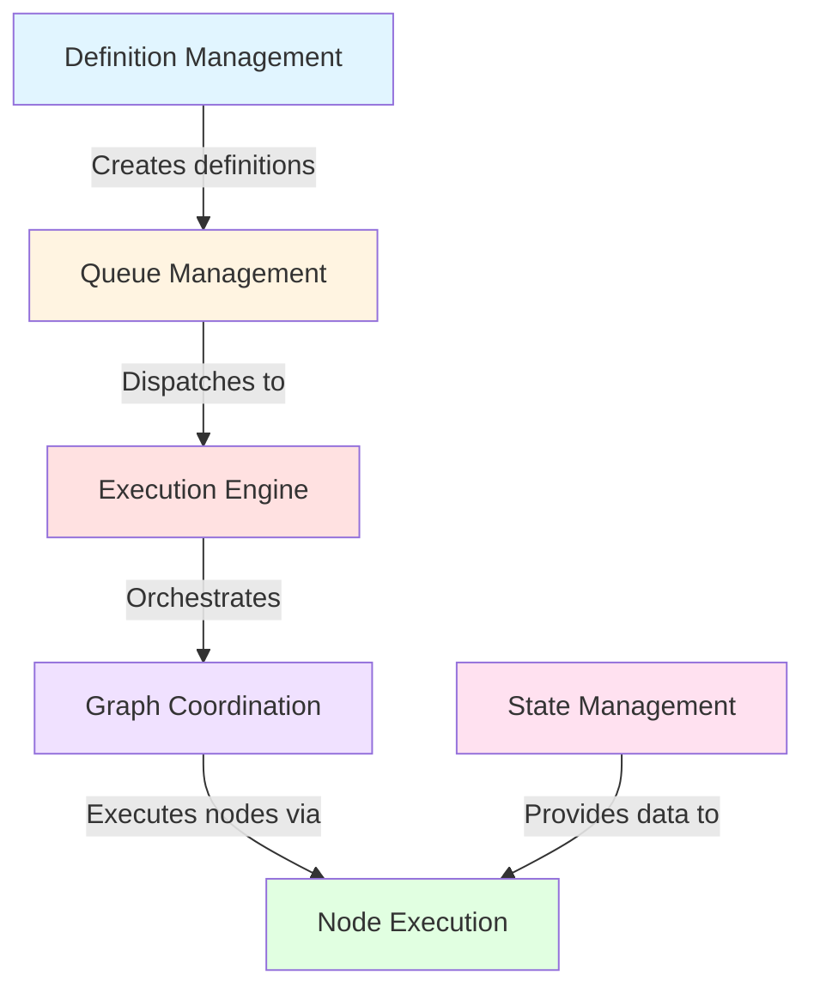

---
tags:
  - architecture/domain
  - domain/workflow
Created: 2024-02-01
---
# Domain: Workflows

---

## Overview

The Workflows domain provides a DAG-based workflow execution engine that enables users to build and execute complex, multi-step automations. It leverages Temporal.io for durable orchestration, allowing workflows to survive service restarts and handle long-running operations. Workflow definitions consist of nodes (triggers, actions, controls, utilities) connected via edges that define dependencies and data flow.

---

## Boundaries

### This Domain Owns

- Workflow definitions (DAG structure, nodes, edges, metadata)
- Execution lifecycle management (start, pause, complete, fail)
- Node execution logic (polymorphic node config system, service injection)
- DAG graph coordination (validation, topological sorting, in-degree tracking, execution loop)
- Queue management (execution request queuing, scheduled dispatch, capacity-aware processing)
- Input resolution and templating (`{{ }}` syntax, expression evaluation, entity context loading)
- Temporal integration (workflow registration, activity dispatch, completion handling)
- Execution state persistence (data registry, node outputs, execution records)

### This Domain Does NOT Own

- Entity CRUD operations (delegated to Entities domain via node actions)
- User authentication and session management (handled by Workspaces domain)
- Workspace scoping enforcement (enforced via RLS policies, not domain logic)
- Block operations (delegated to Blocks domain, though may be invoked via workflow nodes)
- External system integrations (integrations are consumed via HTTP action nodes)

---

## Sub-Domains

| Sub-Domain | Purpose |
|---|---|
| [[Execution Engine]] | Temporal workflow orchestration, activity coordination, completion handling |
| [[Queue Management]] | Execution request queuing, scheduled dispatch, capacity-aware processing |
| [[Graph Coordination]] | DAG validation, topological sorting, in-degree tracking, execution loop |
| [[Node Execution]] | Polymorphic node config system, service injection, node type registry |
| [[State Management]] | Template parsing, expression evaluation, input resolution, entity context |
| [[Definition Management]] | Workflow definition CRUD, graph building, execution record management |

### Integrations

|Component|External System|
|---|---|
| [[TemporalWorkerConfiguration]] | Temporal Server |

---

## Flows

| Flow | Type | Description |
|---|---|---|
| [[Flow - Workflow Execution]] | User-facing | API trigger -> queue -> Temporal -> DAG execution -> completion |
| [[Flow - Queue Processing]] | Background | Scheduled queue polling, claiming, capacity check, Temporal dispatch |

---

## Data

### Owned Entities

|Entity|Purpose|Key Fields|
|---|---|---|
| WorkflowDefinition | Workflow metadata and configuration | id, workspace_id, name, description, trigger_config |
| WorkflowExecution | Execution instance records | id, definition_id, status, temporal_workflow_id, started_at, completed_at |
| WorkflowNode | Node definitions within a workflow | id, definition_id, type, config (JSONB), position |
| WorkflowEdge | Edges connecting nodes | id, definition_id, source_node_id, target_node_id |
| ExecutionQueue | Queued execution requests | id, workspace_id, definition_id, status, claimed_at, dispatched_at |

### Database Tables

|Table|Entity|Notes|
|---|---|---|
| workflow_definitions | WorkflowDefinition | Contains JSONB trigger config |
| workflow_executions | WorkflowExecution | Tracks execution status and Temporal workflow IDs |
| workflow_nodes | WorkflowNode | Polymorphic config stored as JSONB |
| workflow_edges | WorkflowEdge | Defines DAG structure |
| workflow_execution_queue | ExecutionQueue | State machine: PENDING -> CLAIMED -> DISPATCHED |

---

## External Dependencies

|Dependency|Purpose|Failure Impact|
|---|---|---|
| Temporal Server | Workflow orchestration, durable execution, activity dispatch | All workflow executions stop; queued items remain pending |
| ShedLock | Distributed lock for queue dispatch scheduler | Multiple pods may process same queue items, causing duplicate executions |

---

## Domain Interactions

### Depends On

|Domain|What We Need|How We Access|
|---|---|---|
| [[Entities]] | Entity CRUD operations for node actions (create, update, delete, query) | Direct service calls from node config implementations |
| [[Workspaces]] | Workspace scoping, capacity tier enforcement | PostgreSQL RLS policies, service-level capacity checks |

### Consumed By

|Domain|What They Need|How They Access|
|---|---|---|
| API consumers | Workflow management endpoints (definitions, executions, graph operations) | REST controllers (WorkflowDefinitionController, WorkflowExecutionController, WorkflowGraphController) |

---

## Service Summary

| Subdomain | Service | Purpose |
|---|---|---|
| Execution Engine | [[WorkflowOrchestrationService]] | Temporal workflow — DAG lifecycle orchestration |
| Execution Engine | [[WorkflowCoordinationService]] | Temporal activity — node execution coordination |
| Execution Engine | [[WorkflowGraphCoordinationService]] | DAG execution loop with pull-based scheduling |
| Execution Engine | [[WorkflowCompletionActivityImpl]] | Records final execution status |
| Queue Management | [[WorkflowExecutionQueueService]] | Queue state transitions and persistence |
| Queue Management | [[WorkflowExecutionDispatcherService]] | Scheduled queue polling with ShedLock |
| Queue Management | [[WorkflowExecutionQueueProcessorService]] | Per-item processing with isolated transactions |
| Graph Coordination | [[WorkflowGraphValidationService]] | DAG cycle detection, edge validation, connectivity |
| Graph Coordination | [[WorkflowGraphTopologicalSorterService]] | Kahn's algorithm topological sort |
| Graph Coordination | [[WorkflowGraphQueueManagementService]] | In-degree tracking and ready queue |
| Node Execution | [[WorkflowNodeConfig]] | Sealed interface — polymorphic node execution |
| Node Execution | [[WorkflowNodeConfigRegistry]] | Node type discovery and registration |
| Node Execution | [[WorkflowNodeServiceInjectionProvider]] | Lazy Spring service injection for nodes |
| State Management | [[WorkflowNodeInputResolverService]] | Template resolution against data registry |
| State Management | [[WorkflowNodeTemplateParserService]] | {{ }} template syntax parsing |
| State Management | [[WorkflowNodeExpressionEvaluatorService]] | Expression evaluation for conditions |
| State Management | [[EntityContextService]] | Entity data loading for workflow context |
| Definition Management | [[WorkflowDefinitionService]] | Definition CRUD operations |
| Definition Management | [[WorkflowGraphService]] | Graph node/edge management |
| Definition Management | [[WorkflowExecutionService]] | Execution lifecycle and status queries |

---

## Subdomain Navigation

---

## Key Decisions

|Decision|Summary|
|---|---|
| Temporal for durable execution | Chose Temporal.io over custom state machine for workflow durability, retry logic, and long-running operation support |
| DAG-based execution model | Workflows are directed acyclic graphs rather than sequential steps, enabling parallel node execution |
| Queue-mediated dispatch | Execution requests are queued and processed by a scheduled dispatcher, decoupling API requests from Temporal dispatch and enabling capacity checks |
| Polymorphic node config | Sealed interface with subtypes for different node types (trigger, action, control, utility), enabling compile-time type safety |
| Template-based data flow | Node inputs resolved via `{{ steps.node_id.output.field }}` syntax, enabling declarative data passing between nodes |

---

## Technical Debt

|Issue|Impact|Effort|
|---|---|---|
| Sequential batch execution — nodes in same batch execute sequentially, not truly parallel | Medium | High |
| No loops or switch/case in control flow — only binary conditions supported | High | High |
| Template-only expressions — no complex transformations, array indexing, or arithmetic | Medium | Medium |
| No partial failure recovery — one node failure = entire workflow failure | High | High |
| WorkflowGraphQueueManagementService holds mutable state — not thread-safe | Medium | Medium |
| No workflow pausing for human approval — WorkflowHumanInteractionConfig is a stub | High | High |
| Fixed batch size — not adaptive to load | Low | Low |
| No rate limiting per workspace — fair-use enforcement is coarse | Medium | Medium |

---

## Recent Changes

| Date | Change | Feature/ADR |
| ---- | ------ | ----------- |
|      |        | [[]]        |
