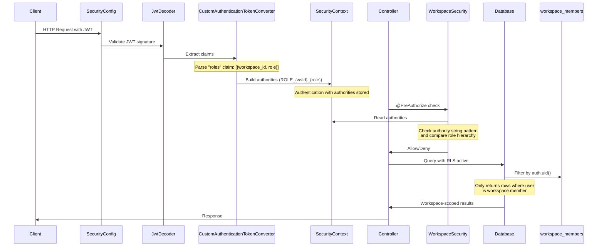

---
tags:
  - component/active
  - layer/configuration
  - architecture/component
Created: 2026-02-08
Updated: 2026-02-08
Domains:
  - "[[Workspaces & Users]]"
---
# WorkspaceSecurity

Part of [[Auth & Authorization]]

---

## Purpose

Central authorization component that provides workspace-scoped role checking for Spring Security @PreAuthorize expressions. Every protected endpoint in the application uses WorkspaceSecurity to verify the caller has appropriate workspace membership and role level.

---

## Responsibilities

**What this component owns:**
- Verify workspace membership from Spring Security authorities
- Compare roles against the OWNER > ADMIN > MEMBER hierarchy using numeric authority levels
- Provide fine-grained permission checks (exact role, role-or-higher, higher-than)
- Support member update authorization (owner override + admin-only-for-lower-roles)
- Enable self-identification check for member-specific operations

**Explicitly NOT responsible for:**
- JWT decoding (handled by [[TokenDecoder]])
- Authority extraction from JWT claims (handled by CustomAuthenticationTokenConverter)
- Database-level row-level security (PostgreSQL RLS policies)
- User authentication (handled by [[SecurityConfig]])
- Token validation (Spring Security JWT decoder)

---

## Dependencies

### Internal Dependencies

| Component | Purpose | Coupling |
|---|---|---|
| Spring SecurityContextHolder | Reads authentication context to extract authorities | High |
| [[WorkspaceRoles]] enum | Authority comparison via numeric authority field | High |
| [[WorkspaceMember]] model | Used in isUpdatingWorkspaceMember for role checking | Medium |

### External Dependencies

| Service/Library | Purpose | Failure Impact |
|---|---|---|
| Spring Security | Authentication context access | All authorization checks fail |

### Injected Dependencies

```kotlin
// Spring Component - no constructor injection
// Accesses SecurityContextHolder statically
@Component
class WorkspaceSecurity
```

---

## Consumed By

| Component | How It Uses This | Notes |
|---|---|---|
| WorkspaceService | @PreAuthorize checks on workspace CRUD operations | hasWorkspace, hasWorkspaceRoleOrHigher |
| WorkspaceInviteService | @PreAuthorize checks on invitation management | Compound: hasWorkspace AND hasWorkspaceRoleOrHigher |
| EntityTypeService | @PreAuthorize checks on entity type operations | hasWorkspace |
| EntityService | @PreAuthorize checks on entity CRUD operations | hasWorkspace |
| WorkflowDefinitionService | @PreAuthorize checks on workflow CRUD | hasWorkspace |
| WorkflowGraphService | @PreAuthorize checks on workflow graph operations | hasWorkspace |
| BlockService | @PreAuthorize checks on block operations | hasWorkspace |
| BlockTypeService | @PreAuthorize checks on block type operations | hasWorkspace |
| BlockEnvironmentService | @PreAuthorize checks on environment operations | hasWorkspace |

---

## Public Interface

### Key Methods

#### `hasWorkspace(workspaceId: UUID): Boolean`

- **Purpose:** Checks if the authenticated user has ANY role in the specified workspace
- **When to use:** Most common check - verifies basic workspace access before allowing read operations
- **Side effects:** None - reads from SecurityContext
- **Throws:** None - returns false if authentication is missing or user not a member

Authority format checked: Any authority starting with `ROLE_{workspaceId}` (matches OWNER, ADMIN, or MEMBER)

```kotlin
fun hasWorkspace(workspaceId: UUID): Boolean {
    SecurityContextHolder.getContext().authentication.let {
        if (it == null || !it.isAuthenticated) return false
        if (it.authorities.isEmpty()) return false
        return it.authorities.any { claim -> claim.authority.startsWith("ROLE_$workspaceId") }
    }
}
```

#### `hasWorkspaceRole(workspaceId: UUID, role: WorkspaceRoles): Boolean`

- **Purpose:** Checks if the user has an EXACT role match in the workspace
- **When to use:** When operation requires a specific role (rare - most operations use role-or-higher)
- **Side effects:** None
- **Throws:** None - returns false if role doesn't match exactly

Authority format checked: Exact match `ROLE_{workspaceId}_{ROLE}` (e.g., `ROLE_abc-123_ADMIN`)

```kotlin
fun hasWorkspaceRole(workspaceId: UUID, role: WorkspaceRoles): Boolean {
    val authority: String = "ROLE_${workspaceId}_$role"
    SecurityContextHolder.getContext().authentication.let {
        if (it == null || !it.isAuthenticated) return false
        if (it.authorities.isEmpty()) return false
        return it.authorities.any { claim -> claim.authority == authority }
    }
}
```

#### `hasWorkspaceRoleOrHigher(workspaceId: UUID, targetRole: WorkspaceRoles): Boolean`

- **Purpose:** Checks if user's role authority level >= target role authority level
- **When to use:** Most role-based checks - OWNER can do anything ADMIN/MEMBER can do, ADMIN can do anything MEMBER can do
- **Side effects:** None
- **Throws:** None - returns false if authority level insufficient

Uses numeric comparison: OWNER(3) >= ADMIN(2) >= MEMBER(1)

```kotlin
fun hasWorkspaceRoleOrHigher(workspaceId: UUID, targetRole: WorkspaceRoles): Boolean {
    val claim: String = SecurityContextHolder.getContext().authentication.let {
        if (it == null || !it.isAuthenticated) return false
        if (it.authorities.isEmpty()) return false
        it.authorities.firstOrNull { claim ->
            claim.authority.startsWith("ROLE_$workspaceId")
        } ?: return false
    }.toString()

    return WorkspaceRoles.fromString(claim.removePrefix("ROLE_${workspaceId}_"))
        .authority >= targetRole.authority
}
```

#### `hasHigherWorkspaceRole(workspaceId: UUID, targetRole: WorkspaceRoles): Boolean`

- **Purpose:** Checks if user's role authority level > target role authority level (strict greater-than, not inclusive)
- **When to use:** Ensuring admin can only modify members with LOWER roles (not peers)
- **Side effects:** None
- **Throws:** None - returns false if authority level not strictly higher

Uses strict numeric comparison: OWNER(3) > ADMIN(2), but ADMIN(2) > ADMIN(2) is FALSE

```kotlin
fun hasHigherWorkspaceRole(workspaceId: UUID, targetRole: WorkspaceRoles): Boolean {
    val claim: String = SecurityContextHolder.getContext().authentication.let {
        if (it == null || !it.isAuthenticated) return false
        if (it.authorities.isEmpty()) return false
        it.authorities.firstOrNull { claim ->
            claim.authority.startsWith("ROLE_$workspaceId")
        } ?: return false
    }.toString()

    return WorkspaceRoles.fromString(claim.removePrefix("ROLE_${workspaceId}_"))
        .authority > targetRole.authority
}
```

#### `isUpdatingWorkspaceMember(workspaceId: UUID, user: WorkspaceMember): Boolean`

- **Purpose:** Complex permission check for member role changes and removal
- **When to use:** Before allowing role updates or member removal operations
- **Side effects:** None - combines calls to hasWorkspaceRole and hasHigherWorkspaceRole
- **Throws:** None

**Permission logic:**
- OWNER can update anyone
- ADMIN can update only members with LOWER role (MEMBER only, not other ADMINs or OWNER)

```kotlin
fun isUpdatingWorkspaceMember(workspaceId: UUID, user: WorkspaceMember): Boolean {
    return this.hasWorkspaceRole(workspaceId, WorkspaceRoles.OWNER) ||
           (this.hasWorkspaceRoleOrHigher(workspaceId, WorkspaceRoles.ADMIN) &&
            this.hasHigherWorkspaceRole(workspaceId, user.role))
}
```

#### `isUpdatingSelf(memberId: UUID): Boolean`

- **Purpose:** Checks if the authenticated user's JWT `sub` claim matches the target memberId
- **When to use:** Self-service operations (user updating their own profile, leaving workspace)
- **Side effects:** None - reads JWT principal from SecurityContext
- **Throws:** None - returns false if principal is not a JWT or sub claim doesn't match

```kotlin
fun isUpdatingSelf(memberId: UUID): Boolean {
    return SecurityContextHolder.getContext().authentication.principal.let {
        if (it !is Jwt) return false
        it.claims["sub"]
    } == memberId.toString()
}
```

---

## Role Hierarchy

WorkspaceRoles uses a numeric authority system for role comparison:

| Role | Authority Level | Description |
|---|---|---|
| OWNER | 3 | Full workspace control, can manage all members and settings, transfer ownership |
| ADMIN | 2 | Can manage members with lower roles, manage invitations, full access to workspace resources |
| MEMBER | 1 | Basic workspace access, can view and use workspace resources |

**Authority Comparison Logic:**

- `hasWorkspaceRoleOrHigher` uses `>=` comparison: OWNER(3) >= ADMIN(2) is TRUE, ADMIN(2) >= ADMIN(2) is TRUE
- `hasHigherWorkspaceRole` uses `>` comparison: OWNER(3) > ADMIN(2) is TRUE, ADMIN(2) > ADMIN(2) is FALSE

This enables hierarchical permission checks where higher roles inherit all permissions of lower roles, while strict greater-than checks prevent admins from modifying peer admins.

---

## Permission Matrix

What each role can do across workspace operations:

| Operation | MEMBER | ADMIN | OWNER |
|---|---|---|---|
| View workspace | Yes | Yes | Yes |
| Create/update workspace | Yes | Yes | Yes |
| Delete workspace | No | No | Yes |
| View workspace members | Yes | Yes | Yes |
| Invite members | No | Yes | Yes |
| Remove members | No | Yes (lower roles only) | Yes |
| Update member roles | No | Yes (lower roles only) | Yes |
| Revoke invitations | No | Yes | Yes |
| Transfer ownership | No | No | Yes |
| View workspace invites | No | Yes | Yes |

**Key constraints:**
- ADMIN can only modify members with role < ADMIN (i.e., MEMBER users only)
- ADMIN cannot remove/modify other ADMINs or the OWNER
- Only OWNER can delete the workspace or transfer ownership
- All roles can view and use workspace resources (entities, workflows, blocks)

---

## @PreAuthorize Pattern Catalog

Real expressions from the codebase showing how controllers and services use WorkspaceSecurity:

### `@PreAuthorize("@workspaceSecurity.hasWorkspace(#workspaceId)")`

**Meaning:** User must be a member of the workspace (any role)

**Used by:**
- WorkspaceService.getWorkspaceById()
- WorkspaceService.getEntityById()
- WorkspaceInviteService.getWorkspaceInvites()
- EntityTypeService (all CRUD operations)
- EntityService (all CRUD operations)
- WorkflowDefinitionService (all CRUD operations)
- WorkflowGraphService (all CRUD operations)
- BlockService (all CRUD operations)
- BlockTypeService.createBlockType()
- BlockEnvironmentService (multiple operations)

**Pattern:** Most common check - verifies basic workspace membership before allowing access.

### `@PreAuthorize("@workspaceSecurity.hasWorkspaceRoleOrHigher(#workspaceId, 'OWNER')")`

**Meaning:** User must be OWNER of the workspace

**Used by:**
- WorkspaceService.deleteWorkspace()

**Pattern:** Restricts destructive operations to workspace owners only.

### `@PreAuthorize("@workspaceSecurity.hasWorkspace(#workspaceId) and @workspaceSecurity.hasWorkspaceRoleOrHigher(#workspaceId, 'ADMIN')")`

**Meaning:** User must be a member AND have ADMIN or OWNER role

**Used by:**
- WorkspaceInviteService.createInvitation()
- WorkspaceInviteService.revokeInvitation()

**Pattern:** Compound expression for admin-level operations. The `hasWorkspace` check is technically redundant (hasWorkspaceRoleOrHigher implies membership) but makes intent explicit.

### `@PreAuthorize("isAuthenticated()")`

**Meaning:** User must be authenticated (not workspace-specific)

**Used by:**
- WorkflowGraphController (endpoints)
- WorkflowExecutionController (endpoints)
- WorkflowDefinitionController (endpoints)

**Pattern:** Controller-level authentication check. Workspace-specific checks happen at service layer.

---

## RLS Mechanism

WorkspaceSecurity provides application-layer authorization, but PostgreSQL Row-Level Security (RLS) provides defense-in-depth at the database layer.

**How workspace scoping works at the database level:**

1. **RLS-protected tables:** All tenant-scoped tables have `workspace_id` column and RLS enabled
   - `workspaces`
   - `entities`, `entity_types`, `entity_relationships`
   - `blocks`, `block_types`
   - `workflow_definitions`, `workflow_graphs`

2. **The workspace_members pivot table:** Connects users to workspaces with their roles
   ```sql
   CREATE TABLE workspace_members (
       workspace_id UUID REFERENCES workspaces(id),
       user_id UUID REFERENCES users(id),
       role VARCHAR(10) -- OWNER, ADMIN, MEMBER
   );
   ```

3. **SELECT policy pattern:** Only return rows where user is a workspace member
   ```sql
   CREATE POLICY "entities_select_by_org" ON entities
       FOR SELECT
       TO authenticated
       USING (
           workspace_id IN (
               SELECT workspace_id
               FROM workspace_members
               WHERE user_id = auth.uid()
           )
       );
   ```

4. **WRITE policy pattern:** Same check for INSERT/UPDATE/DELETE
   ```sql
   CREATE POLICY "entities_write_by_org" ON entities
       FOR ALL
       TO authenticated
       USING (
           workspace_id IN (
               SELECT workspace_id
               FROM workspace_members
               WHERE user_id = auth.uid()
           )
       );
   ```

5. **auth.uid() function:** PostgreSQL function (provided by Supabase) that returns the authenticated user's UUID from the JWT

**Defense-in-depth architecture:**

> [!warning] RLS provides defense-in-depth
> @PreAuthorize checks at the application layer prevent unnecessary database queries and provide role-level granularity (OWNER vs ADMIN vs MEMBER). RLS at the database layer prevents data leakage if application checks are bypassed (SQL injection, misconfigured controller, compromised service). Both layers are essential.

---

## Simplified Auth Flow Diagram

Shows JWT decode -> authority extraction -> PreAuthorize check flow:



**Key stages:**

1. **JWT Validation:** Spring Security's JwtDecoder verifies signature using JWT secret key
2. **Authority Extraction:** CustomAuthenticationTokenConverter parses `roles` claim and builds Spring authorities in format `ROLE_{workspaceId}_{ROLE}`
3. **Application Authorization:** WorkspaceSecurity checks @PreAuthorize expressions by reading authorities from SecurityContext and comparing role hierarchy
4. **Database Authorization:** PostgreSQL RLS filters queries using `auth.uid()` function and workspace_members table

> [!note] Phase 4 will expand this
> A full end-to-end Architecture Flow doc will be created in Phase 4 that covers token generation (AuthTokenService), refresh token rotation, workspace switching, and error handling.

---

## Key Logic

### Authority String Format

All workspace authorities use the format: `ROLE_{workspaceId}_{ROLE}`

**Examples:**
- `ROLE_550e8400-e29b-41d4-a716-446655440000_OWNER`
- `ROLE_550e8400-e29b-41d4-a716-446655440000_ADMIN`
- `ROLE_550e8400-e29b-41d4-a716-446655440000_MEMBER`

**How it's parsed:**

```kotlin
// hasWorkspace: prefix match
claim.authority.startsWith("ROLE_$workspaceId")

// hasWorkspaceRole: exact match
claim.authority == "ROLE_${workspaceId}_$role"

// hasWorkspaceRoleOrHigher: extract role, compare numerically
val roleString = claim.authority.removePrefix("ROLE_${workspaceId}_")
val userRole = WorkspaceRoles.fromString(roleString)
userRole.authority >= targetRole.authority
```

### Permission Evaluation

All methods follow the same pattern:

1. **Check authentication:** Return false if SecurityContext has no authentication or user not authenticated
2. **Check authorities exist:** Return false if authorities collection is empty
3. **Find matching authority:** Search authorities for workspace-specific pattern
4. **Apply role logic:** Compare roles numerically or check exact match

No exceptions are thrown - all methods return false when authorization fails, allowing Spring Security to handle the 403 Forbidden response.

---

## Gotchas & Edge Cases

> [!warning] No JWT principal check in most methods
> Most methods only check authorities, not the JWT principal. The `isUpdatingSelf` method is the exception - it explicitly casts principal to Jwt and reads the `sub` claim. This means hasWorkspace/hasWorkspaceRole checks work regardless of how authorities were populated.

### Known Limitations

- **No caching:** Every @PreAuthorize call reads from SecurityContext (fast in-memory lookup, but not cached)
- **Authority string coupling:** Changes to authority format (ROLE_{wsId}_{role}) would require updates to all string parsing logic
- **No method-level permission differentiation:** RLS policies don't distinguish between OWNER/ADMIN/MEMBER at database level - all workspace members can read/write. Fine-grained control is application-layer only.

### Common Mistakes

- **Using hasWorkspaceRole instead of hasWorkspaceRoleOrHigher:** Most operations should allow higher roles (OWNER can do what ADMIN can do). Exact role match is rarely needed.
- **Forgetting compound expressions:** Admin-only operations need `hasWorkspace AND hasWorkspaceRoleOrHigher` to be explicit (though hasWorkspaceRoleOrHigher implies membership).
- **Checking isUpdatingSelf without workspace check:** Self-service operations may need BOTH workspace membership AND self-identification checks.

### Thread Safety / Concurrency

- **Thread-safe:** SecurityContextHolder uses ThreadLocal storage, so concurrent requests don't interfere
- **Request-scoped:** Authentication is populated per-request by Spring Security filter chain
- **No mutable state:** WorkspaceSecurity has no instance fields, all methods are stateless

---

## Related

- [[WorkspaceRoles]] - Role enum with numeric authority levels
- [[SecurityConfig]] - Spring Security configuration that enables @PreAuthorize
- [[CustomAuthenticationTokenConverter]] - Extracts authorities from JWT
- [[WorkspaceMember]] - Model used in isUpdatingWorkspaceMember
- [[Auth & Authorization]] - Parent subdomain
