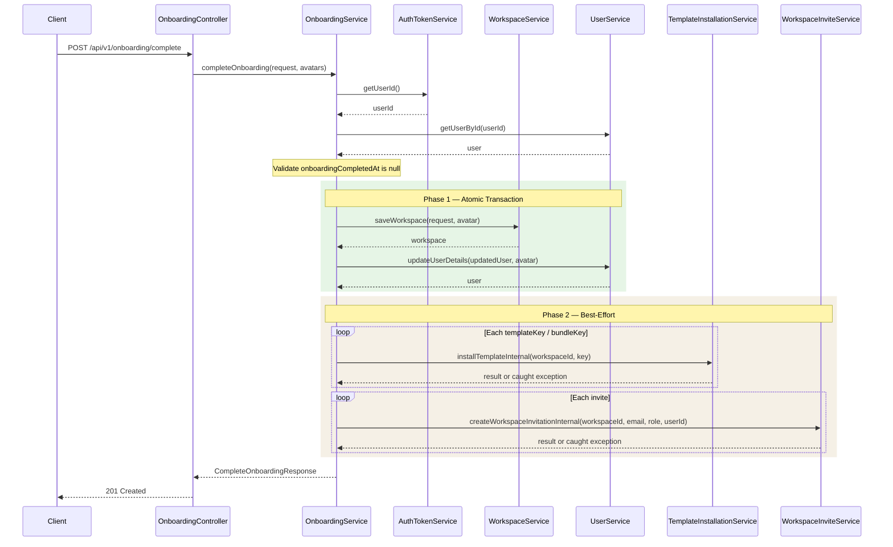

---
tags:
  - flow/api
  - architecture/flow
  - domain/workspace
Domains:
  - "[[Workspaces & Users]]"
Created: 2026-03-12
---
# Flow: User Onboarding

## Overview

API-triggered flow that provisions a complete workspace environment for a newly authenticated user in a single request. Combines workspace creation, user profile setup, catalog template installation, and team invitation sending into one orchestrated operation with two-phase failure semantics.

---

## Trigger

`POST /api/v1/onboarding/complete` -- multipart request containing JSON body (`CompleteOnboardingRequest`) with optional `profileAvatar` and `workspaceAvatar` file parts.

## Entry Point

[[OnboardingService]]

---

## Steps

1. **OnboardingController** receives the multipart request, validates the JSON body via `@Valid`, and delegates to [[OnboardingService]]
2. **OnboardingService** retrieves the current user ID from JWT via [[AuthTokenService]] and validates onboarding eligibility (checks `user.onboardingCompletedAt` is null; throws `ConflictException` if already completed)
3. **Phase 1 (atomic transaction):** Inside a `TransactionTemplate.execute` block:
   - Creates workspace (with optional avatar) via [[WorkspaceService]], which assigns OWNER membership to the current user
   - Updates user profile (name, phone, default workspace, `onboardingCompletedAt` timestamp) via [[UserService]], with optional profile avatar upload
   - Logs an `ONBOARDING / CREATE` activity with workspace and profile details
4. **Phase 2 (best-effort, after commit):**
   - Iterates `templateKeys` and `bundleKeys`, installing each via [[TemplateInstallationService]] `*Internal` methods with individual try/catch -- failures produce `TemplateInstallResult` entries with `success = false` and error message
   - Iterates `invites`, sending each via [[WorkspaceInviteService]] `createWorkspaceInvitationInternal` with pre-validation (rejects self-invite and OWNER role) and individual try/catch -- failures produce `InviteResult` entries with `success = false` and error message
5. Returns `CompleteOnboardingResponse` containing the created `Workspace`, updated `User`, and lists of `TemplateInstallResult` and `InviteResult`

---

## Failure Modes

| What Fails | Phase | Impact | Recovery |
|---|---|---|---|
| User already onboarded (`onboardingCompletedAt` is set) | Pre-check | `409 Conflict` returned, no side effects | None needed -- onboarding is a one-time operation |
| Workspace creation fails | Phase 1 | Entire Phase 1 rolls back, no workspace or profile changes persist | Client retries the request |
| User profile update fails | Phase 1 | Entire Phase 1 rolls back, no workspace or profile changes persist | Client retries the request |
| Single template/bundle installation fails | Phase 2 | Failed item returned with `success = false`, other items continue | Client can install failed templates manually via catalog endpoints |
| Single invitation fails | Phase 2 | Failed invite returned with `success = false`, other invites continue | Client can send failed invitations manually via invite endpoints |
| AuthTokenService cannot extract user ID | Pre-check | `401 Unauthorized` | Client must re-authenticate |

---

## The `*Internal` Method Pattern

During onboarding, the newly created workspace does not exist in the user's JWT claims. Standard service methods like `installTemplate` and `createWorkspaceInvitation` are guarded by `@PreAuthorize("@workspaceSecurity.hasWorkspace(#workspaceId)")`, which would reject the call because the JWT was issued before the workspace existed.

The `*Internal` variants (`installTemplateInternal`, `installBundleInternal`, `createWorkspaceInvitationInternal`) contain the same business logic but omit the `@PreAuthorize` annotation, allowing OnboardingService to operate on the just-created workspace. These methods are not exposed via controllers -- they exist solely for trusted internal callers like the onboarding flow.

---

## Components Involved

- [[OnboardingService]]
- [[WorkspaceService]]
- [[UserService]]
- [[TemplateInstallationService]]
- [[WorkspaceInviteService]]
- [[AuthTokenService]]
