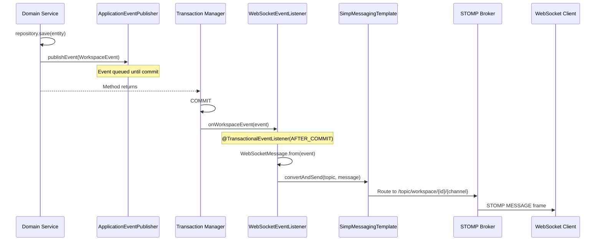

---
tags:
  - flow/internal
  - architecture/flow
  - domain/websocket
Domains:
  - "[[Workspaces & Users]]"
Created: 2026-03-14
---
# Flow: Domain Event Broadcasting

## Overview

Internal cross-domain flow that propagates domain mutations from service methods to connected WebSocket clients. Uses Spring's application event system with transactional guarantees — events are only broadcast after the publishing transaction commits successfully.

---

## Trigger

Any `@Transactional` service method that calls `applicationEventPublisher.publishEvent(WorkspaceEvent)`.

## Entry Point

The publishing service (e.g. [[EntityService]], [[WorkspaceService]], BlockEnvironmentService).

---

## Steps

1. **Domain service** performs a mutation (create/update/delete) inside a `@Transactional` method
2. **Domain service** constructs a `WorkspaceEvent` subtype with workspace context, operation type, and summary data
3. **Domain service** calls `applicationEventPublisher.publishEvent(event)` — Spring queues the event
4. **Spring transaction manager** commits the transaction
5. **WebSocketEventListener** receives the event via `@TransactionalEventListener(phase = AFTER_COMMIT)`
6. **WebSocketEventListener** resolves the STOMP topic via `WebSocketChannel.topicPath(workspaceId, channel)`
7. **WebSocketEventListener** converts the event to `WebSocketMessage.from(event)` (adds timestamp)
8. **SimpMessagingTemplate** sends the message to all subscribers of the topic
9. **Spring's simple broker** delivers the message to connected STOMP clients subscribed to that topic

---

## Failure Modes

| What Fails | Impact | Recovery |
|---|---|---|
| Transaction rolls back | Event is never delivered to listener — no WebSocket message sent | Correct behavior: clients see no change because no change persisted |
| No clients subscribed to topic | Message is sent to broker but discarded — no error | None needed: fire-and-forget by design |
| WebSocket client disconnected | Broker removes subscription — missed messages are not replayed | Client must refetch state on reconnect |
| SimpMessagingTemplate throws | Exception logged but does not propagate to the original service (event fires after commit) | Message lost; client state stale until next event or manual refresh |

---

## Cross-Domain Interactions

| Publishing Domain | Service | Event Type | Channel |
|---|---|---|---|
| Entities | [[EntityService]] | `EntityEvent` | ENTITIES |
| Knowledge (Blocks) | BlockEnvironmentService | `BlockEnvironmentEvent` | BLOCKS |
| Workspaces & Users | [[WorkspaceService]] | `WorkspaceChangeEvent` | WORKSPACE |

**Coupling model:** Publishing services depend only on `ApplicationEventPublisher` (Spring core) and the `WorkspaceEvent` model classes (in `models.websocket` package). They have no dependency on `WebSocketEventListener`, `SimpMessagingTemplate`, or any WebSocket infrastructure. This is intentional loose coupling via the event bus.

---

## Components Involved

- [[EntityService]], [[WorkspaceService]], BlockEnvironmentService — Event publishers
- [[WebSocketEventListener]] — Event-to-STOMP bridge
- [[WebSocketSecurityInterceptor]] — Protects topic subscriptions
- [[WorkspaceEvent]] — Event contract
- [[WebSocketMessage]] — Wire format
