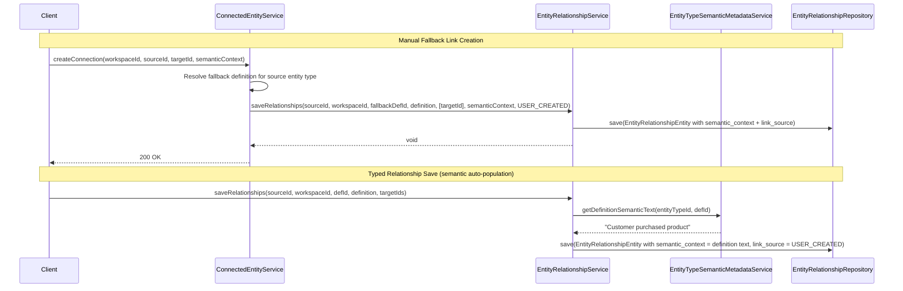

---
tags:
  - "#status/draft"
  - priority/high
  - architecture/design
  - architecture/feature
  - domain/entity
  - domain/knowledge
  - domain/integration
Created: 2026-02-28
Updated:
Domains:
  - "[[Entities]]"
  - "[[Knowledge]]"
  - "[[Integrations]]"
blocked by:
  - "[[Semantic Metadata Foundation]]"
---
# Feature: Connected Entities and Per-Instance Relationship Semantics

---

## 1. Overview

### Problem Statement

The current relationship system requires every entity-to-entity link to be assigned to a typed `relationship_definition`. This works well for user-defined schemas but breaks down in three scenarios:

1. **Integration-synced entity types are READONLY.** Their schemas cannot be modified to add new relationship definitions. When [[Integration Identity Resolution System]] detects that a Stripe customer and an Intercom user are the same person, there is no relationship definition on either entity type to assign the link to.

2. **Identity resolution produces links that don't fit existing definitions.** A match between entities may be detected (via email, phone, name + company) but no appropriate typed relationship exists. The system currently has no fallback — the link is either lost or requires the user to manually create a relationship definition first.

3. **No unified view of all connections.** Each entity's relationships are grouped by definition. There is no way to ask "show me everything connected to this entity" across all definitions as a single flat view.

Additionally, the current semantic metadata system ([[Entity Semantics]]) operates only at the **definition level** — one semantic description per relationship definition. When the [[Enrichment Pipeline]] constructs text for vector embeddings, every link under a definition shares the same generic description. A "Customer → Order" link and a "Customer → Refund" link under the same "Transactions" definition produce identical semantic context, degrading embedding quality.

### Proposed Solution

Introduce two complementary capabilities:

**1. System-managed "Connected Entities" fallback definition per entity type.** When an entity type is published, auto-create a `protected = true`, `allowPolymorphic = true`, `MANY_TO_MANY` relationship definition. This definition accepts any entity type as a target and serves as the catch-all bucket for identity resolution links, cross-integration connections, and manual ad-hoc links. It reuses the existing `entity_relationships` table and relationship infrastructure entirely.

**2. Per-instance semantic context on relationship rows.** Extend `entity_relationships` with `semantic_context`, `link_source`, and `confidence` columns. For typed relationship instances, `semantic_context` is auto-populated from the definition's semantic metadata at write time (snapshot). For fallback "Connected Entities" instances, `semantic_context` is populated case-by-case by the creating system (identity resolution, manual user input, integration sync). This gives the [[Enrichment Pipeline]] per-row meaning for embedding construction without requiring queryable metadata.

**3. Catch-all query filter.** Add an `IsRelatedTo` variant to [[RelationshipFilter]] that omits the `definitionId` predicate, enabling "show me all entities related to X" queries across all definitions including the fallback.

### Success Criteria

- [ ] Every newly published entity type automatically gets a protected "Connected Entities" relationship definition
- [ ] A user can manually link any two entities via the fallback definition through the API, with a semantic description of why they're connected
- [ ] Identity resolution can create fallback links with confidence scores and semantic context describing the match reason
- [ ] Integration sync can create fallback links between READONLY entity types that share no typed relationship definition
- [ ] Typed relationship instances have their `semantic_context` auto-populated from the definition's semantic metadata
- [ ] The query pipeline supports an `IsRelatedTo` filter that matches entities related to specific targets across all definitions
- [ ] The fallback definition is `protected = true` and cannot be deleted or modified by users
- [ ] Existing relationship CRUD, cardinality enforcement, and query behaviour are unaffected

---

## 2. Data Model

### Entity Modifications

#### `entity_relationships` Table — New Columns

| Column | Type | Constraints | Default | Purpose |
|--------|------|-------------|---------|---------|
| `semantic_context` | `TEXT` | Nullable | `NULL` | Natural language description of what this specific link means. Auto-populated from definition semantic metadata for typed relationships; case-by-case for fallback links. |
| `link_source` | `VARCHAR(50)` | `NOT NULL` | `'USER_CREATED'` | How this link was created. Enum: `USER_CREATED`, `IDENTITY_RESOLUTION`, `INTEGRATION_SYNC`, `WORKFLOW`, `SYSTEM` |
| `confidence` | `FLOAT` | Nullable | `NULL` | Confidence score (0.0–1.0) for identity-resolution-created links. NULL for all other link sources. |

#### `relationship_definitions` Table — New Column

| Column | Type | Constraints | Default | Purpose |
|--------|------|-------------|---------|---------|
| `system_type` | `VARCHAR(50)` | Nullable | `NULL` | Identifies system-managed definitions. `'CONNECTED_ENTITIES'` for the fallback definition. NULL for user-created definitions. |

**Constraints:**
- `UNIQUE (workspace_id, source_entity_type_id, system_type) WHERE system_type IS NOT NULL` — partial unique index ensuring at most one system definition of each type per entity type

### New Enums

#### `RelationshipLinkSource`

In `riven.core.enums.entity`:

| Value | Meaning |
|-------|---------|
| `USER_CREATED` | Manually linked by a user via the API or UI |
| `IDENTITY_RESOLUTION` | Created by the [[Integration Identity Resolution System]] |
| `INTEGRATION_SYNC` | Created during integration data sync |
| `WORKFLOW` | Created by a [[Workflows]] automation |
| `SYSTEM` | Created by internal system processes |

#### `SystemRelationshipType`

In `riven.core.enums.entity`:

| Value | Meaning |
|-------|---------|
| `CONNECTED_ENTITIES` | The fallback "Connected Entities" definition |

### Data Ownership

- [[EntityTypeService]] owns the auto-creation of the fallback definition during `publishEntityType`
- [[EntityRelationshipService]] owns the `semantic_context` population logic during `saveRelationships`
- [[EntityTypeSemanticMetadataService]] provides the definition-level semantic text used as the baseline for typed relationship instances
- Identity resolution, integration sync, and workflow services own the population of fallback links with their respective `link_source` values

### Relationships

```
entity_types ---(publishEntityType)---> relationship_definitions [system_type = 'CONNECTED_ENTITIES']
entity_relationships ---(semantic_context)---> entity_type_semantic_metadata [inherited at write time, snapshot]
```

### Data Lifecycle

- **Creation:**
  - Fallback definition: auto-created when entity type is published, within the same `@Transactional` boundary as semantic metadata initialization
  - Typed relationship instances: `semantic_context` populated from definition's semantic metadata during `saveRelationships`
  - Fallback instances: created via dedicated API endpoint, identity resolution, integration sync, or workflow with explicit `semantic_context`
- **Updates:**
  - `semantic_context` on existing typed relationship rows is NOT retroactively updated when the definition's semantic metadata changes (snapshot at write time). Re-enrichment handled by [[Schema Change Handling]] when needed.
  - Fallback link `semantic_context` can be updated via the API
- **Deletion:**
  - Fallback definition: cannot be deleted (`protected = true`)
  - Individual fallback links: soft-deleted like any other relationship instance
  - When entity type is deleted: fallback definition soft-deleted alongside other definitions via existing cascade in [[EntityTypeRelationshipService]]

### Consistency Requirements

- [x] Requires strong consistency (ACID transactions)
- Fallback definition creation executes within the same `@Transactional` scope as `publishEntityType`
- Semantic context population executes within the same `@Transactional` scope as `saveRelationships`

---

## 3. Component Design

### New Components

#### ConnectedEntityService

- **Responsibility:** Manages CRUD for fallback "Connected Entities" links. Provides a dedicated interface for creating, updating, and removing ad-hoc connections with semantic context. Delegates to [[EntityRelationshipService]] for the actual persistence but handles the fallback-specific concerns: resolving the fallback definition for an entity type, validating semantic context, and setting `link_source`.
- **Dependencies:** [[EntityRelationshipService]], [[EntityTypeRelationshipService]], `RelationshipDefinitionRepository`
- **Exposes to:** REST API controllers, [[Integration Identity Resolution System]], integration sync services, [[Workflows]]

### Affected Existing Components

| Component | Change Required | Impact |
|-----------|----------------|--------|
| [[EntityTypeService]] | Add fallback definition auto-creation in `publishEntityType` after semantic metadata initialization | Low — additive hook, same pattern as `semanticMetadataService.initializeForEntityType()` |
| [[EntityRelationshipService]] | Populate `semantic_context` from definition semantic metadata during `saveRelationships` for typed relationships. Accept `semantic_context`, `link_source`, `confidence` as optional parameters. | Medium — core save path gains optional semantic population |
| [[EntityTypeSemanticMetadataService]] | New method `getDefinitionSemanticText(entityTypeId, definitionId)` to retrieve the semantic definition text for a relationship definition | Low — read-only convenience method |
| [[EntityTypeRelationshipService]] | Handle fallback definition in `getDefinitionsForEntityType` — include it in results but mark it as system-managed. Skip it during user-facing schema diffs. | Low — filter by `system_type` |
| [[RelationshipSqlGenerator]] | New `IsRelatedTo` condition handler that generates EXISTS subquery without `relationship_definition_id` predicate | Medium — new filter variant |
| [[QueryFilterValidator]] | Accept `IsRelatedTo` filter variant | Low — validation rule addition |
| `EntityRelationshipEntity` (JPA) | Add `semanticContext`, `linkSource`, `confidence` fields with defaults | Low — additive columns |
| `RelationshipDefinitionEntity` (JPA) | Add `systemType` field | Low — nullable additive column |

### Component Interaction Diagram



---

## 4. API Design

### New Endpoints

#### `POST /api/v1/entities/workspace/{workspaceId}/entity/{entityId}/connections`

- **Purpose:** Create a fallback link between two entities
- **Request:**

```json
{
  "targetEntityId": "uuid",
  "semanticContext": "Matched via shared email john@acme.com across Stripe and Intercom",
  "linkSource": "USER_CREATED",
  "confidence": null
}
```

- **Response:**

```json
{
  "id": "uuid",
  "sourceEntityId": "uuid",
  "targetEntityId": "uuid",
  "definitionId": "uuid",
  "semanticContext": "Matched via shared email john@acme.com across Stripe and Intercom",
  "linkSource": "USER_CREATED",
  "confidence": null,
  "createdAt": "2026-02-28T10:00:00Z"
}
```

- **Error Cases:**
    - `400` — Missing `targetEntityId` or `semanticContext`
    - `404` — Source or target entity not found
    - `403` — No workspace access

#### `DELETE /api/v1/entities/workspace/{workspaceId}/entity/{entityId}/connections/{connectionId}`

- **Purpose:** Remove a fallback link
- **Error Cases:**
    - `404` — Connection not found or not a fallback link
    - `403` — No workspace access

#### `PUT /api/v1/entities/workspace/{workspaceId}/entity/{entityId}/connections/{connectionId}`

- **Purpose:** Update the semantic context of a fallback link
- **Request:**

```json
{
  "semanticContext": "Updated: Confirmed same person via phone verification",
  "confidence": 0.95
}
```

#### `GET /api/v1/entities/workspace/{workspaceId}/entity/{entityId}/connections`

- **Purpose:** Retrieve all connections for an entity — aggregates all typed relationship links AND fallback links into a flat list
- **Response:**

```json
{
  "connections": [
    {
      "id": "uuid",
      "targetEntityId": "uuid",
      "targetEntityLabel": "John Smith",
      "targetEntityTypeKey": "customer",
      "definitionId": "uuid",
      "definitionName": "Purchases",
      "isSystemDefinition": false,
      "semanticContext": "Customer purchased product",
      "linkSource": "USER_CREATED",
      "confidence": null
    },
    {
      "id": "uuid",
      "targetEntityId": "uuid",
      "targetEntityLabel": "john@acme.com (Intercom)",
      "targetEntityTypeKey": "intercom_user",
      "definitionId": "uuid",
      "definitionName": "Connected Entities",
      "isSystemDefinition": true,
      "semanticContext": "Identity match: shared email john@acme.com",
      "linkSource": "IDENTITY_RESOLUTION",
      "confidence": 0.92
    }
  ]
}
```

### Contract Changes

Existing entity relationship save endpoints (`saveEntity` relationship payload) are unchanged. The `semantic_context` auto-population for typed relationships is transparent — no client changes required.

The existing `findRelatedEntities` response shape in [[EntityService]] gains optional `semanticContext`, `linkSource`, and `confidence` fields on each `EntityLink` projection. Clients that don't read these fields are unaffected.

---

## 5. Failure Modes & Recovery

| Failure | Cause | System Behavior | Recovery |
|---------|-------|----------------|----------|
| Fallback definition missing for entity type | Entity type published before this feature deployed, or auto-creation failed | `ConnectedEntityService` checks for existence and creates on-demand if missing | Self-healing — lazy creation as fallback |
| Semantic metadata not found for definition | Definition has no semantic metadata record yet | `semantic_context` on the relationship row is set to `NULL` | Acceptable — metadata can be populated later |
| Duplicate fallback link | Same source+target via fallback definition | Existing cardinality enforcement in [[EntityRelationshipService]] handles this — `MANY_TO_MANY` allows duplicates by design | Application-level dedup in `ConnectedEntityService` if exact duplicate targets should be prevented |
| Confidence score out of range | Identity resolution provides value outside 0.0–1.0 | Validation in `ConnectedEntityService` rejects invalid values | `400 Bad Request` |

### Rollback Strategy

- [x] Database migration reversible — columns are additive with defaults
- [x] Backward compatible with previous version — all new columns are nullable or have defaults
- Removing the feature requires: dropping the new columns from `entity_relationships`, dropping the `system_type` column from `relationship_definitions`, and soft-deleting auto-created fallback definitions

### Blast Radius

If `ConnectedEntityService` fails, only fallback link management is affected. Typed relationship CRUD via [[EntityRelationshipService]] is unaffected. The fallback definition auto-creation in `publishEntityType` executes in the same transaction — if it fails, entity type publishing also fails. This is acceptable because the fallback definition is lightweight (one INSERT) and failure indicates a database-level issue that would affect other operations anyway.

---

## 6. Security

### Authentication & Authorization

- **Who can access this feature?** Any workspace member with entity write permissions
- **Authorization model:** Existing `@PreAuthorize("@workspaceSecurity.hasWorkspace(#workspaceId)")` pattern
- `ConnectedEntityService` public methods carry `@PreAuthorize` annotations
- Fallback definition auto-creation (lifecycle hook) runs within already-authorized transactions — no additional auth needed

### Data Sensitivity

| Data Element | Sensitivity | Protection Required |
|---|---|---|
| `semantic_context` | User-authored / system-generated content | Workspace isolation via RLS |
| `confidence` | System metric | None beyond workspace isolation |
| `link_source` | System metadata | None beyond workspace isolation |

---

## 7. Performance & Scale

### Expected Load

- **Fallback definition auto-creation:** Once per entity type publish — negligible
- **Semantic context population:** One additional read per `saveRelationships` call to fetch definition semantic text — low overhead, cacheable
- **Fallback link CRUD:** Comparable to existing relationship link volume, skewed by identity resolution batch operations during integration sync

### Impact on Existing Queries

- Adding three nullable columns to `entity_relationships` has zero impact on existing queries — no index changes, no JOIN changes
- The `IsRelatedTo` query filter generates a simpler EXISTS subquery (fewer predicates) than existing relationship filters — no performance regression

### Database Considerations

- **New indexes:**
  - Partial unique on `relationship_definitions(workspace_id, source_entity_type_id, system_type) WHERE system_type IS NOT NULL`
  - Consider partial index on `entity_relationships(link_source) WHERE link_source != 'USER_CREATED'` if filtering by link source becomes needed
- **Query patterns:** `IsRelatedTo` omits `relationship_definition_id`, correlating only on `source_entity_id` or `target_entity_id`. Existing composite indexes on `(workspace_id, source_entity_id)` cover this.

---

## 8. Observability

### Logging

| Event | Level | Key Fields |
|---|---|---|
| Fallback definition auto-created | INFO | `entityTypeId`, `definitionId`, `workspaceId` |
| Fallback link created | DEBUG | `sourceId`, `targetId`, `linkSource`, `confidence` |
| Semantic context populated from definition | DEBUG | `definitionId`, `entityRelationshipId` |
| Fallback definition lazy-created (was missing) | WARN | `entityTypeId`, `workspaceId` |

---

## 9. Testing Strategy

### Unit Tests

- [ ] `ConnectedEntityService` — create, update, delete fallback links with semantic context
- [ ] `ConnectedEntityService` — rejects invalid confidence scores
- [ ] `ConnectedEntityService` — lazy-creates fallback definition if missing
- [ ] `EntityTypeService` — fallback definition auto-created on publish
- [ ] `EntityRelationshipService` — `semantic_context` populated from definition metadata for typed relationships
- [ ] `EntityRelationshipService` — `semantic_context` passed through for fallback links
- [ ] `RelationshipSqlGenerator` — `IsRelatedTo` generates correct EXISTS without definition predicate
- [ ] `RelationshipSqlGenerator` — `IsRelatedTo` works for both FORWARD and INVERSE directions

### Integration Tests

- [ ] End-to-end: publish entity type → verify fallback definition exists
- [ ] End-to-end: create fallback link → query via `IsRelatedTo` → verify returned
- [ ] End-to-end: typed relationship save → verify `semantic_context` on relationship row matches definition metadata

---

## 10. Migration & Rollout

### Database Migrations

1. **Add columns to `entity_relationships`:** `semantic_context` (TEXT, nullable), `link_source` (VARCHAR(50), NOT NULL, DEFAULT 'USER_CREATED'), `confidence` (FLOAT, nullable)
2. **Add column to `relationship_definitions`:** `system_type` (VARCHAR(50), nullable)
3. **Add partial unique index:** `UNIQUE (workspace_id, source_entity_type_id, system_type) WHERE system_type IS NOT NULL`

### Data Backfill

- **Existing entity types** that were published before this feature will NOT have fallback definitions. `ConnectedEntityService` handles this via lazy creation — on first access, if the fallback definition is missing, it creates one.
- **Existing relationship rows** will have `semantic_context = NULL` and `link_source = 'USER_CREATED'`. No backfill needed — semantic context is forward-looking. A future batch process could backfill `semantic_context` from definition metadata for existing rows if desired.

### Rollout Sequence

1. Deploy database migrations (additive, non-breaking)
2. Deploy application code
3. Existing entity types gain fallback definitions lazily on first connection access
4. New entity types gain fallback definitions at publish time

---

## 11. Open Questions

> [!warning] Unresolved
>
> - [ ] Should the "Connected Entities" aggregation view (GET endpoint) also include inverse-visible links from typed definitions, or only forward + fallback?
> - [ ] Should fallback links be bidirectional by default (if A→B is created, should B→A be visible without a separate link)?
> - [ ] When identity resolution creates a fallback link, should it also attempt to create a typed relationship if a matching definition exists (promoting the link from fallback to typed)?

---

## 12. Decisions Log

| Date | Decision | Rationale | Alternatives Considered |
|------|----------|-----------|------------------------|
| 2026-02-28 | System-managed fallback definition per entity type (Path A) | Reuses existing `entity_relationships` infrastructure entirely — cardinality, query pipeline, inverse visibility, soft-delete all work without modification. Avoids a parallel link table. | Path B: nullable `definitionId` on `entity_relationships` — rejected because it breaks the current contract across `EntityRelationshipService`, cardinality enforcement, and `RelationshipSqlGenerator` |
| 2026-02-28 | Per-instance `semantic_context` as snapshot, not live reference | Avoids JOIN back to semantic metadata table during embedding construction. Definition-level semantics may change but existing relationship embeddings should reflect the meaning at time of creation. Re-enrichment handled by [[Schema Change Handling]] when needed. | Live reference via JOIN — rejected for embedding pipeline performance |
| 2026-02-28 | `semantic_context` / `link_source` / `confidence` are NOT queryable in the filter pipeline | These columns serve the [[Enrichment Pipeline]] and knowledge layer only. Adding them as filterable fields adds complexity to [[RelationshipSqlGenerator]] without clear user-facing value. | Making them queryable — deferred, can be added later if needed |
| 2026-02-28 | `IsRelatedTo` filter omits `definitionId` entirely | Simplest catch-all — "is this entity connected to X through any relationship". Matches both typed and fallback links. | Per-definition-type filter variants — over-engineered for the use case |
| 2026-02-28 | Lazy creation of fallback definitions for pre-existing entity types | Avoids a data migration that creates definitions for all existing entity types. Self-healing on first access. | Batch migration — more complete but adds deployment complexity and risk |

---

## 13. Implementation Tasks

### Phase 1: Data Model + Fallback Definition Auto-Creation
- [ ] Migration: add `semantic_context`, `link_source`, `confidence` columns to `entity_relationships`
- [ ] Migration: add `system_type` column to `relationship_definitions` with partial unique index
- [ ] Create `RelationshipLinkSource` enum
- [ ] Create `SystemRelationshipType` enum
- [ ] Update `EntityRelationshipEntity` JPA class with new fields
- [ ] Update `RelationshipDefinitionEntity` JPA class with `systemType` field
- [ ] Add fallback definition auto-creation in `EntityTypeService.publishEntityType`
- [ ] Update `EntityTypeRelationshipService.getDefinitionsForEntityType` to include system definitions with marker

### Phase 2: Semantic Context Population + ConnectedEntityService
- [ ] Add `getDefinitionSemanticText` method to `EntityTypeSemanticMetadataService`
- [ ] Modify `EntityRelationshipService.saveRelationships` to accept and populate `semantic_context` from definition metadata
- [ ] Create `ConnectedEntityService` with CRUD for fallback links, lazy fallback definition creation, validation
- [ ] Create REST controller for `/connections` endpoints (POST, GET, PUT, DELETE)
- [ ] Update `EntityLink` projection to include `semanticContext`, `linkSource`, `confidence`

### Phase 3: Query Filter Extension
- [ ] Add `IsRelatedTo` variant to `RelationshipFilter`
- [ ] Implement `IsRelatedTo` handler in `RelationshipSqlGenerator` (EXISTS without definition predicate)
- [ ] Update `QueryFilterValidator` to accept `IsRelatedTo`
- [ ] Update `AttributeFilterVisitor` to dispatch `IsRelatedTo` to `RelationshipSqlGenerator`

### Phase 4: Identity Resolution + Integration Sync Integration
- [ ] Extend [[Integration Identity Resolution System]] to create fallback links with confidence scores and match-reason semantic context
- [ ] Extend integration sync pipeline to create fallback links between READONLY entity types
- [ ] Add workflow action node support for creating fallback links

---

## Related Documents

- [[Connected Entities for READONLY Entity Types]] — Original quick design (superseded by this document)
- [[Entity Type Polymorphic Relationship Support for Semantic Categories]] — Related: semantic category matching for target rules
- [[Integration Identity Resolution System]] — Primary consumer of fallback links
- [[Semantic Metadata Foundation]] — Provides definition-level semantic text inherited by relationship instances
- [[Entity Semantics]] — Subdomain owning semantic metadata
- [[Enrichment Pipeline]] — Consumes `semantic_context` for embedding construction
- [[Schema Change Handling]] — Handles re-enrichment when definition semantics change
- [[Entity Provenance Tracking]] — Complementary: entity-level source tracking, relationship-level `link_source`
- [[Relationships]] — Relationship subdomain architecture
- [[EntityRelationshipService]] — Core relationship instance management
- [[EntityTypeRelationshipService]] — Relationship definition lifecycle
- [[RelationshipSqlGenerator]] — Query pipeline for relationship filters
- [[Entities]] — Parent domain

---

## Changelog

| Date | Author | Change |
|------|--------|--------|
| 2026-02-28 | Claude | Initial design — full scope covering data model, fallback definition auto-creation, per-instance semantic context, query filter extension, manual link API, identity resolution integration, and integration sync integration |
