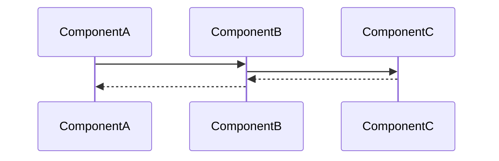

---
tags:
  - "#status/draft"
  - priority/high
  - architecture/feature
  - domain/knowledge
  - tool/temporal
  - tool/postgres
Created: 2026-02-06
Updated:
Domains:
  - "[[Knowledge]]"
blocked by:
  - "[[Semantically Imbued Entity Attributes]]"
---
# Feature: Data Enrichment Pipeline

---
## 1. Overview

### Problem Statement
To build the RAG model for data acquisition, raw data coming from important environment events
	- Entity insertions, updates and deletions
	- Integration Events
will need to be consumed, processed and analysed, not just in its raw form, but in context to its overarching schema, and what the semantics behind this event mean for data analysis and pattern recognition capabilities.

Data needs to be processed into embeddable chunks, enriched with schema context converted to embeddings and stored via `pgvector` 
### Proposed Solution
> `The first is metadata-enriched embeddings, where before embedding a piece of data, you prepend or append its schema context. So instead of embedding "I'm frustrated with the onboarding flow," you embed something like "Support communication from customer segment: Enterprise, acquisition channel: Paid Search, subscription tier: Pro, churn risk: unknown — message content: I'm frustrated with the onboarding flow." The embedding now captures both the semantic content and the structural position in your entity graph.`

- A postgres based job queue will be developed to handle all data sources that need to be processed through a pipeline
	- Each job represents an entity based event that occurs for any given workspace
		- The job would contain the set of ids affected and the action (ie. CREATE,UPDATE,DELETE)
- An asynchronous Temporal based workflow execution will be set up to then continuously consume all jobs that appear in the queue
- The triggers to start the pipeline include
	- Entity created
	- Entity updated (attributes or relationships changed)
	- Related entity updated (if relationship is semantically significant)
	- Schema change affecting entity type [[Schema Change Handling]]
	- Integration sync completes for entity
	- Manual re-embedding requested

```
EntityEmbeddingWorkflow
├── Activity: FetchEntityWithContext
│   ├── Fetch entity data
│   ├── Fetch related entities (1 degree of separation)
│   └── Fetch semantic metadata for entity type, attributes, relationships
├── Activity: ConstructEnrichedText
│   ├── Apply semantic descriptions to structure the text
│   ├── Include relevant attribute values with semantic labels
│   ├── Include relationship context with related entity summaries
│   └── Prepend entity type category and workspace context
├── Activity: GenerateEmbedding
│   ├── Call embedding API (OpenAI text-embedding-3-small initially)
│   ├── Retry with exponential backoff on failure
│   └── Return vector
├── Activity: StoreEmbeddingWithMetadata
│   ├── Store vector in pgvector column
│   ├── Store metadata for filtering (entity_type, workspace_id, semantic_category, related_entity_types, timestamps)
│   └── Update entity record with embedding_updated_at timestamp
└── Compensation: Log failure, mark entity as embedding_pending for retry queue
```
### Success Criteria

- Embedding latency p95 < 5 seconds from entity mutation to stored vector 
- Pipeline handles 1000 entity mutations per hour without backlog growth 
- Failed embeddings are automatically retried with visibility into failure reasons 
- Embeddings are never retrieved across workspace boundaries

---

## 2. Data Model

### New Entities

_What new tables/entities are being introduced?_

| Entity           | Purpose                                           | Key Fields                                                                                                                                                                                                                                                                                                                                                                                                                                     |
| ---------------- | ------------------------------------------------- | ---------------------------------------------------------------------------------------------------------------------------------------------------------------------------------------------------------------------------------------------------------------------------------------------------------------------------------------------------------------------------------------------------------------------------------------------- |
| EntityEmbeddings | To store all data chunks used for vectors and RAG | entity_embeddings<br>├── entity_id (FK, unique)<br>├── workspace_id (FK, for isolation filtering)<br>├── embedding (vector(1536))<br>├── entity_type_id (FK, for filtering)<br>├── semantic_category (denormalized)<br>├── related_entity_type_ids (array)<br>├── enriched_text_hash (to detect if re-embedding needed)<br>├── embedding_model_version (to track when model upgrades require re-embedding)<br>├── created_at<br>└── updated_at |
|                  |                                                   |                                                                                                                                                                                                                                                                                                                                                                                                                                                |

```
CREATE INDEX ON entity_embeddings USING hnsw (embedding vector_cosine_ops) WHERE workspace_id = [parameterized per query];
```
### Entity Modifications

_What existing entities need changes?_

|Entity|Change|Rationale|
|---|---|---|
||||

### Data Ownership

_Which component is the source of truth for each piece of data?_

### Relationships

```
[Entity A] ---(relationship)---> [Entity B]
```

### Data Lifecycle

- **Creation:** How/when is this data created?
- **Updates:** What triggers changes?
- **Deletion:** When/how is it removed? Soft delete? Cascade?

### Consistency Requirements

- [ ] Requires strong consistency (ACID transactions)
- [ ] Eventual consistency acceptable
- _If eventual:_ What's the acceptable delay? What happens during inconsistency?

---

## 3. Component Design

### New Components

_List each new service/component this feature introduces_

#### ComponentName

- **Responsibility:**
- **Dependencies:** [[Dependency1]], [[Dependency2]]
- **Exposes to:** [[Consumer1]], [[Consumer2]]

### Affected Existing Components

|Component|Change Required|Impact|
|---|---|---|
|[[]]|||

### Component Interaction Diagram



---

## 4. API Design

### New Endpoints

#### `POST /api/v1/resource`

- **Purpose:**
- **Request:**

```json
{
  
}
```

- **Response:**

```json
{
  
}
```

- **Error Cases:**
    - `400` -
    - `404` -
    - `409` -

### Contract Changes

_Any changes to existing APIs? Versioning implications?_

### Idempotency

- [ ] Operations are idempotent
- _If not:_ How do we handle retries?

---

## 5. Failure Modes & Recovery

### Dependency Failures

|Dependency|Failure Scenario|System Behavior|Recovery|
|---|---|---|---|
|Database||||
|External API||||
|Message Queue||||

### Partial Failure Scenarios

_What happens if we fail mid-operation?_

|Scenario|State Left Behind|Recovery Strategy|
|---|---|---|
||||

### Rollback Strategy

_If this feature needs to be disabled/rolled back, what's required?_

- [ ] Feature flag controlled
- [ ] Database migration reversible
- [ ] Backward compatible with previous version

### Blast Radius

_If this component fails completely, what else breaks?_

---

## 6. Security

### Authentication & Authorization

- **Who can access this feature?**
- **Authorization model:** RBAC / Resource-based / Other
- **Required permissions:**

### Data Sensitivity

|Data Element|Sensitivity|Protection Required|
|---|---|---|
||PII / Confidential / Public|Encryption / Audit / None|

### Trust Boundaries

_Where does validated data become untrusted?_

### Attack Vectors Considered

- [ ] Input validation
- [ ] Authorization bypass
- [ ] Data leakage
- [ ] Rate limiting

---

## 7. Performance & Scale

### Expected Load

- **Requests/sec:**
- **Data volume:**
- **Growth rate:**

### Performance Requirements

- **Latency target:** p50: ___ ms, p99: ___ ms
- **Throughput target:**

### Scaling Strategy

- [ ] Horizontal scaling possible
- [ ] Vertical scaling required
- **Bottleneck:**

### Caching Strategy

_What can be cached? TTL? Invalidation strategy?_

### Database Considerations

- **New indexes required:**
- **Query patterns:**
- **Potential N+1 issues:**

---

## 8. Observability

### Key Metrics

_What metrics indicate this feature is healthy?_

|Metric|Normal Range|Alert Threshold|
|---|---|---|
||||

### Logging

_What events should be logged? At what level?_

|Event|Level|Key Fields|
|---|---|---|
||INFO/WARN/ERROR||

### Tracing

_What spans should be created for distributed tracing?_

### Alerting

_What conditions should trigger alerts?_

|Condition|Severity|Response|
|---|---|---|
||||

---

## 9. Testing Strategy

### Unit Tests

- [ ] Component logic coverage
- [ ] Edge cases identified:

### Integration Tests

- [ ] API contract tests
- [ ] Database interaction tests
- [ ] External service mocks

### End-to-End Tests

- [ ] Happy path
- [ ] Failure scenarios

### Load Testing

- [ ] Required (describe scenario)
- [ ] Not required (justify)

---

## 10. Migration & Rollout

### Database Migrations

_List migrations in order_

### Data Backfill

_Is existing data affected? How will it be migrated?_

### Feature Flags

- **Flag name:**
- **Rollout strategy:** % rollout / User segment / All at once

### Rollout Phases

|Phase|Scope|Success Criteria|Rollback Trigger|
|---|---|---|---|
|1||||
|2||||

---

## 11. Open Questions

> [!warning] Unresolved
> 
> - [ ] Question 1
> - [ ] Question 2

---

## 12. Decisions Log

|Date|Decision|Rationale|Alternatives Considered|
|---|---|---|---|
|||||

---

## 13. Implementation Tasks

- [ ] Task 1
- [ ] Task 2
- [ ] Task 3

---

## Related Documents

- [[ADR-xxx-decision-name]]
- [[Flow - Related Flow]]
- [[Domain - Relevant Domain]]

---

## Changelog

| Date | Author | Change        |
| ---- | ------ | ------------- |
|      |        | Initial draft |