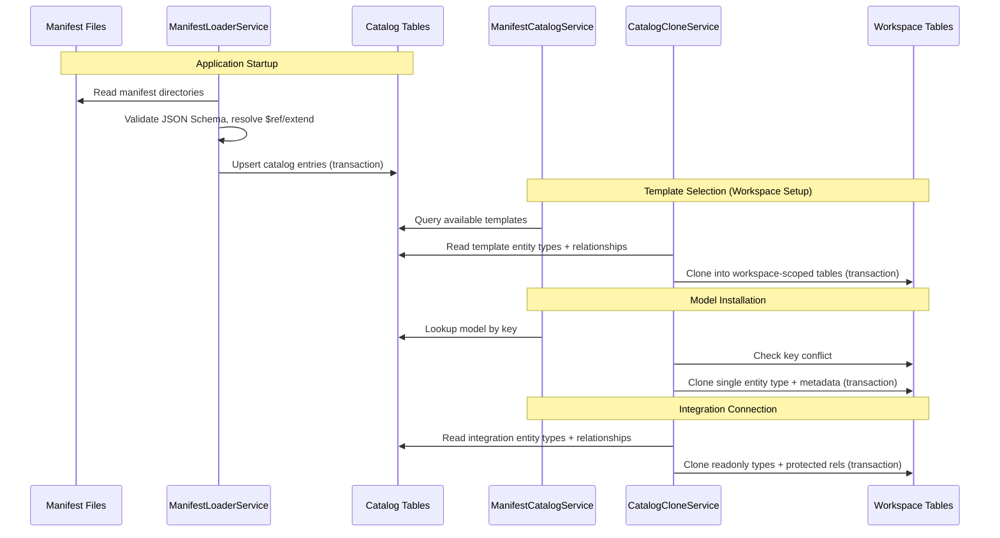

---
tags:
  - "#status/draft"
  - priority/high
  - architecture/design
  - architecture/feature
Created: 2026-02-28
Domains:
  - "[[Entities]]"
  - "[[Integrations]]"
Sub-Domain: "[[Entity Integration Sync]]"
---
# Feature:Declarative Manifest Catalog and Consumption Pipeline

---

## 1. Overview

### Problem Statement

[[ADR-004 Declarative-First Storage for Integration Mappings and Entity Templates]] established declarative JSON manifests as the source of truth for integration schemas, entity templates, and shared entity models — but the runtime storage model was never designed. The existing `entity_types` table is workspace-scoped (`workspace_id` NOT NULL, RLS-protected) and represents live entity types owned by a workspace. Manifest definitions are global blueprints with no workspace affiliation. Loading them into `entity_types` would require nulling `workspace_id`, fighting RLS policies, and conflating "template available for selection" with "active type in your workspace."

Additionally, shared models (`models/`) need to be independently installable into workspaces outside of template onboarding. ADR-004 treats them as a compile-time abstraction that is resolved away during loading — they must instead become first-class catalog citizens.

### Proposed Solution

A global catalog table model (no workspace scope, no RLS — following the `integration_definitions` precedent from [[Integration Access Layer]]) that stores all manifest-loaded definitions. A manifest loader upserts definitions on startup. A clone service copies catalog entries into workspace-scoped tables when a user selects a template, installs a model, or connects an integration.

### Success Criteria

- [ ] All three manifest types (models, templates, integrations) are loaded into the catalog on application startup
- [ ] Available models and templates are queryable from the catalog without workspace context
- [ ] A workspace can install an individual shared model as a standalone entity type outside of template onboarding
- [ ] Template selection during workspace setup clones fully resolved entity types, relationships, and semantic metadata into workspace-scoped tables
- [ ] Integration connection clones readonly entity types and protected relationships; field mappings remain in the catalog for runtime reference
- [ ] Installation of a model into a workspace with an existing entity type of the same key is rejected
- [ ] Manifest changes between deployments are reflected in the catalog on next startup (idempotent upsert)

---

## 2. Data Model

### New Entities

| Entity | Purpose | Key Fields |
|--------|---------|------------|
| `ManifestCatalogEntity` | Parent container for each loaded manifest file | `id`, `key`, `name`, `description`, `type` (MODEL/TEMPLATE/INTEGRATION), `manifestVersion`, `integrationDefinitionId`, `active` |
| `CatalogEntityTypeEntity` | Resolved entity type definitions from all manifests | `id`, `manifestId`, `key`, `name`, `schema` (JSONB), `columns` (JSONB), `identifierKey`, `readonly` |
| `CatalogRelationshipEntity` | Relationship definitions at the catalog level | `id`, `manifestId`, `key`, `sourceEntityTypeKey`, `name`, `iconType`, `iconColour`, `allowPolymorphic`, `cardinalityDefault`, `protected` |
| `CatalogRelationshipTargetRuleEntity` | Per-target-type rules for catalog relationships | `id`, `catalogRelationshipId`, `targetEntityTypeKey`, `semanticTypeConstraint`, `cardinalityOverride`, `inverseVisible`, `inverseName` |
| `CatalogFieldMappingEntity` | Integration field mapping rules (integration only) | `id`, `manifestId`, `entityTypeKey`, `mappings` (JSONB) |
| `CatalogSemanticMetadataEntity` | Semantic metadata for catalog definitions | `id`, `manifestId`, `catalogEntityTypeId`, `targetType`, `targetId`, `definition`, `classification`, `tags` (JSONB) |

### Database Tables

#### `manifest_catalog`

Global, no `workspace_id`, no RLS — follows `integration_definitions` precedent.

| Column | Type | Constraints |
|--------|------|-------------|
| `id` | UUID | PK |
| `key` | VARCHAR | UNIQUE, NOT NULL — manifest slug (e.g., `customer`, `saas-startup`, `hubspot`) |
| `name` | VARCHAR | NOT NULL |
| `description` | TEXT | nullable |
| `type` | TEXT | NOT NULL, CHECK IN (`MODEL`, `TEMPLATE`, `INTEGRATION`) |
| `manifest_version` | VARCHAR | from manifest's `manifestVersion` field |
| `integration_definition_id` | UUID | FK → `integration_definitions.id`, nullable (non-null for INTEGRATION type only) |
| `active` | BOOLEAN | DEFAULT TRUE |
| `created_at` | TIMESTAMPTZ | NOT NULL |
| `updated_at` | TIMESTAMPTZ | NOT NULL |

One row per manifest file.

#### `catalog_entity_types`

| Column | Type | Constraints |
|--------|------|-------------|
| `id` | UUID | PK |
| `manifest_id` | UUID | FK NOT NULL → `manifest_catalog.id` ON DELETE CASCADE |
| `key` | VARCHAR | NOT NULL |
| `name` | VARCHAR | NOT NULL |
| `schema` | JSONB | NOT NULL — same attribute definition format as `entity_types.schema` |
| `columns` | JSONB | nullable — column ordering, same format as `entity_types.columns` |
| `identifier_key` | VARCHAR | nullable |
| `readonly` | BOOLEAN | NOT NULL, DEFAULT FALSE — `true` for integrations, `false` for models and templates |
| `created_at` | TIMESTAMPTZ | NOT NULL |
| `updated_at` | TIMESTAMPTZ | NOT NULL |

- UNIQUE `(manifest_id, key)`
- MODEL manifests → 1 row. TEMPLATE manifests → N rows (fully resolved). INTEGRATION manifests → N rows (all inline).

#### `catalog_relationships`

| Column | Type | Constraints |
|--------|------|-------------|
| `id` | UUID | PK |
| `manifest_id` | UUID | FK NOT NULL → `manifest_catalog.id` ON DELETE CASCADE |
| `key` | VARCHAR | NOT NULL |
| `source_entity_type_key` | VARCHAR | NOT NULL — references entity type key within same manifest |
| `name` | VARCHAR | nullable |
| `icon_type` | VARCHAR | nullable |
| `icon_colour` | VARCHAR | nullable |
| `allow_polymorphic` | BOOLEAN | DEFAULT FALSE |
| `cardinality_default` | VARCHAR | NOT NULL — ONE_TO_ONE, ONE_TO_MANY, MANY_TO_ONE, MANY_TO_MANY |
| `protected` | BOOLEAN | NOT NULL — defaults inferred from manifest directory |
| `created_at` | TIMESTAMPTZ | NOT NULL |
| `updated_at` | TIMESTAMPTZ | NOT NULL |

- UNIQUE `(manifest_id, key)`
- Key-based references: `source_entity_type_key` uses VARCHAR, not UUID FK. Loader validates keys exist in manifest's entity type set. UUID resolution at clone time.

#### `catalog_relationship_target_rules`

| Column | Type | Constraints |
|--------|------|-------------|
| `id` | UUID | PK |
| `catalog_relationship_id` | UUID | FK NOT NULL → `catalog_relationships.id` ON DELETE CASCADE |
| `target_entity_type_key` | VARCHAR | nullable — references entity type key within same manifest |
| `semantic_type_constraint` | VARCHAR | nullable |
| `cardinality_override` | VARCHAR | nullable |
| `inverse_visible` | BOOLEAN | DEFAULT FALSE |
| `inverse_name` | VARCHAR | nullable |
| `created_at` | TIMESTAMPTZ | NOT NULL |
| `updated_at` | TIMESTAMPTZ | NOT NULL |

- At least one of `target_entity_type_key` or `semantic_type_constraint` must be non-null

#### `catalog_field_mappings`

Integration manifests only.

| Column | Type | Constraints |
|--------|------|-------------|
| `id` | UUID | PK |
| `manifest_id` | UUID | FK NOT NULL → `manifest_catalog.id` ON DELETE CASCADE |
| `entity_type_key` | VARCHAR | NOT NULL — which catalog entity type this mapping applies to |
| `mappings` | JSONB | NOT NULL — array of field mapping rules |
| `created_at` | TIMESTAMPTZ | NOT NULL |
| `updated_at` | TIMESTAMPTZ | NOT NULL |

- UNIQUE `(manifest_id, entity_type_key)`
- Only INTEGRATION manifests produce rows. Not cloned into workspaces — referenced at sync runtime.

#### `catalog_semantic_metadata`

| Column | Type | Constraints |
|--------|------|-------------|
| `id` | UUID | PK |
| `manifest_id` | UUID | FK NOT NULL → `manifest_catalog.id` ON DELETE CASCADE |
| `catalog_entity_type_id` | UUID | FK NOT NULL → `catalog_entity_types.id` ON DELETE CASCADE |
| `target_type` | TEXT | NOT NULL, CHECK IN (`ENTITY_TYPE`, `ATTRIBUTE`, `RELATIONSHIP`) |
| `target_id` | UUID | NOT NULL — ID of schema element; equals `catalog_entity_type_id` for ENTITY_TYPE targets |
| `definition` | TEXT | nullable |
| `classification` | TEXT | nullable, CHECK IN (`identifier`, `categorical`, `quantitative`, `temporal`, `freetext`, `relational_reference`) |
| `tags` | JSONB | NOT NULL, DEFAULT `'[]'::jsonb` |
| `created_at` | TIMESTAMPTZ | NOT NULL |
| `updated_at` | TIMESTAMPTZ | NOT NULL |

- UNIQUE `(catalog_entity_type_id, target_type, target_id)`

### Entity Modifications

| Entity | Change | Rationale |
|--------|--------|-----------|
| `entity_types` | Add `source_manifest_key` column (VARCHAR nullable) | Track which catalog manifest a cloned entity type originated from. NULL for user-created types. Used for reference/audit only — does not constrain editing. |
| `entity_types` | Add `readonly` column (BOOLEAN DEFAULT FALSE) | Prevent modification of integration-derived entity types (per [[Predefined Integration Entity Types]]) |

### Data Ownership

- **`manifest_catalog` + children** — owned by the manifest loader. Written on startup, read by catalog query service and clone service. No user writes.
- **`integration_definitions`** — unchanged, still owns connection infrastructure metadata. `manifest_catalog` rows of type INTEGRATION link to it via FK.
- **Workspace-scoped tables** (`entity_types`, `relationship_definitions`, etc.) — after cloning, rows are owned by the workspace. The catalog origin is recorded via `source_manifest_key` but does not constrain editing.

### Relationships

```
manifest_catalog ||--o{ catalog_entity_types : "contains"
manifest_catalog ||--o{ catalog_relationships : "contains"
manifest_catalog ||--o{ catalog_field_mappings : "contains"
manifest_catalog }o--|| integration_definitions : "integration_definition_id (nullable)"
catalog_entity_types ||--o{ catalog_semantic_metadata : "catalog_entity_type_id"
catalog_relationships ||--o{ catalog_relationship_target_rules : "catalog_relationship_id"
```

### Data Lifecycle

- **Creation:** Manifest loader upserts on every application startup (idempotent, keyed on `manifest_catalog.key` + child unique constraints)
- **Updates:** If a manifest file changes between deployments, the loader updates the catalog to match on next startup. Definitions from manifests are treated as the canonical version.
- **Deletion:** Catalog entries for manifests that no longer exist on disk are removed on startup (full reconciliation). Child rows cascade via ON DELETE CASCADE. Workspace-scoped clones are NOT affected by catalog changes — they were cloned at installation time and are independently owned.

### Consistency Requirements

- [x] Requires strong consistency (ACID transactions) — manifest loading runs within transactions; clone operations are atomic per workspace

---

## 3. Component Design

### New Components

#### ManifestLoaderService

- **Responsibility:** Startup service that reads manifest files, validates against JSON Schema, resolves `$ref` + `extend` merges, and upserts into catalog tables. Processes in dependency order: models → templates → integrations.
- **Dependencies:** `ManifestCatalogRepository`, `CatalogEntityTypeRepository`, `CatalogRelationshipRepository`, `CatalogFieldMappingRepository`, `CatalogSemanticMetadataRepository`, `IntegrationDefinitionRepository`
- **Exposes to:** Application startup (via `@EventListener(ApplicationReadyEvent::class)` or `ApplicationRunner`)

#### ManifestCatalogService

- **Responsibility:** Read-only query service for browsing available manifests. Methods: `getAvailableTemplates()`, `getAvailableModels()`, `getManifestByKey(key)`, `getEntityTypesForManifest(manifestId)`.
- **Dependencies:** `ManifestCatalogRepository`, `CatalogEntityTypeRepository`
- **Exposes to:** `CatalogCloneService`, future catalog browsing API controllers

#### CatalogCloneService

- **Responsibility:** Clones catalog entries into workspace-scoped tables. Handles UUID generation, `workspace_id` assignment, and key-to-UUID resolution for relationships.
- **Dependencies:** `ManifestCatalogService`, `EntityTypeRepository`, `RelationshipDefinitionRepository`, `RelationshipTargetRuleRepository`, `EntityTypeSemanticMetadataRepository`
- **Exposes to:** Workspace setup flow (template selection), model installation API, integration connection flow
- Three modes:
  - **Template clone:** All entity types + relationships + target rules + semantic metadata. Sets `source_manifest_key` on each cloned entity type.
  - **Model install:** Single entity type + its semantic metadata. Rejects if key conflict in workspace. Sets `source_manifest_key`.
  - **Integration clone:** All entity types (`readonly=true`) + relationships (`protected=true`) + semantic metadata. Field mappings stay in catalog. Sets `source_manifest_key`.

### Affected Existing Components

| Component | Change Required | Impact |
|-----------|----------------|--------|
| [[EntityTypeService]] | Respect `readonly` flag — reject mutations on readonly entity types | Low — guard clause on existing methods |
| [[EntityTypeAttributeService]] | Reject attribute modifications on readonly entity types | Low |
| [[EntityTypeRelationshipService]] | Reject relationship modifications on protected definitions from catalog | Low |
| [[IntegrationConnectionService]] | Call `CatalogCloneService` when connection transitions to CONNECTED | Medium — new dependency |

### Component Interaction Diagram



---

## 4. API Design

Full API design deferred to when controllers are built. The catalog and clone service operate at the service layer. Key API surface to anticipate:

### Anticipated Endpoints

#### `GET /api/v1/catalog/templates`

- **Purpose:** List available workspace templates for selection during onboarding
- **Response:** Array of `{ key, name, description, entityTypeCount }`
- **Auth:** Public (no workspace context required)

#### `GET /api/v1/catalog/models`

- **Purpose:** List available installable shared models
- **Response:** Array of `{ key, name, description }`
- **Auth:** Authenticated user

#### `GET /api/v1/catalog/{key}`

- **Purpose:** Get full manifest details with entity types, relationships
- **Response:** Complete manifest with nested entity types and relationship definitions
- **Auth:** Authenticated user

#### `POST /api/v1/workspaces/{workspaceId}/install-model`

- **Purpose:** Install a single shared model into a workspace
- **Request:** `{ "modelKey": "customer" }`
- **Response:** Created entity type
- **Error Cases:**
  - `404` — model key not found in catalog
  - `409` — entity type with same key already exists in workspace

Template selection is part of the workspace creation flow (existing endpoint, extended).

### Idempotency

- [x] Manifest loading is idempotent (keyed upsert)
- [ ] Clone operations are NOT idempotent — they create new workspace rows each time. Caller is responsible for not double-cloning. Model install guards against key conflicts.

---

## 5. Failure Modes & Recovery

### Dependency Failures

| Dependency | Failure Scenario | System Behavior | Recovery |
|------------|-----------------|-----------------|----------|
| Filesystem | Manifest directory missing or unreadable | Loader logs error, skips directory | Fix filesystem permissions, restart |
| Database | Connection failure during catalog upsert | Startup continues with stale catalog data | Automatic retry on next startup |
| JSON Schema | Invalid manifest file | Warning logged, individual manifest skipped | Fix manifest, restart |

### Partial Failure Scenarios

| Scenario | State Left Behind | Recovery Strategy |
|----------|-------------------|-------------------|
| Manifest loader fails mid-upsert | Transaction rolls back — catalog unchanged | Fix failing manifest, restart |
| Clone fails mid-operation | Transaction rolls back — no workspace changes | Retry clone operation |
| Model install conflicts | No changes made — rejected before write | User chooses different model or resolves conflict |

### Rollback Strategy

- [x] Database migration reversible — drop catalog tables, remove columns from `entity_types`
- [x] Backward compatible with previous version — catalog tables are additive, existing workspace data unaffected

### Blast Radius

If the manifest loader fails completely, the catalog is empty/stale. Impact:
- New workspace creation cannot offer templates (degrades onboarding)
- Model installation unavailable
- Integration connection cannot clone schemas
- Existing workspaces are **unaffected** — their cloned data is independent

---

## 6. Security

### Authentication & Authorization

- **Catalog read:** No workspace context required. Authenticated users can browse available templates and models.
- **Clone operations:** Require workspace ADMIN role. Cloning modifies workspace-scoped data.
- **Catalog write:** Not exposed via API. Only the manifest loader writes to catalog tables on startup.

### Data Sensitivity

| Data Element | Sensitivity | Protection Required |
|-------------|------------|-------------------|
| Manifest definitions | Public | None — shipped with application |
| Catalog tables | Public | None — no RLS, no workspace scope |
| Workspace-scoped clones | Workspace-private | Standard workspace RLS |

### Trust Boundaries

Manifest files are part of the application deployment — trusted. Catalog data is derived from manifests — trusted. Workspace data is user-owned — standard RLS applies.

### Attack Vectors Considered

- [x] Input validation — JSON Schema validation on manifest files at load time
- [x] Authorization bypass — clone operations require workspace ADMIN
- [x] Data leakage — catalog is intentionally global; no sensitive data
- [ ] Rate limiting — not applicable (startup operation + infrequent clone operations)

---

## 7. Performance & Scale

### Expected Load

- **Manifest count:** 10-30 models, 3-10 templates, 6-50 integrations at initial scale
- **Catalog table rows:** < 500 total across all tables
- **Clone operations:** Infrequent — workspace creation, model install, integration connection

### Performance Requirements

- **Startup loading:** < 5 seconds for 100 manifest files
- **Clone operation:** < 500ms per template/model/integration clone

### Scaling Strategy

- Catalog is small and static — no scaling concerns at any realistic scale
- **Bottleneck:** None expected. Manifest loading is I/O-bound (file reads), clone is DB-bound (inserts)

### Caching Strategy

Catalog data changes only on application restart. In-memory caching of catalog queries is beneficial but not critical given the small dataset. No TTL or invalidation needed — cache is rebuilt on startup.

### Database Considerations

- **New indexes:** `manifest_catalog(key)` unique, `catalog_entity_types(manifest_id, key)` unique — covered by unique constraints
- **Query patterns:** Lookup by manifest key, filter by type, join catalog entries with entity types
- **N+1 risks:** `ManifestCatalogService` should use eager fetch for entity types when returning full manifest details

---

## 8. Observability

### Key Metrics

| Metric | Normal Range | Alert Threshold |
|--------|-------------|-----------------|
| Manifests loaded at startup | Equal to manifest file count | Fewer than expected (manifest skipped) |
| Manifest load duration | < 5s | > 10s |
| Clone operation duration | < 500ms | > 2s |
| Skipped manifests (invalid) | 0 | > 0 (warning) |

### Logging

| Event | Level | Key Fields |
|-------|-------|------------|
| Manifest loaded successfully | INFO | `manifestKey`, `type`, `entityTypeCount` |
| Manifest skipped (invalid) | WARN | `manifestKey`, `validationErrors` |
| Manifest removed (no longer on disk) | INFO | `manifestKey` |
| Clone operation completed | INFO | `workspaceId`, `manifestKey`, `mode` |
| Clone conflict (key exists) | WARN | `workspaceId`, `conflictingKey` |

---

## 9. Testing Strategy

### Unit Tests

- [ ] `$ref` resolution — shared model lookup, missing model handling
- [ ] `extend` merge — attribute addition, semantic override, no-extend passthrough
- [ ] Relationship format normalization — shorthand to full conversion
- [ ] Key validation — source/target key existence checks
- [ ] Clone key-to-UUID mapping — correct resolution of VARCHAR keys to workspace UUIDs
- [ ] Readonly/protected flag inference from directory context

### Integration Tests

- [ ] Full startup load cycle — manifests → catalog tables → queryable
- [ ] Template clone end-to-end — catalog → workspace-scoped rows with correct FKs
- [ ] Model install with conflict detection
- [ ] Integration clone with readonly + protected flags
- [ ] Idempotent re-load — manifest change reflected in catalog without duplication
- [ ] Manifest removal — catalog entry deleted, cascades to children

### Load Testing

- [ ] Not required — catalog is small and operations are infrequent

---

## 10. Migration & Rollout

### Database Migrations

1. Create `manifest_catalog` table
2. Create `catalog_entity_types` table
3. Create `catalog_relationships` table
4. Create `catalog_relationship_target_rules` table
5. Create `catalog_field_mappings` table
6. Create `catalog_semantic_metadata` table
7. Add `source_manifest_key` column to `entity_types`
8. Add `readonly` column to `entity_types`

### Data Backfill

No existing data affected. Catalog tables are populated fresh by the manifest loader on first startup after migration. Existing workspace entity types receive `source_manifest_key = NULL` and `readonly = FALSE` (column defaults).

### Rollout Phases

| Phase | Scope | Success Criteria | Rollback Trigger |
|-------|-------|-----------------|-----------------|
| 1 | Catalog tables + manifest loader | All manifests load on startup, queryable via service | Loader fails to start or corrupts data |
| 2 | Clone service + template selection | Workspace creation clones templates successfully | Clone produces incorrect entity types |
| 3 | Model installation API | Individual models installable with conflict detection | Key conflict handling fails |
| 4 | Integration clone on connection | Integration connection clones readonly schemas | Readonly/protected flags not respected |

---

## 11. Open Questions

> [!warning] Unresolved
>
> - [ ] Should catalog entries support a `deprecated` flag for manifests being phased out?
> - [ ] When a manifest is updated between deployments, should workspaces that previously cloned from it be notified of available updates?
> - [ ] Should the model install API support batch installation (multiple models at once)?

---

## 12. Decisions Log

| Date | Decision | Rationale | Alternatives Considered |
|------|----------|-----------|------------------------|
| 2026-02-28 | Separate catalog tables instead of reusing `entity_types` with nullable `workspace_id` | Catalog entries are global blueprints, not workspace-owned types. Mixing them violates RLS assumptions and conflates template availability with active usage. | Nullable `workspace_id` on `entity_types` — rejected due to RLS conflicts and semantic confusion |
| 2026-02-28 | Key-based references in catalog relationships (VARCHAR, not UUID FK) | Manifest definitions are self-contained by key. UUID resolution happens at clone time when workspace-scoped rows are created. Avoids circular dependency during loading. | UUID FKs within catalog — rejected because entity types and relationships load in the same transaction and UUIDs aren't stable across re-loads |
| 2026-02-28 | Field mappings stay in catalog, not cloned to workspace | Field mappings are referenced at sync runtime by the generic mapping engine. They are not workspace-owned configuration — they describe how external data maps to entity attributes. | Clone mappings into workspace — rejected because mappings are not user-editable and duplicating them adds complexity without value |
| 2026-02-28 | Shared models promoted to first-class catalog citizens | Enables standalone model installation outside template onboarding. ADR-004's compile-time-only treatment was too restrictive. | Keep models as compile-time only — rejected because independent installation is a real requirement |

---

## 13. Implementation Tasks

- [ ] Design and apply database migration for all catalog tables + `entity_types` column additions
- [ ] Implement `ManifestCatalogEntity` and related JPA entities
- [ ] Implement `ManifestLoaderService` with `$ref` resolution and `extend` merge
- [ ] Implement `ManifestCatalogService` for read-only catalog queries
- [ ] Implement `CatalogCloneService` with template, model, and integration clone modes
- [ ] Add `readonly` guard clauses to `EntityTypeService` and `EntityTypeAttributeService`
- [ ] Integrate `CatalogCloneService` into `IntegrationConnectionService`
- [ ] Write unit tests for manifest loading (resolution, merge, validation)
- [ ] Write integration tests for full load + clone cycle
- [ ] Extend workspace creation flow to invoke template clone
- [ ] Build model installation API endpoint

---

## Related Documents

- [[ADR-004 Declarative-First Storage for Integration Mappings and Entity Templates]]
- [[Integration Access Layer]]
- [[Integration Schema Mapping]]
- [[Predefined Integration Entity Types]]
- [[Semantic Metadata Baked Entity Data Model Templates]]
- [[Entity Integration Sync]]
- [[Semantic Metadata Foundation]]
- [[Connected Entities for READONLY Entity Types]]

---

## Changelog

| Date | Author | Change |
|------|--------|--------|
| 2026-02-28 | | Initial draft |
