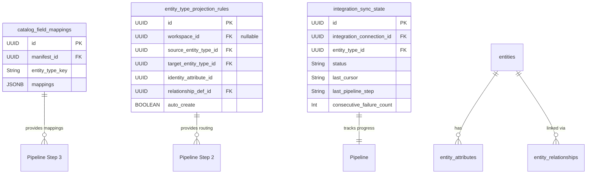
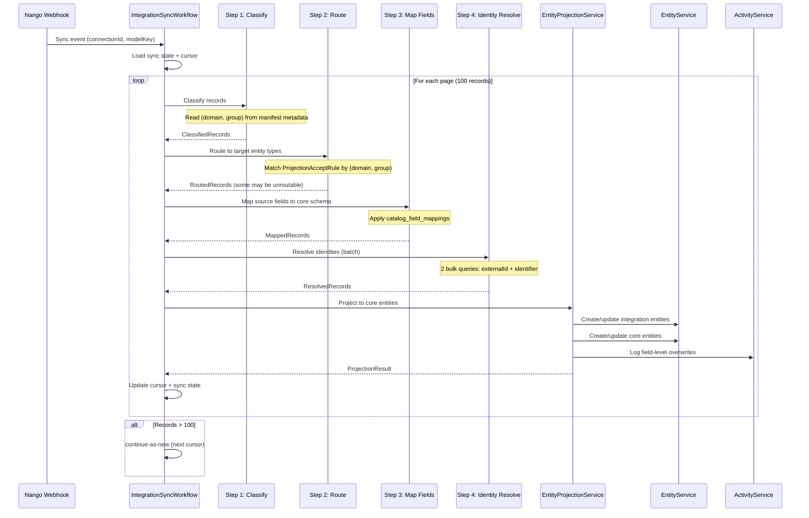

---
tags:
  - "#status/draft"
  - priority/high
  - architecture/feature
Created: 2026-03-27
Updated: 2026-03-27
Domains:
  - "[[riven/docs/system-design/domains/Integrations/Integrations]]"
  - "[[riven/docs/system-design/domains/Entities/Entities]]"
  - "[[riven/docs/system-design/domains/Identity Resolution/Identity Resolution]]"
depends-on:
  - "[[2. Areas/2.1 Startup & Content/Riven/2. System Design/feature-design/1. Planning/Smart Projection Architecture]]"
---
# Feature: Entity Ingestion Pipeline — Classify, Route, Map, Resolve

---

## 1. Overview

### Problem Statement

Riven ingests entity data from multiple external sources — Nango-synced SaaS integrations, webhooks, CSV imports, direct Postgres connections, and API pushes. Today, each source writes integration entity rows independently. There is no centralised pipeline that transforms heterogeneous source data into unified core lifecycle entities. The result is:

1. **No single source of truth.** A Customer may exist as a `hubspot_contact`, a `stripe_customer`, and a `zendesk_user` — three separate integration entity rows with no automated path to a single core `Customer` entity.
2. **No field normalisation.** Each integration uses its own field names (`contact_email`, `email_address`, `primary_email`). Without a mapping step, projected core entities receive raw source fields instead of normalised schema attributes.
3. **No identity deduplication at ingest time.** Two records from different integrations representing the same person create two core entities. Identity resolution runs post-hoc and suggests matches, but doesn't prevent duplicates during the sync itself.
4. **No classification routing.** Incoming data has no mechanism to self-route to the correct core entity type based on its domain classification. Routing is implicit (hardcoded per integration) rather than declarative.

Without a unified ingestion pipeline, the [[2. Areas/2.1 Startup & Content/Riven/2. System Design/feature-design/1. Planning/Smart Projection Architecture]] cannot function — it depends on classified, mapped, and identity-resolved data flowing into core entity types automatically.

### Proposed Solution

**A 4-step ingestion pipeline** that every data source passes through before writing to core entities. The pipeline is: **Classify -> Route -> Map -> Resolve**.

```
INGESTION SOURCES
  Nango Sync, Webhook, CSV Import, Postgres, API Push
         |
         v
  STEP 1: CLASSIFY
  Determine (LifecycleDomain, SemanticGroup) from integration manifest metadata
         |
         v
  STEP 2: ROUTE
  ProjectionAcceptRule matches (domain, group) -> target core entity type
  No match -> integration entity only (preserved but not projected)
         |
         v
  STEP 3: MAP FIELDS
  catalog_field_mappings: source fields -> core schema
  Unmapped fields preserved on integration entity row
         |
         v
  STEP 4: IDENTITY RESOLUTION
  Check 1: sourceExternalId match (same integration + same external ID)
  Check 2: Identifier key match (email, etc.)
  Match -> UPDATE existing, No match -> CREATE new
         |
    +----+----+
    v         v
  Integration Entity     Core Entity (hub)
  (hidden, readonly)     (visible, sourceType=PROJECTED)
```

Each step is a discrete, testable unit. Steps execute sequentially within a Temporal workflow activity, with retry semantics at the activity level and cursor-based pagination via continue-as-new for large datasets.

### Architectural Rationale — Why a Pipeline, Not Per-Source Logic?

The previous approach embedded transformation logic per integration — each Nango model had custom mapping code, each webhook handler did its own dedup. This was evaluated and rejected because:

- **Source proliferation:** The SaaS Decline thesis predicts customers will increasingly connect messy internal Postgres tables, undocumented APIs, and CSV dumps. Per-source logic does not scale to N arbitrary sources.
- **Consistency guarantee:** A centralised pipeline ensures every record — regardless of origin — passes through the same classification, mapping, and identity resolution. No source can bypass dedup or skip field normalisation.
- **Testability:** Four discrete steps with defined input/output contracts are independently testable. Per-source spaghetti is not.
- **Temporal execution model:** The pipeline maps cleanly to Temporal activities — each step is an activity with its own retry policy, timeout, and error isolation.

### Field Ownership: Source Wins for Mapped Fields

> **Decision (eng review 2026-03-27):** Integration sources own mapped fields. Users own unmapped fields.

When the pipeline creates or updates a core entity via projection, attributes fall into two categories:

1. **Mapped fields** — attributes whose values originate from integration data via `catalog_field_mappings` (e.g., `email`, `name`, `company`). These are **owned by the integration source**. If a user manually edits a mapped field, that edit will be **overwritten on the next sync** when the integration source provides a new value.
2. **Unmapped fields** — attributes added by the user to the core entity type that have no corresponding mapping from any integration source (e.g., custom notes, internal tags, manual classifications). These are **owned by the user** and are never touched by the pipeline.

**Audit trail requirement:** When a sync overwrites a user-edited value on a mapped field, the change is logged at field level via `activityService.logActivity()`:

```json
{
  "event": "FIELD_OVERWRITE",
  "entityId": "<core_entity_id>",
  "attributeId": "<attribute_id>",
  "field": "email",
  "previousValue": "jane@old.com",
  "newValue": "jane@new.com",
  "source": "hubspot",
  "syncId": "<sync_run_id>"
}
```

### Most Recent Sync Wins for Multi-Source Conflicts

> **Decision (eng review 2026-03-27):** When multiple integrations project to the same core entity, the most recently synced values for mapped fields win. Timestamp-based, no configuration needed.

When two integrations project to the same core entity (e.g., same Customer matched from Zendesk + HubSpot via identity resolution), both sources may provide values for the same mapped fields. The conflict resolution rule is: **most recent sync wins**.

- Each sync run has a timestamp. When a mapped field is updated, the new value overwrites the previous value regardless of which integration source provided the earlier value.
- No user configuration is needed — this is the default behaviour.
- The field-level audit trail records all changes from all sources, preserving full history even though only the latest value is stored.

**Example timeline:**

| Time | Source | Field | Value | Stored? |
|------|--------|-------|-------|---------|
| T1 | HubSpot sync | email | jane@hubspot.com | Yes |
| T2 | Zendesk sync | email | jane@zendesk.com | Yes (overwrites T1) |
| T3 | HubSpot sync | email | jane@hubspot-updated.com | Yes (overwrites T2) |

All three changes are logged in the activity trail. The core entity always reflects the most recent value.

### Prerequisites

This feature assumes the following are merged to main:

| PR / Feature | What It Provides | Why It's Required |
|---|---|---|
| #143 (lifecycle-spine) | LifecycleDomain enum, SemanticGroup, Kotlin core model definitions | Step 1 (Classify) depends on domain/group metadata on integration manifests |
| #142 (integration-sync) | Temporal sync workflow (Pass 1 + Pass 2), IntegrationSyncStateEntity | Pipeline extends the existing Temporal workflow with ingestion activities |
| #141 (identity-resolution) | pg_trgm matching, identity clusters, match suggestions | Step 4 (Resolve) uses identity matching infrastructure |
| Smart Projection Architecture | ProjectionAcceptRule on core models, entity_type_projection_rules table | Step 2 (Route) matches against projection acceptance rules |
| CatalogFieldMappingEntity | Field mapping definitions per integration manifest | Step 3 (Map) reads mappings from catalog_field_mappings table |

### Short Comings

- **Source Wins is non-negotiable:** Users cannot protect individual mapped fields from being overwritten. A future enhancement could add per-field ownership toggles, but that introduces CRDT-like complexity.
- **Most Recent Sync Wins is naive:** Timestamp-based resolution does not account for data quality — a stale HubSpot sync could overwrite a more accurate Zendesk value if it runs later. Field-level source priority configuration is deferred.
- **No partial mapping recovery:** If a field mapping references a source field that doesn't exist in the incoming payload, the entire field is skipped silently. No mechanism exists to flag "expected but missing" fields to the user.
- **CSV imports lack manifest metadata:** CSV files have no inherent LifecycleDomain or SemanticGroup. Classification for CSV requires user input during the import wizard (not yet designed).
- **Ambiguous identity resolution creates duplicates:** When identity resolution finds multiple potential matches with equal confidence, it creates a new entity rather than risking a false merge. This can lead to duplicates that require manual resolution.

### Success Criteria

- [ ] Every Nango sync runs through all 4 pipeline steps (classify, route, map, resolve) before writing core entities
- [ ] Integration entity rows are always created regardless of whether projection succeeds
- [ ] Unmatched data (no ProjectionAcceptRule) is preserved as integration entity rows, not discarded
- [ ] Field mapping transforms source field names to core schema attribute names using catalog_field_mappings
- [ ] Unmapped source fields are preserved on the integration entity row (never lost)
- [ ] Identity resolution prevents duplicate core entities for the same logical person/record within a single sync batch
- [ ] sourceExternalId match takes priority over identifier key match
- [ ] Field-level audit trail logs every overwrite of a user-edited mapped field
- [ ] Pipeline completes within Temporal activity timeout for batches of 100 records
- [ ] Pipeline failures are per-record isolated — one failed record does not block the batch
- [ ] Cursor-based pagination with continue-as-new handles datasets exceeding 100 records

---

## 2. Data Model

### New Entities

No new database tables are introduced by this feature. The ingestion pipeline operates on existing infrastructure:

| Existing Entity | Role in Pipeline |
|----------------|------------------|
| `CatalogFieldMappingEntity` | Step 3: provides source -> core field mappings |
| `entity_type_projection_rules` | Step 2: routing rules from (domain, group) to target core entity type |
| `IntegrationSyncStateEntity` | Cursor tracking, failure counts per sync |
| `EntityEntity` | Target: both integration entities and core entities |
| `EntityAttributeEntity` | Target: attribute values on created/updated entities |

The pipeline is a **processing layer**, not a data model extension. It reads configuration from existing tables and writes to existing entity infrastructure.

### Entity Modifications

| Entity | Change | Rationale |
|--------|--------|-----------|
| `SourceType` enum | Add `PROJECTED` value | Distinguishes auto-created core entities from user-created and integration-synced. Currently has: USER_CREATED, INTEGRATION, IMPORT, API, WORKFLOW, TEMPLATE |
| `IntegrationSyncStateEntity` | Add `lastPipelineStep` field (nullable String) | Tracks which pipeline step the sync was in when it last checkpointed, enabling resume from correct step |
| `EntityEntity` | Add `syncVersion` field (Long, default 0) | Monotonically increasing version per sync — prevents stale writes when two syncs race |

#### SourceType Extension

```kotlin
enum class SourceType {
    USER_CREATED,
    INTEGRATION,
    IMPORT,
    API,
    WORKFLOW,
    TEMPLATE,
    PROJECTED   // NEW — auto-created by ingestion pipeline projection step
}
```

#### IntegrationSyncStateEntity — New Column

```sql
ALTER TABLE integration_sync_state
    ADD COLUMN "last_pipeline_step" VARCHAR(50) DEFAULT NULL;
```

Since schema files are declarative (not incremental), this is added to the existing `integration_sync_state` table definition in `db/schema/`:

```sql
@Column(name = "last_pipeline_step", length = 50)
var lastPipelineStep: String? = null,
```

#### EntityEntity — syncVersion Column

```sql
-- Added to existing entities table definition
"sync_version" BIGINT NOT NULL DEFAULT 0
```

```kotlin
@Column(name = "sync_version", nullable = false)
var syncVersion: Long = 0,
```

The `syncVersion` is incremented on each pipeline write. When two syncs race to update the same entity, the write with the lower syncVersion is rejected:

```kotlin
// Optimistic concurrency guard
if (existingEntity.syncVersion > incomingSyncVersion) {
    logger.warn { "Stale sync write rejected: entity=${existingEntity.id}, existing=${existingEntity.syncVersion}, incoming=$incomingSyncVersion" }
    return // skip — newer data already written
}
```

### Data Ownership

| Data | Owner | Notes |
|------|-------|-------|
| Pipeline configuration | `CatalogFieldMappingEntity`, `entity_type_projection_rules` | Read-only during pipeline execution. Written during materialization. |
| Integration entity rows | `IntegrationSyncActivities` (via EntityService) | Always created, regardless of projection outcome |
| Projected core entity rows | `EntityProjectionService` | Created with `sourceType = PROJECTED`, linked via relationships |
| Sync state + cursor | `IntegrationSyncStateEntity` | Updated after each batch |
| Field-level audit trail | `ActivityService` | Append-only log of field overwrites |

### Consistency Requirements

- [x] Requires strong consistency (ACID transactions)
- Each record's 4-step pipeline execution is transactional. Integration entity creation + core entity projection + relationship linking occurs within a single `@Transactional` boundary per record.
- Batch processing groups records into chunks of 50. Each chunk is a separate transaction — failure in chunk N does not roll back chunks 1 through N-1.
- Cursor advancement is committed after each successful chunk, ensuring exactly-once processing semantics with Temporal's at-least-once delivery.

### Data Flow Diagram



### Data Lifecycle

- **Creation:** Integration entity rows are created in Step 4 (Resolve) when no existing match is found. Core entity rows are created via projection when `autoCreate = true` and no identity match exists.
- **Updates:** Existing integration entities matched by `sourceExternalId` are updated in-place. Existing core entities matched by identifier key have their mapped fields overwritten (source wins).
- **Deletion:** The pipeline never deletes entities. Integration disconnection pauses the sync — existing entities remain. Soft-delete of core entities does not affect integration entity rows.

---

## 3. Component Design

### New Components

| Component | Package | Type | Purpose |
|-----------|---------|------|---------|
| `FieldMappingService` | `riven.core.service.ingestion` | Service | Step 3: transforms source fields to core schema using catalog_field_mappings |
| `IdentityResolutionService` | `riven.core.service.ingestion` | Service | Step 4: matches incoming data to existing entities by sourceExternalId or identifier keys |
| `EntityProjectionService` | `riven.core.service.ingestion` | Service | Creates/updates core entities from integration data after mapping and resolution |
| `IntegrationSyncWorkflow` | `riven.core.workflow.integration` | Temporal Workflow | Orchestrates the 4-step pipeline with pagination and retry |
| `IntegrationSyncActivities` | `riven.core.workflow.integration` | Temporal Activities | Activity implementations for each pipeline step |

### Service Responsibilities

#### FieldMappingService

Transforms raw source payloads into core schema attribute maps using `CatalogFieldMappingEntity` definitions.

```
  mapFields(sourcePayload: Map<String, Any>, mappings: CatalogFieldMappingModel)
    |
    +-- For each mapping entry (sourceField -> targetAttributeKey):
    |   +-- Extract value from sourcePayload[sourceField]
    |   +-- If source field missing -> skip, log WARN
    |   +-- If value type mismatch -> attempt coercion, log WARN on failure
    |   +-- Add to mappedFields map
    |
    +-- Collect unmapped fields (sourcePayload keys not in any mapping)
    |   +-- Preserve in unmappedFields map
    |
    +-- Return FieldMappingResult(mappedFields, unmappedFields, warnings)
```

```kotlin
data class FieldMappingResult(
    val mappedFields: Map<String, Any?>,      // targetAttributeKey -> value
    val unmappedFields: Map<String, Any?>,     // sourceFieldName -> value (preserved on integration entity)
    val warnings: List<FieldMappingWarning>,
)

data class FieldMappingWarning(
    val sourceField: String,
    val reason: FieldMappingWarningReason,
    val details: String? = null,
)

enum class FieldMappingWarningReason {
    SOURCE_FIELD_MISSING,
    TYPE_MISMATCH,
    COERCION_FAILED,
}
```

Key behaviours:
- **Unmapped preservation:** Source fields with no mapping entry are collected into `unmappedFields`. These are stored as JSONB on the integration entity row — no data is ever discarded.
- **Type coercion:** Basic coercions are attempted (String -> Number, ISO timestamp -> ZonedDateTime). Failed coercions skip the field with a warning — they don't fail the record.
- **Empty mappings:** If no `CatalogFieldMappingEntity` exists for this manifest + entity type key, all fields are treated as unmapped. The integration entity is created with the full raw payload. No projection occurs.
- **Mapping cache:** Mappings are loaded once per workflow execution and reused across all records in the batch. No per-record database lookup.

#### IdentityResolutionService

Matches incoming records to existing entities using a two-check priority system.

```
  resolve(record: IngestRecord, workspaceId: UUID, entityTypeId: UUID)
    |
    +-- Check 1: sourceExternalId match
    |   Query: entities WHERE source_external_id = ? AND source_integration_id = ? AND entity_type_id = ?
    |   Match -> return EXISTING(entity) with confidence HIGH
    |
    +-- Check 2: Identifier key match
    |   Extract identifier values (email, phone, etc.) from mapped fields
    |   Query: entity_attributes WHERE attribute classified as IDENTIFIER AND value IN (?)
    |   Single match -> return EXISTING(entity) with confidence MEDIUM
    |   Multiple matches -> return NEW (ambiguous, log warning)
    |
    +-- No match -> return NEW
```

```kotlin
sealed class ResolutionResult {
    data class ExistingEntity(
        val entityId: UUID,
        val matchType: MatchType,
    ) : ResolutionResult()

    data object NewEntity : ResolutionResult()
}

enum class MatchType {
    EXTERNAL_ID,    // Same integration + same external ID
    IDENTIFIER_KEY, // Email, phone, or other identifier match
}
```

Key behaviours:
- **Priority ordering:** sourceExternalId match always takes precedence. If Check 1 matches, Check 2 is skipped entirely.
- **Batch optimisation:** For a batch of N records, collect all sourceExternalIds and do a single `WHERE source_external_id IN (...)` query. Then collect unmatched records' identifier values and do a second bulk query. Two queries total, not 2N.
- **Ambiguous match handling:** When Check 2 returns multiple entities with the same identifier value, the record is treated as NEW. A warning is logged with all candidate entity IDs. The identity resolution system (post-hoc) will suggest matches for manual review.
- **Cluster expansion:** When a match is found, the incoming integration entity and the matched core entity are added to the same identity cluster via `IdentityClusterService`. This prevents the post-hoc identity resolution from re-suggesting them.

#### EntityProjectionService

Creates or updates core entities from resolved, mapped integration data.

```
  project(records: List<ResolvedRecord>, workspaceId: UUID)
    |
    +-- Group records by target core entity type
    |
    +-- For each group:
    |   +-- Load projection rules for (domain, semanticGroup)
    |   +-- For each record:
    |   |   +-- If resolution = ExistingEntity:
    |   |   |   +-- Load existing core entity
    |   |   |   +-- Compare mapped fields to current values
    |   |   |   +-- Update changed mapped fields (source wins)
    |   |   |   +-- Log field-level overwrites via activityService
    |   |   |   +-- Preserve unmapped user-owned fields
    |   |   |   +-- Increment syncVersion
    |   |   |
    |   |   +-- If resolution = NewEntity AND rule.autoCreate:
    |   |   |   +-- Create core entity with sourceType=PROJECTED
    |   |   |   +-- Set mapped field values as initial attributes
    |   |   |   +-- Create relationship link (integration -> core)
    |   |   |   +-- Add to identity cluster
    |   |   |
    |   |   +-- If resolution = NewEntity AND !rule.autoCreate:
    |   |       +-- Skip (log at DEBUG)
    |   |
    |   +-- Always create/update integration entity row
    |
    +-- Return ProjectionResult(created, updated, skipped, errors)
```

```kotlin
data class ProjectionResult(
    val created: Int,
    val updated: Int,
    val skipped: Int,
    val errors: List<ProjectionError>,
)

data class ProjectionError(
    val recordIndex: Int,
    val sourceExternalId: String?,
    val reason: String,
    val exception: String? = null,
)
```

Key behaviours:
- **Field-level audit trail:** When a mapped field overwrites a value that was previously user-edited (determined by checking the last activity log for that field), an activity entry with `event = FIELD_OVERWRITE` is created.
- **Integration entity always written:** Regardless of projection outcome, the raw integration entity row is always created or updated. The integration entity stores the full unmapped payload as JSONB — it is the immutable source-of-record.
- **Relationship creation is idempotent:** If a relationship between the integration entity and the core entity already exists (same source, target, and relationship def), it is not duplicated.
- **syncVersion guard:** Before writing to a core entity, the service checks `syncVersion`. A stale write (lower version than current) is rejected silently.

### Pipeline Orchestration — IntegrationSyncWorkflow

The existing Temporal sync workflow is extended with the 4-step pipeline:



#### Temporal Workflow Configuration

```kotlin
@WorkflowInterface
interface IntegrationSyncWorkflow {

    @WorkflowMethod
    fun executeSyncPipeline(params: SyncPipelineParams)
}

data class SyncPipelineParams(
    val workspaceId: UUID,
    val integrationConnectionId: UUID,
    val entityTypeKey: String,
    val cursor: String? = null,
    val batchSize: Int = 100,
    val syncRunId: UUID = UUID.randomUUID(),
)
```

#### Activity Retry Policies

| Activity | Start-to-Close Timeout | Retry Max Attempts | Backoff | Rationale |
|----------|----------------------|-------------------|---------|-----------|
| classifyRecords | 10s | 3 | 1s initial, 2x | Metadata lookup — fast, low failure risk |
| routeRecords | 10s | 3 | 1s initial, 2x | Rule lookup — fast, low failure risk |
| mapFields | 30s | 3 | 2s initial, 2x | Field transformation — may involve type coercion |
| resolveIdentities | 60s | 5 | 5s initial, 2x | Bulk DB queries — may contend under load |
| projectEntities | 120s | 5 | 5s initial, 2x | Multi-entity writes — most complex step |
| updateSyncState | 10s | 10 | 1s initial, 2x | Cursor checkpoint — must succeed for exactly-once |

#### Continue-as-New for Large Datasets

When a sync page returns a `nextCursor`, the workflow uses Temporal's continue-as-new to process the next page in a fresh execution:

```kotlin
// Inside workflow implementation
if (result.nextCursor != null) {
    Workflow.continueAsNew(
        params.copy(cursor = result.nextCursor)
    )
}
```

This prevents workflow history from growing unbounded. Each execution processes at most `batchSize` records (default 100).

### Affected Existing Components

| Component | Change Required | Impact |
|-----------|-----------------|--------|
| `NangoWebhookService` | Dispatch sync pipeline workflow instead of direct entity upsert | Webhook handler becomes a thin dispatcher — delegates all processing to Temporal |
| `IntegrationSyncStateEntity` | Add `lastPipelineStep` column | Enables resume from correct pipeline step after crash |
| `EntityEntity` | Add `syncVersion` column | Optimistic concurrency for racing sync writes |
| `SourceType` enum | Add `PROJECTED` value | New source type for auto-created core entities |
| `TemplateMaterializationService` | No change needed | Already creates integration entity types; pipeline reads its output |
| `EntityRelationshipService` | No change needed | Pipeline calls existing relationship creation methods |
| `IdentityClusterService` | No change needed | Pipeline calls existing cluster assignment methods |
| `TemporalWorkerConfiguration` | Register new workflow + activities | Standard Temporal worker registration |

### Existing Infrastructure Reuse

The pipeline deliberately reuses existing services rather than reimplementing:

| Capability | Existing Service | How Pipeline Uses It |
|-----------|-----------------|---------------------|
| Entity CRUD | `EntityService` | Create/update integration + core entities |
| Relationship linking | `EntityRelationshipService` | Link integration entities to core entities |
| Identity clusters | `IdentityClusterService` | Add matched pairs to clusters |
| Activity logging | `ActivityService` | Field-level overwrite audit trail |
| Field mappings | `CatalogFieldMappingEntity` | Read mapping configuration |
| Projection rules | `entity_type_projection_rules` | Read routing configuration |
| Sync state | `IntegrationSyncStateRepository` | Cursor + status tracking |

---

## 4. API Design

### Endpoints

No new REST endpoints. The ingestion pipeline is entirely system-initiated — triggered by Nango webhooks, scheduled syncs, or import jobs. There is no user-facing API to manually trigger or configure the pipeline.

Affected existing endpoints:

#### Nango Webhook — Dispatch Change

`POST /api/v1/integrations/webhook/nango`

- **Change:** Instead of directly upserting entities, the webhook handler dispatches an `IntegrationSyncWorkflow` via Temporal. The webhook returns `202 Accepted` immediately.
- **Behaviour:** The webhook extracts `connectionId` and `modelKey` from the Nango payload, validates the connection exists, and starts the Temporal workflow.

```kotlin
// NangoWebhookService — simplified
fun handleSyncWebhook(payload: NangoWebhookPayload) {
    val userId = authTokenService.getUserId()
    val connection = findConnection(payload.connectionId)

    workflowClient.newWorkflowStub(IntegrationSyncWorkflow::class.java, workflowOptions)
        .executeSyncPipeline(
            SyncPipelineParams(
                workspaceId = connection.workspaceId,
                integrationConnectionId = connection.id,
                entityTypeKey = payload.modelKey,
            )
        )
}
```

#### Sync Status Endpoint (existing)

`GET /api/v1/integrations/{workspaceId}/connections/{connectionId}/sync-state`

- **Change:** Response now includes `lastPipelineStep` field showing where the sync is in the pipeline.
- **No breaking change:** New field is additive.

### Contract Changes

No breaking changes to existing API contracts. The webhook endpoint behaviour changes from synchronous processing to asynchronous (returns 202 instead of waiting for completion), but the Nango webhook contract does not require a specific response body — only a 2xx status.

### Future Endpoints (deferred)

These are documented for architectural awareness — not built in this feature:

- `POST /api/v1/ingestion/{workspaceId}/csv-import` — CSV upload triggering pipeline with user-provided classification
- `POST /api/v1/ingestion/{workspaceId}/api-push` — Direct API push endpoint for custom integrations
- `GET /api/v1/ingestion/{workspaceId}/pipeline-runs` — Pipeline execution history and status

---

## 5. Failure Modes & Recovery

### Failure Modes Registry

| Codepath | Failure Mode | Handled | User Sees | Logged | Recovery |
|----------|-------------|---------|-----------|--------|----------|
| Nango webhook | Webhook timeout (Nango retries) | Yes | None (async) | WARN | Temporal workflow is idempotent — duplicate webhook starts are deduplicated by workflow ID |
| Step 1: Classify | Missing lifecycle domain on manifest | Yes | None (skip projection) | WARN | Integration entity created without projection. No data lost. |
| Step 2: Route | No ProjectionAcceptRule match | Yes | None (integration entity only) | DEBUG | Integration entity preserved. Core entity not created. Data available for future re-projection. |
| Step 3: Map | Source field missing from payload | Yes | None (field skipped) | WARN | Other fields still mapped. Warning recorded in FieldMappingResult. |
| Step 3: Map | Type mismatch / coercion failure | Yes | None (field skipped) | WARN | Field skipped with warning. Other fields still mapped. |
| Step 3: Map | No field mappings exist for entity type | Yes | None (raw payload preserved) | DEBUG | All fields treated as unmapped. Integration entity created with full raw payload. |
| Step 4: Resolve | Ambiguous identity match (multiple candidates) | Yes | None (new entity created) | WARN | New entity created instead of risking false merge. Identity resolution suggests matches post-hoc. |
| Step 4: Resolve | DB query timeout during bulk resolution | Yes | Delayed sync | ERROR | Temporal retries activity with backoff. Cursor tracks progress. |
| Projection | DB constraint violation (duplicate entity) | Yes | None (skip record) | WARN | Catch ConstraintViolationException, log, continue with next record in batch. |
| Projection | Activity crash mid-batch | Yes | Delayed sync | ERROR | Temporal retries from last cursor position. Already-written records are idempotent (sourceExternalId + syncVersion). |
| Projection | Core entity soft-deleted since last sync | Yes | None (skip projection) | WARN | Integration entity still updated. Core entity not resurrected — projection skipped. |
| Workflow | Integration connection disconnected | Yes | "Sync paused" in UI | INFO | Workflow checks connection status before processing. If disconnected, workflow completes without processing. |
| Workflow | Temporal server unavailable | Yes | Delayed sync | ERROR | Nango webhooks retry. When Temporal recovers, pending workflows execute. |
| Workflow | continue-as-new exceeds max history | No | Pipeline stalls | ERROR | Requires manual intervention. Mitigation: batch size tuning. |

0 unhandled failure modes. All failures are per-record isolated except workflow-level failures (Temporal unavailable, connection disconnected).

### Rollback Strategy

| Step | Action | Reversible |
|------|--------|------------|
| 1 | Revert NangoWebhookService to direct upsert (remove Temporal dispatch) | Yes |
| 2 | Remove pipeline activities from Temporal worker | Yes |
| 3 | Remove `PROJECTED` from SourceType | Yes (no entities use it until pipeline runs) |
| 4 | Drop `last_pipeline_step` column from integration_sync_state | Yes |
| 5 | Drop `sync_version` column from entities | Yes (default value = 0) |

Projected entities created before rollback persist as regular entities with `sourceType = PROJECTED`. They don't break anything — they're just orphaned from the pipeline.

Reversibility: 5/5

### Blast Radius

If the ingestion pipeline fails completely:
- **Nango webhooks still received** — they just fail to dispatch workflows. Nango retries.
- **Integration sync state** shows errors — visible in integration management UI.
- **Existing entities untouched** — the pipeline only creates or updates, never deletes.
- **Manual entity creation unaffected** — users can still create core entities manually with `sourceType = USER_CREATED`.
- **Identity resolution unaffected** — runs independently of the pipeline.

---

## 6. Security

### Authentication & Authorization

- **Pipeline execution:** Runs within the Temporal worker's service context. No user JWT involved. Workspace scoping is enforced by the integration connection's workspace ID — the pipeline only writes to the workspace that owns the connection.
- **Field mappings:** System-defined from manifests. Read-only during pipeline execution. No user-modifiable configuration (until future CSV import wizard).
- **Projection rules:** System-defined rules have `workspace_id = NULL`. User-defined rules (future) are workspace-scoped via `@PreAuthorize`.
- **Activity logging:** Pipeline writes activity entries attributed to a system actor (not a user), with `userId = null` and `sourceType = SYSTEM`.

### Data Sensitivity

| Data Element | Sensitivity | Protection Required |
|-------------|-------------|---------------------|
| Raw source payloads | PII (emails, names, phone numbers from integrations) | Workspace-scoped storage. RLS on entities table. |
| Field mapping results | Derived PII (same as source, normalised) | Same protection as source — workspace-scoped, RLS |
| Identity resolution queries | PII (searching by email, phone) | Parameterised queries. No user input in SQL. |
| Sync state / cursors | Internal metadata | No additional protection needed |
| Field overwrite audit trail | Contains previous + new PII values | Same protection as entity attributes — workspace-scoped |

### Attack Vectors Considered

- [x] **Input validation** — Source payloads are from Nango (trusted intermediary) or validated upload endpoints. Field mapping keys are from system-defined manifests.
- [x] **Authorization bypass** — Pipeline inherits workspace scope from integration connection. No cross-workspace writes possible.
- [x] **Data leakage** — Identity resolution queries are scoped to `workspace_id`. Bulk `IN` queries include workspace filter.
- [x] **Injection** — All database queries use parameterised JPQL or Spring Data derived queries. No string interpolation.
- [x] **Denial of service** — Batch size capped at 100 records per workflow execution. continue-as-new prevents unbounded history growth.

---

## 7. Performance & Scale

### Performance Strategy

The pipeline runs as Temporal workflow activities — latency is not user-facing. The goal is throughput: process N records per minute without degrading the database for interactive queries.

### Batch Identity Resolution (Critical Path)

Identity resolution is the performance bottleneck. Naive per-record queries (2 queries per record * 100 records = 200 queries per batch) would be unacceptable.

**Batch strategy:**

```kotlin
// Step 4: Batch identity resolution
fun resolveIdentities(records: List<IngestRecord>, workspaceId: UUID, entityTypeId: UUID): List<ResolvedRecord> {
    // Query 1: Bulk sourceExternalId match
    val externalIds = records.mapNotNull { it.sourceExternalId }
    val externalIdMatches = entityRepository.findBySourceExternalIdIn(
        externalIds, entityTypeId, workspaceId
    ) // Single query: WHERE source_external_id IN (?) AND entity_type_id = ? AND workspace_id = ?

    // Query 2: Bulk identifier key match (for unmatched records only)
    val unmatched = records.filter { it.sourceExternalId !in externalIdMatches }
    val identifierValues = unmatched.flatMap { extractIdentifierValues(it) }
    val identifierMatches = entityAttributeRepository.findByIdentifierValueIn(
        identifierValues, entityTypeId, workspaceId
    ) // Single query: WHERE value IN (?) AND attribute.classification = 'IDENTIFIER'

    // Combine results
    return records.map { record ->
        externalIdMatches[record.sourceExternalId]?.let { ResolvedRecord(record, ExistingEntity(it, EXTERNAL_ID)) }
            ?: identifierMatches[record.identifierValue]?.let { ResolvedRecord(record, ExistingEntity(it, IDENTIFIER_KEY)) }
            ?: ResolvedRecord(record, NewEntity)
    }
}
```

**Result:** 2 database queries per batch of 100 records, regardless of batch size.

### Field Mapping Cache

Field mappings are loaded once per workflow execution and passed to the mapping activity:

```kotlin
// Loaded once at workflow start, reused across all pages
val fieldMappings = catalogFieldMappingRepository.findByManifestIdAndEntityTypeKey(
    manifestId, entityTypeKey
)
// Passed as activity input — no per-record DB lookup
```

### Index Strategy

| Index | Expression | Type | Purpose |
|-------|-----------|------|---------|
| `idx_entities_source_external_id` | `(source_external_id, source_integration_id, entity_type_id, workspace_id)` | B-tree composite | Batch Check 1: sourceExternalId lookup |
| `idx_entity_attributes_identifier` | `(attribute_id, value) WHERE classification = 'IDENTIFIER'` | B-tree partial | Batch Check 2: identifier key lookup |
| `idx_entities_sync_version` | `(id, sync_version)` | B-tree | Optimistic concurrency check |

### Throughput Targets

| Metric | Target | Rationale |
|--------|--------|-----------|
| Records per batch | 100 | Temporal continue-as-new boundary |
| Batches per minute | 10 | ~1000 records/min sustained throughput |
| Identity resolution (batch) | < 500ms for 100 records | 2 bulk queries with composite indexes |
| Field mapping (batch) | < 100ms for 100 records | In-memory transformation, no DB calls |
| End-to-end per batch | < 10s | All 4 steps + entity writes |

### Database Considerations

- **No new extensions required** — uses existing PostgreSQL capabilities.
- **Bulk inserts:** Use `saveAll()` with batch size tuning in Hibernate (`spring.jpa.properties.hibernate.jdbc.batch_size=50`).
- **Connection pool pressure:** Pipeline activities share the application connection pool. Monitor for contention during large syncs. If needed, configure a separate Temporal worker with its own pool.

---

## 8. Observability

### Logging

| Event | Level | Key Fields |
|-------|-------|------------|
| Pipeline started | INFO | workspaceId, connectionId, entityTypeKey, cursor |
| Step 1: Classification complete | DEBUG | recordCount, domain, semanticGroup |
| Step 2: Routing complete | DEBUG | routableCount, unroutableCount, targetEntityTypeIds |
| Step 3: Mapping complete | DEBUG | mappedFieldCount, unmappedFieldCount, warningCount |
| Step 3: Field mapping warning | WARN | sourceField, reason, entityTypeKey |
| Step 4: Identity resolution complete | INFO | matchedByExternalId, matchedByIdentifier, newCount, ambiguousCount |
| Step 4: Ambiguous identity match | WARN | recordExternalId, candidateEntityIds |
| Projection: core entity created | INFO | coreEntityId, sourceType=PROJECTED, integrationEntityId |
| Projection: core entity updated | INFO | coreEntityId, updatedFieldCount, syncVersion |
| Projection: field overwrite | INFO | entityId, field, previousValue (truncated), newValue (truncated), source |
| Projection: skipped (no rule match) | DEBUG | entityTypeKey, domain, semanticGroup |
| Projection: skipped (stale syncVersion) | WARN | entityId, existingSyncVersion, incomingSyncVersion |
| Projection: error (single record) | WARN | recordIndex, sourceExternalId, error |
| Batch complete | INFO | workspaceId, created, updated, skipped, errors, durationMs |
| Cursor advanced | DEBUG | workspaceId, connectionId, newCursor |
| Pipeline complete (all pages) | INFO | workspaceId, connectionId, totalRecords, totalDurationMs |
| Pipeline failed (fatal) | ERROR | workspaceId, connectionId, step, error, cursor |

### Activity Logging

All mutations are logged via `ActivityService`:

| Operation | Activity Type | Details |
|-----------|--------------|---------|
| Core entity created (projected) | `ENTITY` / `CREATE` | `{ "sourceType": "PROJECTED", "projectedFrom": "<integration_entity_id>", "syncRunId": "<id>" }` |
| Core entity updated (field overwrite) | `ENTITY` / `UPDATE` | `{ "event": "FIELD_OVERWRITE", "field": "<name>", "previousValue": "<old>", "newValue": "<new>", "source": "<integration>" }` |
| Integration entity created | `ENTITY` / `CREATE` | `{ "sourceType": "INTEGRATION", "sourceExternalId": "<id>", "syncRunId": "<id>" }` |
| Relationship linked | `ENTITY_RELATIONSHIP` / `CREATE` | `{ "sourceEntityId": "<id>", "targetEntityId": "<id>", "relationshipDefId": "<id>" }` |

### Temporal Observability

- **Workflow ID convention:** `sync-pipeline-{connectionId}-{entityTypeKey}-{timestamp}`
- **Search attributes:** `workspaceId`, `connectionId`, `entityTypeKey`, `status`
- **Metrics:** Temporal SDK emits activity execution time, retry counts, and failure rates. These are scraped by the existing Prometheus + Grafana stack.

---

## 9. Testing Strategy

### Unit Tests (20 tests)

#### FieldMappingService (5 tests)

- **Happy path:** Source payload with all mapped fields -> all fields transformed correctly, no warnings
- **Missing source field:** Payload missing a mapped field -> field skipped, warning emitted, other fields still mapped
- **Type mismatch:** String value for numeric target field -> coercion attempted, warning on failure
- **Unmapped fields preserved:** Source fields with no mapping -> collected in unmappedFields, not discarded
- **Empty mappings:** No CatalogFieldMappingEntity exists -> all fields treated as unmapped, no projection

#### IdentityResolutionService (5 tests)

- **sourceExternalId match:** Record with known externalId -> returns ExistingEntity with EXTERNAL_ID match type
- **Identifier key match:** Record with known email, no externalId match -> returns ExistingEntity with IDENTIFIER_KEY match type
- **No match:** Record with unknown externalId and unknown email -> returns NewEntity
- **Ambiguous match:** Record's email matches multiple existing entities -> returns NewEntity, logs warning with candidate IDs
- **Batch optimisation:** 100 records -> exactly 2 database queries executed (verified via mock interaction count)

#### EntityProjectionService (5 tests)

- **Create new core entity:** Resolution = NewEntity, autoCreate = true -> entity created with sourceType=PROJECTED, relationship linked
- **Update existing core entity:** Resolution = ExistingEntity -> mapped fields updated, user-owned fields preserved
- **Source wins (overwrite):** Mapped field edited by user, then synced -> field overwritten, FIELD_OVERWRITE activity logged
- **User fields preserved:** Unmapped field edited by user -> field untouched after sync
- **No rule match:** Integration entity with unroutable (domain, group) -> integration entity created, no core entity, no error

#### IntegrationSyncWorkflow (5 tests)

- **Full sync (single page):** < 100 records -> all 4 steps execute, sync state updated, workflow completes
- **Incremental sync (with cursor):** Sync resumes from cursor -> processes only new records
- **Retry on activity failure:** Step 4 fails once -> Temporal retries, second attempt succeeds
- **Pagination (continue-as-new):** > 100 records -> first page processed, workflow continues-as-new with next cursor
- **Fatal failure:** Unrecoverable error -> sync state updated with error, consecutive failure count incremented

### Integration Tests (5 tests)

- **NangoWebhookService dispatch:** Webhook received -> Temporal workflow dispatched with correct params
- **Duplicate webhook:** Same webhook received twice -> workflow deduplicated by workflow ID
- **Unknown model key:** Webhook with unrecognised model key -> logged, no workflow dispatched

### E2E Tests (3 tests, Testcontainers + Temporal test server)

- **Multi-source customer:** HubSpot contact + Stripe customer with same email -> single core Customer entity, both integration entities linked, aggregation columns reflect both sources
- **Cross-source tickets:** Zendesk ticket + Intercom ticket for same customer -> both projected as Support Tickets, linked to same Customer, "Open Tickets" count = 2
- **Full pipeline with field mapping:** Raw Nango payload -> classified -> routed -> mapped -> resolved -> integration entity + core entity created with correct attribute values

### Key Test Scenarios

- **Confidence test:** HubSpot contact syncs with email -> pipeline creates integration entity + core Customer -> Customer's "Known Emails" shows email -> second sync with updated email -> field overwritten, activity logged
- **Hostile QA test:** 500 records with 10 distinct emails -> 10 core entities created, 500 integration entities, 500 relationship links, 0 duplicates
- **Chaos test:** Kill Temporal worker mid-batch -> restart -> pipeline resumes from cursor, no duplicate entities
- **Race test:** Two syncs for same entity type run concurrently -> syncVersion prevents stale overwrites

---

## 10. Migration & Rollout

### Database Migrations

Since schema files are declarative (not incremental), changes are applied to existing SQL files:

1. **`entities` table:** Add `sync_version BIGINT NOT NULL DEFAULT 0` column to existing table definition
2. **`integration_sync_state` table:** Add `last_pipeline_step VARCHAR(50) DEFAULT NULL` column to existing table definition
3. **`SourceType` enum:** Add `PROJECTED` value (VARCHAR in DB — code-only change)
4. **Indexes:** Add `idx_entities_source_external_id` composite index and `idx_entity_attributes_identifier` partial index

### Data Backfill

No backfill needed. The pipeline is activated for new syncs. Existing integration entities already have `sourceExternalId` populated. To retroactively project existing integration data, trigger a re-sync for each connection — the pipeline will process all records from cursor = null.

### Feature Flags

No feature flags. The pipeline is activated by wiring it into the Temporal workflow. To disable: remove the pipeline activities from the workflow definition — falls back to direct upsert behaviour.

### Rollout Sequence

1. **Deploy schema changes** — new columns + indexes (non-breaking, additive)
2. **Deploy pipeline services** — FieldMappingService, IdentityResolutionService, EntityProjectionService (dormant, not wired)
3. **Deploy Temporal activities** — register IntegrationSyncActivities with worker
4. **Wire NangoWebhookService** — switch from direct upsert to Temporal dispatch
5. **Monitor first syncs** — watch pipeline logs for classification, routing, mapping, resolution metrics
6. **Validate projected entities** — confirm core entities created with correct attributes and relationships

---

## 11. Open Questions

- **CSV-01:** How does the CSV import wizard provide LifecycleDomain and SemanticGroup? CSV files have no manifest metadata. Options: (a) user selects from dropdown during import, (b) LLM-assisted classification from column headers, (c) always create as UNCATEGORIZED. Current lean: option (a) with (b) as enhancement.
- **RACE-01:** Is syncVersion sufficient for concurrent sync race prevention, or do we need database-level advisory locks per entity? syncVersion handles most cases but two syncs writing to the same entity in the same millisecond could both read the same version. Probability is low but non-zero.
- **PERF-01:** Should field mappings be denormalised into the Temporal workflow input (serialised upfront) or fetched per-activity? Current design: fetched once at workflow start, passed as activity input. If mapping payloads are large (>100 fields), this inflates Temporal history.
- **AUDIT-01:** Should field-level overwrite logging be synchronous (within the projection transaction) or async (fire-and-forget to activity service)? Synchronous guarantees audit completeness but adds write latency. Async risks losing audit entries on crash.
- **SCOPE-01:** Should the pipeline handle relationship resolution between integration entities (current Pass 2) or only core entity projection? Current design: Pass 2 (integration relationships) remains separate. Pipeline handles Pass 3+ (core projection). Confirm this separation.

---

## 12. Decisions Log

| Date | Decision | Rationale | Alternatives Considered |
|------|----------|-----------|------------------------|
| 2026-03-27 | 4-step pipeline (Classify -> Route -> Map -> Resolve) | Each step is a discrete, testable unit with clear input/output contract. Steps map cleanly to Temporal activities with independent retry policies. | Monolithic sync handler (rejected: untestable, no retry granularity), 2-step (classify+route, map+resolve — rejected: loses independent retry for map vs resolve) |
| 2026-03-27 | Hub model: core entities as user-facing hubs, integration entities as hidden infrastructure | Users see Customer, not hubspot_customer. Integration entities are the immutable source-of-record. Aligns with [[2. Areas/2.1 Startup & Content/Riven/2. System Design/feature-design/1. Planning/Smart Projection Architecture]]. | Direct write to core entities (rejected: provenance conflicts, no translation boundary) |
| 2026-03-27 | Source Wins for mapped fields | Simplest conflict resolution. Integration sources are authoritative for fields they provide. Users own fields the integration doesn't map to. | Per-field ownership toggles (rejected: CRDT-like complexity, premature), User Wins (rejected: integration data becomes stale) |
| 2026-03-27 | Most Recent Sync Wins for multi-source conflicts | Timestamp-based, zero configuration. Field-level audit trail preserves full history. | Source priority ranking (rejected: requires user configuration, complex edge cases), CRDT merge (rejected: massive complexity for marginal benefit) |
| 2026-03-27 | Field-level audit trail via activityService.logActivity() | Reuses existing activity infrastructure. Provides complete history of field changes including source attribution. | Separate audit table (rejected: duplicates activity infrastructure), No audit (rejected: users can't debug sync overwrites) |
| 2026-03-27 | Unmatched data preserved as integration entity rows | Never discard data. If no ProjectionAcceptRule matches, the integration entity still exists for future re-projection when rules change. | Discard unroutable records (rejected: data loss), Queue for manual routing (rejected: premature, no UI for this) |
| 2026-03-27 | Temporal execution with activity-level retry | Pipeline steps are long-running and may fail transiently. Temporal provides durable execution, retry, and cursor-based pagination via continue-as-new. | Spring @Async (rejected: no durable execution, no retry semantics), Synchronous in webhook handler (rejected: blocks Nango webhook response) |
| 2026-03-27 | Batch identity resolution (2 bulk queries per 100 records) | Eliminates N+1 query problem. Composite indexes make bulk lookups fast. | Per-record queries (rejected: 200 queries per batch), Pre-loaded identity index (rejected: memory-intensive for large workspaces) |
| 2026-03-27 | Ambiguous identity match creates new entity | Safer than risking a false merge. Post-hoc identity resolution handles manual review. | Auto-merge highest confidence match (rejected: false positives corrupt data), Fail the record (rejected: data loss) |
| 2026-03-27 | syncVersion for optimistic concurrency | Lightweight guard against racing sync writes. No database-level locks needed. | Advisory locks (rejected: adds lock management complexity), Last-write-wins without version (rejected: no detection of stale writes) |

---

## 13. Implementation Phases

Implementation follows a 3-phase sequencing. Each phase is independently deployable and testable.

### Phase A: Pipeline Foundation

**Prerequisite:** Smart Projection Architecture Phase A complete (projection rules table, PROJECTED source type).

- [ ] Add `sync_version` column to entities table definition
- [ ] Add `last_pipeline_step` column to integration_sync_state table definition
- [ ] Add `PROJECTED` to `SourceType` enum (if not already added by Smart Projection)
- [ ] Create composite index `idx_entities_source_external_id`
- [ ] Create partial index `idx_entity_attributes_identifier`
- [ ] Implement `FieldMappingService` with mapping, coercion, and unmapped preservation
- [ ] Implement `IdentityResolutionService` with batch sourceExternalId + identifier key resolution
- [ ] Unit tests for FieldMappingService (5 tests) and IdentityResolutionService (5 tests)

**Effort:** M (human: ~1 week / CC: ~45 min)

### Phase B: Temporal Pipeline + Projection

**Prerequisite:** Phase A

- [ ] Implement `EntityProjectionService` with create/update/link/audit logic
- [ ] Implement `IntegrationSyncWorkflow` and `IntegrationSyncActivities`
- [ ] Wire Temporal workflow with activity retry policies and continue-as-new
- [ ] Extend `NangoWebhookService` to dispatch pipeline workflow instead of direct upsert
- [ ] Register workflow + activities in `TemporalWorkerConfiguration`
- [ ] Unit tests for EntityProjectionService (5 tests) and IntegrationSyncWorkflow (5 tests)
- [ ] Integration tests for NangoWebhookService dispatch (3 tests)

**Effort:** L (human: ~2 weeks / CC: ~1.5 hours)

### Phase C: E2E Validation + Hardening

**Prerequisite:** Phase B

- [ ] E2E tests with Testcontainers + Temporal test server (3 tests)
- [ ] Hostile QA: 500-record batch stress test
- [ ] Race condition testing: concurrent syncs with syncVersion verification
- [ ] Pipeline monitoring dashboard (Temporal metrics + application logs)
- [ ] Documentation: update [[2. Areas/2.1 Startup & Content/Riven/2. System Design/feature-design/1. Planning/Integration Data Sync Pipeline]] with pipeline architecture
- [ ] Performance benchmarking: measure throughput against targets (1000 records/min)

**Effort:** M (human: ~1 week / CC: ~1 hour)

---

## Related Documents

- [[2. Areas/2.1 Startup & Content/Riven/2. System Design/feature-design/1. Planning/Smart Projection Architecture]] — Projection rules and aggregation columns consumed by the pipeline
- [[riven/docs/system-design/feature-design/2. Planned/Identity Resolution System]] — Matching engine used in Step 4 (Resolve)
- [[riven/docs/system-design/domains/Integrations/Integrations]] — Integration domain providing connections, manifests, and sync infrastructure
- [[riven/docs/system-design/domains/Entities/Entities]] — Entity domain providing entity types, attributes, relationships
- [[2. Areas/2.1 Startup & Content/Riven/2. System Design/feature-design/1. Planning/Integration Data Sync Pipeline]] — Existing Temporal sync workflow extended by this pipeline

---

## Changelog

| Date | Author | Change |
|------|--------|--------|
| 2026-03-27 | Claude | Initial design from engineering review. 4-step pipeline (Classify, Route, Map, Resolve) with Temporal execution, batch identity resolution, field-level audit trail, and optimistic concurrency via syncVersion. 28-test contract defined across 5 components. |
