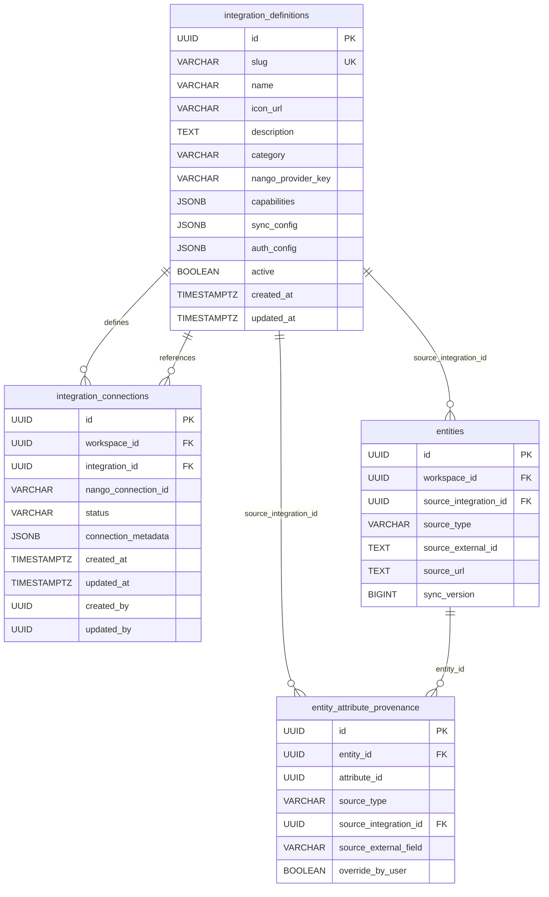
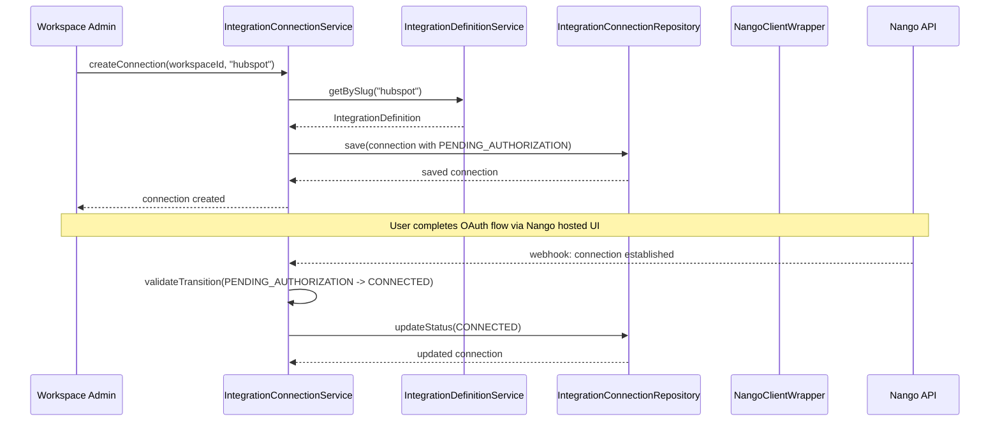
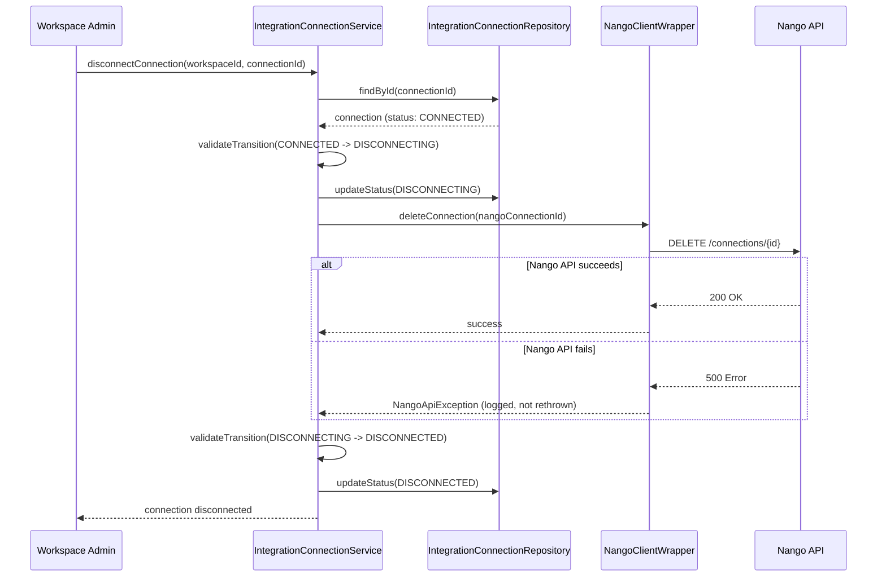

---
tags:
  - priority/high
  - status/draft
  - architecture/feature
Created: 2026-02-13
Domains:
  - "[[Integrations]]"
  - "[[Entities]]"
Sub-Domain: "[[Entity Integration Sync]]"
---
# Feature: Integration Access Layer

---

## 1. Overview

### Problem Statement

The platform's core value proposition is connecting third-party tools into a unified entity ecosystem so teams can build cross-domain intelligence. To do this, the system needs a centralized mechanism for managing OAuth connections, storing connection state, and communicating with third-party APIs. Without an integration access layer, each integration would require bespoke authentication logic, token management, retry handling, and connection lifecycle management -- an approach that does not scale to the dozens of integrations the platform intends to support.

### Proposed Solution

A layered integration access layer consisting of three components:

1. **Integration Definitions Catalog** -- a global, database-stored catalog of supported integrations. Each entry defines the integration's Nango provider key, capabilities (what models it can sync), sync configuration, and authentication requirements. This catalog is seeded via Flyway migration and is not workspace-scoped.

2. **Integration Connections** -- workspace-scoped records tracking which integrations a workspace has connected. Each connection stores the Nango connection ID, current lifecycle status, and connection metadata. Connections are protected by RLS policies matching the same pattern used for entities.

3. **Nango REST API Client** -- a Spring `WebClient`-based wrapper around the Nango REST API that handles authentication, retry logic with exponential backoff, and rate limit (429) handling. This client is the single point of contact with Nango's infrastructure for connection management operations.

This layer deliberately excludes REST controllers -- the Phase 1 implementation provides service-layer infrastructure only. Controllers, webhook handlers, and sync orchestration are deferred to later phases.

### Success Criteria

- Integration definitions can be queried by ID, slug, category, and active status.
- Integration connections can be created, transitioned through lifecycle states, and disconnected with state machine enforcement.
- Nango API communication handles retries, rate limits, and transient failures gracefully.
- Workspace isolation is enforced at the database level via RLS, preventing cross-workspace connection access.
- All existing entity creation flows continue to work without modification.

---

## 2. Data Model

### New Entities

| Entity | Purpose | Key Fields |
|--------|---------|------------|
| `IntegrationDefinitionEntity` | Global catalog entry for a supported integration | `id`, `slug`, `name`, `nangoProviderKey`, `capabilities`, `syncConfig`, `authConfig`, `category`, `active` |
| `IntegrationConnectionEntity` | Workspace-scoped record of an active integration connection | `id`, `workspaceId`, `integrationId`, `nangoConnectionId`, `status`, `connectionMetadata` |

### Entity Modifications

No modifications to existing JPA entities. Foreign key constraints from `entities.source_integration_id` and `entity_attribute_provenance.source_integration_id` to `integration_definitions.id` are added in V004, but these are database-level constraints only -- the JPA entity classes for provenance are created in [[Entity Provenance Tracking]] without requiring changes here.

### Data Ownership

- **IntegrationDefinitionEntity** is owned by the Integrations domain. It is a global resource with no workspace scoping. The catalog is seeded by Flyway migrations and managed by `IntegrationDefinitionService`.
- **IntegrationConnectionEntity** is owned by the Integrations domain, scoped to a workspace. It extends `AuditableEntity` for standard audit fields (`createdAt`, `updatedAt`, `createdBy`, `updatedBy`). Managed by `IntegrationConnectionService`.

### Relationships



### Data Lifecycle

- **Integration Definitions:** Created via Flyway seed migration (V005). Read-only at runtime -- no user-facing CRUD. New integrations are added through future migrations. Definitions are never deleted; they are deactivated by setting `active = false`.
- **Integration Connections:** Created when a workspace admin initiates an integration connection. Transitions through lifecycle states (see Component Design). Disconnection soft-deletes by transitioning to `DISCONNECTED` status. The connection record remains for audit purposes.
- **Cascade behavior:** Deleting an integration definition is not supported (definitions are global and persistent). Deleting a workspace cascades to its connections via standard FK cascade rules.

### Consistency Requirements

- Requires strong consistency (ACID transactions). Connection status transitions must be atomic to prevent invalid state machine jumps. The `UNIQUE(workspace_id, integration_id)` constraint ensures a workspace cannot have duplicate connections to the same integration.

---

## 3. Component Design

### New Components

#### NangoConfigurationProperties

- **Responsibility:** Binds configuration from the `riven.nango` prefix to a typed properties class. Reads `NANGO_SECRET_KEY`, `NANGO_BASE_URL` (defaults to `https://api.nango.dev`), and `NANGO_WEBHOOK_SECRET` from environment variables.
- **Dependencies:** Spring Boot `@ConfigurationProperties` infrastructure
- **Exposes to:** `NangoClientConfiguration`, `NangoClientWrapper`

#### NangoClientConfiguration

- **Responsibility:** Creates a qualified `WebClient` bean (`"nangoWebClient"`) preconfigured with the Nango base URL and `Authorization: Bearer {secretKey}` header. This bean is injected into `NangoClientWrapper` to ensure all Nango API calls use consistent authentication.
- **Dependencies:** `NangoConfigurationProperties`
- **Exposes to:** `NangoClientWrapper`

#### NangoClientWrapper

- **Responsibility:** REST API client wrapping Nango's connection management endpoints. Provides `getConnection(connectionId)`, `listConnections(integrationId)`, and `deleteConnection(connectionId)` methods. Implements retry logic with 3 attempts and exponential backoff. Detects 429 rate limit responses and backs off accordingly. Performs runtime validation that the Nango secret key is configured before making API calls.
- **Dependencies:** `NangoClientConfiguration` (via `@Qualifier("nangoWebClient")`)
- **Exposes to:** `IntegrationConnectionService`
- **Error handling:** Throws `NangoApiException` for non-retryable API errors. Throws `RateLimitException` when rate limits are exhausted after retries.

#### NangoModels

- **Responsibility:** Data classes representing Nango API request/response structures: `NangoConnection`, `NangoConnectionList`, `NangoCreateConnectionRequest`, `NangoErrorResponse`. These are internal DTOs for Nango API communication, not exposed to consumers of the integration layer.
- **Dependencies:** None
- **Exposes to:** `NangoClientWrapper`

#### IntegrationDefinitionService

- **Responsibility:** Read-only catalog query service. Methods: `getById(id)`, `getBySlug(slug)`, `getActiveIntegrations()`, `getByCategory(category)`. No write operations -- the catalog is managed via migrations.
- **Dependencies:** `IntegrationDefinitionRepository`
- **Exposes to:** `IntegrationConnectionService`, future sync orchestration services

#### IntegrationConnectionService

- **Responsibility:** Manages the full lifecycle of integration connections with state machine enforcement. Key operations:
  - `createConnection(workspaceId, integrationSlug)` -- creates a new connection in `PENDING_AUTHORIZATION` status. Requires `ADMIN` role via `@PreAuthorize`.
  - `updateConnectionStatus(connectionId, newStatus)` -- validates the transition against `ConnectionStatus.canTransitionTo()` before applying. Throws `InvalidStateTransitionException` for illegal transitions.
  - `disconnectConnection(workspaceId, connectionId)` -- transitions to `DISCONNECTED` and calls `NangoClientWrapper.deleteConnection()`. Requires `ADMIN` role. Handles Nango API failure gracefully (the local connection is still marked as disconnected even if the Nango API call fails).
- **Dependencies:** `IntegrationConnectionRepository`, `IntegrationDefinitionService`, `NangoClientWrapper`
- **Exposes to:** Future controllers, webhook handlers, sync orchestration services

#### ConnectionStatus Enum

- **Responsibility:** Defines the 10 lifecycle states and valid transitions between them. The `canTransitionTo(target)` method encodes the state machine rules.
- **States:** `PENDING_AUTHORIZATION`, `AUTHORIZING`, `CONNECTED`, `SYNCING`, `SYNC_FAILED`, `PAUSED`, `ERROR`, `REFRESHING_TOKEN`, `DISCONNECTING`, `DISCONNECTED`
- **Key transitions:**
  - `PENDING_AUTHORIZATION` -> `AUTHORIZING`, `DISCONNECTED`
  - `AUTHORIZING` -> `CONNECTED`, `ERROR`, `DISCONNECTED`
  - `CONNECTED` -> `SYNCING`, `PAUSED`, `DISCONNECTING`, `REFRESHING_TOKEN`
  - `SYNCING` -> `CONNECTED`, `SYNC_FAILED`, `ERROR`
  - `SYNC_FAILED` -> `SYNCING`, `PAUSED`, `DISCONNECTING`
  - `PAUSED` -> `CONNECTED`, `DISCONNECTING`
  - `ERROR` -> `AUTHORIZING`, `DISCONNECTING`
  - `REFRESHING_TOKEN` -> `CONNECTED`, `ERROR`
  - `DISCONNECTING` -> `DISCONNECTED`
  - `DISCONNECTED` -> (terminal state, no outbound transitions)

#### IntegrationCategory Enum

- **Values:** `CRM`, `PAYMENTS`, `SUPPORT`, `EMAIL`, `PROJECT_MANAGEMENT`, `COMMUNICATION`, `OTHER`

#### SyncDirection Enum

- **Values:** `INBOUND`, `OUTBOUND`, `BIDIRECTIONAL`

### Affected Existing Components

| Component | Change Required | Impact |
|-----------|----------------|--------|
| `entities` table | FK constraint added from `source_integration_id` to `integration_definitions.id` | Database-level only, no JPA entity changes |
| `entity_attribute_provenance` table | FK constraint added from `source_integration_id` to `integration_definitions.id` | Database-level only, no JPA entity changes |

### Component Interaction Diagram





---

## 4. API Design

### No REST Controllers in Phase 1

This is intentional. The Integration Access Layer establishes the service-layer infrastructure -- data model, Nango client, catalog service, and connection lifecycle management. REST controllers for integration management, webhook endpoints for Nango callbacks, and sync orchestration endpoints are deferred to subsequent phases where the full user-facing flow is implemented.

### Internal API Surface (NangoClientWrapper)

The `NangoClientWrapper` exposes the following methods for internal use by services within the integration domain:

| Method | Parameters | Returns | Purpose |
|--------|-----------|---------|---------|
| `getConnection` | `connectionId: String` | `NangoConnection` | Retrieves connection details and current auth status from Nango |
| `listConnections` | `integrationId: String` | `NangoConnectionList` | Lists all Nango connections for a given integration provider |
| `deleteConnection` | `connectionId: String` | `Unit` | Removes a connection from Nango, revoking tokens |

All methods throw `NangoApiException` on non-retryable errors and `RateLimitException` when rate limits are exhausted.

### Internal API Surface (Services)

| Service | Method | Authorization | Purpose |
|---------|--------|---------------|---------|
| `IntegrationDefinitionService` | `getById(id)` | None (read-only catalog) | Retrieve definition by UUID |
| `IntegrationDefinitionService` | `getBySlug(slug)` | None | Retrieve definition by unique slug |
| `IntegrationDefinitionService` | `getActiveIntegrations()` | None | List all active integration definitions |
| `IntegrationDefinitionService` | `getByCategory(category)` | None | Filter definitions by category |
| `IntegrationConnectionService` | `createConnection(workspaceId, slug)` | `ADMIN` role | Create new connection |
| `IntegrationConnectionService` | `updateConnectionStatus(connectionId, status)` | Internal only | Transition connection state |
| `IntegrationConnectionService` | `disconnectConnection(workspaceId, connectionId)` | `ADMIN` role | Disconnect and clean up |

---

## 5. Failure Modes & Recovery

### Dependency Failures

| Dependency | Failure Scenario | System Behavior | Recovery |
|------------|-----------------|-----------------|----------|
| PostgreSQL | Database unavailable | All connection and catalog operations fail | Standard Spring retry. Flyway blocks startup until DB is available. |
| Nango API | Nango service unavailable (5xx) | `NangoClientWrapper` retries up to 3 times with exponential backoff, then throws `NangoApiException` | Connection remains in current state. Operation can be retried by caller. |
| Nango API | Rate limited (429) | `NangoClientWrapper` backs off based on `Retry-After` header, retries up to 3 times | If retries exhausted, throws `RateLimitException`. Caller should retry after delay. |
| Nango API | Invalid secret key | `NangoClientWrapper` runtime validation fails on first call | Application logs error. Secret key must be corrected in environment variables. |

### Partial Failure Scenarios

| Scenario | State Left Behind | Recovery Strategy |
|----------|------------------|-------------------|
| Connection created locally but Nango OAuth never completed | Connection stuck in `PENDING_AUTHORIZATION` | Future cleanup job can detect stale `PENDING_AUTHORIZATION` connections and transition them to `DISCONNECTED`. |
| Disconnect succeeds locally but Nango `deleteConnection` fails | Connection marked `DISCONNECTED` locally, but Nango still holds the connection | Acceptable state. The local system treats the connection as disconnected. Nango connection becomes orphaned but poses no security risk (tokens expire naturally). Logged for manual review. |
| Status update fails mid-transaction | Transaction rolls back, status unchanged | Caller retries the operation. State machine ensures no invalid intermediate states. |

### Rollback Strategy

- Database migrations V003, V004, V005 are additive (new tables, new constraints, new seed data). Rollback requires corresponding `UNDO` migrations that drop the tables and constraints.
- The feature has no REST API surface in Phase 1, so there is no client-facing behavior to roll back.
- Backward compatible with previous version: existing entity and workflow functionality is unaffected by the presence of integration tables.

### Blast Radius

If the integration access layer fails completely:
- No integration connections can be created or managed.
- No integration sync operations can proceed (blocked at the connection layer).
- Existing entity CRUD, workflow execution, and all non-integration features remain fully operational.
- The Nango client failure is isolated -- it does not affect database operations or other service layers.

---

## 6. Security

### Authentication & Authorization

- **Integration definition catalog** is publicly readable (no workspace scoping). Definitions are global system configuration, not user data. No authorization checks on read operations.
- **Integration connections** are strictly workspace-scoped. RLS policies on `integration_connections` use the same `workspace_members` subquery pattern as the `entities` table, ensuring a user can only see connections belonging to workspaces they are a member of.
- **Create and disconnect operations** require the `ADMIN` role within the workspace, enforced via `@PreAuthorize("@workspaceSecurity.hasRole(#workspaceId, 'ADMIN')")`.
- **Nango secret key** is stored as an environment variable (`NANGO_SECRET_KEY`), never in the database or application configuration files. The `NangoConfigurationProperties` class binds it from the environment at startup.

### Data Sensitivity

| Data Element | Sensitivity | Protection Required |
|-------------|-------------|---------------------|
| `nango_connection_id` | Confidential | RLS prevents cross-workspace access. Not a secret itself, but identifies a Nango-managed OAuth session. |
| `connection_metadata` (JSONB) | Confidential | May contain integration-specific metadata (account names, workspace identifiers in the third-party tool). Protected by RLS. |
| `NANGO_SECRET_KEY` | Secret | Environment variable only. Never logged, never stored in database. Runtime validation confirms it is set. |
| `NANGO_WEBHOOK_SECRET` | Secret | Environment variable only. Used to validate inbound webhook signatures in future phases. |
| Integration definition data | Public | Catalog data (names, icons, categories) is not sensitive. |

### Trust Boundaries

- Data from Nango API responses (`NangoConnection`, `NangoConnectionList`) crosses a trust boundary. All responses are deserialized into typed data classes (`NangoModels`) and validated before use. Unexpected response shapes result in `NangoApiException`.
- Connection metadata stored in the `connection_metadata` JSONB column is treated as opaque data -- the system stores it but does not execute or interpret its contents beyond basic serialization.

### RLS Policy (integration_connections)

```sql
CREATE POLICY workspace_isolation ON integration_connections
    USING (workspace_id IN (
        SELECT workspace_id FROM workspace_members
        WHERE user_id = current_setting('app.current_user_id')::UUID
    ));
```

This mirrors the RLS policy pattern applied to the `entities` table, ensuring consistent workspace isolation across all workspace-scoped tables.

---

## 7. Performance & Scale

### Expected Load

- **Integration definitions:** Low read volume. Cached in-memory after first access. The catalog contains fewer than 100 entries at scale.
- **Integration connections:** Low write volume (connections are created/disconnected infrequently). Read volume proportional to sync frequency, but sync operations are handled in later phases.
- **Nango API calls:** Bounded by the number of active connections. `deleteConnection` is called only on explicit disconnect. `getConnection` and `listConnections` are used during sync orchestration (future phases).

### Database Considerations

**Indexes:**

| Table | Index | Purpose |
|-------|-------|---------|
| `integration_definitions` | `UNIQUE(slug)` | Fast lookup by integration slug |
| `integration_connections` | `UNIQUE(workspace_id, integration_id)` | Enforce one connection per integration per workspace |
| `integration_connections` | Index on `workspace_id` | RLS policy performance |
| `integration_connections` | Index on `status` | Query connections by lifecycle state |

**JSONB columns:** `capabilities`, `sync_config`, `auth_config` on `integration_definitions` and `connection_metadata` on `integration_connections` use JSONB via Hypersistence Utils `JsonBinaryType`. JSONB is chosen over normalized columns because the structure varies significantly across integrations (a CRM has different capabilities than a payment processor). JSONB supports `@>` containment queries if filtering by capability is needed in future.

**Query patterns:**
- Catalog queries are simple primary key or slug lookups -- no complex joins.
- Connection queries filter by `workspace_id` (covered by RLS) and optionally by `status` or `integration_id`.
- No N+1 risks in Phase 1 as the service layer does not eagerly load relationships.

---

## 8. Observability

### Key Metrics

| Metric | Normal Range | Alert Threshold |
|--------|-------------|-----------------|
| Nango API response time (p99) | < 500ms | > 2000ms |
| Nango API error rate | < 1% | > 5% |
| Rate limit (429) frequency | < 1/min | > 10/min |
| Connection state transitions / hour | Varies by workspace activity | N/A (informational) |

### Logging

| Event | Level | Key Fields |
|-------|-------|------------|
| Nango API call initiated | DEBUG | `method`, `endpoint`, `connectionId` |
| Nango API call succeeded | INFO | `method`, `endpoint`, `responseTime` |
| Nango API call failed (retryable) | WARN | `method`, `endpoint`, `statusCode`, `retryAttempt` |
| Nango API call failed (exhausted retries) | ERROR | `method`, `endpoint`, `statusCode`, `totalAttempts` |
| Rate limit hit (429) | WARN | `endpoint`, `retryAfter` |
| Connection status transition | INFO | `connectionId`, `fromStatus`, `toStatus`, `workspaceId` |
| Invalid state transition attempted | WARN | `connectionId`, `currentStatus`, `attemptedStatus` |
| Connection created | INFO | `connectionId`, `workspaceId`, `integrationSlug` |
| Connection disconnected | INFO | `connectionId`, `workspaceId`, `nangoDeleteSuccess` |

### Tracing

- `NangoClientWrapper` methods should create spans for each outbound HTTP call to Nango, capturing the HTTP method, endpoint, response status, and duration. This enables tracing the full lifecycle of a connection operation from the service layer through to the external API call.

### Alerting

| Condition | Severity | Response |
|-----------|----------|----------|
| Nango API error rate > 5% for 5 minutes | High | Investigate Nango service status. Check if secret key is valid. |
| Rate limit (429) > 10/min sustained | Medium | Review call patterns. May indicate a sync loop or misconfigured retry. |
| Connections stuck in `PENDING_AUTHORIZATION` > 1 hour | Low | May indicate abandoned OAuth flows. No immediate action required. |

---

## 9. Testing Strategy

### Unit Tests

#### ConnectionStatusTest

Tests the `canTransitionTo()` state machine on the `ConnectionStatus` enum:

- Verify all valid transitions (e.g., `PENDING_AUTHORIZATION` -> `AUTHORIZING` returns `true`)
- Verify all invalid transitions (e.g., `DISCONNECTED` -> `CONNECTED` returns `false`)
- Verify `DISCONNECTED` is a terminal state with no outbound transitions
- Verify every state has at least one valid outbound transition except `DISCONNECTED`
- Uses backtick-style test names per project convention (e.g., `` `PENDING_AUTHORIZATION can transition to AUTHORIZING` ``)

#### IntegrationConnectionServiceTest

Tests the service layer with mocked repositories and `NangoClientWrapper`:

- `createConnection` saves a connection in `PENDING_AUTHORIZATION` status
- `createConnection` throws when integration slug does not exist
- `createConnection` throws when a connection already exists for the workspace and integration (unique constraint)
- `updateConnectionStatus` succeeds for valid transitions
- `updateConnectionStatus` throws `InvalidStateTransitionException` for invalid transitions
- `disconnectConnection` transitions to `DISCONNECTING` then `DISCONNECTED`
- `disconnectConnection` still marks as `DISCONNECTED` even if Nango API call fails

### Integration Tests

- Not in Phase 1 scope. Integration tests requiring a running database and/or Nango API mock server will be added when REST controllers are introduced in later phases.

### Load Testing

- Not required for Phase 1. The service layer handles low-volume connection lifecycle operations. Load testing will be relevant when sync orchestration introduces high-frequency Nango API calls.

---

## 10. Migration & Rollout

### Database Migrations

| Migration | Description | Key Details |
|-----------|-------------|-------------|
| **V003** | Create `integration_definitions` table | Global catalog, no RLS. UUID PK, `slug` UNIQUE, JSONB columns for `capabilities`, `sync_config`, `auth_config`. `active` boolean, timestamps. |
| **V004** | Create `integration_connections` table + FK constraints | Workspace-scoped with RLS. UUID PK, FK to `integration_definitions`, FK to workspace. `UNIQUE(workspace_id, integration_id)`. RLS policies using `workspace_members` subquery. Also adds FK from `entities.source_integration_id` and `entity_attribute_provenance.source_integration_id` to `integration_definitions.id`. |
| **V005** | Seed initial integration definitions | 6 integrations: HubSpot (CRM), Salesforce (CRM), Stripe (PAYMENTS), Zendesk (SUPPORT), Intercom (SUPPORT), Gmail (EMAIL). Each entry includes `nango_provider_key`, category, and placeholder `capabilities`/`sync_config` JSONB. |

### Data Backfill

No existing data is affected. These are entirely new tables. The V005 seed migration populates the catalog with initial integration definitions. No entity data is modified.

### Rollout Phases

| Phase | Scope | Success Criteria | Rollback Trigger |
|-------|-------|-----------------|------------------|
| 1 | Flyway migrations (V003, V004, V005) | Tables created, RLS policies active, seed data present | Migration failure on startup |
| 2 | Service layer deployment | `IntegrationDefinitionService` and `IntegrationConnectionService` operational, `NangoClientWrapper` can authenticate with Nango API | Service startup failure or Nango API connectivity issue |
| 3 | (Future) REST controllers + webhook handlers | User-facing integration management | N/A -- separate feature design |

Flyway manages execution order automatically. Migrations V001 and V002 ([[Entity Provenance Tracking]]) run before V003 and V004, ensuring the `entities` and `entity_attribute_provenance` tables exist before FK constraints are added in V004.

---

## 11. Open Questions

> [!warning] Unresolved
>
> - [ ] Should `integration_definitions` support runtime updates (e.g., admin UI to enable/disable integrations) or remain strictly migration-managed?
> - [ ] What is the cleanup strategy for connections stuck in `PENDING_AUTHORIZATION` after the user abandons the OAuth flow? Scheduled job vs. TTL-based expiration?
> - [ ] Should `connection_metadata` have a defined schema per integration type, or remain fully opaque JSONB?
> - [ ] How will webhook signature verification work when Nango sends connection status callbacks? Deferred to the webhook handler phase, but the `NANGO_WEBHOOK_SECRET` is already provisioned.

---

## 12. Decisions Log

| Date | Decision | Rationale | Alternatives Considered |
|------|----------|-----------|------------------------|
| 2026-02-13 | Use Nango as centralized integration infrastructure | Nango provides prebuilt OAuth flows, token management, rate limiting, and webhook infrastructure for 250+ integrations. Building this in-house would be a multi-month effort with ongoing maintenance burden. See [[ADR-001 Nango as Integration Infrastructure]]. | Direct OAuth implementation per provider; Unified.to; Merge.dev |
| 2026-02-13 | Store integration catalog in the database (not code) | Database-stored definitions allow catalog queries via standard JPA, Flyway-managed versioning, and future admin UI management. Code-based enums would require redeployment to add integrations. | Kotlin enum class; YAML configuration file; External catalog service |
| 2026-02-13 | 10-state connection lifecycle with `canTransitionTo()` state machine | Connections pass through multiple stages (authorization, syncing, error recovery, disconnection). A state machine prevents invalid transitions that could leave connections in inconsistent states. The `canTransitionTo()` method centralizes transition rules in the enum itself. | Simpler 3-state model (PENDING, ACTIVE, INACTIVE); External state machine library |
| 2026-02-13 | One connection per integration per workspace | Enforced by `UNIQUE(workspace_id, integration_id)`. Simplifies connection management and avoids confusion about which connection is active. A workspace connecting to HubSpot has exactly one HubSpot connection. | Allow multiple connections per integration (e.g., connecting two HubSpot accounts); no constraint (managed in application logic) |
| 2026-02-13 | No REST controllers in Phase 1 | The service layer needs to be stable and tested before exposing it via HTTP. Controllers require additional design decisions (request/response DTOs, error handling, pagination) that are better addressed when the full user flow is designed. | Build controllers alongside services; API-first development |
| 2026-02-13 | Graceful handling of Nango API failure during disconnect | When disconnecting, the local connection is always marked as `DISCONNECTED` even if the Nango API call to revoke the connection fails. This prevents a Nango outage from blocking workspace cleanup. Orphaned Nango connections expire naturally as tokens are not refreshed. | Strict consistency (fail the disconnect if Nango fails); Retry queue for failed Nango calls |

---

## 13. Implementation Tasks

- [ ] **V003 Migration: Integration Definitions Table** -- Create `integration_definitions` table with UUID PK, `slug` (UNIQUE), `name`, `icon_url`, `description`, `category`, `nango_provider_key`, `capabilities` (JSONB), `sync_config` (JSONB), `auth_config` (JSONB), `active` (BOOLEAN), and timestamps.
- [ ] **V004 Migration: Integration Connections Table + FK Constraints** -- Create `integration_connections` table with UUID PK, `workspace_id` FK, `integration_id` FK to `integration_definitions`, `nango_connection_id`, `status` (DEFAULT `'PENDING_AUTHORIZATION'`), `connection_metadata` (JSONB), audit columns. Add `UNIQUE(workspace_id, integration_id)`. Create RLS policy matching entity pattern. Add FK constraints from `entities.source_integration_id` and `entity_attribute_provenance.source_integration_id` to `integration_definitions.id`.
- [ ] **Enums: ConnectionStatus, IntegrationCategory, SyncDirection** -- Create `ConnectionStatus` enum with 10 states and `canTransitionTo()` method. Create `IntegrationCategory` and `SyncDirection` enums.
- [ ] **JPA Entities and Repositories** -- Create `IntegrationDefinitionEntity` (no `AuditableEntity`, global scope) and `IntegrationConnectionEntity` (extends `AuditableEntity`). Create `IntegrationDefinitionRepository` and `IntegrationConnectionRepository` extending `JpaRepository<Entity, UUID>`.
- [ ] **Nango Client Infrastructure** -- Create `NangoConfigurationProperties` (`@ConfigurationProperties(prefix = "riven.nango")`). Create `NangoClientConfiguration` with qualified `WebClient` bean. Create `NangoModels` data classes. Create `NangoClientWrapper` with retry logic, rate limit handling, and runtime secret key validation.
- [ ] **Custom Exceptions** -- Create `RateLimitException`, `NangoApiException`, `InvalidStateTransitionException`.
- [ ] **IntegrationDefinitionService** -- Implement catalog query methods (`getById`, `getBySlug`, `getActiveIntegrations`, `getByCategory`).
- [ ] **IntegrationConnectionService** -- Implement connection lifecycle management with state machine enforcement, `@PreAuthorize` on `createConnection` and `disconnectConnection`, graceful Nango failure handling on disconnect.
- [ ] **V005 Migration: Seed Integration Catalog** -- Seed 6 initial integrations: HubSpot (CRM, `hubspot`), Salesforce (CRM, `salesforce`), Stripe (PAYMENTS, `stripe`), Zendesk (SUPPORT, `zendesk`), Intercom (SUPPORT, `intercom`), Gmail (EMAIL, `gmail`).
- [ ] **ConnectionStatusTest** -- Unit tests for all valid and invalid state transitions on the `ConnectionStatus` enum.
- [ ] **IntegrationConnectionServiceTest** -- Unit tests for connection creation, status updates, disconnect flow, and error cases with mocked dependencies.

---

## Related Documents

- [[ADR-001 Nango as Integration Infrastructure]]
- [[Flow Integration Connection Lifecycle]]
- [[Entity Integration Sync]]
- [[Entity Provenance Tracking]]
- [[Integration Schema Mapping]]
- [[Integration Identity Resolution System]]
- [[Predefined Integration Entity Types]]
- [[Entities]]
- [[Workspaces & Users]]

---

## Changelog

| Date | Author | Change |
|------|--------|--------|
| 2026-02-13 | | Initial draft -- full design replacing quick design stub. Covers data model (V003-V005), component design (Nango client, services, enums), failure modes, security (RLS + RBAC), and implementation tasks. |
