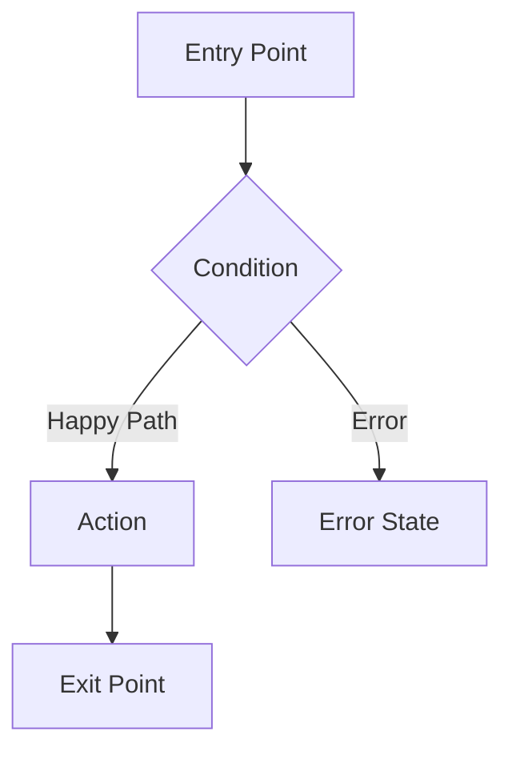

---
tags:
  - priority/high
  - status/draft
  - status/designed
  - status/implemented
  - architecture/design
  - architecture/feature
  - architecture/frontend
Created:
Updated:
Domains:
  - "[[Integrations]]"
Backend-Feature: "[[Integrations]]"
Pages:
  - "[[]]"
---
# Frontend Feature: Integration Connection UI

---

## 1. Overview

### Problem Statement

_What user-facing problem does this feature solve? What is the current experience gap?_

### Proposed Solution

_High-level description of the approach (2-3 sentences max)_

### Success Criteria

_User-observable outcomes that indicate the feature is working correctly_

- [ ] Criterion 1
- [ ] Criterion 2

---

## 2. User Flows

_Entry points → happy path → error/empty states → exit points_



### Alternate Flows

_Secondary paths, edge cases, permission-gated flows_

---

## 3. Information Architecture

### Data Displayed

_What data is shown, and in what visual hierarchy?_

| Data Element | Source | Priority | Display Format |
| ------------ | ------ | -------- | -------------- |
|              |        | Primary / Secondary | |

### Grouping & Sorting

_Default grouping, sort order, and user-configurable options_

### Visual Hierarchy

_What draws attention first → second → tertiary. Layout zones._

---

## 4. Component Design

### Component Tree

```
FeatureRoot
├── ComponentA
│   ├── SubComponentA1
│   └── SubComponentA2
└── ComponentB
```

### Component Responsibilities

#### ComponentName

- **Responsibility:**
- **Props:**

```typescript
interface ComponentNameProps {

}
```

- **Shared components used:** [[]]
- **Children:**

### Shared Component Reuse

_Which existing shared components does this feature consume?_

| Component | Source | Purpose |
| --------- | ------ | ------- |
|           |        |         |

---

## 5. State Management

### Server State (TanStack Query)

| Query/Mutation | Key | Stale Time | Invalidated By |
| -------------- | --- | ---------- | -------------- |
|                |     |            |                |

### URL State

_Search params, route segments, filters persisted in URL_

| Param | Purpose | Default |
| ----- | ------- | ------- |
|       |         |         |

### Local State (React)

| State | Owner Component | Purpose |
| ----- | --------------- | ------- |
|       |                 |         |

---

## 6. Data Fetching

### Endpoints Consumed

| Endpoint | Method | Backend Feature Section | Purpose |
| -------- | ------ | ----------------------- | ------- |
|          |        | [[]] §API Design        |         |

### Query/Mutation Hooks

_Custom hooks wrapping TanStack Query — naming, params, return types_

### Optimistic Updates

_Which mutations use optimistic updates? Rollback strategy on failure?_

### Loading & Skeleton Strategy

_What does the user see while data loads? Skeleton shapes, shimmer, spinners._

---

## 7. Interaction Design

### Keyboard Shortcuts

| Shortcut | Action | Scope |
| -------- | ------ | ----- |
|          |        |       |

### Drag & Drop

_Draggable elements, drop zones, visual feedback_

### Modals & Drawers

_Which interactions open overlays? Trigger, content, dismiss behavior._

### Inline Editing

_Which fields support inline edit? Activation, validation, save behavior._

### Bulk Selection

_Multi-select pattern, bulk action bar, select-all behavior_

### Context Menus

_Right-click / action menus — items, placement, keyboard access_

---

## 8. Responsive & Accessibility

### Breakpoint Behavior

| Breakpoint | Layout Change |
| ---------- | ------------- |
| Desktop    |               |
| Tablet     |               |
| Mobile     |               |

### Accessibility

- **ARIA roles/labels:**
- **Keyboard navigation order:**
- **Screen reader considerations:**
- **Focus management:**
- **Color contrast:**

---

## 9. Error, Empty & Loading States

| State | Condition | Display | User Action |
| ----- | --------- | ------- | ----------- |
| Loading | Initial fetch | | |
| Empty | No data exists | | |
| Filtered empty | Filters yield zero results | | |
| Network error | API unreachable | | |
| Permission error | Insufficient access | | |
| Partial failure | Some data loads, some fails | | |

---

## 10. Implementation Tasks

### Foundation

- [ ] Task

### Core

- [ ] Task

### Polish

- [ ] Task

---

## Related Documents

- [[]] — Backend feature design
- [[Flow - Related Flow]]
- [[Domain - Relevant Domain]]

---

## Changelog

| Date | Author | Change        |
| ---- | ------ | ------------- |
|      |        | Initial draft |
