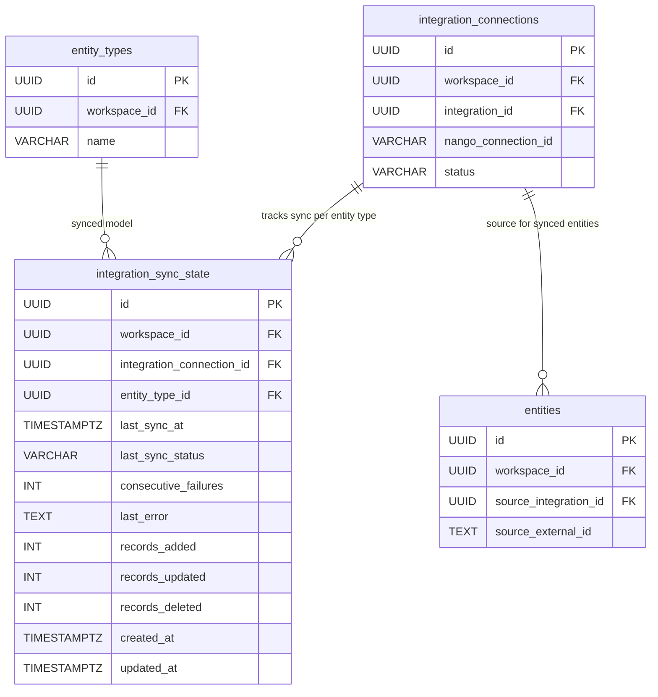
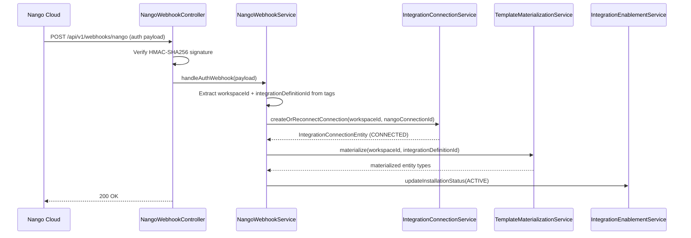
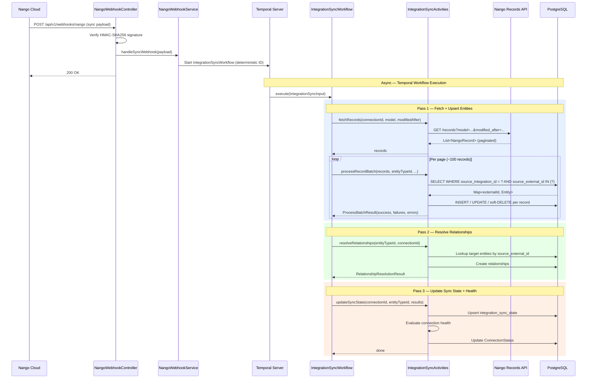

---
tags:
  - "#status/draft"
  - priority/high
  - architecture/feature
Created: 2026-03-16
Updated: 2026-03-16
Domains:
  - "[[riven/docs/system-design/domains/Integrations/Integrations]]"
  - "[[riven/docs/system-design/domains/Entities/Entities]]"
Sub-Domain: "[[riven/docs/system-design/feature-design/_Sub-Domain Plans/Entity Integration Sync]]"
---

# Feature: Integration Data Sync Pipeline

---

## 1. Overview

### Problem Statement

The integration infrastructure has three layers in place: a global catalog ([[riven/docs/system-design/feature-design/3. Active/Integration Access Layer|IntegrationDefinitionEntity]]), workspace connections ([[riven/docs/system-design/feature-design/3. Active/Integration Access Layer|IntegrationConnectionEntity]]), and installation tracking (WorkspaceIntegrationInstallationEntity). Schema mapping ([[2. Areas/2.1 Startup & Content/Riven/2. System Design/feature-design/1. Planning/Integration Schema Mapping|SchemaMappingService]]) and template materialization (TemplateMaterializationService) are built. What is missing is the **data sync pipeline** — the mechanism that receives Nango webhook notifications, fetches synced records, maps them to entities, and persists them with deduplication and relationship resolution.

Additionally, the current auth flow creates connections pre-emptively in `PENDING_AUTHORIZATION` state during enablement. This is deprecated dead code — Nango handles authentication entirely via its Connect UI, and the backend should only create connections in response to Nango's auth webhook. The `ConnectionStatus` enum needs simplification to reflect this webhook-driven reality.

Without this pipeline, integrations can be connected and their schemas mapped, but no external data actually flows into the entity ecosystem. The sync pipeline is the critical bridge between Nango's managed records cache and the Riven entity layer.

### Proposed Solution

A Temporal-orchestrated sync pipeline triggered by Nango webhooks, consisting of:

1. **Webhook ingestion endpoint** — receives Nango auth and sync webhooks, verifies HMAC signatures, and dispatches to handlers. Auth webhooks create connections and trigger materialization. Sync webhooks start Temporal workflows.

2. **Temporal sync workflow** — a three-pass durable workflow per entity type per connection:
   - **Pass 1:** Fetch records from Nango's records API (paginated, heartbeating) and upsert entities with batch deduplication via the existing `source_external_id` + `source_integration_id` columns on the `entities` table (unique partial index).
   - **Pass 2:** Resolve relationships between integration entity types using external reference IDs.
   - **Pass 3:** Update per-entity-type sync state and evaluate connection health.

3. **Connection health aggregator** — reads per-entity-type sync state to determine overall connection health (HEALTHY, DEGRADED, FAILED), driving `ConnectionStatus` transitions.

4. **Auth flow simplification** — connections are created only via Nango's auth webhook (not pre-created during enablement). The `ConnectionStatus` enum is streamlined to remove deprecated states.

### Success Criteria

- [ ] Nango auth webhooks create connections, trigger materialization, and update installation status to ACTIVE
- [ ] Nango sync webhooks trigger Temporal workflows that fetch, map, and persist integration records
- [ ] Duplicate webhook deliveries are handled idempotently via deterministic Temporal workflow IDs
- [ ] Records are deduplicated using `source_external_id` + `source_integration_id` with a unique partial index
- [ ] Per-record errors do not fail the batch — errors are aggregated and reported
- [ ] Relationships between integration entity types are resolved in a two-pass workflow
- [ ] Connection health reflects per-entity-type sync status (HEALTHY / DEGRADED / FAILED)
- [ ] HMAC signature verification rejects invalid webhook requests
- [ ] Installation status surfaces auth webhook failures to users (PENDING_CONNECTION / ACTIVE / FAILED)
- [ ] All existing entity creation flows continue to work without modification

---

## 2. Data Model

### New Entities

| Entity | Purpose | Key Fields |
|--------|---------|------------|
| `IntegrationSyncStateEntity` | Tracks per-entity-type sync health for a connection | `id`, `workspaceId`, `integrationConnectionId`, `entityTypeId`, `lastSyncAt`, `lastSyncStatus` (SyncStatus), `consecutiveFailures`, `lastError`, `recordsAdded`, `recordsUpdated`, `recordsDeleted` |

### Entity Modifications

| Entity | Change | Rationale |
|--------|--------|-----------|
| `WorkspaceIntegrationInstallationEntity` | Add `status: InstallationStatus` field (default `PENDING_CONNECTION`) | Surfaces auth webhook failures to users instead of silent "waiting" state |
| `ConnectionStatus` enum | Remove `PENDING_AUTHORIZATION`, `AUTHORIZING`; add `HEALTHY`, `DEGRADED`, `STALE` | Auth is handled entirely by Nango frontend flows — these states are deprecated dead code. New states reflect sync health. |
| `entities` table | Add unique partial index on `(workspace_id, source_integration_id, source_external_id)` | Enforces deduplication for integration-sourced entities at the database level |

### New Enums

| Enum | Values | Purpose |
|------|--------|---------|
| `SyncStatus` | `PENDING`, `SUCCESS`, `FAILED` | Used by `integration_sync_state.last_sync_status` |
| `InstallationStatus` | `PENDING_CONNECTION`, `ACTIVE`, `FAILED` | Used by `workspace_integration_installations.status` |

### Relationships



### Data Lifecycle

- **Creation:** `IntegrationSyncStateEntity` rows are created on the first sync for each `(connection, entity_type)` combination. Entities are created during Pass 1 of the sync workflow.
- **Updates:** Sync state is updated after every sync workflow completion. Entity attributes are fully replaced on each sync (external system is source of truth). `consecutiveFailures` resets to 0 on success, increments on failure.
- **Deletion:** Entities are soft-deleted when Nango reports a `DELETED` record. Sync state rows are not deleted — they persist for health history. No cascade on entity soft-delete.

### Consistency Requirements

- [x] Requires strong consistency (ACID transactions)
- Per-record processing within a batch is transactional. Sync state updates are atomic. Connection health transitions use the existing `ConnectionStatus.canTransitionTo()` state machine to prevent invalid states.
- Temporal provides at-least-once execution guarantees. Idempotency is enforced by the dedup index (upsert semantics) and deterministic workflow IDs (Temporal rejects duplicate starts).

---

## 3. Component Design

### New Components

#### NangoWebhookController

- **Responsibility:** Receives `POST /api/v1/webhooks/nango` requests. Verifies HMAC-SHA256 signature using `NangoConfigurationProperties.secretKey`. Parses payload type (auth vs sync). Delegates to `NangoWebhookService`. Returns 200 immediately.
- **Dependencies:** `NangoWebhookService`, `NangoConfigurationProperties`
- **Exposes to:** Nango webhook infrastructure (external)

#### NangoWebhookService

- **Responsibility:** Handles auth and sync webhook payloads. Auth webhooks: validates tags, creates connection via `IntegrationConnectionService`, triggers materialization, updates installation status. Sync webhooks: resolves connection by `nangoConnectionId`, starts `IntegrationSyncWorkflow` via Temporal client with deterministic workflow ID.
- **Dependencies:** [[riven/docs/system-design/feature-design/3. Active/Integration Access Layer|IntegrationConnectionService]], `TemplateMaterializationService`, `IntegrationEnablementService`, `WorkflowClient` (Temporal), `IntegrationConnectionRepository`, `ActivityService`
- **Exposes to:** `NangoWebhookController`

#### IntegrationSyncWorkflow / IntegrationSyncWorkflowImpl

- **Responsibility:** Temporal workflow interface and implementation. Orchestrates the three-pass sync pipeline: fetch + upsert entities, resolve relationships, update sync state + health.
- **Dependencies:** `IntegrationSyncActivities` (via Temporal activity stubs)
- **Exposes to:** `NangoWebhookService` (workflow starter)

#### IntegrationSyncActivities / IntegrationSyncActivitiesImpl

- **Responsibility:** Temporal activity implementations for each pipeline step. `fetchRecords` — paginated Nango record fetching with heartbeating. `processRecordBatch` — batch dedup lookup + per-record upsert/delete with error isolation. `resolveRelationships` — two-pass relationship resolution by `source_external_id`. `updateSyncState` — write per-entity-type metrics.
- **Dependencies:** `NangoClientWrapper`, [[2. Areas/2.1 Startup & Content/Riven/2. System Design/feature-design/1. Planning/Integration Schema Mapping|SchemaMappingService]], `EntityService`, `EntityRepository`, `EntityRelationshipService`, `IntegrationSyncStateRepository`, `IntegrationConnectionHealthService`
- **Exposes to:** `IntegrationSyncWorkflowImpl` (via Temporal)

#### IntegrationConnectionHealthService

- **Responsibility:** Aggregates per-entity-type sync state into an overall connection health status. All types SUCCESS = HEALTHY. Any type with 3+ consecutive failures = DEGRADED. All types FAILED = FAILED.
- **Dependencies:** `IntegrationSyncStateRepository`, [[riven/docs/system-design/feature-design/3. Active/Integration Access Layer|IntegrationConnectionService]]
- **Exposes to:** `IntegrationSyncActivitiesImpl`

#### IntegrationSyncTemporalConfiguration

- **Responsibility:** Registers the `IntegrationSyncWorkflow` and `IntegrationSyncActivities` with the Temporal worker factory. Configures the dedicated `integration.sync` task queue and retry policies.
- **Dependencies:** Temporal `WorkerFactory`, `IntegrationSyncActivitiesImpl`
- **Exposes to:** Spring application context (auto-configuration)

#### IntegrationSyncStateEntity + IntegrationSyncStateRepository

- **Responsibility:** JPA persistence for per-entity-type sync state. Does NOT extend `AuditableEntity` or implement `SoftDeletable` (system-managed, not user-facing).
- **Dependencies:** None
- **Exposes to:** `IntegrationSyncActivitiesImpl`, `IntegrationConnectionHealthService`

### Affected Existing Components

| Component | Change Required | Impact |
|-----------|----------------|--------|
| [[riven/docs/system-design/feature-design/3. Active/Integration Access Layer\|IntegrationConnectionService]] | Extract `createOrReconnectConnection()` private method from `enableConnection()`. Deprecate `enableConnection()` as public API — connections are now only created via webhook handler. | Auth webhook handler reuses connection creation logic without duplicating it. |
| `IntegrationEnablementService` | `enableIntegration()` no longer creates a connection or triggers materialization. Creates installation in `PENDING_CONNECTION` status only. | Materialization and initial sync are triggered by the auth webhook, not enablement. |
| `NangoClientWrapper` | Add `fetchRecords(connectionId, model, modifiedAfter, cursor, limit)` and `triggerSync(connectionId, syncName, fullResync)` methods. | Enables the sync workflow to pull delta records from Nango's records API. |
| `IntegrationConnectionRepository` | Add `findByNangoConnectionId(nangoConnectionId: String)` query. | Required by sync webhook handler to resolve Nango's connection ID to internal entity. |
| `EntityRepository` | Add `findByWorkspaceIdAndSourceIntegrationIdAndSourceExternalIdIn(workspaceId, sourceIntegrationId, externalIds)` batch query. | Enables O(1) per-record dedup lookup instead of N+1 queries. |
| `WorkspaceIntegrationInstallationEntity` | Add `status: InstallationStatus` field with `@Enumerated(EnumType.STRING)`, default `PENDING_CONNECTION`. | Surfaces installation state to users. |
| `ConnectionStatus` enum | Remove `PENDING_AUTHORIZATION`, `AUTHORIZING`. Add `HEALTHY`, `DEGRADED`, `STALE`. Update `canTransitionTo()` state machine. | Reflects webhook-driven auth flow and sync health states. |

### Component Interaction Diagram

#### Auth Webhook Flow



#### Sync Webhook Flow



---

## 4. API Design

### New Endpoints

#### `POST /api/v1/webhooks/nango`

- **Purpose:** Receives webhook notifications from Nango for auth events (OAuth completion) and sync events (data ready for fetching). This is not a user-facing endpoint — it is called exclusively by Nango's infrastructure.
- **Authentication:** HMAC-SHA256 signature verification via `X-Nango-Hmac-Sha256` header. No JWT authentication (webhooks originate from Nango, not authenticated users).
- **Request Headers:**
  - `X-Nango-Hmac-Sha256` — HMAC-SHA256 of the raw request body, computed using `NangoConfigurationProperties.secretKey`
  - `Content-Type: application/json`

- **Request (Auth Webhook):**

```json
{
  "type": "auth",
  "connectionId": "nango-conn-uuid",
  "providerConfigKey": "hubspot",
  "authMode": "OAUTH2",
  "operation": "creation",
  "success": true,
  "connection": {
    "id": 12345,
    "connection_id": "nango-conn-uuid",
    "provider_config_key": "hubspot"
  },
  "endUser": {
    "id": "workspace-uuid",
    "tags": {
      "workspaceId": "uuid",
      "integrationDefinitionId": "uuid"
    }
  }
}
```

- **Request (Sync Webhook):**

```json
{
  "type": "sync",
  "connectionId": "nango-conn-uuid",
  "providerConfigKey": "hubspot",
  "syncName": "hubspot-contacts",
  "model": "HubSpotContact",
  "syncType": "INITIAL",
  "modifiedAfter": "2026-03-15T00:00:00Z",
  "responseResults": {
    "added": 150,
    "updated": 12,
    "deleted": 3
  }
}
```

- **Response:** `200 OK` (empty body). Processing is async via Temporal.

- **Error Cases:**
  - `401` — Missing or invalid `X-Nango-Hmac-Sha256` signature
  - `200` — Always returned for valid signatures, even if processing encounters errors (webhook must not be retried due to application-level issues)

### Contract Changes

- `POST /api/v1/integrations/enable` — Response now indicates installation is in `PENDING_CONNECTION` state (no longer returns a connection). Frontend polls for `ACTIVE` status after user completes Nango Connect UI flow.
- `ConnectionStatus` enum — serialized values change. `PENDING_AUTHORIZATION` and `AUTHORIZING` are removed. `HEALTHY`, `DEGRADED`, `STALE` are added.

### Idempotency

- [x] Operations are idempotent
- **Webhook dedup:** Deterministic Temporal workflow ID `integration-sync-{connectionId}-{syncModel}-{modifiedAfter}` — Temporal natively rejects duplicate workflow starts.
- **Record dedup:** Unique partial index on `(workspace_id, source_integration_id, source_external_id)` — ADDED records that already exist are treated as UPDATEs (idempotent). DELETED records that don't exist are no-ops.
- **Auth webhook idempotency:** If a connection already exists for the workspace + integration, the handler performs a reconnect (idempotent).

---

## 5. Failure Modes & Recovery

### Dependency Failures

| Dependency | Failure Scenario | System Behavior | Recovery |
|------------|-----------------|-----------------|----------|
| Nango Records API | 429 rate limit | `NangoClientWrapper` retries with backoff (existing retry logic) | Automatic — retry policy handles transient rate limits |
| Nango Records API | 5xx server error | Temporal activity retries (3 attempts, 30s initial, 2x backoff, 5min max) | Automatic — Temporal retry policy. After max retries, sync state marked FAILED. |
| Nango Records API | Prolonged outage | Sync workflows fail after retry exhaustion. Connection transitions to DEGRADED (partial) or FAILED (all types). | Manual — re-trigger sync via Nango API when service recovers. Temporal workflow can be restarted. |
| PostgreSQL | Database unavailable | All sync operations fail. Temporal activities throw and retry. | Automatic — Temporal retries. Database reconnects via HikariCP pool. |
| Temporal Server | Temporal unavailable | Webhook handler cannot start workflows. Returns 200 to Nango (webhook not retried). | Nango re-delivers webhook (at-least-once). When Temporal recovers, next webhook delivery starts the workflow. |
| SchemaMappingService | Mapping definition not found for model | Activity logs error for unmapped records, continues processing mapped records | Fix mapping definition and re-trigger sync. |

### Partial Failure Scenarios

| Scenario | State Left Behind | Recovery Strategy |
|----------|------------------|-------------------|
| Sync fails mid-batch (e.g., 50 of 200 records processed) | 50 entities persisted, 150 not yet processed. Sync state not updated. | Temporal retries the workflow. Processed records are idempotently handled (ADDED + exists = UPDATE). No data corruption. |
| Relationship resolution fails (Pass 2) after entity upsert (Pass 1) succeeds | All entities exist but some relationships are missing. | Temporal retries Pass 2. Relationship creation is idempotent (existing relationships are skipped). |
| Auth webhook arrives but materialization fails | Connection created in CONNECTED state. Installation remains PENDING_CONNECTION (not updated to ACTIVE). | Auth webhook handler wraps materialization in try-catch. On failure: logs error, installation status set to FAILED. Connection is created but no entity types are materialized. Manual intervention required. |
| Single bad record in batch | Other records in the batch succeed. Bad record logged in `ProcessBatchResult.errors`. | Per-record try-catch isolates failures. Error details available in sync state for debugging. Fix source data or mapping and re-sync. |

### Rollback Strategy

- [x] Database migration reversible — new table (`integration_sync_state`) and index can be dropped. `status` column on installations can be removed.
- [x] Backward compatible with previous version — existing entity CRUD, workflows, and non-integration features are unaffected.
- Rollback involves: stop Temporal sync workers, remove webhook endpoint, revert `ConnectionStatus` enum changes, drop `integration_sync_state` table.

### Blast Radius

If the sync pipeline fails completely:
- No integration data flows into the entity ecosystem. Connections remain in their current state.
- Existing entities (user-created and previously synced) are unaffected.
- All non-integration features (entity CRUD, workflows, blocks) continue operating normally.
- The webhook endpoint returns 200 regardless, so Nango does not enter a retry storm.

---

## 6. Security

### Auth & Authorization

- **Webhook endpoint** (`POST /api/v1/webhooks/nango`) is authenticated via HMAC-SHA256 signature verification, not JWT. The endpoint is excluded from Spring Security's JWT filter chain. HMAC verification uses `NangoConfigurationProperties.secretKey`:

```kotlin
val mac = Mac.getInstance("HmacSHA256")
val secretKey = SecretKeySpec(
    nangoProperties.secretKey.toByteArray(StandardCharsets.UTF_8), "HmacSHA256"
)
mac.init(secretKey)
val computed = mac.doFinal(rawBody.toByteArray(StandardCharsets.UTF_8)).toHexString()
require(computed == request.getHeader("X-Nango-Hmac-Sha256")) { "Invalid webhook signature" }
```

- **Sync activities** run in the Temporal worker context (no user JWT). Workspace scoping is enforced by passing `workspaceId` through the workflow input and filtering all queries by it.
- **Enable integration** (`POST /api/v1/integrations/enable`) retains existing `ADMIN` role requirement via `@PreAuthorize`.

### Data Sensitivity

| Data Element | Sensitivity | Protection Required |
|-------------|-------------|---------------------|
| Nango secret key | Secret | Environment variable only. Used for HMAC verification. Never logged or stored in database. |
| External record payloads | Confidential | Processed in-memory, mapped to entity attributes, then discarded. Raw payloads are not persisted. |
| `source_external_id` | Confidential | Identifies records in third-party systems. Protected by workspace-scoped RLS on `entities` table. |
| Sync state metrics (records added/updated/deleted) | Internal | Not user-sensitive but operationally relevant. No special protection required. |
| Nango connection ID | Confidential | RLS prevents cross-workspace access. Not a secret itself but identifies a Nango-managed OAuth session. |

---

## 7. Performance & Scale

### Expected Load

- **Webhook volume:** Low — Nango sends one webhook per sync completion per model per connection. With 15-minute sync intervals and 5 models per integration, a workspace receives ~20 webhooks/hour.
- **Records per sync:** Varies by integration. Initial sync (backfill) may fetch 10,000+ records. Incremental syncs typically 10-100 records.
- **Concurrent syncs:** Bounded by the number of active connections across all workspaces. Each sync runs as an independent Temporal workflow on the `integration.sync` queue.

### Performance Requirements

- **Webhook response time:** < 50ms (immediate 200 response, async processing)
- **Record processing throughput:** ~100 records/second per sync workflow (bounded by database write throughput)
- **End-to-end sync latency:** < 60s for incremental syncs (< 100 records). Backfills may take minutes depending on volume.

### Database Considerations

**New indexes:**

| Table | Index | Purpose |
|-------|-------|---------|
| `entities` | `UNIQUE(workspace_id, source_integration_id, source_external_id) WHERE source_integration_id IS NOT NULL AND source_external_id IS NOT NULL` | Deduplication for integration-sourced entities. Partial index avoids overhead for user-created entities. |
| `integration_sync_state` | `UNIQUE(integration_connection_id, entity_type_id)` | One sync state row per connection per entity type. |

**Query patterns:**
- **Batch dedup lookup:** `SELECT * FROM entities WHERE workspace_id = ? AND source_integration_id = ? AND source_external_id IN (?)` — uses the unique partial index. Batch size ~100 records per query.
- **Sync state upsert:** `INSERT ... ON CONFLICT (integration_connection_id, entity_type_id) DO UPDATE` — atomic upsert per sync completion.
- **Health aggregation:** `SELECT * FROM integration_sync_state WHERE integration_connection_id = ?` — small result set (one row per entity type, typically 3-10 rows).

**N+1 prevention:** Batch dedup lookup uses `IN` clause with `Map<externalId, Entity>` for O(1) per-record access instead of individual `findBy` calls per record.

---

## 8. Observability

### Key Metrics

| Metric | Normal Range | Alert Threshold |
|--------|-------------|-----------------|
| Sync workflow duration (p99) | < 60s (incremental) | > 300s |
| Records processed per sync | 0-1000 | N/A (informational) |
| Per-record error rate | < 1% | > 5% |
| Consecutive sync failures per entity type | 0 | >= 3 (triggers DEGRADED) |
| Webhook signature verification failures | 0 | > 0 (indicates potential attack or misconfiguration) |
| Temporal workflow failure rate | < 1% | > 5% |

### Logging

| Event | Level | Key Fields |
|-------|-------|------------|
| Webhook received | INFO | `type` (auth/sync), `connectionId`, `providerConfigKey` |
| HMAC verification failed | WARN | `remoteAddress`, `providerConfigKey` |
| Auth webhook — connection created | INFO | `connectionId`, `workspaceId`, `integrationDefinitionId` |
| Auth webhook — missing tags | ERROR | `connectionId`, `providerConfigKey` |
| Sync workflow started | INFO | `workflowId`, `connectionId`, `syncModel`, `syncType` |
| Sync workflow completed | INFO | `workflowId`, `recordsCreated`, `recordsUpdated`, `recordsDeleted`, `errors` |
| Record processing error | WARN | `externalId`, `errorMessage`, `syncModel` |
| Relationship resolution — target not found | WARN | `sourceExternalId`, `targetExternalId`, `relationshipType` |
| Connection health transition | INFO | `connectionId`, `fromStatus`, `toStatus`, `workspaceId` |
| Sync state updated | DEBUG | `connectionId`, `entityTypeId`, `syncStatus`, `consecutiveFailures` |

---

## 9. Testing Strategy

### Unit Tests

#### NangoWebhookControllerTest / NangoWebhookServiceTest

- [ ] **T1:** HMAC verification — valid signature accepted
- [ ] **T2:** HMAC verification — invalid/missing signature returns 401
- [ ] **T3:** Auth webhook — valid tags creates connection + materializes + installation ACTIVE
- [ ] **T4:** Auth webhook — missing tags logs error, returns 200
- [ ] **T5:** Auth webhook — installation not found logs error, returns 200
- [ ] **T6:** Auth webhook — existing connection performs idempotent reconnect
- [ ] **T7:** Sync webhook — connection found starts workflow with deterministic ID
- [ ] **T8:** Sync webhook — connection not found logs error, returns 200

#### IntegrationSyncActivitiesImplTest

- [ ] **T9:** fetchRecords — successful paginated fetch
- [ ] **T10:** fetchRecords — Nango 429 triggers retry
- [ ] **T11:** fetchRecords — Nango 5xx retries then fails
- [ ] **T12:** ADDED record — new entity created with source fields set
- [ ] **T13:** ADDED record — already exists treated as UPDATE (idempotent)
- [ ] **T14:** UPDATED record — entity found, attributes fully replaced
- [ ] **T15:** UPDATED record — not found treated as ADD (self-healing)
- [ ] **T16:** DELETED record — entity found, soft-deleted
- [ ] **T17:** DELETED record — not found, no-op
- [ ] **T18:** Per-record error isolation — one bad record does not fail batch
- [ ] **T19:** Batch dedup lookup uses IN clause (not N+1)

#### Relationship Resolution (Pass 2)

- [ ] **T20:** Target entity exists — relationship created
- [ ] **T21:** Target entity missing — warning logged in result

#### IntegrationConnectionHealthServiceTest

- [ ] **T22:** All entity types SUCCESS — connection transitions to HEALTHY
- [ ] **T23:** Any entity type with 3+ consecutive failures — connection transitions to DEGRADED
- [ ] **T24:** All entity types FAILED — connection transitions to FAILED

#### ConnectionStatus State Machine

- [ ] **T25:** Valid transitions accepted (CONNECTED->SYNCING, SYNCING->HEALTHY, etc.)
- [ ] **T26:** Invalid transitions rejected

### Integration Tests

- [ ] **T27:** E2E auth webhook — connection created + materialization + installation ACTIVE (Testcontainers PostgreSQL)
- [ ] **T28:** E2E sync webhook — entities created with correct attributes via schema mapping (Testcontainers PostgreSQL)
- [ ] **T29:** Gap recovery — disable, re-enable, `modifiedAfter` uses `lastSyncedAt` from sync state

### E2E Tests

- [ ] **Manual:** Verify Temporal workflow visibility in Temporal UI for sync workflow executions
- [ ] **Manual:** Trigger a full auth + sync cycle with a real Nango connection and verify entities appear in the database

### Test Infrastructure

- [ ] `IntegrationConnectionFactory` — factory for `IntegrationConnectionEntity` test data
- [ ] `IntegrationDefinitionFactory` — factory for `IntegrationDefinitionEntity` test data
- [ ] `IntegrationSyncStateFactory` — factory for `IntegrationSyncStateEntity` test data
- [ ] `WorkspaceIntegrationInstallationFactory` — factory for installation test data

---

## 10. Migration & Rollout

### Database Migrations

| Order | File | Description |
|-------|------|-------------|
| 1 | `db/schema/01_tables/entities.sql` (modify) | Add unique partial index `idx_entities_integration_dedup` on `(workspace_id, source_integration_id, source_external_id)` |
| 2 | `db/schema/01_tables/integration_sync_state.sql` (new) | Create `integration_sync_state` table with FK to `integration_connections` and `entity_types` |
| 3 | `db/schema/01_tables/integrations.sql` (modify) | Add `status` column to `workspace_integration_installations` table |

### Data Backfill

- No existing data is affected. The `integration_sync_state` table starts empty. The unique index on `entities` covers only rows where `source_integration_id IS NOT NULL AND source_external_id IS NOT NULL` — existing user-created entities are not affected.
- Existing installations will need a one-time backfill to set `status = 'ACTIVE'` for any installations that already have active connections.

### Rollout Phases

| Phase | Scope | Success Criteria | Rollback Trigger |
|-------|-------|-----------------|------------------|
| 1 | Database schema changes + JPA entities + enums | Tables created, unique index active, entities compile | Migration failure or index conflict with existing data |
| 2 | ConnectionStatus simplification + auth flow refactor | `enableIntegration()` creates installation only (no connection). Existing connections unaffected. | State machine regression breaks existing connection management |
| 3 | Webhook endpoint + NangoWebhookService | Auth webhooks create connections + materialize. HMAC verification blocks invalid requests. | HMAC verification blocks legitimate Nango webhooks |
| 4 | NangoClientWrapper extensions + batch dedup query | `fetchRecords()` retrieves paginated records from Nango. Batch dedup query performs efficiently. | Nango API contract mismatch |
| 5 | Temporal sync workflow + activities | End-to-end sync: webhook -> Temporal -> fetch -> upsert -> relationships -> health. | Sync workflow fails repeatedly, corrupts entity data |
| 6 | Connection health aggregator | Connection status reflects sync health (HEALTHY/DEGRADED/FAILED). | Health aggregation produces incorrect status transitions |

---

## 11. Open Questions

> [!warning] Unresolved
>
> - [ ] Should there be a scheduled job to transition installations stuck in `PENDING_CONNECTION` to `FAILED` after a timeout (e.g., 30 minutes)?
> - [ ] What is the maximum batch size for Nango record fetching? Current assumption is ~100 records per page — needs validation against Nango API documentation.
> - [ ] Should the sync workflow handle pagination internally (activity fetches all pages) or should the workflow loop over pages (activity fetches one page at a time with heartbeating)?
> - [ ] How should the system handle Nango sync scripts that produce records with external relationship IDs pointing to entity types from a different integration? (Current assumption: integrations only relate their own entity types.)
> - [ ] Should `STALE` status be set by a scheduled health check, or only when a sync is expected but has not arrived within a configured window?

---

## 12. Decisions Log

| Date | Decision | Rationale | Alternatives Considered |
|------|----------|-----------|------------------------|
| 2026-03-16 | Temporal for all sync orchestration | Durable execution, built-in retry with backoff, workflow visibility UI, native dedup via deterministic workflow IDs. See [[riven/docs/system-design/decisions/ADR-008 Temporal for Integration Sync Orchestration]]. | Spring Scheduler + custom retry; message queue (RabbitMQ/Kafka); synchronous processing in webhook handler |
| 2026-03-16 | Unique partial index on `entities` table for dedup (no separate mapping table) | Entities already have `source_external_id` + `source_integration_id` columns. A separate `integration_entity_map` table would duplicate data and add join overhead. See [[riven/docs/system-design/decisions/ADR-009 Unique Index Deduplication over Mapping Table]]. | Separate `integration_entity_map` table; application-level dedup only |
| 2026-03-16 | Webhook-driven connection creation (no pre-creation) | `PENDING_AUTHORIZATION` and `AUTHORIZING` are dead code — Nango handles auth entirely in its frontend. Pre-creating connections adds complexity with no benefit. See [[riven/docs/system-design/decisions/ADR-010 Webhook-Driven Connection Creation]]. | Keep pre-creation flow; hybrid (pre-create + webhook update) |
| 2026-03-16 | Dedicated `integration.sync` Temporal task queue | Isolates sync load from user-triggered workflow execution. Prevents sync backfills from starving interactive workflows. | Shared queue with priority; separate worker deployment |
| 2026-03-16 | Per-record try-catch with error aggregation | One bad record (malformed data, mapping failure) should not fail the entire batch. Matches `SchemaMappingService`'s resilient per-field error handling pattern. | Fail-fast (entire batch fails on first error); skip-and-log without aggregation |
| 2026-03-16 | Full replace of all mapped attributes on UPDATE | Integration entity types are readonly — the external system is the source of truth. No user-added attributes exist to protect. | Merge strategy (keep existing, add new); field-level diff and selective update |
| 2026-03-16 | Two-pass in-workflow relationship resolution | Integrations only relate their own entity types — all targets are in the same sync batch. Pass 1 ensures all entities exist before Pass 2 creates relationships. No persistent queue table needed. | Persistent `pending_relationship_queue` table; event-driven resolution; post-sync background job |
| 2026-03-16 | Per-entity-type-per-connection sync state granularity | Enables granular health reporting (e.g., "Contacts healthy, Deals failing") rather than a single connection-level status that obscures which model is failing. | Per-connection only; per-workspace aggregation |
| 2026-03-16 | HMAC verification using `secretKey` (not `webhookSecret`) | Nango uses the main API secret key for HMAC computation, not a separate webhook secret. Verified against Nango documentation. | Separate webhook secret; no verification (trust network) |
| 2026-03-16 | `InstallationStatus` enum on installation entity | Without status, users see "waiting for connection" forever if the auth webhook fails. `PENDING_CONNECTION -> ACTIVE -> FAILED` makes the state visible. | Status on connection entity only; polling Nango for auth state |
| 2026-03-16 | Backfill control via Nango connection metadata | Sync scripts read `syncScope` and `syncWindowMonths` from connection metadata set during enablement. Backend controls backfill scope without modifying sync scripts. | Query parameter on record fetch; separate backfill endpoint; script-level configuration |

---

## 13. Implementation Tasks

### Phase 1: Database Schema

- [ ] Add unique partial index `idx_entities_integration_dedup` to `db/schema/01_tables/entities.sql`
- [ ] Create `db/schema/01_tables/integration_sync_state.sql` with DDL
- [ ] Add `status` column to `workspace_integration_installations` in `db/schema/01_tables/integrations.sql`

### Phase 2: JPA Entities, Repositories, and Enums

- [ ] Create `SyncStatus` enum (`enums/integration/SyncStatus.kt`)
- [ ] Create `InstallationStatus` enum (`enums/integration/InstallationStatus.kt`)
- [ ] Create `IntegrationSyncStateEntity` (does not extend `AuditableEntity`, not `SoftDeletable`)
- [ ] Create `IntegrationSyncStateRepository` with `findByIntegrationConnectionId()` and `findByIntegrationConnectionIdAndEntityTypeId()`
- [ ] Add `status: InstallationStatus` field to `WorkspaceIntegrationInstallationEntity`
- [ ] Add `findByWorkspaceIdAndSourceIntegrationIdAndSourceExternalIdIn()` batch query to `EntityRepository`

### Phase 3: ConnectionStatus Simplification

- [ ] Remove `PENDING_AUTHORIZATION`, `AUTHORIZING` from `ConnectionStatus` enum
- [ ] Add `HEALTHY`, `DEGRADED`, `STALE` to `ConnectionStatus` enum
- [ ] Update `canTransitionTo()` state machine with new transition rules
- [ ] Extract `createOrReconnectConnection()` private method in `IntegrationConnectionService`
- [ ] Deprecate/remove `enableConnection()` and `createConnection()` as public APIs

### Phase 4: NangoClientWrapper Extensions

- [ ] Add `fetchRecords(connectionId, model, modifiedAfter, cursor, limit)` to `NangoClientWrapper`
- [ ] Add `triggerSync(connectionId, syncName, fullResync)` to `NangoClientWrapper`
- [ ] Add `findByNangoConnectionId()` to `IntegrationConnectionRepository`

### Phase 5: Webhook Endpoint + Service

- [ ] Create webhook DTOs in `models/integration/webhook/` (NangoAuthWebhookPayload, NangoSyncWebhookPayload, NangoWebhookPayload)
- [ ] Create `NangoWebhookController` with HMAC verification
- [ ] Create `NangoWebhookService` with auth and sync webhook handlers
- [ ] Exclude webhook endpoint from JWT security filter chain

### Phase 6: Temporal Sync Workflow + Activities

- [ ] Create `IntegrationSyncWorkflow` interface (`@WorkflowInterface`)
- [ ] Create `IntegrationSyncWorkflowImpl` with three-pass orchestration
- [ ] Create `IntegrationSyncActivities` interface (`@ActivityInterface`)
- [ ] Create `IntegrationSyncActivitiesImpl` with `fetchRecords`, `processRecordBatch`, `resolveRelationships`, `updateSyncState`
- [ ] Create workflow/activity input and result DTOs
- [ ] Create `IntegrationSyncTemporalConfiguration` (worker registration, queue config, retry policy)

### Phase 7: Connection Health Aggregator

- [ ] Create `IntegrationConnectionHealthService` with `evaluateConnectionHealth(connectionId)`
- [ ] Wire health evaluation into `updateSyncState` activity

### Phase 8: Auth Flow Refactor

- [ ] Update `IntegrationEnablementService.enableIntegration()` — remove connection creation and materialization, set installation to `PENDING_CONNECTION`
- [ ] Update `IntegrationController` response to indicate `PENDING_CONNECTION` state
- [ ] Wire auth webhook handler to call `createOrReconnectConnection()` + `materialize()` + update installation to `ACTIVE`

### Phase 9: Test Infrastructure + Tests

- [ ] Create test factories: `IntegrationConnectionFactory`, `IntegrationDefinitionFactory`, `IntegrationSyncStateFactory`, `WorkspaceIntegrationInstallationFactory`
- [ ] Write NangoWebhookController/Service tests (T1-T8)
- [ ] Write IntegrationSyncActivitiesImpl tests (T9-T19)
- [ ] Write relationship resolution tests (T20-T21)
- [ ] Write IntegrationConnectionHealthService tests (T22-T24)
- [ ] Write ConnectionStatus state machine tests (T25-T26)
- [ ] Write integration tests (T27-T29)

### Phase 10: Documentation

- [ ] Create ADR stubs: [[riven/docs/system-design/decisions/ADR-008 Temporal for Integration Sync Orchestration]], [[riven/docs/system-design/decisions/ADR-009 Unique Index Deduplication over Mapping Table]], [[riven/docs/system-design/decisions/ADR-010 Webhook-Driven Connection Creation]]

---

## Related Documents

- [[riven/docs/system-design/decisions/ADR-001 Nango as Integration Infrastructure]]
- [[riven/docs/system-design/decisions/ADR-004 Declarative-First Storage for Integration Mappings and Entity Templates]]
- [[riven/docs/system-design/decisions/ADR-008 Temporal for Integration Sync Orchestration]]
- [[riven/docs/system-design/decisions/ADR-009 Unique Index Deduplication over Mapping Table]]
- [[riven/docs/system-design/decisions/ADR-010 Webhook-Driven Connection Creation]]
- [[riven/docs/system-design/feature-design/3. Active/Integration Access Layer]]
- [[2. Areas/2.1 Startup & Content/Riven/2. System Design/feature-design/1. Planning/Integration Schema Mapping]]
- [[Entity Provenance Tracking]]
- [[riven/docs/system-design/feature-design/_Sub-Domain Plans/Entity Integration Sync]]
- [[Integration Identity Resolution System]]
- [[riven/docs/system-design/feature-design/3. Active/Predefined Integration Entity Types]]
- [[riven/docs/system-design/flows/Integration Connection Lifecycle]]
- [[riven/docs/system-design/domains/Integrations/Integrations]]
- [[riven/docs/system-design/domains/Entities/Entities]]
- [[riven/docs/system-design/domains/Workflows/Workflows]]

---

## Changelog

| Date | Author | Change |
|------|--------|--------|
| 2026-03-16 | | Initial draft — full design covering webhook ingestion, Temporal sync orchestration, connection health aggregation, auth flow simplification, and 29 test cases across 10 implementation phases. |
