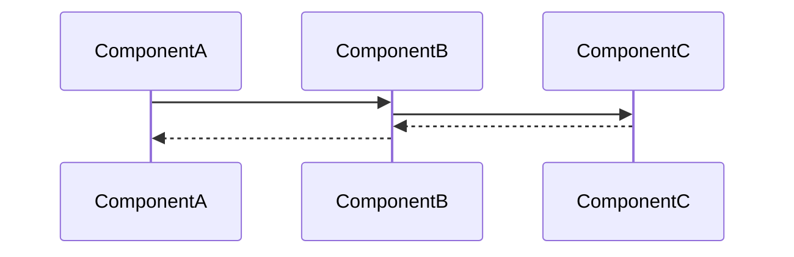

---
tags:
  - "#status/draft"
  - priority/high
  - architecture/feature
Created:
Updated:
Domains:
  - "[[Integrations]]"
  - "[[Entities]]"
Sub-Domain: "[[Entity Integration Sync]]"
---
# Feature: Integration Schema Mapping

---
## 1. Overview

### Problem Statement
When integration data is synced from a third party tool via the infrastructure covered in [[Integration Access Layer]], the data is still in its raw form and needs to be converted into an entity model that can be integrated into the entity ecosystem. The entity model conversion should allow for internal relationships between models from the same integration to maintain existing relationships.

Without a structured mapping layer, each integration would require bespoke transformation code — a Kotlin class per integration defining how to convert raw payloads into entity attributes. This approach does not scale: it requires code changes for every new integration, raises the barrier for community contributors, and prevents self-hosters from adding custom integrations without forking the codebase.

### Proposed Solution

Per [[ADR-004 Declarative-First Storage for Integration Mappings and Entity Templates]], schema mappings are defined **declaratively in JSON manifest files** rather than as per-integration code implementations.

Each integration's manifest (`integrations/{slug}/manifest.json`) contains:
- **Entity type schemas** — the readonly entity types this integration introduces (e.g., HubSpot Contact, Stripe Invoice)
- **Field mappings** — declarative rules mapping source payload fields to target entity attributes, including:
	- Direct field mapping (`source.email` → `target.email_address`)
	- Type coercion (string → number, date format conversion)
	- Value mapping (enum translation between external and internal values)
	- JSONPath extraction for nested source payloads
	- Default values for missing fields
	- Conditional mapping (if field exists, map it; otherwise skip)
- **Relationship definitions** — how entity types within the same integration connect to each other (e.g., HubSpot Contact → HubSpot Deal)
- **Semantic metadata** — natural language definitions and classifications per [[Semantic Metadata Foundation]]

A **generic mapping engine** (single stateless service, deployed once) interprets these declarative definitions at runtime. The engine:
1. Receives a raw external payload (JSON) from the sync pipeline
2. Looks up the field mapping definitions for the integration and model
3. Applies mappings sequentially: extract source value → apply transform → validate type → assign to target attribute
4. Produces an entity attribute payload ready for persistence

**Custom transformation plugins** are only written for integrations with behavior that cannot be expressed declaratively. These register by name and are referenced from the manifest:
```json
{ "transform": { "type": "plugin", "name": "hubspot-currency-converter" } }
```

Manifests are loaded into the database on application startup by the manifest loader (see [[ADR-004 Declarative-First Storage for Integration Mappings and Entity Templates|ADR-004]]). Application code queries mapping definitions from the database at runtime, not from the filesystem.

### Success Criteria

- [ ] A raw JSON payload from any supported integration can be transformed into a valid entity attribute payload using only the declarative mapping definitions in that integration's manifest — no per-integration code required
- [ ] The generic mapping engine handles direct mapping, type coercion, value mapping, JSONPath extraction, default values, and conditional mapping
- [ ] Adding a new integration requires only a manifest file — no Kotlin code changes for standard field mapping patterns
- [ ] Manifest files are validated against a JSON Schema on application startup; invalid manifests are skipped with a warning
- [ ] Internal relationships between entity types from the same integration are preserved during mapping (e.g., HubSpot Contact references HubSpot Deal)

---

## 2. Data Model

### New Entities

_What new tables/entities are being introduced?_

| Entity | Purpose | Key Fields |
| ------ | ------- | ---------- |
|        |         |            |

### Entity Modifications

_What existing entities need changes?_

|Entity|Change|Rationale|
|---|---|---|
||||

### Data Ownership

_Which component is the source of truth for each piece of data?_

### Relationships

```
[Entity A] ---(relationship)---> [Entity B]
```

### Data Lifecycle

- **Creation:** How/when is this data created?
- **Updates:** What triggers changes?
- **Deletion:** When/how is it removed? Soft delete? Cascade?

### Consistency Requirements

- [ ] Requires strong consistency (ACID transactions)
- [ ] Eventual consistency acceptable
- _If eventual:_ What's the acceptable delay? What happens during inconsistency?

---

## 3. Component Design

### New Components

_List each new service/component this feature introduces_

#### ComponentName

- **Responsibility:**
- **Dependencies:** [[Dependency1]], [[Dependency2]]
- **Exposes to:** [[Consumer1]], [[Consumer2]]

### Affected Existing Components

|Component|Change Required|Impact|
|---|---|---|
|[[]]|||

### Component Interaction Diagram



---

## 4. API Design

### New Endpoints

#### `POST /api/v1/resource`

- **Purpose:**
- **Request:**

```json
{
  
}
```

- **Response:**

```json
{
  
}
```

- **Error Cases:**
    - `400` -
    - `404` -
    - `409` -

### Contract Changes

_Any changes to existing APIs? Versioning implications?_

### Idempotency

- [ ] Operations are idempotent
- _If not:_ How do we handle retries?

---

## 5. Failure Modes & Recovery

### Dependency Failures

|Dependency|Failure Scenario|System Behavior|Recovery|
|---|---|---|---|
|Database||||
|External API||||
|Message Queue||||

### Partial Failure Scenarios

_What happens if we fail mid-operation?_

|Scenario|State Left Behind|Recovery Strategy|
|---|---|---|
||||

### Rollback Strategy

_If this feature needs to be disabled/rolled back, what's required?_

- [ ] Feature flag controlled
- [ ] Database migration reversible
- [ ] Backward compatible with previous version

### Blast Radius

_If this component fails completely, what else breaks?_

---

## 6. Security

### Authentication & Authorization

- **Who can access this feature?**
- **Authorization model:** RBAC / Resource-based / Other
- **Required permissions:**

### Data Sensitivity

|Data Element|Sensitivity|Protection Required|
|---|---|---|
||PII / Confidential / Public|Encryption / Audit / None|

### Trust Boundaries

_Where does validated data become untrusted?_

### Attack Vectors Considered

- [ ] Input validation
- [ ] Authorization bypass
- [ ] Data leakage
- [ ] Rate limiting

---

## 7. Performance & Scale

### Expected Load

- **Requests/sec:**
- **Data volume:**
- **Growth rate:**

### Performance Requirements

- **Latency target:** p50: ___ ms, p99: ___ ms
- **Throughput target:**

### Scaling Strategy

- [ ] Horizontal scaling possible
- [ ] Vertical scaling required
- **Bottleneck:**

### Caching Strategy

_What can be cached? TTL? Invalidation strategy?_

### Database Considerations

- **New indexes required:**
- **Query patterns:**
- **Potential N+1 issues:**

---

## 8. Observability

### Key Metrics

_What metrics indicate this feature is healthy?_

|Metric|Normal Range|Alert Threshold|
|---|---|---|
||||

### Logging

_What events should be logged? At what level?_

|Event|Level|Key Fields|
|---|---|---|
||INFO/WARN/ERROR||

### Tracing

_What spans should be created for distributed tracing?_

### Alerting

_What conditions should trigger alerts?_

|Condition|Severity|Response|
|---|---|---|
||||

---

## 9. Testing Strategy

### Unit Tests

- [ ] Component logic coverage
- [ ] Edge cases identified:

### Integration Tests

- [ ] API contract tests
- [ ] Database interaction tests
- [ ] External service mocks

### End-to-End Tests

- [ ] Happy path
- [ ] Failure scenarios

### Load Testing

- [ ] Required (describe scenario)
- [ ] Not required (justify)

---

## 10. Migration & Rollout

### Database Migrations

_List migrations in order_

### Data Backfill

_Is existing data affected? How will it be migrated?_

### Feature Flags

- **Flag name:**
- **Rollout strategy:** % rollout / User segment / All at once

### Rollout Phases

|Phase|Scope|Success Criteria|Rollback Trigger|
|---|---|---|---|
|1||||
|2||||

---

## 11. Open Questions

> [!warning] Unresolved
> 
> - [ ] Question 1
> - [ ] Question 2

---

## 12. Decisions Log

|Date|Decision|Rationale|Alternatives Considered|
|---|---|---|---|
|||||

---

## 13. Implementation Tasks

- [ ] Task 1
- [ ] Task 2
- [ ] Task 3

---

## Related Documents

- [[ADR-004 Declarative-First Storage for Integration Mappings and Entity Templates]]
- [[Integration Access Layer]]
- [[Predefined Integration Entity Types]]
- [[Entity Integration Sync]]
- [[Semantic Metadata Foundation]]
- [[WorkflowNodeConfigRegistry]] — analogous registry pattern for custom transform plugins

---

## Changelog

| Date | Author | Change |
| ---- | ------ | ------------- |
| | | Initial draft |
| 2026-02-28 | | Rewrote Proposed Solution to align with ADR-004 declarative-first approach — replaced per-integration interface definitions with JSON manifest format + generic mapping engine |