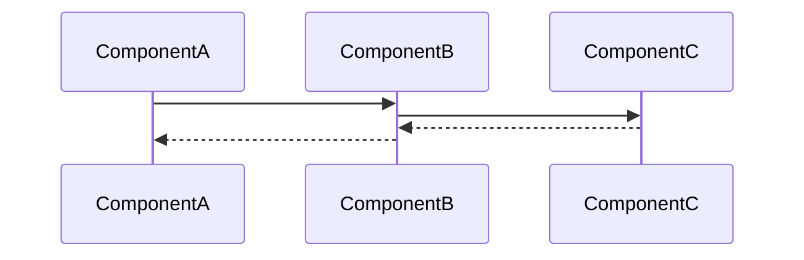

---
tags:
  - "#status/draft"
  - priority/high
  - architecture/feature
  - tool/temporal
  - tool/postgres
  - domain/knowledge
  - domain/workflow
Created: 2026-02-06
Updated:
Domains:
  - "[[riven/docs/system-design/domains/Knowledge/Knowledge]]"
  - "[[riven/docs/system-design/domains/Workflows/Workflows]]"
blocked by:
  - "[[riven/docs/system-design/feature-design/1. Planning/Data Extraction and Retrieval from Queries]]"
  - "[[riven/docs/system-design/feature-design/1. Planning/Prompt Construction for Knowledge Model Queries]]"
---
# Feature: Knowledge Layer Sub-agents

---
## 1. Overview
### Problem Statement
- While the overarching knowledge layer, accessible through [[riven/docs/system-design/feature-design/1. Planning/Prompt Construction for Knowledge Model Queries]] would grant users with the ability to possess cross-domain intelligence in order to answer their questions on demand, there needs to also be a more proactive approach to how data and knowledge is surfaced and observed, the platform also needs to feel like its alive, through the use of `agentic` capabilities 

### Proposed Solution

- A workspace can then also define `perspectives` 
	- These act as individual 'agents', with stored instructions, a defined scope of entities and relationships and a trigger (ie. Entity data change, scheduled cron job, threshold met)
		- *Track which segments churn fastest and why*
		- *Monitor customer acquisition efficiency across channels*
		- *Monitor churn rate by acquisition channel*
		- *Flag when support ticket volume spikes for a customer segment*
		- *Watch for customers who go inactive for more than 14 days after their first purchase*
		- *Monitor product-revenue patterns*
		- *Tracking support to churn correlations*
- These workers would then be further extends upon by [[riven/docs/system-design/feature-design/1. Planning/Extrapolate Agentic Perspectives from Entity Schema]]
- These agents are provided set analytical briefs that ask a singular question or ask for the observation of a particular area of relationship between domains. These are then triggered via a schedule or data event, the output of this may include
	- A daily overview that is updated per day
	- A report sent to the workspace's notifications
- A Temporal workflow will be set up that would handle the actions performed by a sub-agent perspective

```
AnalyticalBriefWorkflow
├── Activity: ParseBriefAndDetermineScope
│   └── Extract entity types, relationships, metadata filters from the stored brief
├── Activity: RetrieveRelevantVectors
│   └── pgvector similarity search with metadata filtering
├── Activity: ConstructPromptWithSchemaContext
│   └── Build the full prompt with retrieved data + schema definitions
├── Activity: CallReasoningLLM
│   └── Send to OpenAI/Anthropic, get response
└── Activity: DeliverInsight
    └── Store result, trigger notification, update dashboard — whatever the output
```

- These sub-agents should then be able to interact with [[riven/docs/system-design/domains/Workflows/Workflows]]
	- A sub-agent could be given certain conditions, where if they are met, a specific automation is triggered, with the relevant data being passed through a function input, for example:
		- *an agent detects that customers from a specific acquisition channel are churning at an elevated rate*
			- **it triggers an automation that tags those customers and notifies the relevant team member**
#### Pre-wired Lifecycle Perspectives

Per CEO Plan: Lifecycle Vertical Scoping (2026-03-18), sub-agents ship with pre-configured lifecycle perspectives out of the box. These activate as data flows into each lifecycle domain — they are not blank agents users must configure.

**Proposed initial perspectives:**

| Perspective | Lifecycle Domain(s) | What It Watches | Trigger |
|---|---|---|---|
| Channel Quality Monitor | ACQUISITION → RETENTION | Divergence between channel conversion rate and downstream retention | Weekly schedule + data change |
| Onboarding Health Tracker | ONBOARDING | First-30-day support load vs. cohort norms, setup completion rates | Daily schedule |
| Usage Engagement Monitor | USAGE | Feature adoption trends, usage drop-offs, inactive customer detection | Daily schedule + usage event |
| Support Load Analyzer | SUPPORT → BILLING | Support ticket volume correlation with customer value and churn risk | Data change (new ticket) |
| Churn Signal Detector | Cross-domain | Correlates usage drops + support spikes + billing patterns into churn risk scores | Daily schedule |
| Revenue Cohort Analyzer | BILLING → ACQUISITION | Revenue and expansion trends by acquisition cohort | Weekly schedule |

Perspectives are defined as manifest entries alongside the lifecycle spine templates. Users can modify, disable, or create their own.

### Success Criteria

- [ ] Sub-agent perspectives can be defined, scoped to entity types/relationships, and triggered via schedule or data change
- [ ] Pre-wired lifecycle perspectives activate automatically as data flows into their scoped lifecycle domains
- [ ] Perspective output is structured (not free-text) and can be surfaced on the Lifecycle Operations Dashboard
- [ ] Perspectives degrade gracefully with partial data — explain what's missing rather than failing silently
- [ ] Users can modify, disable, or create custom perspectives
- [ ] Perspective execution handles LLM failures (timeout, malformed response, refusal) with distinct rescue strategies
- [ ] Perspective definitions are manifest-based — community-contributable

---

## 2. Data Model

### New Entities

_What new tables/entities are being introduced?_

| Entity | Purpose | Key Fields |
| ------ | ------- | ---------- |
|        |         |            |

### Entity Modifications

_What existing entities need changes?_

|Entity|Change|Rationale|
|---|---|---|
||||

### Data Ownership

_Which component is the source of truth for each piece of data?_

### Relationships

```
[Entity A] ---(relationship)---> [Entity B]
```

### Data Lifecycle

- **Creation:** How/when is this data created?
- **Updates:** What triggers changes?
- **Deletion:** When/how is it removed? Soft delete? Cascade?

### Consistency Requirements

- [ ] Requires strong consistency (ACID transactions)
- [ ] Eventual consistency acceptable
- _If eventual:_ What's the acceptable delay? What happens during inconsistency?

---

## 3. Component Design

### New Components

_List each new service/component this feature introduces_

#### ComponentName

- **Responsibility:**
- **Dependencies:** [[Dependency1]], [[Dependency2]]
- **Exposes to:** [[Consumer1]], [[Consumer2]]

### Affected Existing Components

|Component|Change Required|Impact|
|---|---|---|
|[[]]|||

### Component Interaction Diagram



---

## 4. API Design

### New Endpoints

#### `POST /api/v1/resource`

- **Purpose:**
- **Request:**

```json
{
  
}
```

- **Response:**

```json
{
  
}
```

- **Error Cases:**
    - `400` -
    - `404` -
    - `409` -

### Contract Changes

_Any changes to existing APIs? Versioning implications?_

### Idempotency

- [ ] Operations are idempotent
- _If not:_ How do we handle retries?

---

## 5. Failure Modes & Recovery

### Dependency Failures

|Dependency|Failure Scenario|System Behavior|Recovery|
|---|---|---|---|
|Database||||
|External API||||
|Message Queue||||

### Partial Failure Scenarios

_What happens if we fail mid-operation?_

|Scenario|State Left Behind|Recovery Strategy|
|---|---|---|
||||

### Rollback Strategy

_If this feature needs to be disabled/rolled back, what's required?_

- [ ] Feature flag controlled
- [ ] Database migration reversible
- [ ] Backward compatible with previous version

### Blast Radius

_If this component fails completely, what else breaks?_

---

## 6. Security

### Authentication & Authorization

- **Who can access this feature?**
- **Authorization model:** RBAC / Resource-based / Other
- **Required permissions:**

### Data Sensitivity

|Data Element|Sensitivity|Protection Required|
|---|---|---|
||PII / Confidential / Public|Encryption / Audit / None|

### Trust Boundaries

_Where does validated data become untrusted?_

### Attack Vectors Considered

- [ ] Input validation
- [ ] Authorization bypass
- [ ] Data leakage
- [ ] Rate limiting

---

## 7. Performance & Scale

### Expected Load

- **Requests/sec:**
- **Data volume:**
- **Growth rate:**

### Performance Requirements

- **Latency target:** p50: ___ ms, p99: ___ ms
- **Throughput target:**

### Scaling Strategy

- [ ] Horizontal scaling possible
- [ ] Vertical scaling required
- **Bottleneck:**

### Caching Strategy

_What can be cached? TTL? Invalidation strategy?_

### Database Considerations

- **New indexes required:**
- **Query patterns:**
- **Potential N+1 issues:**

---

## 8. Observability

### Key Metrics

_What metrics indicate this feature is healthy?_

|Metric|Normal Range|Alert Threshold|
|---|---|---|
||||

### Logging

_What events should be logged? At what level?_

|Event|Level|Key Fields|
|---|---|---|
||INFO/WARN/ERROR||

### Tracing

_What spans should be created for distributed tracing?_

### Alerting

_What conditions should trigger alerts?_

|Condition|Severity|Response|
|---|---|---|
||||

---

## 9. Testing Strategy

### Unit Tests

- [ ] Component logic coverage
- [ ] Edge cases identified:

### Integration Tests

- [ ] API contract tests
- [ ] Database interaction tests
- [ ] External service mocks

### End-to-End Tests

- [ ] Happy path
- [ ] Failure scenarios

### Load Testing

- [ ] Required (describe scenario)
- [ ] Not required (justify)

---

## 10. Migration & Rollout

### Database Migrations

_List migrations in order_

### Data Backfill

_Is existing data affected? How will it be migrated?_

### Feature Flags

- **Flag name:**
- **Rollout strategy:** % rollout / User segment / All at once

### Rollout Phases

|Phase|Scope|Success Criteria|Rollback Trigger|
|---|---|---|---|
|1||||
|2||||

---

## 11. Open Questions

> [!warning] Unresolved
> 
> - [ ] Question 1
> - [ ] Question 2

---

## 12. Decisions Log

|Date|Decision|Rationale|Alternatives Considered|
|---|---|---|---|
|||||

---

## 13. Implementation Tasks

- [ ] Task 1
- [ ] Task 2
- [ ] Task 3

---

## Related Documents

- [[ADR-xxx-decision-name]]
- [[Flow - Related Flow]]
- [[Domain - Relevant Domain]]

---

## Changelog

| Date | Author | Change        |
| ---- | ------ | ------------- |
|      |        | Initial draft |