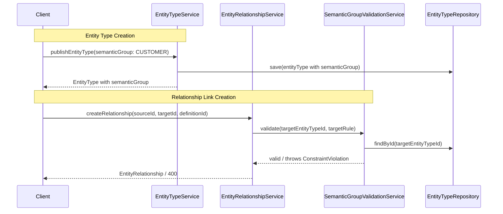

---
tags:
  - "#status/draft"
  - priority/high
  - architecture/feature
  - domain/entity
  - domain/knowledge
Created: 2026-02-28
Updated:
Domains:
  - "[[Knowledge]]"
  - "[[Entities]]"
  - "[[Integrations]]"
---
# Feature: Semantic Entity Groups

---

## 1. Overview

### Problem Statement

Entity types currently carry semantic metadata as natural language descriptions — a freeform `definition` field that explains what an entity type represents. While this works for human comprehension and can be fed into prompts, it provides no machine-readable categorical structure. The system has no way to programmatically answer "which entity types represent customer data?" without parsing natural language.

This creates three concrete problems:

- **Relationship target constraints are incomplete.** The `semanticTypeConstraint` field on [[RelationshipTargetRuleEntity]] is already stubbed but unenforceable — there's no categorical value on entity types to match against. Target rules can only constrain by explicit entity type ID or accept all types.
- **Knowledge layer prompt construction is weaker.** When building prompts for cross-domain queries, the system must infer entity type roles from descriptions. A categorical scaffold (CUSTOMER, PRODUCT, COMMUNICATION) would give the LLM explicit domain structure to reason over, reducing misinterpretation and improving context selection for [[Prompt Construction for Knowledge Model Queries]].
- **Automated perspective suggestions are blocked.** [[Extrapolate Agentic Perspectives from Entity Schema]] needs to detect gaps like "you have CUSTOMER and TRANSACTION types but no agent watching the correlation." This requires categorical grouping — parsing descriptions to infer domain roles is fragile and unreliable.

### Proposed Solution

Add a `semanticGroup` classification to each entity type, stored directly on the `entity_types` table as an enum column. The system provides a fixed set of standard groups (CUSTOMER, PRODUCT, COMMUNICATION, TRANSACTION, SUPPORT, FINANCIAL) plus a CUSTOM option. Standard groups carry built-in semantic meaning for the knowledge layer. CUSTOM requires a user-provided label stored in the entity type's semantic metadata definition.

This enables:
1. Runtime enforcement of the existing `semanticTypeConstraint` on relationship target rules
2. Categorical schema scaffolding for knowledge layer prompt construction
3. Embedding metadata filtering by `semantic_group` in the [[Data Chunking and Enrichment Pipeline]]
4. Automated cross-domain gap detection for [[Extrapolate Agentic Perspectives from Entity Schema]]
5. Template manifest entity types declare their group — flows into [[Semantic Metadata Baked Entity Data Model Templates]]

### Success Criteria

- [ ] Entity types can be assigned a semantic group at creation or via update
- [ ] Relationship target rules with `semanticTypeConstraint` are enforced at entity link creation time
- [ ] `?include=semantics` responses include the semantic group on each entity type
- [ ] Existing entity types default to `UNCATEGORIZED` — no breaking change to current data
- [ ] Knowledge API can filter/retrieve entity types by semantic group
- [ ] Templates and integration manifests can declare semantic groups on entity type definitions

---

## 2. Data Model

### New Entities

No new tables.

### Entity Modifications

| Entity | Change | Rationale |
|---|---|---|
| `EntityTypeEntity` | Add `semanticGroup: SemanticGroup` column (enum, NOT NULL, default `UNCATEGORIZED`) | Primary storage for the categorical classification — needs to be on the entity type itself for fast joins during relationship validation and knowledge queries |
| `RelationshipTargetRuleEntity` | Change `semanticTypeConstraint` from single value to `List<SemanticGroup>` (stored as comma-separated VARCHAR or JSONB array). Already persisted but unused — migration updates the column type. | Supports matching against multiple groups per target rule (e.g., accept CUSTOMER or SUPPORT) |

### Enum: SemanticGroup

```kotlin
enum class SemanticGroup {
    CUSTOMER,       // People, accounts, contacts, leads, users
    PRODUCT,        // Products, services, SKUs, offerings, plans
    TRANSACTION,    // Orders, payments, invoices, subscriptions, purchases
    COMMUNICATION,  // Emails, messages, tickets, conversations, calls
    SUPPORT,        // Support tickets, help requests, feedback, complaints
    FINANCIAL,      // Revenue, costs, budgets, forecasts, metrics
    OPERATIONAL,    // Tasks, projects, workflows, processes, events
    CUSTOM,         // User-defined — requires label in semantic metadata definition
    UNCATEGORIZED,  // Default for existing types and types without explicit assignment
}
```

**Why a fixed enum and not user-defined strings:**
- The knowledge layer needs to reason about groups. Standard groups carry built-in semantic meaning that the LLM can use without additional context. A CUSTOMER group universally means "entities representing people/accounts" — no per-workspace interpretation needed.
- The `semanticTypeConstraint` on target rules needs a stable matching vocabulary. Arbitrary strings would create brittle matching and user confusion.
- Templates and integration manifests reference groups by key. A stable enum ensures cross-template compatibility.
- CUSTOM exists as the escape hatch. Users choosing CUSTOM must provide a descriptive label in their entity type's semantic metadata `definition` field. The knowledge layer reads this label for CUSTOM groups.

### Data Ownership

- `semanticGroup` on `EntityTypeEntity` — owned by [[Type Definitions]] subdomain, written via [[EntityTypeService]]
- `semanticTypeConstraint` on `RelationshipTargetRuleEntity` — owned by [[Relationships]] subdomain, written via [[EntityTypeRelationshipService]]
- Semantic meaning interpretation — owned by [[Knowledge]] domain (prompt construction, enrichment pipeline)

### Relationships

```
[EntityTypeEntity] ---semanticGroup---> [SemanticGroup enum]
[RelationshipTargetRuleEntity] ---semanticTypeConstraint---> [SemanticGroup enum]
```

At link creation time:
```
[EntityRelationshipService] validates:
  IF definition.allowPolymorphic == true → SKIP (accept any type)
  ELSE IF rule.semanticTypeConstraints is non-empty →
    targetEntity.entityType.semanticGroup IN rule.semanticTypeConstraints
  ELSE → fall back to explicit targetEntityTypeId matching (existing behavior)
```

### Data Lifecycle

- **Creation:** Set during `publishEntityType()` if provided in the request, otherwise defaults to `UNCATEGORIZED`. Templates and integration manifests pre-populate this.
- **Updates:** Changed via `updateEntityTypeConfiguration()` — treated as metadata, not a schema-breaking change. Triggers **full re-enrichment** of all entity instances of that type via [[Schema Change Handling]], since the group fundamentally changes the semantic context prepended to every embedding. This is a rare operation in practice.
- **Deletion:** Soft-deleted with the entity type — no special handling needed.

### Consistency Requirements

- [x] Requires strong consistency (ACID transactions)
- Semantic group changes must be immediately visible for relationship validation. Eventual consistency would allow invalid links during the propagation window.

---

## 3. Component Design

### New Components

#### SemanticGroupValidationService

- **Responsibility:** Validates that a target entity's type has a `semanticGroup` contained in the `semanticTypeConstraints` array on the relationship target rule. Skipped entirely when `allowPolymorphic = true` on the definition. Called during entity link creation.
- **Dependencies:** [[EntityTypeRepository]] (to resolve target entity type's semantic group)
- **Exposes to:** [[EntityRelationshipService]] (write-time validation hook)

### Affected Existing Components

| Component | Change Required | Impact |
|---|---|---|
| [[EntityTypeService]] | Accept `semanticGroup` in publish and update requests. Include in response models. Reject CUSTOM group when semantic metadata definition is null or blank. | Low — additive field + one validation check |
| [[EntityTypeController]] | Pass through `semanticGroup` from request DTOs. | Low — additive field |
| [[EntityRelationshipService]] | Call `SemanticGroupValidationService` during link creation when target rule has `semanticTypeConstraint` set. | Medium — new validation path |
| [[EntityTypeRelationshipService]] | No code change — `semanticTypeConstraint` is already persisted on target rules. | None |
| [[EntityTypeSemanticMetadataService]] | No code change — semantic group lives on entity type, not metadata table. Metadata `definition` field on CUSTOM groups carries the descriptive label as it already does. | None |
| [[KnowledgeController]] | Add `GET /api/v1/knowledge/entity-types?semanticGroup={group}` for filtered retrieval. | Low — new query parameter |

### Component Interaction Diagram



---

## 4. API Design

### Modified Endpoints

#### `POST /api/v1/workspaces/{id}/entity-types` (Publish)

**Request change** — add optional `semanticGroup`:

```json
{
  "name": "Customer",
  "description": "...",
  "icon": "users",
  "semanticGroup": "CUSTOMER"
}
```

If omitted, defaults to `UNCATEGORIZED`.

#### `PUT /api/v1/workspaces/{id}/entity-types/{key}` (Update Configuration)

**Request change** — add optional `semanticGroup`:

```json
{
  "name": "Customer",
  "description": "...",
  "icon": "users",
  "semanticGroup": "CUSTOMER"
}
```

#### `GET /api/v1/workspaces/{id}/entity-types` and `GET /api/v1/workspaces/{id}/entity-types/{key}`

**Response change** — `EntityType` model now includes `semanticGroup`:

```json
{
  "entityType": {
    "id": "...",
    "name": "Customer",
    "key": "customer",
    "semanticGroup": "CUSTOMER",
    "attributes": [ ... ]
  },
  "semantics": { ... }
}
```

### New Endpoints

#### `GET /api/v1/knowledge/entity-types?semanticGroup={group}`

- **Purpose:** Retrieve entity types filtered by semantic group. Used by the knowledge layer to scope context selection.
- **Response:** `List<EntityTypeWithSemanticsResponse>` filtered to matching group
- **Error Cases:**
    - `400` — Invalid semantic group value

### Contract Changes

The `EntityType` response model gains a non-null `semanticGroup` field. All existing types return `UNCATEGORIZED`. This is additive — clients that ignore the field are unaffected.

The `SaveRelationshipDefinitionRequest` target rule's `semanticTypeConstraint` changes from a single string to an array of `SemanticGroup` values. Existing clients sending a single value will need to wrap it in an array. Clients not using this field are unaffected.

### Idempotency

- [x] Operations are idempotent — setting the same semantic group twice is a no-op.

---

## 5. Failure Modes & Recovery

### Dependency Failures

| Dependency | Failure Scenario | System Behavior | Recovery |
|---|---|---|---|
| Database | Column migration fails | Entity types cannot be created/updated | Rollback migration |

### Partial Failure Scenarios

| Scenario | State Left Behind | Recovery Strategy |
|---|---|---|
| Semantic group set but re-enrichment fails | Stale embeddings with old category metadata | Enrichment retry queue picks up the failed job |
| Relationship validation check fails mid-batch | Partial link creation | Transaction rollback — link creation is already transactional |

### Rollback Strategy

- [x] Database migration reversible — `ALTER TABLE entity_types DROP COLUMN semantic_group` with backfill to remove constraint references
- [x] Backward compatible with previous version — `UNCATEGORIZED` default means existing data is unaffected

### Blast Radius

If semantic group validation fails, only relationship link creation is affected. Entity CRUD, querying, and existing relationships are untouched. The knowledge layer degrades gracefully — `UNCATEGORIZED` types are treated as having no categorical signal, identical to current behavior.

---

## 6. Security

### Authentication & Authorization

- **Who can access this feature?** Workspace members with entity type management permissions
- **Authorization model:** Existing `@PreAuthorize("@workspaceSecurity.hasWorkspace(#workspaceId)")` — no new permission level needed
- **Required permissions:** Same as existing entity type CRUD

### Data Sensitivity

| Data Element | Sensitivity | Protection Required |
|---|---|---|
| semanticGroup | Public (within workspace) | Standard workspace isolation |

### Attack Vectors Considered

- [x] Input validation — enum value validation, reject unknown strings
- [x] Authorization bypass — covered by existing workspace security
- [ ] Data leakage — N/A, semantic groups are not sensitive
- [ ] Rate limiting — N/A, standard CRUD rate limits apply

---

## 7. Performance & Scale

### Expected Load

- **Requests/sec:** Same as entity type CRUD — low frequency, <10/sec
- **Data volume:** One enum value per entity type (hundreds, not millions)
- **Growth rate:** Grows with entity type creation — negligible

### Performance Requirements

- **Latency target:** No additional latency — single column read
- **Throughput target:** Same as existing entity type operations

### Database Considerations

- **New indexes required:** `CREATE INDEX idx_entity_types_semantic_group ON entity_types (workspace_id, semantic_group)` — for knowledge layer group-filtered queries
- **Query patterns:** Filter entity types by workspace + group, join entity type to check group during relationship validation
- **Potential N+1 issues:** None — semantic group is on the entity type itself, no additional join

---

## 8. Observability

### Logging

| Event | Level | Key Fields |
|---|---|---|
| Semantic group assigned | INFO | entityTypeId, workspaceId, semanticGroup |
| Semantic group changed | INFO | entityTypeId, workspaceId, oldGroup, newGroup |
| Relationship link rejected by semantic constraint | WARN | sourceEntityId, targetEntityId, definitionId, expectedGroup, actualGroup |

---

## 9. Testing Strategy

### Unit Tests

- [ ] `SemanticGroupValidationService` — validates group matching against array of constraints, rejects mismatches, handles `UNCATEGORIZED`, handles empty constraint array (pass-through), handles multiple groups in array
- [ ] `SemanticGroupValidationService` — skips validation entirely when `allowPolymorphic = true`
- [ ] `EntityTypeService` — publishes with semantic group, updates semantic group, defaults to UNCATEGORIZED
- [ ] `EntityTypeService` — rejects CUSTOM group when semantic metadata definition is null or blank
- [ ] `EntityRelationshipService` — link creation calls validation when constraint exists, skips when no constraint, skips when polymorphic

### Integration Tests

- [ ] Full flow: create entity type with CUSTOMER group → create relationship definition with `semanticTypeConstraints: [CUSTOMER, SUPPORT]` → link to CUSTOMER entity succeeds → link to SUPPORT entity succeeds → link to PRODUCT entity fails with 400
- [ ] Polymorphic bypass: `allowPolymorphic = true` with `semanticTypeConstraints: [CUSTOMER]` → link to PRODUCT entity succeeds (polymorphic bypasses constraint)
- [ ] CUSTOM group validation: attempt to set CUSTOM group without semantic metadata description → 400
- [ ] Migration: existing entity types have UNCATEGORIZED after migration
- [ ] Knowledge API: filter by semantic group returns correct results
- [ ] Re-enrichment: changing semantic group triggers enrichment pipeline job for all instances of that type

---

## 10. Migration & Rollout

### Database Migrations

1. `ALTER TABLE entity_types ADD COLUMN semantic_group VARCHAR(50) NOT NULL DEFAULT 'UNCATEGORIZED'`
2. `CREATE INDEX idx_entity_types_semantic_group ON entity_types (workspace_id, semantic_group)`
3. Migrate `semantic_type_constraint` on `relationship_target_rules` from single VARCHAR to VARCHAR array or JSONB array (depends on current column type — if VARCHAR, convert existing values to single-element arrays; if null, leave as empty array)

### Data Backfill

- All existing entity types receive `UNCATEGORIZED`. No data loss. Users can categorize their types at their own pace.
- Existing `semantic_type_constraint` values on target rules are wrapped into single-element arrays. Null values become empty arrays (no constraint).

---

## 11. Open Questions

All resolved — see Decisions Log.

---

## 12. Decisions Log

| Date | Decision | Rationale | Alternatives Considered |
|---|---|---|---|
| 2026-02-28 | Store semantic group on `entity_types` table, not `entity_type_semantic_metadata` | Needed for fast joins during relationship validation and knowledge queries. Semantic metadata is descriptive; the group is operational and affects runtime behavior. | Storing on metadata table (consistent location but requires join for every validation check) |
| 2026-02-28 | Fixed enum with CUSTOM escape hatch | Knowledge layer needs stable vocabulary for cross-domain reasoning. User-defined strings create fragile matching and prevent template interoperability. | Fully user-defined strings (maximum flexibility but no shared vocabulary), hybrid with aliases (over-engineered for current needs) |
| 2026-02-28 | Soft constraint enforcement (reject with 400, don't silently prevent) | Users should see why a link was rejected. Silent filtering would cause confusion. Aligns with the two-pass impact pattern used elsewhere. | Soft warning without blocking (weaker integrity guarantee), silent filtering (confusing UX) |
| 2026-02-28 | Semantic group changes trigger full re-enrichment of all entity instances of that type | The group fundamentally changes the semantic identity of the entity type — embeddings constructed under the old category carry incorrect context. In practice this is a rare operation so the cost is acceptable. Queued via the enrichment pipeline like any other schema change. | Metadata-only update on embeddings table (faster but leaves enriched text stale) |
| 2026-02-28 | CUSTOM groups require a non-empty semantic metadata description | Without a description, a CUSTOM group provides zero signal to the knowledge layer — it's semantically equivalent to UNCATEGORIZED. Enforced at the service layer: `publishEntityType()` and `updateEntityTypeConfiguration()` reject CUSTOM group assignments where the entity type's semantic metadata definition is null or blank. | Optional description (allows meaningless CUSTOM groups) |
| 2026-02-28 | `semanticTypeConstraint` on target rules supports an array of groups, not a single value | Mirrors the existing capability to target multiple explicit entity type IDs. A relationship like "Connected Accounts" should accept both CUSTOMER and SUPPORT types. Stored as `List<SemanticGroup>` on `RelationshipTargetRuleEntity`. Validation checks that the target entity type's group is contained in the array. | Single value (simpler but artificially restrictive — would require duplicate rules to accept multiple groups) |
| 2026-02-28 | `allowPolymorphic = true` bypasses semantic group constraints entirely | `allowPolymorphic` is the "accept all" flag — it accepts any entity type in the workspace regardless of group or explicit type targeting. When enabled, both `targetEntityTypeId` and `semanticTypeConstraint` on target rules are ignored. This is consistent with its existing behavior of bypassing type ID constraints. | Polymorphic still respects group constraints (confusing — "polymorphic" implies unconstrained) |

---

## 13. Implementation Tasks

- [ ] Add `SemanticGroup` enum to domain model
- [ ] Add `semantic_group` column to `entity_types` table (migration)
- [ ] Update `EntityTypeEntity` JPA mapping with new column
- [ ] Update `EntityType` domain model to include `semanticGroup`
- [ ] Update `publishEntityType()` and `updateEntityTypeConfiguration()` to accept and persist `semanticGroup`
- [ ] Add CUSTOM group validation — reject when semantic metadata definition is null or blank
- [ ] Update entity type response DTOs to include `semanticGroup`
- [ ] Migrate `semanticTypeConstraint` on `RelationshipTargetRuleEntity` from single value to array (`List<SemanticGroup>`)
- [ ] Update `SaveRelationshipDefinitionRequest` target rule DTOs to accept array of semantic groups
- [ ] Implement `SemanticGroupValidationService` with array matching and `allowPolymorphic` bypass
- [ ] Wire validation into `EntityRelationshipService` link creation path
- [ ] Wire semantic group change into [[Schema Change Handling]] to trigger full re-enrichment of all entity instances
- [ ] Add `semanticGroup` filter to `KnowledgeController` entity type retrieval
- [ ] Update template manifest schema to include `semanticGroup` on entity type definitions
- [ ] Unit tests for validation service (array matching, polymorphic bypass, CUSTOM rejection), entity type service changes, relationship enforcement
- [ ] Integration tests: constraint enforcement, polymorphic bypass, CUSTOM validation, re-enrichment trigger

---

## Related Documents

- [[Entity Semantics]] — parent subdomain for semantic metadata
- [[Entity Type Polymorphic Relationship Support for Semantic Categories]] — prior quick design (superseded by this document)
- [[Relationships]] — `semanticTypeConstraint` on target rules (already stubbed)
- [[Knowledge]] — domain overview first proposed entity type categories
- [[Data Chunking and Enrichment Pipeline]] — `semantic_category` field on embeddings table will be sourced from this
- [[Prompt Construction for Knowledge Model Queries]] — categorical schema scaffolding for prompts
- [[Extrapolate Agentic Perspectives from Entity Schema]] — cross-domain gap detection using groups
- [[Schema Change Handling]] — semantic group changes trigger re-enrichment
- [[Semantic Metadata Baked Entity Data Model Templates]] — templates declare groups on entity type definitions

---

## Changelog

| Date | Author | Change |
| ---- | ------ | ------------- |
| 2026-02-28 | | Initial draft |
| 2026-02-28 | | Resolved all open questions — group changes trigger full re-enrichment, CUSTOM requires description, `semanticTypeConstraint` becomes array, `allowPolymorphic` bypasses all constraints |