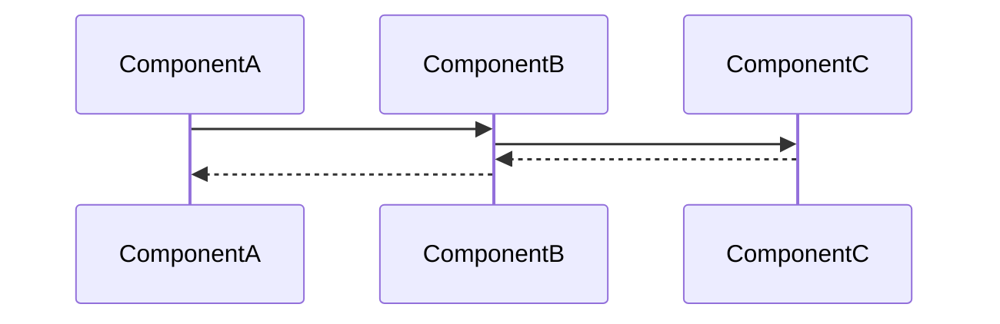

---
tags:
  - "#status/draft"
  - priority/high
  - architecture/feature
  - domain/entity
  - domain/knowledge
Created: 2026-02-06
Updated:
Domains:
  - "[[Knowledge]]"
  - "[[Entities]]"
blocked by:
  - "[[Semantically Imbued Entity Attributes]]"
  - "[[Knowledge Layer Sub-Agents]]"
---
# Feature: Semantic Metadata Baked Entity Data Model Templates

---

## 1. Overview

### Problem Statement

A user that creates a new environment without any prior structure will waste hours creating their own data models, with additional complexity, incorrect semantic definitions and time wasted, this will cause nothing but frustration and will most likely result in users churning before they ever get to the features.
There needs to be a way to get a user set up with an example template, that matches the outcome they need, with the ability to then make additional tweaks to fit their use case exactly
### Proposed Solution

```
Your template semantic definitions feed directly into this. When a template defines that an entity type "Customer" with field "source" means acquisition channel, that semantic mapping is what tells the embedding pipeline how to enrich the context. Without it, you're just embedding raw field values with no meaning.
```

Per [[ADR-004 Declarative-First Storage for Integration Mappings and Entity Templates]], data model templates are defined as **JSON manifest files** stored in the application repository under a `templates/` directory (e.g., `templates/saas-startup/manifest.json`). This uses the same declarative-first storage pattern as integration manifests — manifest files are version-controlled, loaded into the database on application startup by the manifest loader, and queryable via standard JPA repositories at runtime.

Each template manifest defines:
- **Entity type schemas** — full attribute definitions, data types, and validation rules for all entity types in the template
- **Relationship definitions** — how entity types within the template interconnect (e.g., Customer → Subscription, Subscription → Invoice)
- **Complete semantic metadata** — natural language definitions, attribute classifications, and tags for every entity type, attribute, and relationship per [[Semantic Metadata Foundation]]
- **Pre-configured analytical briefs** (3-5 per template) that demonstrate cross-domain querying
- **Example queries** scoped narrowly enough to be useful with <50 records

Initial templates:
- SaaS Startup (customers, subscriptions, MRR, churn, support interactions, feature usage)
- DTC E-commerce (customers, orders, products, acquisition channels, support, returns)
- Service Business (clients, projects, invoices, communications, deliverables)

When a user selects a template during workspace setup, the template's entity types, relationships, and semantic metadata are **cloned into their workspace** as editable, user-owned definitions. From that point forward, the user can modify them freely — adding attributes, changing semantic descriptions, removing entity types — as if they had created everything themselves. The template origin is recorded for reference but does not constrain editing.

Community contributors add new templates by submitting a manifest file PR — no Kotlin code required. Self-hosters can drop custom template manifest files into the `templates/` directory and restart.
### Success Criteria

_How do we know this feature is working correctly?_

- [ ] A user is able to pre-configure an entire ready to go entity ecosystem within 10 minutes of setup
- [ ] A user is able to modify the template and the [[Semantically Imbued Entity Attributes]] without breaking existing embeddings
- [ ] Templates contain pre-configured [[Sub-Agents (Proactive Intelligence)]] that are able to produce useful insights once the ecosystem begins to become populated with meaningful data

---

## 2. Data Model

### New Entities

_What new tables/entities are being introduced?_

| Entity | Purpose | Key Fields |
| ------ | ------- | ---------- |
|        |         |            |

### Entity Modifications

_What existing entities need changes?_

|Entity|Change|Rationale|
|---|---|---|
||||

### Data Ownership

_Which component is the source of truth for each piece of data?_

### Relationships

```
[Entity A] ---(relationship)---> [Entity B]
```

### Data Lifecycle

- **Creation:** How/when is this data created?
- **Updates:** What triggers changes?
- **Deletion:** When/how is it removed? Soft delete? Cascade?

### Consistency Requirements

- [ ] Requires strong consistency (ACID transactions)
- [ ] Eventual consistency acceptable
- _If eventual:_ What's the acceptable delay? What happens during inconsistency?

---

## 3. Component Design

### New Components

_List each new service/component this feature introduces_

#### ComponentName

- **Responsibility:**
- **Dependencies:** [[Dependency1]], [[Dependency2]]
- **Exposes to:** [[Consumer1]], [[Consumer2]]

### Affected Existing Components

|Component|Change Required|Impact|
|---|---|---|
|[[]]|||

### Component Interaction Diagram



---

## 4. API Design

### New Endpoints

#### `POST /api/v1/resource`

- **Purpose:**
- **Request:**

```json
{
  
}
```

- **Response:**

```json
{
  
}
```

- **Error Cases:**
    - `400` -
    - `404` -
    - `409` -

### Contract Changes

_Any changes to existing APIs? Versioning implications?_

### Idempotency

- [ ] Operations are idempotent
- _If not:_ How do we handle retries?

---

## 5. Failure Modes & Recovery

### Dependency Failures

|Dependency|Failure Scenario|System Behavior|Recovery|
|---|---|---|---|
|Database||||
|External API||||
|Message Queue||||

### Partial Failure Scenarios

_What happens if we fail mid-operation?_

|Scenario|State Left Behind|Recovery Strategy|
|---|---|---|
||||

### Rollback Strategy

_If this feature needs to be disabled/rolled back, what's required?_

- [ ] Feature flag controlled
- [ ] Database migration reversible
- [ ] Backward compatible with previous version

### Blast Radius

_If this component fails completely, what else breaks?_

---

## 6. Security

### Authentication & Authorization

- **Who can access this feature?**
- **Authorization model:** RBAC / Resource-based / Other
- **Required permissions:**

### Data Sensitivity

|Data Element|Sensitivity|Protection Required|
|---|---|---|
||PII / Confidential / Public|Encryption / Audit / None|

### Trust Boundaries

_Where does validated data become untrusted?_

### Attack Vectors Considered

- [ ] Input validation
- [ ] Authorization bypass
- [ ] Data leakage
- [ ] Rate limiting

---

## 7. Performance & Scale

### Expected Load

- **Requests/sec:**
- **Data volume:**
- **Growth rate:**

### Performance Requirements

- **Latency target:** p50: ___ ms, p99: ___ ms
- **Throughput target:**

### Scaling Strategy

- [ ] Horizontal scaling possible
- [ ] Vertical scaling required
- **Bottleneck:**

### Caching Strategy

_What can be cached? TTL? Invalidation strategy?_

### Database Considerations

- **New indexes required:**
- **Query patterns:**
- **Potential N+1 issues:**

---

## 8. Observability

### Key Metrics

_What metrics indicate this feature is healthy?_

|Metric|Normal Range|Alert Threshold|
|---|---|---|
||||

### Logging

_What events should be logged? At what level?_

|Event|Level|Key Fields|
|---|---|---|
||INFO/WARN/ERROR||

### Tracing

_What spans should be created for distributed tracing?_

### Alerting

_What conditions should trigger alerts?_

|Condition|Severity|Response|
|---|---|---|
||||

---

## 9. Testing Strategy

### Unit Tests

- [ ] Component logic coverage
- [ ] Edge cases identified:

### Integration Tests

- [ ] API contract tests
- [ ] Database interaction tests
- [ ] External service mocks

### End-to-End Tests

- [ ] Happy path
- [ ] Failure scenarios

### Load Testing

- [ ] Required (describe scenario)
- [ ] Not required (justify)

---

## 10. Migration & Rollout

### Database Migrations

_List migrations in order_

### Data Backfill

_Is existing data affected? How will it be migrated?_

### Feature Flags

- **Flag name:**
- **Rollout strategy:** % rollout / User segment / All at once

### Rollout Phases

|Phase|Scope|Success Criteria|Rollback Trigger|
|---|---|---|---|
|1||||
|2||||

---

## 11. Open Questions

> [!warning] Unresolved
> 
> - [ ] Question 1
> - [ ] Question 2

---

## 12. Decisions Log

|Date|Decision|Rationale|Alternatives Considered|
|---|---|---|---|
|||||

---

## 13. Implementation Tasks

- [ ] Task 1
- [ ] Task 2
- [ ] Task 3

---

## Related Documents

- [[ADR-004 Declarative-First Storage for Integration Mappings and Entity Templates]]
- [[Semantic Metadata Foundation]]
- [[Entity Semantics]]
- [[Predefined Integration Entity Types]] — uses the same manifest format for integration entity types
- [[Integration Schema Mapping]] — parallel manifest structure for integration-specific definitions
- [[Knowledge Layer]]

---

## Changelog

| Date | Author | Change |
| ---- | ------ | ------------- |
| | | Initial draft |
| 2026-02-28 | | Updated Proposed Solution to align with ADR-004 declarative-first approach — templates defined as JSON manifests loaded on startup |