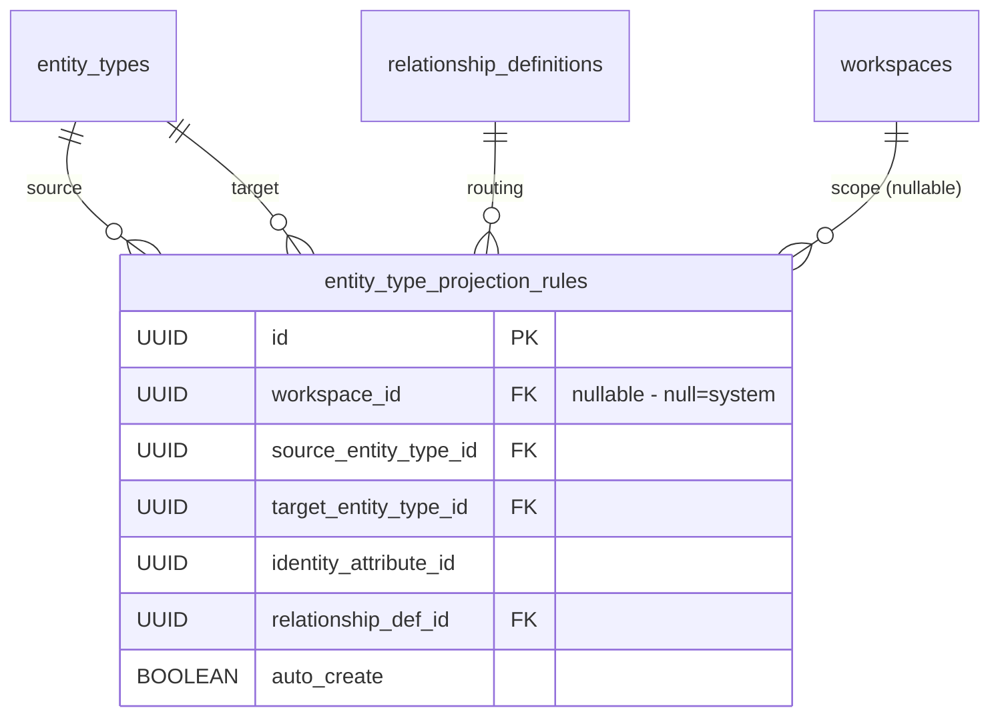
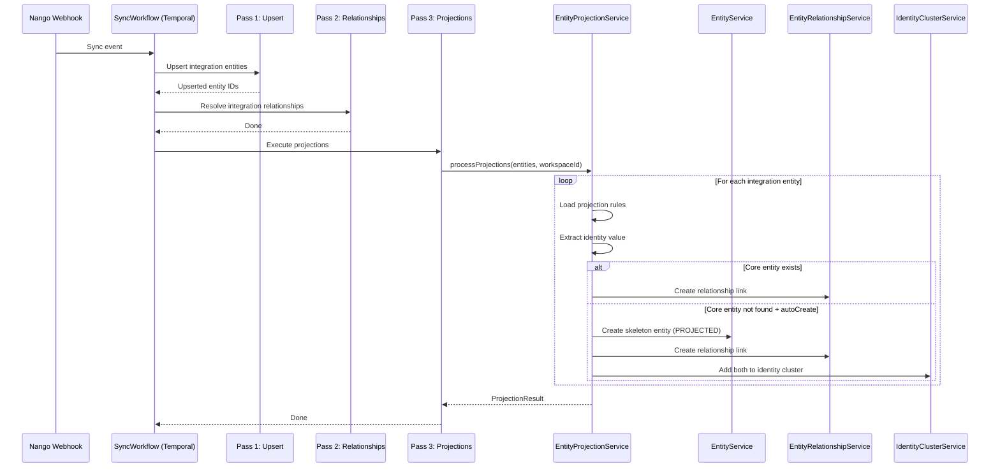

---
tags:
  - "#status/draft"
  - priority/high
  - architecture/feature
Created: 2026-03-20
Updated: 2026-03-20
Domains:
  - "[[Integrations]]"
  - "[[Entities]]"
blocked-by:
  - "[[Identity Resolution System]]"
---
# Feature: Smart Projection Architecture — Entity Integration Bridging

---

## 1. Overview

### Problem Statement

Riven's entity model has two populations that must behave as one unified system:

1. **Core lifecycle entities** (Customer, Support Ticket, Order) — defined as Kotlin core model objects, installed during onboarding via the catalog pipeline, protected schema, user-facing, editable
2. **Integration entities** (hubspot_customer, zendesk_ticket, stripe_customer) — materialized from integration manifests, readonly, immutable source-system mirrors

These are currently independent entity types with no automated bridge. When Zendesk syncs a ticket, it creates a `zendesk_ticket` entity. No corresponding core `Support Ticket` entity is auto-created. The identity resolution system (PR #141) only matches entities that *already exist* — it doesn't create new core entities from integration data.

Without automated bridging, the core Launch Scope promises are impossible:
- **Unified Customer View** requires assembling data from HubSpot, Stripe, and Gorgias onto a single Customer record
- **Cross-Domain Data Tables** require columns like "Open Tickets: 3" and "MRR: $50" derived from integration sources
- **Cross-Domain Questions** require query-time aggregation across relationships
- **Churn Retrospective Timeline** requires traversing a Customer's full lifecycle across all connected tools
- **System Agnosticism** requires the core model to work regardless of which integration provides the data (Zendesk today, Intercom tomorrow)

The gap: no system exists to automatically create core lifecycle entities from integration data, route them into named relationships, or derive computed columns from related integration entities.

### Proposed Solution

**Invisible Integration Entities + Smart Projection** — a three-layer architecture that keeps integration data immutable while presenting users with a unified entity experience.

1. **Invisible integration entities:** Integration entity types (those with `sourceIntegrationId != null`) are hidden from the workspace UI. They exist as infrastructure — provenance, audit trail, re-derivation source — but users never interact with `hubspot_customer` or `zendesk_ticket` directly. They see Customer, Support Ticket, Order.

2. **Projection pipeline:** When integration data syncs, projection rules auto-create or link core lifecycle entities. A `zendesk_ticket` entity triggers creation of a `Support Ticket` entity, linked via a named relationship ("Support Tickets" on Customer). The projection pipeline runs as Pass 3 in the Temporal sync workflow, after entity upsert (Pass 1) and integration relationship resolution (Pass 2).

3. **Aggregation columns:** Computed columns on core entity types derive values from related integration entities at query time. "Open Tickets: 3", "Total Revenue: $2,450", "Known Emails: 2" — all assembled from relationship traversal, never stored.

### Architectural Rationale — Why Not Attio-Style Direct Write?

Attio solves this by not having separate integration entity types — integrations write directly to core records via assert/upsert with per-attribute provenance. This was evaluated and rejected for Riven because:

- **Provenance conflicts:** Multiple sources writing to the same entity introduces CRDT-like conflict resolution complexity. Which source wins for the `email` field? What happens when three sources and a user edit touch the same field in the same sync window?
- **Source migration:** When a company switches from Zendesk to Intercom, the Attio model must figure out which attributes to overwrite. Riven's model just swaps the projection rule — the core entity is re-derived from the new source.
- **Future data sources:** The SaaS Decline thesis predicts customers will increasingly have messy internal Postgres tables and undocumented APIs as data sources. These don't have clean schemas. The readonly integration entity model with explicit projection rules provides a translation boundary that direct-write does not.
- **Debugging and audit:** Readonly integration entities are a complete, immutable mirror of what the source system sent. When a sync goes wrong, you compare the integration entity to the source record — no detective work needed.

Expert consensus (Kleppmann, Hickey, Helland, Thompson, Hohpe) converged on this approach. See CEO plan at `~/.gstack/projects/rmr-studio-riven/ceo-plans/2026-03-20-smart-projection-architecture.md` for the full expert panel analysis.

### Prerequisites

This feature assumes the following PRs are merged to main:

| PR | Feature | Why It's Required |
|---|---|---|
| #143 (lifecycle-spine) | LifecycleDomain enum, Kotlin core model definitions, three-tier entity model | Foundation for domain-based projection routing — LifecycleDomain + SemanticGroup determine which core model an integration entity projects into |
| #142 (integration-sync) | Temporal sync workflow (Pass 1 + Pass 2) | Projection pipeline is Pass 3, extending this workflow |
| #141 (identity-resolution) | pg_trgm matching, identity clusters, match suggestions | Projection uses clusters for dedup; enrichment extends confirmation flow |
| #140 (notes) | Notes feature | Independent, merge first to clear the queue |

**Merge order:** #140 → #143 → #142 → #141. Minor conflicts between PRs:
- `SourceType.kt` touched by #141 and #143 — trivial enum merge
- `TemporalWorkerConfiguration.kt` touched by #141 and #142 — merge both worker registrations
- `TODOS.md` touched by #141 and #142 — merge contents

None of these PRs require rework for Smart Projection. The projection layer is additive — built on top of all three.

### Short Comings

- **Aggregation column performance:** COUNT/SUM queries across relationships at query time could be slow for entity types with thousands of related entities. May need materialized counters or query-time caching as a follow-up.
- **Projection rule conflicts:** Resolved via domain+semanticGroup discriminator (CEO review 2026-03-20). Two core models sharing a LifecycleDomain are disambiguated by SemanticGroup. E.g., Subscription (BILLING, TRANSACTION) vs BillingEvent (BILLING, FINANCIAL).
- **Identity resolution interaction:** The projection pipeline creates entities → identity resolution suggests matches → risk of redundant suggestions for already-projected pairs. Solved by cluster-aware candidate exclusion (see §3).

### Success Criteria

- [ ] Integration entity types with `sourceIntegrationId != null` are hidden from workspace sidebar and entity type listings
- [ ] Users can drill into integration entity details from integration settings
- [ ] Projection rules auto-create core lifecycle entities when integration data syncs
- [ ] Smart relationship routing places integration-derived entities in named relationship columns (e.g., "Support Tickets") based on LifecycleDomain classification
- [ ] Readonly entity types never have inverse relationship columns added — they only show CONNECTED_ENTITIES
- [ ] Aggregation columns (COUNT, SUM, LATEST, STATUS) compute values at query time from related entities
- [ ] A company migrating from Zendesk to Intercom retains core entity types unchanged — only the projection source swaps
- [ ] Users can create core entities manually (sourceType=USER_CREATED) alongside projected entities — both coexist
- [ ] Identity resolution skips suggesting matches between entities already in the same identity cluster (cluster-aware dedup)

---

## 2. Data Model

### New Entities

| Entity | Purpose | Key Fields |
|--------|---------|------------|
| `entity_type_projection_rules` | Declares that integration entity type X should auto-create/link core entity type Y | `source_entity_type_id`, `target_entity_type_id`, `identity_attribute_id`, `relationship_def_id`, `auto_create` |

#### entity_type_projection_rules

```sql
CREATE TABLE IF NOT EXISTS public.entity_type_projection_rules
(
    "id"                      UUID PRIMARY KEY DEFAULT gen_random_uuid(),
    "workspace_id"            UUID        REFERENCES workspaces(id) ON DELETE CASCADE,  -- NULL = system-defined (manifest)
    "source_entity_type_id"   UUID        NOT NULL REFERENCES entity_types(id) ON DELETE CASCADE,
    "target_entity_type_id"   UUID        NOT NULL REFERENCES entity_types(id) ON DELETE CASCADE,
    "identity_attribute_id"   UUID        NOT NULL,  -- Which attribute to match on (email, external ID)
    "relationship_def_id"     UUID        NOT NULL REFERENCES relationship_definitions(id) ON DELETE CASCADE,
    "auto_create"             BOOLEAN     NOT NULL DEFAULT true,
    "created_at"              TIMESTAMPTZ NOT NULL DEFAULT now(),
    "updated_at"              TIMESTAMPTZ NOT NULL DEFAULT now(),
    UNIQUE (workspace_id, source_entity_type_id, target_entity_type_id)
);
```

Design decisions:
- **`workspace_id = NULL`** for system-defined rules from integration manifests. These are immutable — users cannot edit or delete them.
- **`workspace_id = UUID`** for user-defined rules (Phase D, future). Same table, same pipeline.
- **`identity_attribute_id`** references the IDENTIFIER-classified attribute on the source entity type used for matching (e.g., email on hubspot_contact). This is the "matching attribute" from Attio's assert pattern.
- **`relationship_def_id`** determines WHERE the projected entity is linked — "Support Tickets" instead of catch-all CONNECTED_ENTITIES. This is smart routing.
- **`auto_create = true`** means the pipeline creates a new core entity if no match is found. `false` means only link to existing entities — don't create.
- **Unique constraint** on `(workspace_id, source, target)` prevents duplicate rules for the same pair.

### Entity Modifications

| Entity | Change | Rationale |
|--------|--------|-----------|
| `SourceType` enum | Add `PROJECTED` value | Distinguishes auto-created core entities from user-created and integration-synced |
| `ColumnConfiguration` model | Add `AGGREGATION` column type | Supports computed columns (COUNT, SUM, LATEST, STATUS) derived from relationships |

### Enum: SourceType (extended)

```kotlin
enum class SourceType {
    USER_CREATED,
    INTEGRATION,
    IMPORT,
    API,
    WORKFLOW,
    IDENTITY_MATCH,  // Added by PR #141
    PROJECTED         // NEW — auto-created by projection pipeline
}
```

### Model: AggregationColumnDefinition (new, inside ColumnConfiguration JSONB)

```kotlin
data class AggregationColumnDefinition(
    val name: String,                          // "Open Tickets"
    val sourceRelationshipId: UUID,            // relationship_definitions.id
    val aggregation: AggregationType,          // COUNT, SUM, LATEST, STATUS
    val targetAttributeId: UUID? = null,       // Which attribute to aggregate (null for COUNT)
    val filter: AggregationFilter? = null,     // Optional filter (e.g., status IN [open, in-progress])
)

enum class AggregationType {
    COUNT,    // Count of related entities matching filter
    SUM,      // Sum of a numeric attribute across related entities
    LATEST,   // Most recent value of a date/timestamp attribute
    STATUS,   // Latest value of a categorical attribute (by date)
}

data class AggregationFilter(
    val attributeId: UUID,
    val operator: FilterOperator,     // IN, EQUALS, NOT_EQUALS
    val values: List<String>,
)
```

### Data Ownership

| Data | Owner | Notes |
|------|-------|-------|
| Projection rules | `EntityProjectionService` | Created during materialization, consumed during sync |
| Projected entities | `EntityProjectionService` | Auto-created with `sourceType = PROJECTED` |
| Aggregation column definitions | `ColumnConfiguration` (JSONB on entity_types) | System-defined in manifests, user-defined in Phase D |

### Entity Visibility Logic

Integration entity types are hidden from workspace UI using the existing `sourceIntegrationId` field:

```
  Visible entity types:   sourceIntegrationId IS NULL
  Hidden entity types:    sourceIntegrationId IS NOT NULL
```

No new database column needed. The filtering is applied at the API/UI layer, not at the database level — integration entity types remain queryable via API for integration management and debugging.

### Asymmetric Relationship Visibility

Relationships are bidirectional at the data level — one row in `entity_relationships`, traversable in both directions. Column visibility is asymmetric:

- **Core entity types** (`readonly = false`): Show outgoing relationship columns + inverse relationship columns + aggregation columns
- **Readonly entity types** (`readonly = true`): Show outgoing relationship columns only (CONNECTED_ENTITIES). **No inverse columns** from relationships where they are the target.

Implementation in `assembleColumns()`:
```kotlin
if (!entityType.readonly) {
    columns += deriveInverseRelationshipColumns(entityType.id)
}
```

This keeps integration entity types absolutely readonly — no relationship columns are ever appended to them by the system.

### Relationships



### Data Lifecycle

- **Creation:** Projection rules are created during template materialization (system rules) or by users (Phase D, future). Projected entities are created during sync workflow Pass 3.
- **Updates:** Projection rules are immutable for system-defined rules. User-defined rules can be modified. Projected entities are updated when identity resolution links additional sources.
- **Deletion:** Projection rules cascade-delete when source/target entity types are deleted. Projected entities follow standard soft-delete via `SoftDeletable`.

### Consistency Requirements

- [x] Requires strong consistency (ACID transactions)
- Projection pipeline runs within the Temporal sync workflow. Each entity projection (find-or-create + link) is transactional. Failures are per-entity isolated — one failed projection doesn't block others.

---

## 3. Component Design

### New Components

| Component | Package | Type | Purpose |
|-----------|---------|------|---------|
| `EntityProjectionService` | `riven.core.service.integration.projection` | Service | Executes projection rules during sync — find-or-create core entities, link via relationships |
| `ProjectionRuleEntity` | `riven.core.entity.integration` | JPA Entity | `entity_type_projection_rules` table mapping |
| `ProjectionRule` | `riven.core.models.integration.projection` | Domain Model | Projection rule with source/target/identity/relationship references |
| `ProjectionRuleRepository` | `riven.core.repository.integration` | Repository | Workspace-scoped queries, source entity type lookups |
| `AggregationColumnDefinition` | `riven.core.models.entity.configuration` | Data Class | Definition for COUNT/SUM/LATEST/STATUS aggregation columns |
| `AggregationType` | `riven.core.enums.entity` | Enum | COUNT, SUM, LATEST, STATUS |
| `AggregationFilter` | `riven.core.models.entity.configuration` | Data Class | Optional filter for aggregation (attribute + operator + values) |

### Service Responsibilities

#### EntityProjectionService

The core new service. Executes projection rules after integration entities sync.

```
  processProjections(integrationEntities: List<EntityEntity>, workspaceId: UUID)
    │
    ├── loadProjectionRules(sourceEntityTypeId)
    │     → List<ProjectionRule> for this integration entity type
    │
    ├── For each integration entity × projection rule:
    │   ├── extractIdentityValue(entity, rule.identityAttributeId)
    │   │     → e.g., "jane@acme.com"
    │   │
    │   ├── findExistingCoreEntity(rule.targetEntityTypeId, identityValue, workspaceId)
    │   │     → Search core entity type for matching IDENTIFIER attribute
    │   │
    │   ├── If found:
    │   │   └── createRelationshipLink(coreEntity, integrationEntity, rule.relationshipDefId)
    │   │
    │   ├── If not found AND rule.autoCreate:
    │   │   ├── createSkeletonEntity(rule.targetEntityTypeId, identityValues)
    │   │   │     → sourceType = PROJECTED, copies IDENTIFIER attrs only
    │   │   ├── createRelationshipLink(skeleton, integrationEntity, rule.relationshipDefId)
    │   │   └── addToIdentityCluster(skeleton, integrationEntity)
    │   │
    │   └── If not found AND !rule.autoCreate:
    │       └── skip (log at DEBUG)
    │
    └── Return ProjectionResult(created, linked, skipped, errors)
```

Key behaviours:
- **Skeleton entities** get only IDENTIFIER-classified attributes (email, name) copied from the integration entity. All other attributes are empty — the user fills them in, or they're derived via aggregation columns.
- **Identity cluster assignment:** When a projection creates a new core entity, both the core entity and the integration entity are added to the same identity cluster. This prevents identity resolution from re-suggesting them as a match (cluster-aware dedup).
- **Idempotent:** If a relationship already exists between the core and integration entities, skip. If a core entity already exists with the matching identity, link rather than create.

#### assembleColumns() Extension

The existing `EntityTypeService.assembleColumns()` method is extended with two changes:

1. **Skip inverse columns for readonly types** (see §2 Asymmetric Relationship Visibility)
2. **Derive aggregation columns** from `ColumnConfiguration.aggregations`

```kotlin
// Aggregation column assembly (conceptual)
fun deriveAggregationColumns(entityTypeId: UUID): List<AggregationColumn> {
    val config = entityType.columnConfiguration ?: return emptyList()
    return config.aggregations.map { agg ->
        AggregationColumn(
            name = agg.name,
            type = agg.aggregation,
            // Value computed at query time via SQL JOIN
        )
    }
}
```

Aggregation values are computed at query time:

```sql
-- COUNT with filter (e.g., "Open Tickets: 3")
SELECT e.id,
  COUNT(target.id) FILTER (
    WHERE ea.attribute_id = :statusAttrId
    AND ea.value->>'value' IN ('open', 'in-progress')
  ) as open_tickets
FROM entities e
JOIN entity_relationships er ON er.source_entity_id = e.id
  AND er.relationship_definition_id = :supportTicketsRelId
  AND er.deleted = false
JOIN entities target ON target.id = er.target_entity_id
  AND target.deleted = false
LEFT JOIN entity_attributes ea ON ea.entity_id = target.id
  AND ea.deleted = false
GROUP BY e.id
```

### Affected Existing Components

| Component | Change Required | Impact |
|-----------|-----------------|--------|
| `TemplateInstallationService` | Create projection rules and aggregation configs during core model installation | Extended with `installProjectionRules()` and `installAggregationConfigs()` |
| `IntegrationSyncWorkflowImpl` | Add Pass 3: projection pipeline execution | New activity call after relationship resolution |
| `EntityTypeService.assembleColumns()` | Skip inverse columns for readonly types; add aggregation column derivation | Two additions to existing method |
| `IdentityMatchCandidateService` | Add cluster-aware exclusion to candidate query | WHERE clause addition |
| `IdentityConfirmationService` | Add enrichment step (aggregate identity signals to core entity) | New private method after cluster resolution |
| Entity listing API / frontend | Filter `sourceIntegrationId != null` entity types from default views | Query parameter / frontend filter |
| Core model definitions | Kotlin objects declare projection acceptance rules and aggregation columns | New package: `riven.core.lifecycle.models` |

### Integration with Sync Workflow (PR #142)

The projection pipeline integrates as Pass 3 in the existing Temporal sync workflow:

```
  IntegrationSyncWorkflowImpl.syncEntities()
    │
    ├── Pass 1: upsertEntities()              (existing — PR #142)
    │     → Creates/updates integration entities
    │
    ├── Pass 2: resolveRelationships()         (existing — PR #142)
    │     → Resolves relationships between integration entities
    │
    └── Pass 3: executeProjections()           (NEW)
          → For each upserted entity, run projection rules
          → Find-or-create core entities, link via relationships
          → Add to identity clusters for dedup
```

Pass 3 is a new Temporal activity. It receives the list of upserted entity IDs from Pass 1 and calls `EntityProjectionService.processProjections()`.

### Integration with Identity Resolution (PR #141)

Two modifications to the identity resolution system:

1. **Cluster-aware candidate exclusion:** The `IdentityMatchCandidateService` candidate query adds:
   ```sql
   AND ea.entity_id NOT IN (
     SELECT icm2.entity_id
     FROM identity_cluster_members icm1
     JOIN identity_cluster_members icm2 ON icm2.cluster_id = icm1.cluster_id
     WHERE icm1.entity_id = :triggerEntityId
   )
   ```
   This prevents suggesting matches between entities already in the same cluster — including projected pairs.

2. **Identity enrichment on confirmation:** When identity resolution confirms a match between two entities (e.g., jsmith@gmail.com ≈ john.smith@gmail.com), the core entity's aggregation column "Known Emails" automatically reflects both emails because it aggregates EMAIL-classified IDENTIFIER attributes across all cluster members.

### Domain-Based Projection Routing (CEO Review 2026-03-20)

> **Supersedes:** The original design specified per-integration projection declarations in JSON manifests (e.g., `zendesk-ticket` explicitly targeting `support-ticket`). Per the SaaS Decline thesis, this was replaced with domain-based routing that is source-agnostic. See CEO plan: `~/.gstack/projects/rmr-studio-riven/ceo-plans/2026-03-20-core-model-architecture.md`.

Projection routing is **declared on core model definitions**, not on integration manifests. Core models accept projections by `(LifecycleDomain, SemanticGroup)` pair — any entity matching that pair projects automatically, regardless of source (SaaS integration, direct Postgres connection, CSV import, webhook).

**Core model projection declarations (Kotlin):**

```kotlin
object SupportTicketModel : CoreModelDefinition(
    key = "support-ticket",
    lifecycleDomain = LifecycleDomain.SUPPORT,
    semanticGroup = SemanticGroup.SUPPORT,
    // ...attributes, relationships...
    projectionAccepts = ProjectionAcceptRule(
        domain = LifecycleDomain.SUPPORT,
        semanticGroup = SemanticGroup.SUPPORT,
        relationshipName = "Support Tickets",
        autoCreate = true,
    ),
)
```

**How routing works at runtime:**

1. Integration entity syncs with `lifecycleDomain = SUPPORT`, `semanticGroup = SUPPORT`
2. Projection pipeline queries `entity_type_projection_rules` for a rule matching `(SUPPORT, SUPPORT)`
3. Finds SupportTicket core model → creates/links skeleton entity
4. No `zendesk_ticket` or `intercom_ticket` reference anywhere in the routing path

**Domain + SemanticGroup disambiguation:**

| LifecycleDomain | SemanticGroup | Core Model Target | Relationship Name |
|---|---|---|---|
| SUPPORT | SUPPORT | Support Ticket | "Support Tickets" |
| BILLING | FINANCIAL | Billing Event | "Billing Events" |
| BILLING | TRANSACTION | Subscription / Order | "Subscriptions" / "Orders" |
| ACQUISITION | OPERATIONAL | Acquisition Source | "Acquisition Sources" |
| USAGE | OPERATIONAL | Feature Usage Event | "Feature Usage" |
| RETENTION | FINANCIAL | Churn Event | "Churn Events" |
| UNCATEGORIZED | * | (no projection) | CONNECTED_ENTITIES fallback |

**Integration manifests do NOT declare projections.** They only need `lifecycleDomain` and `semanticGroup` on their entity types (which they already have). The projection pipeline matches these against core model acceptance rules automatically.

### Source Agnosticism

This design is critical for the SaaS Decline thesis. Future data sources include:
- Direct Postgres connections (internal tools)
- CSV imports with schema inference
- Webhook receivers from custom systems
- API polling from undocumented internal services

All of these produce entities with `lifecycleDomain` classification. Domain-based routing handles them without any per-source projection configuration.

### Component Interaction Diagram



---

## 4. API Design

### Endpoints

No new REST endpoints for the projection pipeline itself — it runs as part of the sync workflow (system-initiated, not user-initiated).

Affected existing endpoints:

#### Entity Type Listing — Visibility Filter

`GET /api/v1/entity-types/{workspaceId}`

- **Change:** Add optional query parameter `includeInternal` (default: `false`)
- **Behaviour:** When `false`, excludes entity types where `sourceIntegrationId IS NOT NULL`
- **When `true`:** Returns all entity types (used by integration management UI)

#### Entity Type Detail — Aggregation Columns

`GET /api/v1/entity-types/{workspaceId}/{entityTypeId}`

- **Change:** Response includes aggregation column definitions in `columnConfiguration`
- **Behaviour:** Aggregation columns appear alongside attribute and relationship columns in the assembled column list

### Future Endpoints (Phase D — Dynamic Mapping)

These are not built now but documented for architectural awareness:

- `GET /api/v1/projections/{workspaceId}` — List projection rules
- `POST /api/v1/projections/{workspaceId}` — Create user-defined projection rule
- `PUT /api/v1/projections/{workspaceId}/{ruleId}` — Update projection rule
- `DELETE /api/v1/projections/{workspaceId}/{ruleId}` — Delete user-defined projection rule

### Contract Changes

No breaking changes to existing API contracts. Entity type listing gains an optional filter parameter. Entity type detail response includes additional column types.

---

## 5. Failure Modes & Recovery

### Failure Modes Registry

| Codepath | Failure Mode | Handled | User Sees | Logged | Recovery |
|----------|-------------|---------|-----------|--------|----------|
| Projection rule lookup | No rules for entity type | Yes | None (skip) | DEBUG | Skip projection — entity type has no projection rules |
| Identity extraction | Attribute value is null/empty | Yes | None (skip) | WARN | Skip this entity — can't match without identity |
| Core entity search | Query timeout | Yes | Delayed projection | Yes | Temporal retry with backoff |
| Skeleton creation | Unique constraint violation (identity attr) | Yes | None (dedup) | WARN | Entity already exists — fall through to link |
| Relationship creation | Relationship already exists | Yes | None (idempotent) | DEBUG | Skip — already linked |
| Cluster assignment | Cluster service unavailable | Yes | Projection completes without cluster | WARN | Projection still works; identity resolution may re-suggest |
| Aggregation query | Timeout on large relationship sets | Yes | Empty/stale column | WARN | Return null; log for performance investigation |
| Aggregation query | Target entity soft-deleted | Yes | Excluded from count | No | `@SQLRestriction` handles automatically |
| Materialization | Projection rule references non-existent relationship | Yes | Materialization fails | ERROR | Fail fast during materialization — manifest error |
| Manifest parsing | Missing `projections` field | Yes | None (optional) | No | Field is optional — entity type has no projections |

0 critical gaps. All failure modes are per-entity isolated — one failed projection does not block the sync batch.

### Rollback Strategy

| Step | Action | Reversible |
|------|--------|------------|
| 1 | Remove Pass 3 from sync workflow | Yes |
| 2 | Drop `entity_type_projection_rules` table | Yes (system-generated data) |
| 3 | Remove `PROJECTED` from SourceType | Yes (no entities use it yet) |
| 4 | Revert `assembleColumns()` changes | Yes |
| 5 | Remove visibility filter from entity type listing | Yes |

Projected entities created before rollback persist as regular entities with `sourceType = PROJECTED`. They don't break anything — they're just orphaned from the projection system.

Reversibility: 5/5

### Blast Radius

If the projection pipeline fails completely:
- Integration sync (Pass 1 + Pass 2) is unaffected — integration entities still sync
- Identity resolution is unaffected — it runs independently
- Core entity types exist but have no auto-created entities
- Users can still manually create core entities and link them
- Aggregation columns show null/zero values

---

## 6. Security

### Authentication & Authorization

- **Projection rules:** System-defined rules have no workspace_id — they are global. User-defined rules (Phase D) are workspace-scoped via `@PreAuthorize`.
- **Projected entities:** Created with the sync pipeline's service context. Workspace-scoped via the integration connection's workspace.
- **Aggregation queries:** Run within the user's workspace scope. No cross-workspace data leakage.

### Data Sensitivity

| Data Element | Sensitivity | Protection Required |
|-------------|-------------|---------------------|
| Projection rules | Internal configuration | Workspace isolation for user-defined rules |
| Projected entity attributes | PII (copies of integration IDENTIFIER values) | Same protection as source entity attributes — workspace-scoped, RLS |
| Aggregation column values | Derived from existing data | No additional protection — values are computed from already-accessible data |

### Attack Vectors Considered

- [x] Input validation — Projection rules are system-generated from manifests, not user input (until Phase D)
- [x] Authorization bypass — Projected entities inherit workspace scope from the integration connection
- [x] Data leakage — Aggregation queries are workspace-scoped; cross-workspace traversal impossible
- [x] Injection — Aggregation filters use parameterised queries, not string interpolation

---

## 7. Performance & Scale

### Performance Strategy

Projection runs as Temporal workflow activity — latency is not user-facing. The performance-critical path is aggregation column computation at query time.

### Aggregation Column Performance

Aggregation queries JOIN across `entity_relationships` and `entity_attributes`. For a Customer with 50 related tickets, this is trivial. For a Customer with 5,000 related entities, this could be slow.

**Mitigation strategies (in order of implementation):**

1. **Query-time computation** (Phase C, MVP) — Acceptable for < 500 related entities per core entity. This covers the vast majority of workspaces.
2. **Materialized counters** (future) — Denormalized counter columns on core entities, updated via triggers or sync pipeline. Trades consistency for performance.
3. **Async aggregation cache** (future) — Background job computes aggregations periodically, stores results in a cache table.

### Index Strategy

| Index | Expression | Type | Purpose |
|-------|-----------|------|---------|
| `idx_projection_rules_source` | `source_entity_type_id` | B-tree | Lookup projection rules during sync |
| `idx_projection_rules_workspace` | `workspace_id` | B-tree (partial, WHERE workspace_id IS NOT NULL) | Workspace-scoped rule queries (Phase D) |
| Existing entity indexes | — | — | Aggregation queries use existing relationship and attribute indexes |

### Database Considerations

- **No new GIN indexes** — aggregation queries use existing B-tree indexes on relationships and attributes
- **No new extensions** — pg_trgm already added by PR #141
- **Projection rules table is small** — typically < 50 rows per workspace (one per integration entity type × projection target)

---

## 8. Observability

### Logging

| Event | Level | Key Fields |
|-------|-------|------------|
| Projection rules loaded | DEBUG | entity type ID, rule count |
| Projection skipped (no rules) | DEBUG | entity type ID |
| Core entity found (link) | INFO | integration entity ID, core entity ID |
| Core entity created (skeleton) | INFO | integration entity ID, new core entity ID, sourceType=PROJECTED |
| Relationship created | DEBUG | source ID, target ID, relationship def ID |
| Cluster assignment | DEBUG | entity IDs, cluster ID |
| Projection failed (single entity) | WARN | entity ID, error message |
| Projection batch complete | INFO | workspace ID, created count, linked count, skipped count, error count |
| Aggregation query timing | DEBUG | entity type ID, aggregation name, duration ms |
| Aggregation query timeout | WARN | entity type ID, aggregation name |

### Activity Logging

Projected entity creation logs activity via `ActivityService`:
- Activity: `ENTITY`, Operation: `CREATE`
- Details: `{ "sourceType": "PROJECTED", "projectedFrom": "<integration_entity_id>", "projectionRule": "<rule_id>" }`

---

## 9. Testing Strategy

### Unit Tests

- **EntityProjectionService:**
  - Integration entity with matching core entity → link created, no new entity
  - Integration entity with no matching core entity + autoCreate → skeleton created + linked
  - Integration entity with no matching core entity + !autoCreate → skipped
  - Integration entity with null identity value → skipped with warning
  - Duplicate projection (already linked) → idempotent, no error
  - Multiple projection rules for same entity type → all executed
  - Cluster assignment on skeleton creation

- **assembleColumns() changes:**
  - Readonly entity type → no inverse columns
  - Non-readonly entity type → inverse columns included (regression)
  - Aggregation columns included in column list
  - Aggregation with filter → filter applied correctly

- **Projection rule materialization:**
  - Manifest with projections → rules created with correct UUIDs
  - Manifest without projections → no rules created
  - Re-materialization → idempotent (rules not duplicated)

### Integration Tests

- Full sync workflow with projection: Nango webhook → Pass 1 (upsert) → Pass 2 (relationships) → Pass 3 (projection) → core entity created with correct attributes and relationship
- Aggregation column query with real PostgreSQL (Testcontainers) — COUNT with filter returns correct value
- Identity resolution cluster-aware exclusion — projected pairs not suggested as matches

### Key Test Scenarios

- **Confidence test:** Zendesk ticket syncs with requester email → Support Ticket created → linked to Customer via "Support Tickets" relationship → Customer's "Open Tickets" aggregation shows 1
- **Hostile QA test:** 100 integration entities with same email → one core entity created, 100 relationship links, no duplicates
- **Chaos test:** Core entity deleted mid-projection → graceful failure, no orphaned relationships
- **Migration test:** Disable Zendesk, enable Intercom → new projection rules → new integration entities link to same core entities

---

## 10. Migration & Rollout

### Database Migrations

1. Create `entity_type_projection_rules` table with indexes
2. Add `PROJECTED` to SourceType enum (VARCHAR — no migration needed, just code change)
3. Aggregation column definitions are JSONB within existing `column_configuration` — no schema change

### Data Backfill

No backfill needed for existing workspaces. Projection rules are created during integration materialization. For workspaces with already-synced integration data, a manual re-sync will trigger Pass 3 projections.

### Feature Flags

No feature flags needed. The projection pipeline is activated by the presence of projection rules. No rules → no projections. To disable: skip Pass 3 in the sync workflow.

### Rollout Sequence

1. Deploy schema changes (projection rules table)
2. Deploy code with projection pipeline disabled (rules created but Pass 3 not wired)
3. Enable Pass 3 in sync workflow
4. Monitor projection logs for first syncs
5. Deploy aggregation column UI support

---

## 11. Open Questions

- **PERF-01:** At what related-entity count does aggregation query latency become unacceptable? Need benchmarking with realistic data volumes. Threshold for switching to materialized counters.
- **CONFLICT-01:** If two projection rules target the same core entity type from different integration entity types, should they create one core entity (matched by identity) or two? Current design: one, matched by identity attribute — same as Attio's assert/upsert. Confirm this is correct.
- **ENRICH-01:** Should identity enrichment (accumulating emails from cluster members) be a real-time aggregation column or a background sync that updates the core entity's attributes? Current design: aggregation column (no attribute mutation). Confirm.

---

## 12. Decisions Log

| Date | Decision | Rationale | Alternatives Considered |
|------|----------|-----------|------------------------|
| 2026-03-20 | Keep integration entities as hidden infrastructure, not visible to users | Users see Customer, not hubspot_customer. Integration entities exist for provenance, audit, and re-derivation. Expert consensus (Kleppmann, Hickey, Helland, Thompson, Hohpe). | Attio-style direct write (rejected: provenance conflicts, no translation boundary, breaks readonly architecture) |
| 2026-03-20 | Use `sourceIntegrationId != null` for visibility, not new column | Existing field already identifies integration entity types. No schema change needed. | New `internal` boolean column (rejected: redundant with sourceIntegrationId) |
| 2026-03-20 | Asymmetric relationship visibility — skip inverse columns for readonly types | Keeps integration entity types absolutely readonly. No relationship columns appended. CONNECTED_ENTITIES is the only browse mechanism. | `show_inverse` flag on RelationshipDefinition (rejected: implicit rule in assembleColumns is simpler and zero-schema-change) |
| 2026-03-20 | Aggregation columns computed at query time, not stored | Always fresh. No sync/stale problem. Acceptable performance for < 500 related entities. | Materialized counters (deferred: premature optimisation until benchmarked) |
| 2026-03-20 | Smart routing via LifecycleDomain defaults | Integration entity types classified by lifecycle domain map to named relationships. Explicit manifest declarations override. | Always use CONNECTED_ENTITIES (rejected: loses the "Support Tickets" column experience) |
| 2026-03-20 | Skeleton entities with IDENTIFIER attrs only | Core entities start minimal. Users add their own data. Integration data stays on integration entities, accessed via relationships and aggregation columns. No data duplication, no sync conflicts. | Full attribute projection (rejected: reintroduces per-attribute provenance conflicts from PR #130) |
| 2026-03-20 | Projection rules table supports both system and user-defined rules | `workspace_id = null` for manifest rules, UUID for user rules. Same table, same pipeline. Future-proofed for dynamic mapping (Phase D) without separate infrastructure. | Separate tables for system vs user rules (rejected: unnecessary duplication) |
| 2026-03-20 | Cluster-aware candidate exclusion in identity resolution | Projected pairs are added to the same identity cluster. Candidate query excludes cluster members. Prevents redundant match suggestions. | Post-processing filter (rejected: wastes compute on candidates that will be filtered anyway) |
| 2026-03-20 | Domain-based projection routing (replaces per-integration declarations) | Projection rules use (LifecycleDomain, SemanticGroup) pair to route integration entities to core models. Source-agnostic — works for any data source without per-integration configuration. Per SaaS Decline thesis. | Per-integration manifest projections (rejected: violates system agnosticism, doesn't scale with custom integrations, direct Postgres connections, CSV imports) |
| 2026-03-20 | Core models as Kotlin objects (replaces JSON manifests for lifecycle types) | Core lifecycle entity types defined as Kotlin objects with compile-time safety, DRY composition, and co-located projection/aggregation declarations. Integration types remain as JSON manifests. | JSON manifests for everything (rejected: no compile-time safety, DRY violations, verbose for growing complexity) |
| 2026-03-20 | Domain + SemanticGroup as projection discriminator | When multiple core models share a LifecycleDomain, SemanticGroup disambiguates. Both fields already exist on every entity type. No new fields needed. | Single LifecycleDomain match (rejected: ambiguous for BILLING domain shared by Subscription and BillingEvent) |

---

## 13. Implementation Phases

Implementation follows a 4-phase sequencing. Each phase is independently deployable and testable.

### Phase A: Foundation
**Prerequisite:** PRs #140, #143, #142, #141 merged to main. Core Model Architecture (Kotlin core model definitions) implemented.

- [ ] Add `PROJECTED` to `SourceType` enum
- [ ] Create `entity_type_projection_rules` table + JPA entity + repository
- [ ] Extend `TemplateInstallationService` to install projection rules from core model definitions
- [ ] Update `assembleColumns()` to skip inverse columns when `readonly = true`
- [ ] Update entity type listing API to filter by `sourceIntegrationId`
- [ ] Frontend: filter hidden entity types from workspace sidebar

**Effort:** M (human: ~1 week / CC: ~30 min)

### Phase B: Projection Pipeline
**Prerequisite:** Phase A

- [ ] `EntityProjectionService` with find-or-create + link + cluster assignment
- [ ] Add Pass 3 to `IntegrationSyncWorkflowImpl`
- [ ] Domain-based projection routing via `(LifecycleDomain, SemanticGroup)` matching against core model acceptance rules
- [ ] Cluster-aware candidate exclusion in `IdentityMatchCandidateService`
- [ ] Unit and integration tests for projection pipeline

**Effort:** L (human: ~2 weeks / CC: ~1 hour)

### Phase C: Aggregation Columns
**Prerequisite:** Phase B

- [ ] `AggregationColumnDefinition` model and `AggregationType` enum
- [ ] Extend `ColumnConfiguration` to include aggregation definitions
- [ ] `assembleColumns()` aggregation column derivation
- [ ] Query-time aggregation resolution (SQL JOIN + GROUP BY)
- [ ] System-defined aggregation columns in lifecycle-spine manifests (Open Tickets, Total Revenue, etc.)
- [ ] Frontend: data table rendering of aggregation columns
- [ ] Performance benchmarking with realistic data volumes

**Effort:** L (human: ~2 weeks / CC: ~1.5 hours)

### Phase D: Dynamic Mapping (deferred)
**Prerequisite:** Phase C + user feedback

- [ ] User-configurable projection rules via REST API
- [ ] Configuration UI for projection rule management
- [ ] Custom aggregation column creation UI
- [ ] Custom field mapping for non-manifest integrations

**Effort:** XL — deferred until user demand validates the need

---

## Related Documents

- [[Identity Resolution System]] — Matching engine that prevents duplicate suggestions for projected pairs
- [[Integrations]] — Parent domain for integration data flow and sync pipeline
- [[Entities]] — Entity domain providing entity types, attributes, relationships
- [[Three-Tier Entity Model and Lifecycle Spine]] — LifecycleDomain classification used for smart routing
- [[Integration Data Sync Pipeline]] — Temporal sync workflow extended with Pass 3
- [[Integration Schema Mapping]] — SchemaMappingService used for attribute transformation
- [[SaaS Decline & Strategic Positioning]] — Strategic thesis driving system-agnostic design

---

## Changelog

| Date | Author | Change |
|------|--------|--------|
| 2026-03-20 | Claude | Initial design from CEO plan review. Architecture validated by expert panel (Kleppmann, Hickey, Helland, Thompson, Hohpe, Wodtke). Placed in Planning — requires PR prerequisites merged before implementation. |
| 2026-03-20 | Claude | Updated per Core Model Architecture CEO review: projection routing changed from per-integration manifest declarations to domain-based (LifecycleDomain + SemanticGroup) routing declared on Kotlin core model definitions. Integration manifests no longer declare projections. Core models are Kotlin objects, not JSON manifests. Added domain+semanticGroup disambiguation table. Source agnosticism section added per SaaS Decline thesis. |
