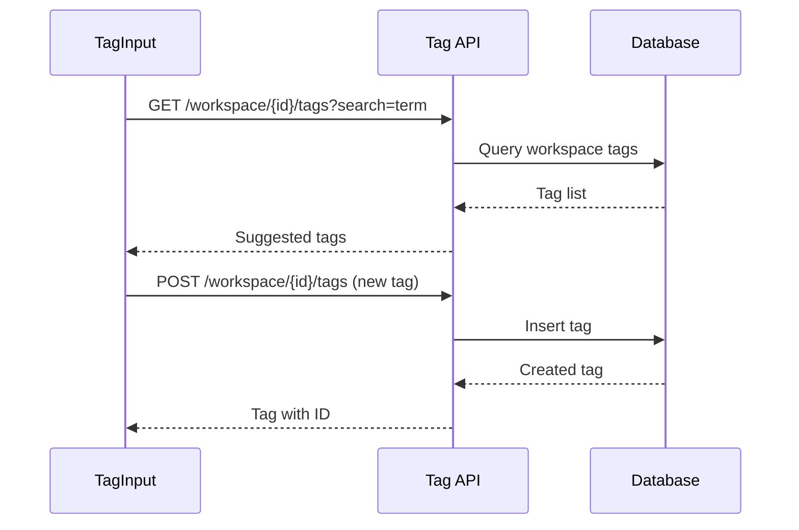

---
tags:
  - "#status/draft"
  - priority/medium
  - domain/entity
  - domain/workspace
  - architecture/design
Created: 2026-03-05
Updated:
Domains:
  - "[[Entity]]"
  - "[[Workspace]]"
---
# Feature: Workspace Scoped Tags

---

## 1. Overview

### Problem Statement

- Tags on entity types are currently free-text strings with no persistence beyond the entity type itself. There is no shared tag vocabulary across a workspace, meaning:
	- Users must remember and retype tags manually, leading to inconsistency (e.g. "finance", "Finance", "financial")
	- There is no way to browse, filter, or manage tags as a first-class concept
	- Tag-based discovery across entity types is unreliable because tags are not normalised or centralised
- A workspace-scoped tag registry would allow tags to be created once and reused across all entity types within that workspace, enabling consistent categorisation and cross-type filtering

### Proposed Solution

Introduce a workspace-level tag registry that stores all tags for a workspace. When users add tags to an entity type, the tag input populates suggestions from this registry. New tags typed by a user are automatically added to the workspace registry. Tags can also be managed (renamed, deleted) from a workspace settings surface.

### Success Criteria

- [ ] Tags are persisted at the workspace level and shared across all entity types
- [ ] Tag input on entity type forms suggests existing workspace tags via search
- [ ] Creating a new tag in any entity type form adds it to the workspace registry
- [ ] Deleting a tag from the workspace registry removes it from all entity types that reference it
- [ ] Tags are consistent (case-normalised, trimmed, deduplicated) across the workspace

---

## 2. Data Model

### New Entities

| Entity        | Purpose                                      | Key Fields                              |
| ------------- | -------------------------------------------- | --------------------------------------- |
| WorkspaceTag  | Stores a unique tag scoped to a workspace    | id, workspaceId, name, createdAt        |

### Entity Modifications

| Entity     | Change                                          | Rationale                                              |
| ---------- | ----------------------------------------------- | ------------------------------------------------------ |
| EntityType | Tags field references WorkspaceTag IDs or names | Replace free-text array with references to registry     |

### Data Ownership

_Which component is the source of truth for each piece of data?_

### Relationships

```
[Workspace] ---(has many)---> [WorkspaceTag]
[EntityType] ---(tagged with many)---> [WorkspaceTag]
```

### Data Lifecycle

- **Creation:** Tags are created when a user types a new tag in any entity type form, or via workspace tag management
- **Updates:** Tag names can be renamed from workspace settings; rename propagates to all references
- **Deletion:** Deleting a tag from the registry removes the association from all entity types. Requires confirmation with impact preview

### Consistency Requirements

- [ ] Requires strong consistency (ACID transactions)
- [ ] Eventual consistency acceptable
- _If eventual:_ What's the acceptable delay? What happens during inconsistency?

---

## 3. Component Design

### New Components

_List each new service/component this feature introduces_

#### ComponentName

- **Responsibility:**
- **Dependencies:** [[Dependency1]], [[Dependency2]]
- **Exposes to:** [[Consumer1]], [[Consumer2]]

### Affected Existing Components

| Component                | Change Required                                        | Impact |
| ------------------------ | ------------------------------------------------------ | ------ |
| [[TagInput]]             | Fetch workspace tags for suggestions                   |        |
| [[EntityTypeService]]    | Resolve tag references on save/load                    |        |
| [[WorkspaceSettings]]    | Add tag management surface                             |        |

### Component Interaction Diagram



---

## 4. API Design

### New Endpoints

#### `GET /api/v1/workspace/{workspaceId}/tags`

- **Purpose:** List all tags for a workspace, with optional search filter
- **Request:**

```
Query params: ?search=term (optional)
```

- **Response:**

```json
{
  "tags": [
    { "id": "uuid", "name": "finance", "createdAt": "2026-03-05T00:00:00Z" }
  ]
}
```

#### `POST /api/v1/workspace/{workspaceId}/tags`

- **Purpose:** Create a new tag in the workspace registry
- **Request:**

```json
{
  "name": "tag-name"
}
```

- **Response:**

```json
{
  "id": "uuid",
  "name": "tag-name",
  "createdAt": "2026-03-05T00:00:00Z"
}
```

- **Error Cases:**
    - `400` - Empty or invalid tag name
    - `409` - Tag with this name already exists in workspace

#### `DELETE /api/v1/workspace/{workspaceId}/tags/{tagId}`

- **Purpose:** Remove a tag from the workspace and all entity type associations
- **Error Cases:**
    - `404` - Tag not found

### Contract Changes

_Any changes to existing APIs? Versioning implications?_

### Idempotency

- [ ] Operations are idempotent
- _If not:_ How do we handle retries?

---

## 5. Failure Modes & Recovery

### Dependency Failures

| Dependency   | Failure Scenario | System Behavior | Recovery |
| ------------ | ---------------- | --------------- | -------- |
| Database     |                  |                 |          |
| External API |                  |                 |          |

### Partial Failure Scenarios

_What happens if we fail mid-operation?_

| Scenario | State Left Behind | Recovery Strategy |
| -------- | ----------------- | ----------------- |
|          |                   |                   |

### Rollback Strategy

_If this feature needs to be disabled/rolled back, what's required?_

- [ ] Feature flag controlled
- [ ] Database migration reversible
- [ ] Backward compatible with previous version

### Blast Radius

_If this component fails completely, what else breaks?_

---

## 6. Security

### Authentication & Authorization

- **Who can access this feature?** Any workspace member can read and create tags. Tag deletion restricted to workspace admins
- **Authorization model:** Resource-based (workspace membership)
- **Required permissions:**

### Data Sensitivity

| Data Element | Sensitivity | Protection Required |
| ------------ | ----------- | ------------------- |
| Tag names    | Public      | None                |

### Trust Boundaries

_Where does validated data become untrusted?_

### Attack Vectors Considered

- [ ] Input validation
- [ ] Authorization bypass
- [ ] Data leakage
- [ ] Rate limiting

---

## 7. Performance & Scale

### Expected Load

- **Requests/sec:**
- **Data volume:**
- **Growth rate:**

### Performance Requirements

- **Latency target:** p50: ___ ms, p99: ___ ms
- **Throughput target:**

### Scaling Strategy

- [ ] Horizontal scaling possible
- [ ] Vertical scaling required
- **Bottleneck:**

### Caching Strategy

_What can be cached? TTL? Invalidation strategy?_

### Database Considerations

- **New indexes required:**
- **Query patterns:**
- **Potential N+1 issues:**

---

## 8. Observability

### Key Metrics

_What metrics indicate this feature is healthy?_

| Metric | Normal Range | Alert Threshold |
| ------ | ------------ | --------------- |
|        |              |                 |

### Logging

_What events should be logged? At what level?_

| Event | Level          | Key Fields |
| ----- | -------------- | ---------- |
|       | INFO/WARN/ERROR |           |

### Tracing

_What spans should be created for distributed tracing?_

### Alerting

_What conditions should trigger alerts?_

| Condition | Severity | Response |
| --------- | -------- | -------- |
|           |          |          |

---

## 9. Testing Strategy

### Unit Tests

- [ ] Component logic coverage
- [ ] Edge cases identified:

### Integration Tests

- [ ] API contract tests
- [ ] Database interaction tests
- [ ] External service mocks

### End-to-End Tests

- [ ] Happy path
- [ ] Failure scenarios

### Load Testing

- [ ] Required (describe scenario)
- [ ] Not required (justify)

---

## 10. Migration & Rollout

### Database Migrations

_List migrations in order_

### Data Backfill

_Is existing data affected? How will it be migrated?_

### Feature Flags

- **Flag name:**
- **Rollout strategy:** % rollout / User segment / All at once

### Rollout Phases

| Phase | Scope | Success Criteria | Rollback Trigger |
| ----- | ----- | ---------------- | ---------------- |
| 1     |       |                  |                  |
| 2     |       |                  |                  |

---

## 11. Open Questions

> [!warning] Unresolved
>
> - [ ] Should tags be referenced by ID or by normalised name? ID-based is more robust for renames, name-based is simpler
> - [ ] Should the existing free-text tags on entity types be migrated into the registry, or start fresh?
> - [ ] Should tags support any metadata beyond name (e.g. colour, description, icon)?
> - [ ] Should tag creation in the entity type form be implicit (auto-register) or require explicit workspace-level creation?

---

## 12. Decisions Log

| Date | Decision | Rationale | Alternatives Considered |
| ---- | -------- | --------- | ----------------------- |
|      |          |           |                         |

---

## 13. Implementation Tasks

- [ ] Task 1
- [ ] Task 2
- [ ] Task 3

---

## Related Documents

- [[Entity Type]]
- [[Workspace]]

---

## Changelog

| Date       | Author | Change        |
| ---------- | ------ | ------------- |
| 2026-03-05 |        | Initial draft |
