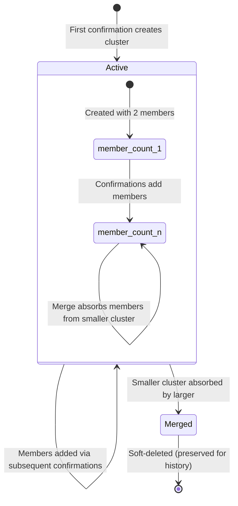
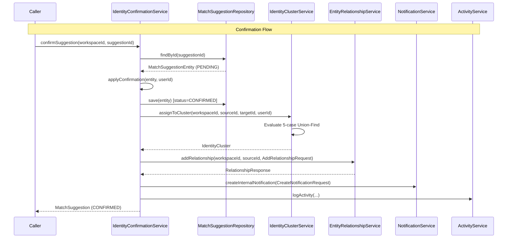
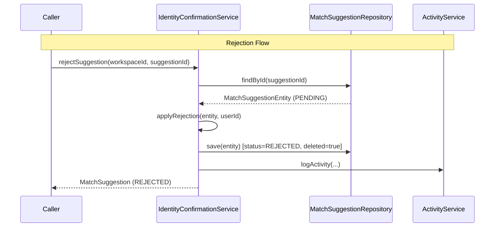

---
tags:
  - "#status/draft"
  - priority/high
  - architecture/design
  - architecture/feature
  - domain/identity-resolution
Created: 2026-03-18
Updated:
Domains:
  - "[[riven/docs/system-design/domains/Identity Resolution/Identity Resolution]]"
  - "[[riven/docs/system-design/domains/Entities/Entities]]"
---
# Feature: Identity Cluster Confirmation and Union-Find Management

---

## 1. Overview

### Problem Statement

The identity resolution pipeline (Phase 2) produces match suggestions — scored candidate pairs that indicate two entities likely represent the same real-world identity. These suggestions sit in PENDING status until a workspace member reviews and either confirms or rejects them.

Confirmation needs to do more than flip a status flag:

1. **Confirmed pairs must form transitive groups.** If A matches B and B matches C, then A, B, and C all represent the same identity. A pairwise confirmation model misses this — the system needs cluster-level tracking so that confirming B↔C automatically links C to A's existing cluster.

2. **Clusters must merge when two groups converge.** If A-B and C-D are separate clusters and then B↔C is confirmed, all four entities should end up in a single cluster. Without merge logic, the system would need manual re-clustering or create contradictory state.

3. **Confirmed relationships must be materialised.** Confirmation should create a CONNECTED_ENTITIES relationship between the two entities via [[riven/docs/system-design/domains/Entities/Entity Management/EntityRelationshipService]], making the link visible in the entity graph, query pipeline, and enrichment layer. Without this, confirmation is invisible to the rest of the platform.

4. **Rejections must be safe.** Rejecting A↔C when A is already clustered with B must not affect the A-B cluster. Rejection operates on individual suggestions, not clusters.

### Proposed Solution

Introduce two new services:

- **`IdentityConfirmationService`** — the confirm/reject state machine. Validates suggestion status, transitions to CONFIRMED or REJECTED, orchestrates cluster assignment, relationship creation, notification publishing, and activity logging. Owns the full confirm flow as a single transactional entry point.

- **`IdentityClusterService`** — cluster CRUD and Union-Find merge. Creates clusters, adds members, merges smaller into larger, maintains `memberCount`, and auto-generates cluster names from member entity NAME attributes.

On confirmation, the flow is:
1. Validate the suggestion is PENDING (ConflictException otherwise)
2. Transition suggestion to CONFIRMED with resolver metadata
3. Determine cluster assignment using the five-case Union-Find algorithm
4. Create a CONNECTED_ENTITIES relationship between the two entities
5. Publish a notification to all workspace members
6. Log activity for audit trail

On rejection, the flow mirrors the existing `rejectSuggestion` logic (moved from [[riven/docs/system-design/domains/Identity Resolution/Matching Pipeline/IdentityMatchSuggestionService]]):
1. Validate the suggestion is PENDING (ConflictException otherwise)
2. Transition to REJECTED with signal snapshot
3. Soft-delete the suggestion row
4. Log activity

### Success Criteria

- [ ] **CONF-01:** Confirming a match suggestion transitions status to CONFIRMED, sets resolvedBy/resolvedAt, and creates a CONNECTED_ENTITIES relationship with `linkSource = IDENTITY_MATCH`
- [ ] **CONF-02:** Cluster assignment handles all five cases: (1) neither clustered → new cluster, (2) source only → add target, (3) target only → add source, (4) different clusters → merge smaller into larger, (5) same cluster → no-op
- [ ] **CONF-03:** Cluster merge soft-deletes the smaller cluster, reassigns its members to the larger, and updates `memberCount` on the surviving cluster
- [ ] **CONF-04:** Rejecting a match suggestion transitions status to REJECTED, snapshots signals to `rejectionSignals`, soft-deletes the row, and does not affect any cluster
- [ ] **CONF-05:** ConflictException is thrown for any state transition from a non-PENDING status (double-confirm, double-reject, reject-after-confirm, confirm-after-reject)

---

## 2. Data Model

### Existing Entities

All tables and JPA entities already exist. No schema changes required.

#### `match_suggestions` / `MatchSuggestionEntity`

| Column | Type | Purpose |
|--------|------|---------|
| `status` | `VARCHAR(20)` | State machine: PENDING → CONFIRMED or REJECTED |
| `resolved_by` | `UUID` | User who confirmed/rejected |
| `resolved_at` | `TIMESTAMPTZ` | When resolved |
| `rejection_signals` | `JSONB` | Signal snapshot at rejection time (for re-suggestion diff) |
| `deleted` | `BOOLEAN` | Soft-deleted on rejection (not on confirmation) |

**State transitions:**

```
PENDING ──confirm──→ CONFIRMED (terminal)
PENDING ──reject───→ REJECTED  (terminal, soft-deleted)
CONFIRMED ──any────→ ConflictException
REJECTED  ──any────→ ConflictException
EXPIRED   ──any────→ ConflictException
```

#### `identity_clusters` / `IdentityClusterEntity`

| Column | Type | Purpose |
|--------|------|---------|
| `workspace_id` | `UUID` | Workspace scope |
| `name` | `TEXT` | Auto-generated from member NAME attributes |
| `member_count` | `INTEGER` | Denormalised count, maintained on add/merge |
| `deleted` / `deleted_at` | `BOOLEAN` / `TIMESTAMPTZ` | Soft-deleted when cluster is merged away |

#### `identity_cluster_members` / `IdentityClusterMemberEntity`

| Column | Type | Purpose |
|--------|------|---------|
| `cluster_id` | `UUID` | FK to parent cluster |
| `entity_id` | `UUID` | FK to entity — **unique index enforces one-cluster-per-entity** |
| `joined_at` | `TIMESTAMPTZ` | When entity was added to cluster |
| `joined_by` | `UUID` | User who triggered the confirmation |

**Not soft-deletable.** Members are hard-deleted when clusters merge (reassigned to surviving cluster).

### DB Constraints

From `identity_indexes.sql`:
- `idx_identity_cluster_members_entity` — **UNIQUE** index on `entity_id`. Enforces the invariant that an entity can belong to at most one identity cluster. This is the database-level guarantee of the Union-Find property.

From `identity_constraints.sql`:
- `chk_match_suggestions_canonical_order` — CHECK constraint `source_entity_id < target_entity_id`
- `uq_match_suggestions_active_pair` — Partial unique index on `(workspace_id, source_entity_id, target_entity_id) WHERE deleted = false`

### Cluster Lifecycle



### Cluster Naming Strategy

Auto-generated from member entity NAME-signal attributes:
1. Query entity attributes where `MatchSignalType.NAME` applies (attributes classified as NAME-type via `SemanticAttributeClassification`)
2. Collect distinct name values across cluster members
3. Join with " / " separator — e.g. "John Smith / J. Smith / john.smith@acme.com"
4. Fallback: `"{entityTypeName} #{truncatedId}"` when no NAME attributes exist
5. On merge: keep the surviving (larger) cluster's name unchanged — no regeneration

---

## 3. Component Design

### New Components

#### `IdentityConfirmationService`

- **Package:** `riven.core.service.identity`
- **Responsibility:** State machine for confirm and reject transitions. The single orchestration point for the full confirmation flow — suggestion state change, cluster assignment, relationship creation, notification, and activity logging. Also owns rejection (moved from [[riven/docs/system-design/domains/Identity Resolution/Matching Pipeline/IdentityMatchSuggestionService]]).
- **Dependencies:** `MatchSuggestionRepository`, `IdentityClusterService`, `EntityRelationshipService`, `EntityTypeRelationshipService`, `NotificationService`, `ActivityService`, `AuthTokenService`, `KLogger`
- **Security:** `@PreAuthorize("@workspaceSecurity.hasWorkspace(#workspaceId)")` on public methods

**Key methods:**

```kotlin
/** Confirms a PENDING match suggestion — creates cluster, relationship, and notification. */
@Transactional
@PreAuthorize("@workspaceSecurity.hasWorkspace(#workspaceId)")
fun confirmSuggestion(workspaceId: UUID, suggestionId: UUID): MatchSuggestion

/** Rejects a PENDING match suggestion — snapshots signals, soft-deletes. */
@Transactional
@PreAuthorize("@workspaceSecurity.hasWorkspace(#workspaceId)")
fun rejectSuggestion(workspaceId: UUID, suggestionId: UUID): MatchSuggestion
```

**Confirm flow (internal decomposition):**

```kotlin
// Public method reads as a high-level story:
fun confirmSuggestion(workspaceId, suggestionId): MatchSuggestion {
    val userId = authTokenService.getUserId()
    val entity = findAndValidatePending(suggestionId)
    applyConfirmation(entity, userId)
    val saved = repository.save(entity)
    val cluster = clusterService.assignToCluster(workspaceId, entity.sourceEntityId, entity.targetEntityId, userId)
    createConnectedEntitiesRelationship(workspaceId, entity.sourceEntityId, entity.targetEntityId)
    publishConfirmationNotification(workspaceId, saved, cluster)
    logConfirmationActivity(saved, userId, cluster)
    return saved.toModel()
}
```

#### `IdentityClusterService`

- **Package:** `riven.core.service.identity`
- **Responsibility:** Cluster CRUD and Union-Find merge logic. Owns cluster creation, member addition, merge (smaller → larger), member count maintenance, and auto-naming. Stateless — all state lives in the database.
- **Dependencies:** `IdentityClusterRepository`, `IdentityClusterMemberRepository`, `EntityTypeClassificationService` (for NAME attribute lookup), `KLogger`
- **Security:** No `@PreAuthorize` — called only from `IdentityConfirmationService` which already handles workspace auth. Workspace ID passed explicitly.

**Key methods:**

```kotlin
/**
 * Assigns two entities to an identity cluster based on the five-case Union-Find algorithm.
 *
 * Returns the (possibly newly created or merged) cluster containing both entities.
 */
@Transactional
fun assignToCluster(workspaceId: UUID, sourceEntityId: UUID, targetEntityId: UUID, userId: UUID): IdentityCluster

/** Finds the cluster a given entity belongs to, or null if not clustered. */
fun findClusterByEntityId(entityId: UUID): IdentityClusterEntity?

/** Finds all members of a given cluster. */
fun findClusterMembers(clusterId: UUID): List<IdentityClusterMemberEntity>
```

**Five-case Union-Find algorithm:**

```
Given: sourceEntityId (S), targetEntityId (T)
Lookup: clusterS = findClusterByEntityId(S), clusterT = findClusterByEntityId(T)

Case 1: clusterS == null && clusterT == null
  → Create new cluster with S and T as members

Case 2: clusterS != null && clusterT == null
  → Add T to clusterS, increment memberCount

Case 3: clusterS == null && clusterT != null
  → Add S to clusterT, increment memberCount

Case 4: clusterS != null && clusterT != null && clusterS.id != clusterT.id
  → Merge: determine larger/smaller by memberCount (ties: lower UUID wins)
  → Reassign all members of smaller to larger
  → Update larger.memberCount += smaller.memberCount
  → Soft-delete smaller cluster

Case 5: clusterS != null && clusterT != null && clusterS.id == clusterT.id
  → No-op — already in same cluster
```

### Repository Queries Needed

#### `IdentityClusterMemberRepository` — additions:

```kotlin
/** Find the cluster membership for a given entity, if any. */
fun findByEntityId(entityId: UUID): IdentityClusterMemberEntity?

/** Find all members of a given cluster. */
fun findAllByClusterId(clusterId: UUID): List<IdentityClusterMemberEntity>

/** Reassign all members from one cluster to another (used in merge). */
@Modifying
@Query("UPDATE IdentityClusterMemberEntity m SET m.clusterId = :targetClusterId WHERE m.clusterId = :sourceClusterId")
fun reassignMembers(sourceClusterId: UUID, targetClusterId: UUID)
```

#### `IdentityClusterRepository` — additions:

```kotlin
/** Find active (non-deleted) clusters in a workspace. */
fun findAllByWorkspaceIdAndDeletedFalse(workspaceId: UUID): List<IdentityClusterEntity>
```

### Affected Existing Components

| Component | Change | Impact |
|-----------|--------|--------|
| [[riven/docs/system-design/domains/Identity Resolution/Matching Pipeline/IdentityMatchSuggestionService]] | Remove `rejectSuggestion()` and all rejection-related private methods — moved to `IdentityConfirmationService` | Medium — method extraction, callers updated |
| [[riven/docs/system-design/domains/Identity Resolution/Matching Pipeline/IdentityMatchSuggestionService]] | Add cluster membership check in `persistSuggestions()` — skip if both entities already in the same cluster | Low — single check before suggestion creation |
| `Activity` enum | Add `IDENTITY_CLUSTER` value for cluster-specific activity logging | Low — additive |
| `ApplicationEntityType` enum | Add `IDENTITY_CLUSTER` value for activity entity type reference | Low — additive |

### Component Interaction Diagram





---

## 4. API Design

### No New REST Endpoints

REST endpoints for confirm/reject are Phase 5 scope. This phase builds the service-layer contracts that Phase 5 controllers will delegate to.

### Service Method Contracts

#### `IdentityConfirmationService.confirmSuggestion`

| Parameter | Type | Description |
|-----------|------|-------------|
| `workspaceId` | `UUID` | Workspace scope (validated by `@PreAuthorize`) |
| `suggestionId` | `UUID` | The match suggestion to confirm |
| **Returns** | `MatchSuggestion` | The updated suggestion domain model with status=CONFIRMED |
| **Throws** | `NotFoundException` | Suggestion not found |
| **Throws** | `ConflictException` | Suggestion is not PENDING |

#### `IdentityConfirmationService.rejectSuggestion`

| Parameter | Type | Description |
|-----------|------|-------------|
| `workspaceId` | `UUID` | Workspace scope (validated by `@PreAuthorize`) |
| `suggestionId` | `UUID` | The match suggestion to reject |
| **Returns** | `MatchSuggestion` | The updated suggestion domain model with status=REJECTED |
| **Throws** | `NotFoundException` | Suggestion not found |
| **Throws** | `ConflictException` | Suggestion is not PENDING |

#### `IdentityClusterService.assignToCluster`

| Parameter | Type | Description |
|-----------|------|-------------|
| `workspaceId` | `UUID` | Workspace scope |
| `sourceEntityId` | `UUID` | First entity in the confirmed pair |
| `targetEntityId` | `UUID` | Second entity in the confirmed pair |
| `userId` | `UUID` | User who confirmed (stored as `joinedBy`) |
| **Returns** | `IdentityCluster` | The cluster now containing both entities |

---

## 5. Failure Modes & Recovery

| Failure | Cause | System Behavior | Recovery |
|---------|-------|----------------|----------|
| Suggestion not PENDING on confirm | Race condition — two users confirm simultaneously | First confirm succeeds, second gets `ConflictException` | Client retries will also get ConflictException — correct behavior since the suggestion is already confirmed |
| Cluster merge fails after suggestion confirmed | Database error during member reassignment | Transaction rolls back — suggestion stays PENDING (not yet committed) | Retry the full confirm. Single `@Transactional` ensures atomicity |
| Relationship creation fails | Target entity deleted between suggestion creation and confirmation, or fallback definition missing | Transaction rolls back — suggestion stays PENDING | User must re-evaluate; if entity is deleted, suggestion should be expired separately |
| Notification fails | NotificationService unavailable or throws | Should not roll back the confirmation — notification is non-critical | Wrap notification call in try-catch, log warning on failure. Cluster and relationship are committed regardless |
| Unique index violation on cluster member | Entity already in a different cluster (concurrent confirm of overlapping pairs) | `DataIntegrityViolationException` — transaction rolls back | Retry will detect existing cluster membership and take the appropriate merge/add path |
| Cluster naming fails | Entity attributes cannot be queried (entity deleted, attribute table issue) | Fall back to generic name `"Identity Cluster #{truncatedClusterId}"` | Acceptable — name can be updated manually in Phase 5 |

### Blast Radius

- **Confirmation failure:** Only the individual suggestion is affected. Other suggestions, existing clusters, and relationships are untouched. The failing suggestion remains PENDING and can be retried.
- **Merge failure:** Only the two clusters involved are affected. Other clusters are untouched. The failing confirmation remains PENDING.
- **Notification failure:** Does not affect confirmation or cluster state. Users miss a notification but the data is correct.

---

## 6. Security

### Authentication & Authorization

- **Who can access?** Any workspace member with workspace access (via JWT)
- **Authorization model:** `@PreAuthorize("@workspaceSecurity.hasWorkspace(#workspaceId)")` on `IdentityConfirmationService` public methods
- `IdentityClusterService` has no `@PreAuthorize` — it is called only from `IdentityConfirmationService` which handles auth
- `userId` retrieved via `authTokenService.getUserId()` at the top of each public method

### Data Sensitivity

| Data Element | Sensitivity | Protection |
|---|---|---|
| Cluster membership | Business-sensitive (reveals identity links) | Workspace isolation via RLS, `@PreAuthorize` on service |
| Suggestion resolution metadata | Audit trail (who confirmed/rejected) | Workspace scoped, immutable after write |
| Notification content | Contains entity names | Workspace-scoped notification visibility |

### Authorization Boundaries

- Confirmation/rejection does not check entity-level permissions — any workspace member can confirm any suggestion in their workspace. This is by design: identity resolution is a workspace-level operation, not entity-owner-scoped.
- The `EntityRelationshipService.addRelationship` call is made with the confirming user's JWT context, so relationship-level auth (if any) applies naturally.

---

## 7. Performance & Scale

### Expected Load

- **Confirmations:** Low volume — human-initiated, one at a time. No batch confirm in v1.
- **Cluster merges:** Rare — only when two previously separate clusters converge. Member reassignment is a single UPDATE query.
- **Relationship creation:** One per confirmation — negligible.

### Critical Queries

| Query | Expected Pattern | Index Support |
|-------|-----------------|---------------|
| `findByEntityId` on cluster members | Point lookup by entity_id | `idx_identity_cluster_members_entity` (UNIQUE) — O(1) |
| `findAllByClusterId` on cluster members | Small result set (cluster size typically 2-10) | `idx_identity_cluster_members_cluster` — B-tree scan |
| `reassignMembers` UPDATE | Bulk update by cluster_id | `idx_identity_cluster_members_cluster` — index scan for WHERE |
| `findById` on clusters | Primary key lookup | PK index — O(1) |
| `findById` on suggestions | Primary key lookup | PK index — O(1) |

### Database Considerations

- **No new indexes needed.** Existing indexes on `identity_cluster_members(entity_id)` (unique) and `identity_cluster_members(cluster_id)` cover all query patterns.
- **`memberCount` denormalisation:** Maintained in application code during add and merge. Avoids COUNT(*) queries. Acceptable trade-off — cluster mutations are low-frequency and always within a transaction.
- **Merge cost:** O(K) where K is the number of members in the smaller cluster. For typical identity clusters (2-10 members), this is negligible. The unique index on `entity_id` provides a natural ceiling — an entity can't accidentally join multiple clusters.

---

## 8. Observability

### Activity Logging

| Event | Activity | Operation | EntityType | Details |
|-------|----------|-----------|------------|---------|
| Suggestion confirmed | `MATCH_SUGGESTION` | `UPDATE` | `MATCH_SUGGESTION` | `action: "confirmed"`, sourceEntityId, targetEntityId, confidenceScore, clusterId, clusterMemberCount |
| Suggestion rejected | `MATCH_SUGGESTION` | `UPDATE` | `MATCH_SUGGESTION` | `action: "rejected"`, sourceEntityId, targetEntityId, confidenceScore |
| Cluster created | `IDENTITY_CLUSTER` | `CREATE` | `IDENTITY_CLUSTER` | clusterId, memberCount, initialMembers (entity IDs) |
| Cluster merge | `IDENTITY_CLUSTER` | `UPDATE` | `IDENTITY_CLUSTER` | survivingClusterId, mergedClusterId, newMemberCount, mergedMemberCount |

### Logging

| Event | Level | Key Fields |
|-------|-------|------------|
| Confirmation started | DEBUG | suggestionId, workspaceId |
| Cluster case determined | DEBUG | case (1-5), sourceClusterId, targetClusterId |
| Cluster created | INFO | clusterId, workspaceId, memberCount |
| Cluster merge executed | INFO | survivingClusterId, mergedClusterId, reassignedCount |
| Confirmation completed | INFO | suggestionId, clusterId |
| Rejection completed | INFO | suggestionId |
| Notification publish failed | WARN | suggestionId, error message |

### Notifications

Published on confirmation only (not rejection), to all workspace members (`userId = null`):

```kotlin
CreateNotificationRequest(
    workspaceId = workspaceId,
    userId = null,  // all workspace members
    type = NotificationType.REVIEW_REQUEST,
    content = NotificationContent.ReviewRequest(
        title = "Identity Match Confirmed",
        message = "John Smith (Contact) and john@acme.com (Lead) have been linked. Identity cluster now has 3 members.",
        priority = ReviewPriority.NORMAL,
    ),
    referenceType = NotificationReferenceType.ENTITY_RESOLUTION,
    referenceId = suggestionId,
)
```

---

## 9. Testing Strategy

### Unit Tests

#### `IdentityConfirmationServiceTest`

- [ ] `confirmSuggestion` — PENDING suggestion transitions to CONFIRMED with resolvedBy/resolvedAt
- [ ] `confirmSuggestion` — calls `IdentityClusterService.assignToCluster` with correct entity IDs
- [ ] `confirmSuggestion` — creates CONNECTED_ENTITIES relationship via `EntityRelationshipService.addRelationship`
- [ ] `confirmSuggestion` — publishes notification with correct content, referenceType=ENTITY_RESOLUTION, referenceId=suggestionId
- [ ] `confirmSuggestion` — logs activity with action="confirmed"
- [ ] `confirmSuggestion` — throws `NotFoundException` for non-existent suggestion
- [ ] `confirmSuggestion` — throws `ConflictException` for CONFIRMED suggestion
- [ ] `confirmSuggestion` — throws `ConflictException` for REJECTED suggestion
- [ ] `confirmSuggestion` — throws `ConflictException` for EXPIRED suggestion
- [ ] `confirmSuggestion` — notification failure does not roll back confirmation
- [ ] `rejectSuggestion` — PENDING suggestion transitions to REJECTED with signal snapshot
- [ ] `rejectSuggestion` — soft-deletes the suggestion row
- [ ] `rejectSuggestion` — does not call `IdentityClusterService` or `EntityRelationshipService`
- [ ] `rejectSuggestion` — logs activity with action="rejected"
- [ ] `rejectSuggestion` — throws `ConflictException` for non-PENDING suggestions
- [ ] `@PreAuthorize` — workspace security enforced on both methods

#### `IdentityClusterServiceTest`

- [ ] Case 1: neither entity clustered → creates new cluster with memberCount=2, both entities as members
- [ ] Case 2: source clustered, target not → adds target to source's cluster, increments memberCount
- [ ] Case 3: target clustered, source not → adds source to target's cluster, increments memberCount
- [ ] Case 4: different clusters → merges smaller into larger, soft-deletes smaller, reassigns members, updates memberCount
- [ ] Case 4 (tie-breaker): equal memberCount → lower UUID cluster survives
- [ ] Case 5: same cluster → returns existing cluster, no mutations
- [ ] Cluster naming: auto-generated from member NAME attributes
- [ ] Cluster naming: fallback when no NAME attributes exist
- [ ] Cluster merge: surviving cluster name unchanged

#### `IdentityMatchSuggestionServiceTest` (updated)

- [ ] `persistSuggestions` — skips suggestion when both entities are already in the same cluster

### Integration Tests

- [ ] End-to-end: confirm suggestion → verify cluster exists with correct members
- [ ] End-to-end: confirm two suggestions sharing an entity → verify single cluster with 3 members
- [ ] End-to-end: confirm suggestion bridging two clusters → verify merge, smaller soft-deleted
- [ ] End-to-end: confirm suggestion → verify CONNECTED_ENTITIES relationship created
- [ ] End-to-end: reject suggestion → verify no cluster created, suggestion soft-deleted

---

## 10. Decisions Log

| Date | Decision | Rationale | Alternatives Considered |
|------|----------|-----------|------------------------|
| 2026-03-18 | Auto-generate cluster names from NAME-signal attributes | Users need a human-readable cluster label; NAME attributes (email, person name) are the most meaningful identifiers. Manual rename deferred to Phase 5. | User-assigned names at confirmation time — rejected, adds friction to confirm flow |
| 2026-03-18 | Notify on confirmation only, not rejection | Rejections are low-signal — they just dismiss a suggestion. Confirmations create state (clusters, relationships) that all workspace members should know about. | Notify on both — rejected, creates notification noise for non-events |
| 2026-03-18 | No undo/unconfirm in v1 | Cluster splitting (reverse merge) is complex — cascading effects on relationships, potentially ambiguous member reassignment. User recourse: delete the CONNECTED_ENTITIES relationship manually. | Full unconfirm with cluster split — deferred to v2 |
| 2026-03-18 | Move `rejectSuggestion` from `IdentityMatchSuggestionService` to `IdentityConfirmationService` | Confirm and reject are symmetric operations on the same state machine. Keeping them in one service ensures consistent validation (ConflictException guard) and avoids splitting the state machine across two services. | Keep rejection in `IdentityMatchSuggestionService` — rejected, violates single-responsibility for state transitions |
| 2026-03-18 | Skip re-suggestion when entities share a cluster | If two entities are already in the same cluster, they're transitively confirmed as the same identity. Suggesting a direct match is redundant and creates user-facing noise. | Always suggest regardless of cluster — rejected, poor UX |
| 2026-03-18 | Merge tie-breaker: lower UUID wins | Deterministic, simple, avoids ambiguity. Cluster size is the primary merge direction (smaller → larger); UUID is the tie-breaker when sizes are equal. | Random, creation time — creation time adds a query; random is non-deterministic |
| 2026-03-18 | Notification failure does not roll back confirmation | Notification is non-critical. The cluster and relationship are the primary outcomes. A missed notification is recoverable (user can check the suggestion list); a rolled-back confirmation forces the user to re-confirm. | Strict transactional — rejected, notification service availability should not gate confirmation |

---

## 11. Implementation Tasks

### Phase 4a: Core Services

- [ ] Add `IDENTITY_CLUSTER` to `Activity` enum
- [ ] Add `IDENTITY_CLUSTER` to `ApplicationEntityType` enum
- [ ] Add repository query methods to `IdentityClusterMemberRepository` (`findByEntityId`, `findAllByClusterId`, `reassignMembers`)
- [ ] Add repository query methods to `IdentityClusterRepository` (`findAllByWorkspaceIdAndDeletedFalse`)
- [ ] Create `IdentityClusterService` with Union-Find algorithm, cluster creation, merge, naming
- [ ] Create `IdentityConfirmationService` with confirm and reject flows
- [ ] Move rejection logic from `IdentityMatchSuggestionService` to `IdentityConfirmationService`
- [ ] Add cluster membership check in `IdentityMatchSuggestionService.persistSuggestions`

### Phase 4b: Testing

- [ ] Unit tests for `IdentityClusterService` (all 5 cases, merge, naming)
- [ ] Unit tests for `IdentityConfirmationService` (confirm flow, reject flow, ConflictException, notification)
- [ ] Updated tests for `IdentityMatchSuggestionService` (cluster skip in persistSuggestions)
- [ ] Integration tests for end-to-end confirm/reject flows

---

## Related Documents

- [[riven/docs/system-design/domains/Identity Resolution/Identity Resolution]] — Parent domain
- [[riven/docs/system-design/domains/Identity Resolution/Clusters/Clusters]] — Subdomain architecture
- [[riven/docs/system-design/domains/Identity Resolution/Matching Pipeline/Matching Pipeline]] — Upstream: produces match suggestions consumed by this feature
- [[riven/docs/system-design/domains/Identity Resolution/Flow - Identity Match Pipeline]] — Async pipeline flow that creates the suggestions this feature resolves
- [[riven/docs/system-design/domains/Identity Resolution/Matching Pipeline/IdentityMatchSuggestionService]] — Upstream: owns suggestion persistence; rejection moves to confirmation service
- [[riven/docs/system-design/domains/Identity Resolution/Matching Pipeline/IdentityMatchCandidateService]] — Upstream: candidate finding
- [[riven/docs/system-design/domains/Identity Resolution/Matching Pipeline/IdentityMatchScoringService]] — Upstream: confidence scoring
- [[riven/docs/system-design/domains/Entities/Entity Management/EntityRelationshipService]] — Downstream: creates CONNECTED_ENTITIES relationships on confirmation
- [[riven/docs/system-design/domains/Entities/Entity Management/EntityService]] — Downstream: entity lookup for cluster naming
- [[Integration Identity Resolution System]] — System-level overview
- [[riven/docs/system-design/domains/Identity Resolution/Temporal Integration/Temporal Integration]] — Async pipeline orchestration (upstream of this feature)
- [[riven/docs/system-design/feature-design/3. Active/Connected Entities and Per-Instance Relationship Semantics]] — CONNECTED_ENTITIES relationship infrastructure this feature consumes

---

## Changelog

| Date | Author | Change |
|------|--------|--------|
| 2026-03-18 | Claude | Initial design — confirmation state machine, Union-Find cluster management, relationship creation, notification, activity logging |
