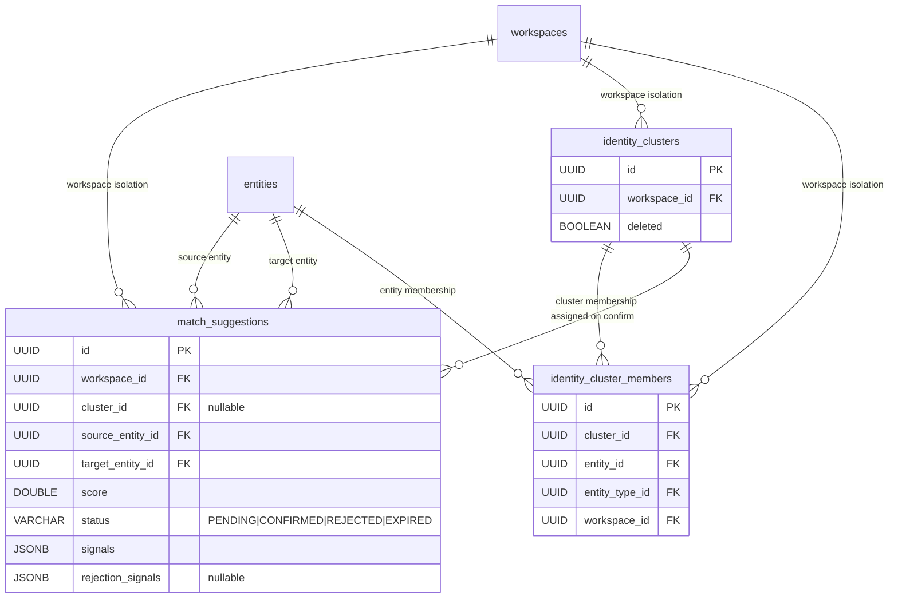
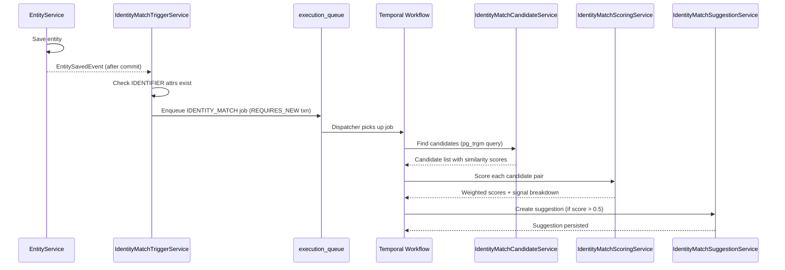
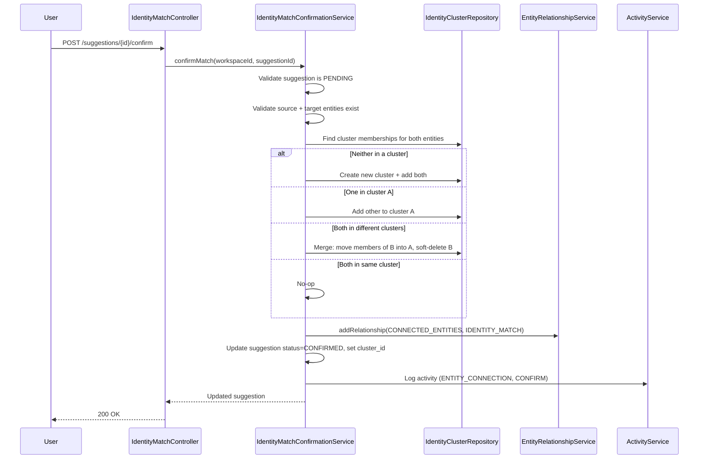

---
tags:
  - "#status/draft"
  - priority/high
  - architecture/feature
Created: 2026-02-11
Updated: 2026-03-16
Domains:
  - "[[Integrations]]"
  - "[[Entities]]"
---
# Feature: Integration Identity Resolution System

---

## 1. Overview

### Problem Statement

When a workspace connects multiple integration tools (CRM, email platform, support desk, billing), entities from different sources often represent the same real-world identity but have no automatic linkage. A Stripe customer with email `john@acme.com`, an Intercom user with email `john@acme.com`, and a form submission from `j.smith@acme.com` are the same person — but the system treats them as three unrelated entities.
This is the same for when a user manually enters entity data without linking it with other relevant entities within the workspace ecosystem

Each tool uses its own unique identifiers (email, username, per-tool ID), and the entity model stores these as separate, unlinked records. Manual linking is not feasible at scale and undermines the platform's premise of turning siloed integration data into actionable intelligence.

Without identity resolution, the entity graph remains fragmented per-tool rather than unified per-identity.

### Proposed Solution

A dedicated identity resolution domain that automatically detects when entities from different integration tools likely represent the same real-world identity, and surfaces match suggestions for human review.

The system:
- Triggers asynchronously on entity save/update via a Temporal workflow dispatched through a generic execution queue
- Compares IDENTIFIER-classified attributes (email, phone, name, company) using pg_trgm fuzzy matching with a two-phase candidate query
- Computes weighted confidence scores with per-signal breakdown
- Persists match suggestions with a PENDING → CONFIRMED / REJECTED / EXPIRED state machine
- On confirmation, creates a CONNECTED_ENTITIES relationship via the existing [[EntityRelationshipService]] and assigns both entities to an identity cluster
- On rejection, stores the signal snapshot and re-suggests only when new or stronger signals appear

Integration entities remain readonly and separate — confirming a match creates a relationship, not a merge. This keeps integration data pristine and traceable to its source while giving workspace members a unified view across all connected tools.

### Short Comings
This system is sound in theory. But heavily relies on the user correctly labelling each relevant entity attribute as an identifier.
- The first line of defence would be that all core models installed via a template would be semantically labelled appropriately, and cannot be changed by the user
- But for new custom data models, it may be skewed. There would need to be either additional focus, better ease of use, or some other mechanism to ensure that users can appropriatetly define Identifier columns to make use of this resolution technique.

### Success Criteria

- [ ] An entity save with IDENTIFIER-classified attributes triggers an async match job that produces suggestions when similar entities exist in the same workspace
- [ ] Match suggestions include per-signal breakdown (type, source value, target value, similarity, weight) and a composite confidence score
- [ ] Confirming a match creates a CONNECTED_ENTITIES relationship with `source=IDENTITY_MATCH` and assigns both entities to an identity cluster
- [ ] Rejecting a match stores the signal snapshot; the system only re-suggests when new or stronger signals appear
- [ ] Identity clusters correctly handle all five cases: neither clustered, one clustered, both in different clusters (merge), both in same cluster (no-op)
- [ ] Duplicate suggestions are prevented by canonical UUID ordering with a DB CHECK constraint
- [ ] The generic execution queue supports both WORKFLOW and IDENTITY_MATCH job types without interfering with each other

---

## 2. Data Model

### New Entities

| Entity | Purpose | Key Fields |
|--------|---------|------------|
| `match_suggestions` | Stores match suggestions with confidence score, status, and signal breakdown | `workspace_id`, `source_entity_id`, `target_entity_id`, `score`, `status`, `signals` (JSONB), `cluster_id` (nullable until confirmed) |
| `identity_clusters` | Groups confirmed identity matches into transitive clusters | `workspace_id`, audit columns, soft-delete |
| `identity_cluster_members` | Maps entities to their identity cluster | `cluster_id`, `entity_id`, `entity_type_id`, `workspace_id`, `joined_at` |

#### match_suggestions

```sql
CREATE TABLE match_suggestions (
    id                    UUID PRIMARY KEY DEFAULT gen_random_uuid(),
    workspace_id          UUID NOT NULL REFERENCES workspaces(id) ON DELETE CASCADE,
    cluster_id            UUID REFERENCES identity_clusters(id),  -- NULL until confirmed
    source_entity_id      UUID NOT NULL REFERENCES entities(id) ON DELETE CASCADE,
    source_entity_type_id UUID NOT NULL REFERENCES entity_types(id),
    target_entity_id      UUID NOT NULL REFERENCES entities(id) ON DELETE CASCADE,
    target_entity_type_id UUID NOT NULL REFERENCES entity_types(id),
    score                 DOUBLE PRECISION NOT NULL,
    status                VARCHAR(20) NOT NULL DEFAULT 'PENDING',
    signals               JSONB NOT NULL,  -- Array of {type, sourceValue, targetValue, similarity, weight}
    resolved_by           UUID,
    resolved_at           TIMESTAMPTZ,
    rejection_signals     JSONB,  -- Signal snapshot at rejection time (for re-suggest logic)
    created_at            TIMESTAMPTZ NOT NULL DEFAULT now(),
    updated_at            TIMESTAMPTZ NOT NULL DEFAULT now(),
    created_by            UUID,
    updated_by            UUID,
    deleted               BOOLEAN NOT NULL DEFAULT false,
    deleted_at            TIMESTAMPTZ,
    UNIQUE (source_entity_id, target_entity_id, deleted),
    CONSTRAINT chk_canonical_ordering CHECK (source_entity_id < target_entity_id)
);
```

Canonical ordering (`source_entity_id < target_entity_id`) is enforced at both the application and database level to prevent bidirectional duplicates — (A,B) and (B,A) cannot both exist.

Signals are stored as JSONB directly on the suggestion rather than in a separate table. They are always read/written with the parent suggestion and never queried independently.

#### identity_clusters

```sql
CREATE TABLE identity_clusters (
    id              UUID PRIMARY KEY DEFAULT gen_random_uuid(),
    workspace_id    UUID NOT NULL REFERENCES workspaces(id) ON DELETE CASCADE,
    created_at      TIMESTAMPTZ NOT NULL DEFAULT now(),
    updated_at      TIMESTAMPTZ NOT NULL DEFAULT now(),
    created_by      UUID,
    updated_by      UUID,
    deleted         BOOLEAN NOT NULL DEFAULT false,
    deleted_at      TIMESTAMPTZ
);
```

#### identity_cluster_members

```sql
CREATE TABLE identity_cluster_members (
    id              UUID PRIMARY KEY DEFAULT gen_random_uuid(),
    cluster_id      UUID NOT NULL REFERENCES identity_clusters(id) ON DELETE CASCADE,
    entity_id       UUID NOT NULL REFERENCES entities(id) ON DELETE CASCADE,
    entity_type_id  UUID NOT NULL REFERENCES entity_types(id),
    workspace_id    UUID NOT NULL REFERENCES workspaces(id) ON DELETE CASCADE,
    joined_at       TIMESTAMPTZ NOT NULL DEFAULT now(),
    created_at      TIMESTAMPTZ NOT NULL DEFAULT now(),
    deleted         BOOLEAN NOT NULL DEFAULT false,
    deleted_at      TIMESTAMPTZ,
    UNIQUE (cluster_id, entity_id, deleted)
);
```

### Entity Modifications

| Entity | Change | Rationale |
|--------|--------|-----------|
| `execution_queue` (renamed from `workflow_execution_queue`) | Add `job_type VARCHAR(30) NOT NULL DEFAULT 'WORKFLOW'`, rename `workflow_definition_id` → `reference_id` | Generic queue abstraction enables reuse across workflow and identity match domains |
| `SourceType` enum | Add `IDENTITY_MATCH` value | Provenance tracking for relationships created by identity resolution |

### Data Ownership

| Data | Owner | Notes |
|------|-------|-------|
| Match suggestions | `IdentityMatchSuggestionService` | CRUD operations, canonical ordering enforcement |
| Identity clusters | `IdentityMatchConfirmationService` | Created and managed only at confirmation time |
| Cluster membership | `IdentityMatchConfirmationService` | Modified during confirmation (add members, merge clusters) |
| Signals | `IdentityMatchScoringService` | Computed during scoring, stored as JSONB on suggestions |

### Relationships



### Data Lifecycle

- **Creation:** Match suggestions are created by the matching pipeline after scoring candidates above the 0.5 threshold. Clusters and memberships are created only at confirmation time.
- **Updates:** Suggestions transition from PENDING to CONFIRMED/REJECTED/EXPIRED. Cluster membership changes on confirmation (add members or merge clusters).
- **Deletion:** Soft-delete via `SoftDeletable`. Suggestions and clusters follow the standard workspace cascade pattern.

### Consistency Requirements

- [x] Requires strong consistency (ACID transactions)
- Confirmation is transactional: cluster management, relationship creation, suggestion status update, and activity logging all happen within a single `@Transactional` scope. If any step fails, everything rolls back.

---

## 3. Component Design

### New Components

| Component | Package | Type | Purpose |
|-----------|---------|------|---------|
| `IdentityMatchController` | `riven.core.controller.identity` | Controller | REST endpoints for suggestion review, cluster browsing, per-entity match count |
| `IdentityMatchTriggerService` | `riven.core.service.identity` | Service | `@TransactionalEventListener(AFTER_COMMIT)` — dispatches match jobs to queue |
| `IdentityMatchCandidateService` | `riven.core.service.identity` | Service | Two-phase pg_trgm fuzzy query for candidate discovery |
| `IdentityMatchScoringService` | `riven.core.service.identity` | Service | Weighted scoring with default weights as companion object constants |
| `IdentityMatchSuggestionService` | `riven.core.service.identity` | Service | CRUD on suggestions, canonical ordering, re-suggest logic |
| `IdentityMatchConfirmationService` | `riven.core.service.identity` | Service | Confirm/reject, cluster management, relationship creation, notification |
| `MatchSuggestionEntity` | `riven.core.entity.identity` | JPA Entity | Suggestion with status, score, signals JSONB |
| `IdentityClusterEntity` | `riven.core.entity.identity` | JPA Entity | Identity cluster (workspace-scoped) |
| `IdentityClusterMemberEntity` | `riven.core.entity.identity` | JPA Entity | Cluster-entity mapping |
| `MatchSuggestion` | `riven.core.models.identity` | Domain Model | Includes signals as `List<MatchSignal>` |
| `IdentityCluster` | `riven.core.models.identity` | Domain Model | Cluster with member list |
| `MatchSignal` | `riven.core.models.identity` | Data Class | type, sourceValue, targetValue, similarity, weight |
| `MatchSuggestionStatus` | `riven.core.enums.identity` | Enum | PENDING, CONFIRMED, REJECTED, EXPIRED |
| `MatchSignalType` | `riven.core.enums.identity` | Enum | EMAIL, PHONE, NAME, COMPANY, CUSTOM_IDENTIFIER |
| `EntitySavedEvent` | `riven.core.models.entity.event` | Event | Spring ApplicationEvent for entity save |
| `MatchSuggestionRepository` | `riven.core.repository.identity` | Repository | Workspace-scoped queries, status filtering |
| `IdentityClusterRepository` | `riven.core.repository.identity` | Repository | Cluster CRUD |
| `IdentityClusterMemberRepository` | `riven.core.repository.identity` | Repository | Membership queries |

### Service Responsibilities

#### IdentityMatchTriggerService
- Listens for `EntitySavedEvent` via `@TransactionalEventListener(AFTER_COMMIT)`
- Annotated with `@Transactional(propagation = REQUIRES_NEW)` so queue write gets its own transaction
- Checks if entity type has IDENTIFIER-classified attributes (via `EntityTypeSemanticMetadataService`)
- Checks queue deduplication — skips if a PENDING job already exists for the same entity
- Dispatches matching Temporal workflow via the generic execution queue

#### IdentityMatchCandidateService
- Executes a two-phase pg_trgm query against `entity_attributes`:
  ```sql
  SELECT ea.entity_id, ea.attribute_id, ea.value->>'value' as attr_value,
         similarity(ea.value->>'value', :inputValue) as sim_score
  FROM entity_attributes ea
  WHERE ea.workspace_id = :workspaceId
    AND ea.schema_type IN ('EMAIL', 'PHONE', 'TEXT')
    AND ea.deleted = false
    AND ea.entity_id != :triggerEntityId
    AND (ea.value->>'value') % :inputValue            -- GIN-indexed trigram containment
    AND similarity(ea.value->>'value', :inputValue) > :threshold  -- precise filter
  ```
- Filters: same workspace, different entity, not soft-deleted
- Returns candidate entity IDs with per-attribute similarity scores

#### IdentityMatchScoringService
- Computes weighted confidence score from multiple signals
- Default weights (companion object constants): EMAIL=0.9, PHONE=0.85, NAME=0.5, COMPANY=0.3, CUSTOM_IDENTIFIER=0.7
- Formula: `score = sum(signal_similarity × signal_weight) / sum(signal_weight)`
- Guards: zero signals → 0.0, score clamped to [0.0, 1.0]
- Minimum threshold: 0.5 (configurable via TODO-IR-002 in future)

#### IdentityMatchSuggestionService
- Creates suggestions with canonical UUID ordering (source < target, enforced before insert)
- Idempotent: duplicate pair silently skipped via unique constraint
- Checks rejection history: compares current signals against `rejection_signals` snapshot — only re-suggests if new/stronger signals exist
- Publishes notification via `NotificationService` (stubbed until notification domain ships)

#### IdentityMatchConfirmationService
- Confirm: transitions PENDING → CONFIRMED, manages clusters (5 cases), creates relationship, logs activity
- Reject: transitions PENDING → REJECTED, stores signal snapshot in `rejection_signals`
- Handles idempotency: double-confirm → `ConflictException`, double-reject → `ConflictException`

### Affected Existing Components

| Component | Change Required | Impact |
|-----------|-----------------|--------|
| [[EntityService]] | Publish `EntitySavedEvent` on entity save/update | One event publish call added |
| Queue dispatcher | Route based on `job_type` — WORKFLOW vs IDENTITY_MATCH | Dispatcher logic branching |
| `SourceType` enum | Add `IDENTITY_MATCH` value | One enum constant |
| `execution_queue` table | Rename + add `job_type` column + rename `workflow_definition_id` → `reference_id` | Schema migration, existing workflow code adapts to new column names |

### Component Interaction Diagram



### Confirmation Flow



### Match Suggestion State Machine

```
                    ┌──────────┐
                    │ PENDING  │◀──── Initial state (system creates)
                    └────┬─────┘
                         │
              ┌──────────┼──────────┐
              ▼          ▼          ▼
        ┌──────────┐ ┌────────┐ ┌─────────┐
        │ CONFIRMED│ │REJECTED│ │ EXPIRED │
        └──────────┘ └────────┘ └─────────┘
                         ▲
                         │ (re-suggest on new signals
                         │  creates NEW suggestion)
```

Invalid transitions (enforced):
- REJECTED → CONFIRMED (must create new suggestion if signals change)
- EXPIRED → anything (must re-trigger matching)
- CONFIRMED → PENDING (would need to delete relationship first)

---

## 4. API Design

### Endpoints

All endpoints prefixed with `/api/v1/identity`. Tagged with `@Tag(name = "identity")`. All service methods guarded with `@PreAuthorize("@workspaceSecurity.hasWorkspace(#workspaceId)")`.

#### `GET /api/v1/identity/{workspaceId}/suggestions`

- **Purpose:** List match suggestions, filterable by status, paginated
- **Query Parameters:** `status` (optional, e.g. `PENDING`), `page`, `size`
- **Response:**

```json
{
  "content": [
    {
      "id": "a1b2c3d4-e5f6-7890-abcd-ef1234567890",
      "workspaceId": "f8b1c2d3-4e5f-6789-abcd-ef9876543210",
      "sourceEntityId": "11111111-1111-1111-1111-111111111111",
      "sourceEntityTypeId": "22222222-2222-2222-2222-222222222222",
      "targetEntityId": "33333333-3333-3333-3333-333333333333",
      "targetEntityTypeId": "44444444-4444-4444-4444-444444444444",
      "score": 0.87,
      "status": "PENDING",
      "createdAt": "2026-03-16T10:30:00Z"
    }
  ],
  "totalElements": 12,
  "totalPages": 2,
  "number": 0,
  "size": 10
}
```

#### `GET /api/v1/identity/{workspaceId}/suggestions/{id}`

- **Purpose:** Get suggestion detail with full signal breakdown
- **Response:**

```json
{
  "id": "a1b2c3d4-e5f6-7890-abcd-ef1234567890",
  "workspaceId": "f8b1c2d3-4e5f-6789-abcd-ef9876543210",
  "sourceEntityId": "11111111-1111-1111-1111-111111111111",
  "sourceEntityTypeId": "22222222-2222-2222-2222-222222222222",
  "targetEntityId": "33333333-3333-3333-3333-333333333333",
  "targetEntityTypeId": "44444444-4444-4444-4444-444444444444",
  "score": 0.87,
  "status": "PENDING",
  "clusterId": null,
  "signals": [
    {
      "type": "EMAIL",
      "sourceValue": "john@acme.com",
      "targetValue": "john@acme.com",
      "similarity": 1.0,
      "weight": 0.9
    },
    {
      "type": "NAME",
      "sourceValue": "John Smith",
      "targetValue": "J. Smith",
      "similarity": 0.65,
      "weight": 0.5
    }
  ],
  "resolvedBy": null,
  "resolvedAt": null,
  "createdAt": "2026-03-16T10:30:00Z",
  "updatedAt": "2026-03-16T10:30:00Z"
}
```

- **Error Cases:**
    - `403` — No workspace access
    - `404` — Suggestion not found

#### `POST /api/v1/identity/{workspaceId}/suggestions/{id}/confirm`

- **Purpose:** Confirm a match suggestion
- **Response:** `200 OK` — Updated suggestion with `status: "CONFIRMED"`, `clusterId` set
- **Error Cases:**
    - `404` — Suggestion or entity not found
    - `409` — Suggestion already confirmed or rejected

#### `POST /api/v1/identity/{workspaceId}/suggestions/{id}/reject`

- **Purpose:** Reject a match suggestion
- **Response:** `200 OK` — Updated suggestion with `status: "REJECTED"`, `rejectionSignals` snapshot stored
- **Error Cases:**
    - `404` — Suggestion not found
    - `409` — Suggestion already confirmed or rejected

#### `GET /api/v1/identity/{workspaceId}/clusters`

- **Purpose:** List identity clusters in the workspace
- **Response:**

```json
[
  {
    "id": "55555555-5555-5555-5555-555555555555",
    "workspaceId": "f8b1c2d3-4e5f-6789-abcd-ef9876543210",
    "memberCount": 3,
    "createdAt": "2026-03-16T10:30:00Z"
  }
]
```

#### `GET /api/v1/identity/{workspaceId}/clusters/{id}`

- **Purpose:** Get cluster detail with all member entities
- **Response:**

```json
{
  "id": "55555555-5555-5555-5555-555555555555",
  "workspaceId": "f8b1c2d3-4e5f-6789-abcd-ef9876543210",
  "members": [
    {
      "entityId": "11111111-1111-1111-1111-111111111111",
      "entityTypeId": "22222222-2222-2222-2222-222222222222",
      "joinedAt": "2026-03-16T10:30:00Z"
    },
    {
      "entityId": "33333333-3333-3333-3333-333333333333",
      "entityTypeId": "44444444-4444-4444-4444-444444444444",
      "joinedAt": "2026-03-16T10:35:00Z"
    }
  ],
  "createdAt": "2026-03-16T10:30:00Z"
}
```

#### `GET /api/v1/identity/{workspaceId}/entities/{entityId}/matches`

- **Purpose:** Get pending match count for a specific entity
- **Response:**

```json
{
  "entityId": "11111111-1111-1111-1111-111111111111",
  "pendingMatchCount": 3
}
```

### Contract Changes

No changes to existing API contracts. All new endpoints are under the `/api/v1/identity/` prefix.

### Idempotency

- [x] Suggestion creation is idempotent — duplicate canonical pairs silently skipped via unique constraint
- [x] Confirm/reject are idempotent in intent — double-confirm or double-reject returns `409 Conflict` rather than creating inconsistent state

---

## 5. Failure Modes & Recovery

### Failure Modes Registry

| Codepath | Failure Mode | Handled | User Sees | Logged | Recovery |
|----------|-------------|---------|-----------|--------|----------|
| Event listener | Queue write fails | Yes | None (async) | Yes | `@Transactional(REQUIRES_NEW)` — failure logged, stale recovery catches orphans |
| Event listener | No IDENTIFIER attrs | Yes | None (skip) | Yes | Skip matching, log at DEBUG |
| Queue dispatch | Temporal unavailable | Yes | Delayed match | Yes | Temporal retry policy with backoff |
| Queue dispatch | Unknown `job_type` | Yes | Job marked FAIL | Yes | Dispatcher logs error, marks job failed |
| Candidate query | pg_trgm not installed | Yes | Feature off | Yes | Startup check prevents; graceful degradation |
| Candidate query | Query timeout (large workspace) | Yes | Delayed match | Yes | Temporal retry with backoff |
| Scoring | Zero signals | Yes | No suggestion | Yes | Returns 0.0 (guarded) |
| Suggestion persist | Concurrent duplicate (canonical) | Yes | None (dedup) | Yes | `DataIntegrityViolationException` silently skipped |
| Suggestion persist | Entity deleted mid-match | Yes | No suggestion | Yes | Graceful exit, no orphaned suggestion |
| Cluster merge | Two clusters for same pair | Yes | Merged cleanly | Yes | Union-find merge within transaction |
| Confirm | Entity deleted after suggest | Yes | "Not found" | Yes | `NotFoundException` → 404 |
| Confirm | Double-confirm | Yes | "Conflict" | Yes | `ConflictException` → 409 |
| Confirm | Relationship already exists | Yes | Treated as OK | Yes | Catch `ConflictException` from relationship service |
| Reject | Double-reject | Yes | "Conflict" | Yes | `ConflictException` → 409 |
| Notification | NotificationService down | Yes | No notification | Yes | Fire-and-forget; stubbed until notification domain ships |
| Re-suggest | Same signals as rejection | Yes | None (skip) | Yes | Signal diff comparison prevents noise |

0 critical gaps.

### Rollback Strategy

- Disable event listener (remove `@Component` or feature flag)
- Drop new tables (`match_suggestions`, `identity_clusters`, `identity_cluster_members`)
- Drop GIN index on `entity_attributes`
- Confirmed relationships persist (desirable — they represent user-validated connections)
- Reversibility: 4/5

### Blast Radius

If the identity resolution domain fails completely:
- Entity saves are unaffected (event listener is fire-and-forget after commit)
- Existing relationships and clusters persist
- No other domain depends on identity resolution services
- The only user impact is that new match suggestions stop appearing

---

## 6. Security

### Authentication & Authorization

- **Who can access:** All workspace members. No role-based restriction on match review.
- **Authorization model:** Workspace-scoped via `@PreAuthorize("@workspaceSecurity.hasWorkspace(#workspaceId)")`
- **Required permissions:** Workspace membership (existing `WorkspaceSecurity` check)

Standard Supabase JWT authentication via [[AuthTokenService]]. No changes to the authentication flow.

### Data Sensitivity

| Data Element | Sensitivity | Protection Required |
|-------------|-------------|---------------------|
| Match signals (email, phone, name) | PII — values are copies of entity attribute values | Workspace isolation via RLS; no additional encryption beyond existing attribute storage |
| Confidence scores | Internal | Workspace isolation |
| Cluster membership | Internal | Workspace isolation |

### Trust Boundaries

- Entity attribute values used as signals come from the existing `entity_attributes` table, which is workspace-scoped and RLS-protected
- The fuzzy matching query is workspace-scoped (`WHERE workspace_id = :workspaceId`) — entities from other workspaces are never visible as candidates
- Cross-workspace matching is explicitly out of scope as a security boundary enforcement

### Attack Vectors Considered

- [x] Input validation — confirmation/rejection endpoints validate suggestion exists, is PENDING, and entities are not deleted
- [x] Authorization bypass — `@PreAuthorize` on all service methods; workspace-scoped queries prevent cross-tenant access
- [x] Data leakage — signals contain entity attribute values already accessible to workspace members; no new data exposure
- [x] Rate limiting — matching is async (Temporal), naturally rate-limited by queue dispatch; no synchronous endpoint is computationally expensive

---

## 7. Performance & Scale

### Performance Strategy

Matching is async via Temporal workflow, so latency is not user-facing (2-5s from entity save to suggestion creation). The critical performance path is the candidate query.

### Two-Phase Candidate Query

The `%` trigram operator uses the GIN index for fast candidate narrowing, then `similarity()` refines on the small result set. This avoids running `similarity()` across all rows in `entity_attributes`.

```sql
-- Phase 1: GIN-indexed trigram containment (fast)
AND (ea.value->>'value') % :inputValue
-- Phase 2: precise similarity filter (on small result set)
AND similarity(ea.value->>'value', :inputValue) > :threshold
```

### Index Strategy

| Index | Expression | Type | Purpose |
|-------|-----------|------|---------|
| `idx_entity_attributes_trgm` | `(value->>'value') gin_trgm_ops` | GIN (partial) | Fuzzy matching — `WHERE schema_type IN ('EMAIL', 'PHONE', 'TEXT') AND deleted = false` |
| `idx_identity_clusters_workspace` | `workspace_id` | B-tree (partial) | Workspace-scoped cluster queries — `WHERE deleted = false` |
| `idx_identity_cluster_members_cluster` | `cluster_id` | B-tree (partial) | Cluster membership lookups — `WHERE deleted = false` |
| `idx_identity_cluster_members_entity` | `entity_id` | B-tree (partial) | Entity-to-cluster lookups — `WHERE deleted = false` |
| `idx_match_suggestions_workspace_status` | `workspace_id, status` | B-tree (partial) | Suggestion listing by status — `WHERE deleted = false` |
| `idx_match_suggestions_source` | `source_entity_id` | B-tree (partial) | Source entity lookups — `WHERE deleted = false` |
| `idx_match_suggestions_target` | `target_entity_id` | B-tree (partial) | Target entity lookups — `WHERE deleted = false` |

The GIN index uses `CREATE INDEX CONCURRENTLY` to avoid blocking writes during creation. The index expression uses `(value->>'value')` (not `(value::text)`) to extract the actual value from the JSONB envelope before trigram computation.

### Database Considerations

- **pg_trgm extension:** `CREATE EXTENSION IF NOT EXISTS pg_trgm` — idempotent, no lock
- **Partial GIN index:** Only covers `schema_type IN ('EMAIL', 'PHONE', 'TEXT') AND deleted = false` — smaller index, faster updates
- **No N+1:** Signal data is embedded as JSONB on the suggestion, eliminating the join that a separate `match_signals` table would require

---

## 8. Observability

### Logging

| Event | Level | Key Fields |
|-------|-------|------------|
| Match triggered | INFO | entity ID, workspace ID |
| No IDENTIFIER attrs (skip) | DEBUG | entity ID |
| Candidates found | INFO | entity ID, candidate count |
| Candidate query timing | DEBUG | duration in ms |
| Score computed | DEBUG | source ID, target ID, score, signal list |
| Suggestion created | INFO | suggestion ID, source ID, target ID, score |
| Duplicate suggestion skipped | DEBUG | source ID, target ID |
| Match confirmed | INFO | suggestion ID, user ID |
| Match rejected | INFO | suggestion ID, user ID |
| Queue dedup (skip enqueue) | DEBUG | entity ID |

### Metrics

| Metric | Type | Dimensions |
|--------|------|------------|
| `identity.matches.triggered` | Counter | workspace |
| `identity.matches.candidates_found` | Histogram | 0, 1-5, 5-20, 20+ |
| `identity.matches.suggestions_created` | Counter | workspace |
| `identity.matches.confirmed` | Counter | workspace |
| `identity.matches.rejected` | Counter | workspace |
| `identity.matches.score_distribution` | Histogram | 0-0.25, 0.25-0.5, 0.5-0.75, 0.75-1.0 |
| `identity.matches.workflow_duration_ms` | Histogram | — |

### Activity Logging

All create, confirm, and reject operations log activity via `ActivityService` with operation type, user ID, workspace ID, entity type, entity ID, and a details map containing relevant context (e.g., signal breakdown for creates, cluster ID for confirms).

---

## 9. Testing Strategy

### Unit Tests

- **IdentityMatchTriggerService:** Event dispatches match job; entity with no IDENTIFIER attrs → skip; queue dedup → skip
- **IdentityMatchCandidateService:** Fuzzy query returns candidates; no candidates → empty list; workspace isolation enforced
- **IdentityMatchScoringService:** Weighted score computation; zero signals → 0.0; single signal; max signals; boundary scores; score clamped to [0.0, 1.0]
- **IdentityMatchSuggestionService:** CRUD operations; duplicate suggestion → skip; rejection with signal snapshot; re-suggest on new signals vs same signals; canonical ordering enforced
- **IdentityMatchConfirmationService:** State transitions (PENDING→CONFIRMED, PENDING→REJECTED); double-confirm → ConflictException; confirm deleted entity → NotFoundException; relationship created with IDENTITY_MATCH source type
- **Identity clusters:** All 5 cluster cases (neither, one, other, different clusters merge, same cluster no-op)

### Integration Tests

- Entity save triggers match event → Temporal workflow → suggestion created (full flow)
- pg_trgm fuzzy query with real PostgreSQL (Testcontainers) — verifies `(value->>'value')` index expression returns correct results
- Idempotent upsert with DB constraints (canonical ordering CHECK)
- Relationship created on confirmation via [[EntityRelationshipService]]

### Engineering Review Test Additions

1. **Queue refactor regression** — Integration test: enqueue WORKFLOW job → dispatches correctly through refactored queue
2. **Concurrent suggestion creation** — Unit test: two concurrent `createSuggestion()` for same canonical pair → one succeeds, one hits `DataIntegrityViolationException` and is silently skipped
3. **Canonical ordering** — Unit test: (uuid-B, uuid-A) stored as (uuid-A, uuid-B) where A < B
4. **Cluster merge on confirmation** — Unit test: Case 4 (both entities in different clusters → merge, smaller into larger, empty cluster soft-deleted)
5. **JSONB value extraction** — Integration test: pg_trgm `similarity()` using `value->>'value'` returns correct results
6. **IDENTITY_MATCH source type** — Unit test: confirmed relationship has `linkSource = IDENTITY_MATCH`

### Key Test Scenarios

- **Confidence test:** Two entities across different types with matching email IDENTIFIER attributes → suggestion created with correct score → confirm → CONNECTED_ENTITIES relationship exists
- **Hostile QA test:** 100 entities where 50 have same email across 5 types → correct number of suggestions (no N^2 duplicates due to canonical ordering)
- **Chaos test:** Soft-delete entity while match job is in Temporal queue → job completes gracefully, no orphaned suggestions

---

## 10. Migration & Rollout

### Database Migrations

All new tables — no modifications to existing data tables (queue rename is structural, not data-affecting). Deploy order:

1. `CREATE EXTENSION IF NOT EXISTS pg_trgm` — idempotent, no lock
2. Rename `workflow_execution_queue` → `execution_queue`, add `job_type` column, rename `workflow_definition_id` → `reference_id`
3. Create `identity_clusters`, `identity_cluster_members`, `match_suggestions` tables with indexes
4. Create partial GIN index on `entity_attributes` using `CREATE INDEX CONCURRENTLY`
5. Deploy application code

### Data Backfill

No backfill needed. Matching only triggers on new entity saves/updates. Existing entities can be matched by re-saving them (future: batch re-scan capability in v2).

### Feature Flags

No feature flags needed. The feature is passive until entities are saved — the event listener is the only entry point. To disable: remove the `@Component` annotation on `IdentityMatchTriggerService`.

### Rollback

| Step | Action | Reversible |
|------|--------|------------|
| 1 | Remove `@Component` from `IdentityMatchTriggerService` | Yes |
| 2 | Drop new tables (no data loss — all data is generated, not user-entered) | Yes |
| 3 | Drop GIN index | Yes |
| 4 | Revert queue rename (if needed) | Yes |

Confirmed relationships persist after rollback — they represent user-validated connections and are desirable to keep.

---

## 11. Open Questions

No unresolved questions for v1. All design decisions were locked during the CEO and engineering review phases.

**Future considerations (v2 requirements, deferred):**

- **CONFIG-01:** Per-workspace match weight configuration — how should the UI present weight overrides?
- **CONFIG-02:** "Never match" blocklist rules — should these be at entity pair level or entity type pair level?
- **AUTO-01:** Auto-confirm above learned threshold — what confirmation/rejection volume is needed to learn reliable thresholds?
- **AUTO-02:** Transitive matching (A↔B + B↔C → suggest A↔C) — how to prevent suggestion explosion in large clusters?
- **ANALYTICS-01/02:** Match analytics endpoints — should these be real-time queries or pre-computed aggregates?

---

## 12. Decisions Log

| Date | Decision | Rationale | Alternatives Considered |
|------|----------|-----------|------------------------|
| 2026-03-15 | Async matching via Temporal workflow | Production-grade: retryable, observable, handles long-running scans. 2-5s latency acceptable. Reuses existing queue dispatch pattern. | Synchronous matching (rejected: O(N) scan blocks entity saves) |
| 2026-03-15 | Identity clusters, not pairwise matching | Enables transitive discovery, scales to N entities per identity, makes identity graph a first-class concept | Pairwise-only relationships (rejected: no transitive grouping) |
| 2026-03-15 | Relationship-only confirmation (no merge/unmerge) | Keeps integration data pristine and traceable to source. Both entities remain independent. Fully reversible — just soft-delete the relationship. | Entity merge/golden record (rejected: complex merge conflicts, integration entities are readonly) |
| 2026-03-15 | Clusters at confirmation only | Simplifies suggestion service — no cleanup on rejection. No unconfirmed entities appear in clusters. Cluster logic isolated in ConfirmationService. | Clusters at suggestion creation (rejected: requires cleanup on rejection) |
| 2026-03-15 | Canonical UUID ordering for bidirectional dedup | DB-level CHECK constraint prevents (A,B) and (B,A) as separate rows. Application enforces `source < target` before insert. | Application-only dedup (rejected: race conditions between concurrent inserts) |
| 2026-03-15 | Signals as JSONB on match_suggestions | Always read/written with parent suggestion, never queried independently. Eliminates table, JOIN, and repository. | Separate `match_signals` table (rejected: unnecessary complexity for co-located data) |
| 2026-03-15 | Generic execution queue (shared table + job_type discriminator) | Enables reuse across workflow and identity match domains without duplicating queue infrastructure. | Separate `identity_match_queue` table (rejected: duplicates queue logic) |
| 2026-03-15 | Remove IdentityMatchRuleService | Single-method service returning hardcoded weights is premature abstraction. ScoringService owns defaults as companion object constants. | Keep RuleService (rejected: YAGNI — extract when configurable weights ship in TODO-IR-002) |
| 2026-03-15 | Two-phase candidate query (`%` then `similarity()`) | `%` operator uses GIN index for fast narrowing; `similarity()` refines on small result set. Avoids sequential scan. | Single `similarity()` query (rejected: doesn't leverage GIN index on 300k+ rows) |
| 2026-03-15 | REQUIRES_NEW transaction on event listener | `@TransactionalEventListener(AFTER_COMMIT)` runs outside a transaction. Queue write needs its own transaction. Failures logged, stale recovery catches orphans. | No explicit transaction (rejected: queue write could fail silently) |
| 2026-03-15 | Keep IdentityMatch prefix on service names | Global unambiguity in stack traces, logs, and imports. `IdentityMatchCandidateService` is immediately clear; `CandidateService` in `service.identity` is not. | Drop prefix to reduce verbosity (rejected: clarity > brevity for service names) |
| 2026-03-15 | IDENTITY_MATCH added to SourceType enum | Provenance tracking for relationships created by identity resolution. DB column is VARCHAR — no migration needed. | Reuse existing INTEGRATION source type (rejected: loses provenance distinction) |
| 2026-03-15 | pg_trgm index on `(value->>'value')` not `(value::text)` | Casting whole JSONB to text includes the JSON envelope `{"value": "..."}` in trigram matching. Must extract the actual value first. | Index on `(value::text)` (rejected: includes JSON structure in similarity computation) |
| 2026-03-15 | Re-suggest on new signals after rejection | Rejection stores signal snapshot. New/stronger signals trigger re-suggestion with "new evidence" flag. Prevents endlessly re-suggesting identical matches. | Never re-suggest rejected pairs (rejected: misses genuine new evidence) |
| 2026-03-15 | All workspace members can view/act on suggestions | Standard workspace security check is sufficient. Match review is a team activity — no role-based restriction needed. | Admin-only match review (rejected: unnecessary friction for team-based workflows) |

---

## 13. Implementation Tasks

Implementation follows a 5-phase bottom-up roadmap. Each phase is fully testable before the next builds on it.

### Phase 1: Infrastructure (Complete)
**Requirements:** INFRA-01 through INFRA-06

- [x] Generic execution queue refactor (`job_type` discriminator, `reference_id`, dedup index)
- [x] pg_trgm extension + partial GIN index on `entity_attributes` using `(value->>'value')`
- [x] DB schema for `identity_clusters`, `identity_cluster_members`, `match_suggestions`
- [x] Canonical UUID ordering (CHECK constraint + unique constraint)
- [x] `IDENTITY_MATCH` added to `SourceType` enum
- [x] JPA entities + domain models + repositories for identity domain

### Phase 2: Matching Pipeline
**Requirements:** MATCH-02 through MATCH-06, SUGG-01 through SUGG-05

- [ ] `IdentityMatchScoringService` with weighted scoring and default weights
- [ ] `IdentityMatchCandidateService` with two-phase pg_trgm query
- [ ] `IdentityMatchSuggestionService` with CRUD, canonical ordering, re-suggest logic
- [ ] Temporal matching workflow activity connecting candidate → score → suggest
- [ ] Unit and integration tests for scoring, candidates, and suggestion state machine

### Phase 3: Trigger and Dispatch
**Requirements:** MATCH-01

- [ ] `EntitySavedEvent` published from [[EntityService]] on entity save/update
- [ ] `IdentityMatchTriggerService` with `@TransactionalEventListener` and `REQUIRES_NEW`
- [ ] Queue dispatcher routing for `IDENTITY_MATCH` job type
- [ ] Queue deduplication (skip if PENDING job exists for same entity)

### Phase 4: Confirmation and Clusters
**Requirements:** CONF-01 through CONF-05

- [ ] `IdentityMatchConfirmationService` with confirm/reject flows
- [ ] Cluster management (5 cases including merge)
- [ ] Relationship creation via [[EntityRelationshipService]] with `IDENTITY_MATCH` source
- [ ] Activity logging for all state transitions
- [ ] Notification stub for match events

### Phase 5: REST API
**Requirements:** API-01 through API-08

- [ ] `IdentityMatchController` with 7 endpoints
- [ ] Suggestion listing (paginated, filterable by status)
- [ ] Suggestion detail with signal breakdown
- [ ] Confirm/reject endpoints
- [ ] Cluster listing and detail
- [ ] Per-entity pending match count

---

## Related Documents

- [[Integrations]] — Parent domain for integration data flow
- [[Entities]] — Entity domain providing entity types, attributes, relationships
- [[Entity Semantics]] — Semantic metadata providing IDENTIFIER classification for signal detection
- [[EntityRelationshipService]] — Creates CONNECTED_ENTITIES relationships on match confirmation
- [[EntityService]] — Modified to publish `EntitySavedEvent` on save/update
- [[Execution Engine]] — Temporal workflow infrastructure for async matching

---

## Changelog

| Date | Author | Change |
|------|--------|--------|
| 2026-02-11 | Jared | Initial draft — problem statement and proposed solution |
| 2026-03-16 | Claude | Full design populated from CEO review (PLAN-REVIEW), engineering review (ENG-REVIEW), PROJECT, ROADMAP, and REQUIREMENTS documents. Moved from Planning to Planned. |
