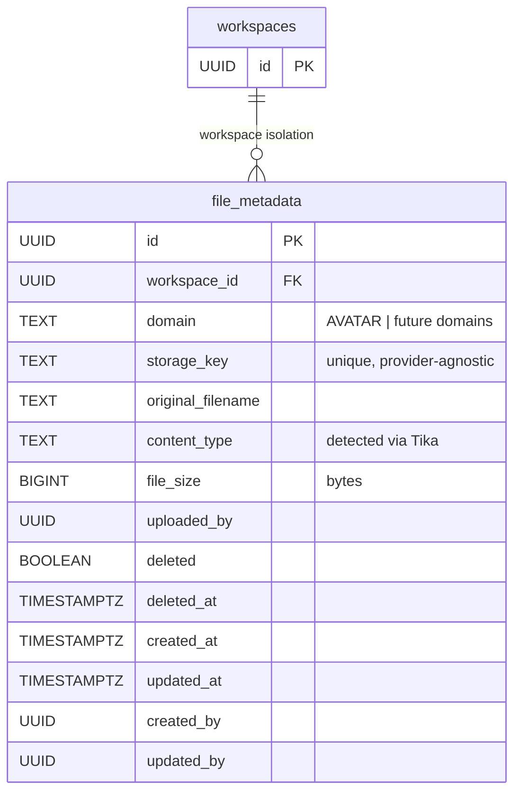
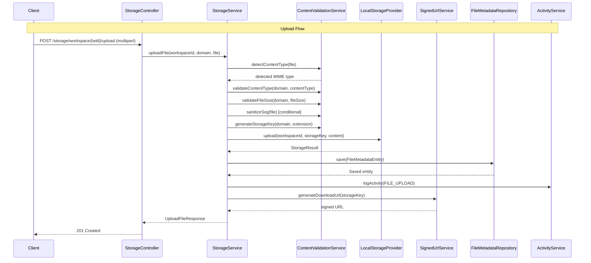
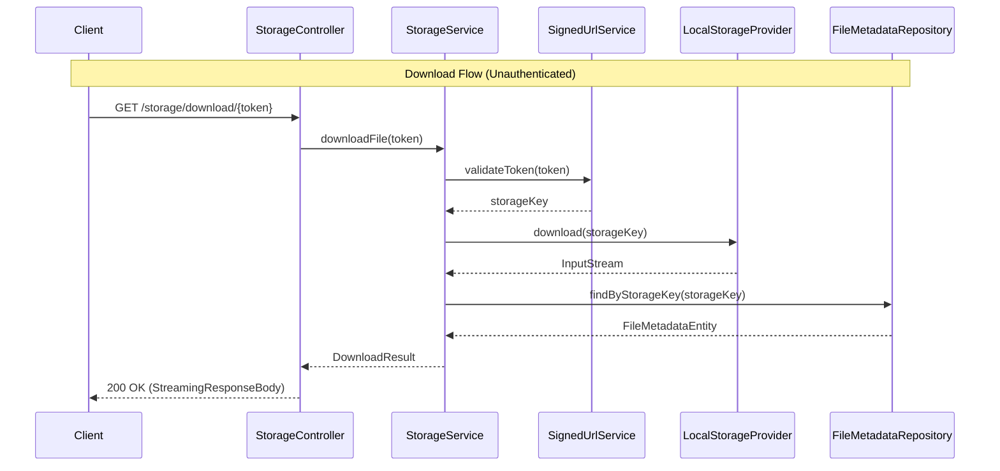

---
tags:
  - status/designed
  - priority/high
  - architecture/design
  - architecture/feature
Created: 2026-03-06
Domains:
  - "[[Storage]]"
Sub-Domain: "[[File Storage]]"
---
# Feature: Provider-Agnostic File Storage

---

## 1. Overview

### Problem Statement

The platform has no file storage capability. Users cannot upload avatars, attach files to entities, or embed images in block content. Without a storage layer, features like workspace branding, entity file attachments, and rich-text image embedding are blocked. Additionally, the platform must support multiple deployment contexts — self-hosted instances using local filesystem storage and cloud deployments using Supabase Storage or S3-compatible backends — meaning the storage implementation cannot be coupled to a single provider.

### Proposed Solution

Introduce a provider-agnostic file storage system with a `StorageProvider` interface activated via Spring `@ConditionalOnProperty`, a local filesystem adapter as the first implementation, content validation using Apache Tika magic byte detection, HMAC-signed download URLs for unauthenticated file access, file metadata persistence via a new `file_metadata` JPA entity, and a `StorageController` exposing 6 REST endpoints under `/api/v1/storage/`. The system validates content types and file sizes per-domain (e.g., AVATAR domain allows only image types up to 2MB), sanitizes SVG uploads to prevent XSS, and generates time-limited signed download URLs that bypass JWT authentication for inline rendering use cases.

### Success Criteria

- [ ] A user can upload a file to a workspace via the API and receive a signed download URL in the response
- [ ] A user can download a file using only the signed URL token, without JWT authentication
- [ ] The system rejects files that do not match the allowed content types for the target domain (e.g., uploading a PDF to AVATAR domain is rejected)
- [ ] The system rejects files that exceed the maximum file size for the target domain
- [ ] SVG uploads are sanitized to remove embedded scripts before storage
- [ ] File metadata is persisted and queryable by workspace and domain
- [ ] The storage provider can be switched by changing a single configuration property (`storage.provider`)
- [ ] Signed download URLs expire after the configured duration and return 401 after expiry

---

## 2. Data Model

### New Entities

#### `file_metadata` Table

Stores metadata for every uploaded file. The actual file content is stored by the storage provider (local filesystem, Supabase Storage, S3); this table tracks the mapping between logical file identity and physical storage location.

| Column | Type | Constraints | Default | Purpose |
|--------|------|-------------|---------|---------|
| `id` | `UUID` | PK | `uuid_generate_v4()` | Row identifier |
| `workspace_id` | `UUID` | `NOT NULL`, FK to `workspaces(id)` ON DELETE CASCADE | -- | Workspace isolation |
| `domain` | `TEXT` | `NOT NULL` | -- | Storage domain (e.g., `AVATAR`) controlling validation rules |
| `storage_key` | `TEXT` | `NOT NULL`, UNIQUE | -- | Provider-agnostic key identifying the file in the storage backend |
| `original_filename` | `TEXT` | `NOT NULL` | -- | User-provided filename preserved for download Content-Disposition |
| `content_type` | `TEXT` | `NOT NULL` | -- | Detected MIME type (via Tika magic bytes, not client-provided) |
| `file_size` | `BIGINT` | `NOT NULL` | -- | File size in bytes |
| `uploaded_by` | `UUID` | `NOT NULL` | -- | User who uploaded the file |
| `deleted` | `BOOLEAN` | `NOT NULL` | `FALSE` | Soft-delete flag |
| `deleted_at` | `TIMESTAMPTZ` | Nullable | `NULL` | Soft-delete timestamp |
| `created_at` | `TIMESTAMPTZ` | -- | `CURRENT_TIMESTAMP` | Audit: creation time |
| `updated_at` | `TIMESTAMPTZ` | -- | `CURRENT_TIMESTAMP` | Audit: last update time |
| `created_by` | `UUID` | Nullable | `NULL` | Audit: creating user |
| `updated_by` | `UUID` | Nullable | `NULL` | Audit: last updating user |

**Constraints:**
- `UNIQUE (storage_key)` -- guarantees no duplicate storage keys across all workspaces

**Indexes:**
- `idx_file_metadata_workspace` on `(workspace_id)` -- workspace-scoped queries
- `idx_file_metadata_workspace_domain` on `(workspace_id, domain)` -- filtered queries by domain within workspace
- `idx_file_metadata_storage_key` on `(storage_key)` -- download path lookup by storage key

### Entity Modifications

None. This feature is purely additive. No columns are added to any existing table.

### Data Ownership

`StorageService` is the sole writer to the `file_metadata` table. No other service writes to this table directly.

### Relationships



### Data Lifecycle

1. **Created** -- when a file is uploaded via `StorageService.uploadFile`. Metadata is persisted after the file is successfully stored by the provider.
2. **Read** -- via `StorageService.listFiles` (workspace + optional domain filter) or `StorageService.getFile` (by file ID).
3. **Soft-deleted** -- when a file is deleted via `StorageService.deleteFile`. The metadata row is soft-deleted and the physical file is deleted from the storage provider. Physical deletion failure is logged but does not roll back the metadata soft-delete.
4. **Never hard-deleted** -- follows the standard soft-delete pattern via `SoftDeletable`.

### Consistency

Metadata persistence and physical file storage are not in a single ACID transaction (the storage provider is an external system). The upload flow stores the file first, then persists metadata. If metadata persistence fails, an orphaned file may remain in the storage backend. This is an acceptable tradeoff -- orphaned files are harmless and can be cleaned up by a future background job. The alternative (persist metadata first, then store file) risks metadata pointing to a nonexistent file, which is worse.

---

## 3. Component Design

### New Components

| Component | Package | Type | Purpose |
|-----------|---------|------|---------|
| `StorageProvider` | `riven.core.models.storage` | Interface | Blocking interface defining upload, download, delete, exists, generateSignedUrl, healthCheck operations. Activated via `@ConditionalOnProperty("storage.provider")`. |
| `LocalStorageProvider` | `riven.core.service.storage` | Service | Filesystem implementation storing files under `{basePath}/{workspaceId}/{domain}/{uuid}.{ext}`. Path traversal prevention via resolve+normalize+startsWith check. |
| `ContentValidationService` | `riven.core.service.storage` | Service | Apache Tika magic byte detection, domain-based content type validation, domain-based file size validation, SVG sanitization via `io.github.borewit:sanitize`, UUID-based storage key generation. |
| `SignedUrlService` | `riven.core.service.storage` | Service | HMAC-SHA256 token generation/validation. Token format: Base64URL(storageKey:expiresAt:hmacSignature). Constant-time comparison via `MessageDigest.isEqual()`. |
| `StorageService` | `riven.core.service.storage` | Service | Orchestrates upload (detect MIME, validate, sanitize, store, persist metadata, log activity, return signed URL), download (validate token, fetch file, lookup filename), delete (soft-delete metadata, delete physical file, log activity), list, getFile, generateSignedUrl. |
| `StorageController` | `riven.core.controller.storage` | Controller | 6 REST endpoints for file upload, download, list, get metadata, generate signed URL, and delete. |
| `FileMetadataEntity` | `riven.core.entity.storage` | JPA Entity | Database mapping, extends `AuditableSoftDeletableEntity`, includes `toModel()`. |
| `FileMetadataRepository` | `riven.core.repository.storage` | Repository | JPA repository with derived queries: findByWorkspaceIdAndDomain, findByWorkspaceId, findByStorageKey, findByIdAndWorkspaceId. |
| `StorageConfigurationProperties` | `riven.core.configuration.storage` | Configuration | `@ConfigurationProperties(prefix = "storage")` with provider, local.basePath, signedUrl.secret, signedUrl.defaultExpirySeconds, signedUrl.maxExpirySeconds. |
| `StorageDomain` | `riven.core.enums.storage` | Enum | AVATAR with allowedContentTypes and maxFileSize. Has `isContentTypeAllowed()` and `isFileSizeAllowed()` methods. |
| `StorageResult` | `riven.core.models.storage` | Model | Upload result: storageKey, contentType, contentLength. |
| `DownloadResult` | `riven.core.models.storage` | Model | Download result: content InputStream, contentType, contentLength, originalFilename. |
| `FileMetadata` | `riven.core.models.storage` | Model | Domain model: id, workspaceId, domain, storageKey, originalFilename, contentType, fileSize, uploadedBy, createdAt, updatedAt. |
| `GenerateSignedUrlRequest` | `riven.core.models.request.storage` | DTO | Request body for signed URL generation: fileId, expiresInSeconds (optional). |
| `UploadFileResponse` | `riven.core.models.response.storage` | Response | Upload response: file (FileMetadata), signedUrl (String). |
| `FileListResponse` | `riven.core.models.response.storage` | Response | List response: files (List of FileMetadata). |
| `SignedUrlResponse` | `riven.core.models.response.storage` | Response | Signed URL response: url, expiresAt. |
| `ContentTypeNotAllowedException` | `riven.core.exceptions` | Exception | Thrown when uploaded file content type is not in domain allowlist. |
| `FileSizeLimitExceededException` | `riven.core.exceptions` | Exception | Thrown when uploaded file exceeds domain max file size. |
| `StorageNotFoundException` | `riven.core.exceptions` | Exception | Thrown when file not found in storage provider. |
| `StorageProviderException` | `riven.core.exceptions` | Exception | Thrown when storage provider operation fails. |
| `SignedUrlExpiredException` | `riven.core.exceptions` | Exception | Thrown when signed download token has expired. |

### Affected Existing Components

| Component | Change |
|-----------|--------|
| `SecurityConfig` | Permits `/api/v1/storage/download/**` without JWT authentication. All other storage endpoints require authentication. |

### Component Interaction Diagram





---

## 4. API Design

### StorageController Endpoints

All authenticated endpoints are prefixed with `/api/v1/storage`. The controller is tagged with `@Tag(name = "storage")` for OpenAPI grouping. All business logic and authorization is delegated to `StorageService` -- the controller is thin.

#### 4.1 Upload File

```
POST /api/v1/storage/workspace/{workspaceId}/upload
Content-Type: multipart/form-data
```

**Request:** Multipart form with `file` (the file bytes) and `domain` (string, e.g., `"AVATAR"`).

**Response** `201 Created`:
```json
{
  "file": {
    "id": "a1b2c3d4-e5f6-7890-abcd-ef1234567890",
    "workspaceId": "f8b1c2d3-4e5f-6789-abcd-ef9876543210",
    "domain": "AVATAR",
    "storageKey": "avatar/a1b2c3d4-e5f6-7890-abcd-ef1234567890.png",
    "originalFilename": "profile-photo.png",
    "contentType": "image/png",
    "fileSize": 245760,
    "uploadedBy": "f8b1c2d3-4e5f-6789-abcd-ef0123456789",
    "createdAt": "2026-03-06T10:30:00Z",
    "updatedAt": "2026-03-06T10:30:00Z"
  },
  "signedUrl": "/api/v1/storage/download/YXZhdGFyL2ExYjJ..."
}
```

**Error Responses**: `400` (invalid domain), `403` (no workspace access), `413` (file size exceeded), `415` (content type not allowed)

#### 4.2 List Files

```
GET /api/v1/storage/workspace/{workspaceId}/files?domain=AVATAR
```

**Query Parameters:**
- `domain` (optional) -- filter by storage domain

**Response** `200 OK`:
```json
{
  "files": [
    {
      "id": "a1b2c3d4-e5f6-7890-abcd-ef1234567890",
      "workspaceId": "f8b1c2d3-4e5f-6789-abcd-ef9876543210",
      "domain": "AVATAR",
      "storageKey": "avatar/a1b2c3d4-e5f6-7890-abcd-ef1234567890.png",
      "originalFilename": "profile-photo.png",
      "contentType": "image/png",
      "fileSize": 245760,
      "uploadedBy": "f8b1c2d3-4e5f-6789-abcd-ef0123456789",
      "createdAt": "2026-03-06T10:30:00Z",
      "updatedAt": "2026-03-06T10:30:00Z"
    }
  ]
}
```

**Error Responses**: `403` (no workspace access)

#### 4.3 Get File Metadata

```
GET /api/v1/storage/workspace/{workspaceId}/files/{fileId}
```

**Response** `200 OK`: Single `FileMetadata` object (same shape as list item above).

**Error Responses**: `403` (no workspace access), `404` (file not found or not in workspace)

#### 4.4 Generate Signed URL

```
POST /api/v1/storage/workspace/{workspaceId}/files/{fileId}/signed-url
```

**Request Body**:
```json
{
  "expiresInSeconds": 7200
}
```

`expiresInSeconds` is optional -- defaults to `storage.signed-url.default-expiry-seconds` (3600). Capped at `storage.signed-url.max-expiry-seconds` (86400).

**Response** `200 OK`:
```json
{
  "url": "/api/v1/storage/download/YXZhdGFyL2ExYjJ...",
  "expiresAt": "2026-03-06T12:30:00Z"
}
```

**Error Responses**: `403` (no workspace access), `404` (file not found)

#### 4.5 Delete File

```
DELETE /api/v1/storage/workspace/{workspaceId}/files/{fileId}
```

**Response** `204 No Content`

**Error Responses**: `403` (no workspace access), `404` (file not found)

#### 4.6 Download File (Unauthenticated)

```
GET /api/v1/storage/download/{token}
```

This endpoint is **unauthenticated** -- authorization is embedded in the signed token. The `SecurityConfig` permits this path without JWT validation.

**Response** `200 OK`:
- `Content-Type`: detected MIME type of the file
- `Content-Disposition`: `attachment; filename="original-filename.png"`
- Body: `StreamingResponseBody` streaming file bytes

**Error Responses**: `401` (token expired or invalid signature), `404` (file not found in storage)

---

## 5. Failure Modes & Recovery

| Failure | Cause | HTTP Status | Recovery |
|---------|-------|-------------|----------|
| Content type not allowed | Uploaded file MIME type not in domain allowlist | `415 Unsupported Media Type` | `ContentTypeNotAllowedException` thrown, caught by `@ControllerAdvice` |
| File size exceeded | Uploaded file exceeds domain max file size | `413 Payload Too Large` | `FileSizeLimitExceededException` thrown, caught by `@ControllerAdvice` |
| Signed URL expired | Download token timestamp has passed | `401 Unauthorized` | `SignedUrlExpiredException` thrown, caught by `@ControllerAdvice` |
| Invalid signed URL | HMAC signature does not match | `401 Unauthorized` | `SignedUrlExpiredException` thrown, caught by `@ControllerAdvice` |
| File not found in storage | Physical file missing from storage backend | `404 Not Found` | `StorageNotFoundException` thrown. May indicate orphaned metadata -- logged at WARN level. |
| Storage provider failure | Disk full, permission denied, I/O error | `500 Internal Server Error` | `StorageProviderException` thrown. Upload fails atomically (no metadata persisted). |
| Metadata persistence failure | Database connection loss after file stored | `500 Internal Server Error` | Orphaned file in storage backend. Acceptable -- harmless and cleanable by future background job. |
| Path traversal attempt | Malicious storage key with `../` sequences | `400 Bad Request` | `LocalStorageProvider` resolve+normalize+startsWith check throws `StorageProviderException` |
| No workspace access | User JWT does not include the target workspace | `403 Forbidden` | `@PreAuthorize("@workspaceSecurity.hasWorkspace(#workspaceId)")` rejects before service logic executes |
| File not found | File ID does not exist or is soft-deleted | `404 Not Found` | `ServiceUtil.findOrThrow` throws `NotFoundException` |
| Physical delete failure | Storage provider cannot delete file (permissions, I/O) | Metadata still soft-deleted | Logged at WARN level. Physical file becomes orphaned. Does not roll back metadata soft-delete. |

### Blast Radius

If the storage provider is unavailable (e.g., disk failure for local provider), uploads and downloads fail but all other application functionality is unaffected. File storage is isolated from the entity, block, and workflow domains.

If `SignedUrlService` fails (e.g., missing HMAC secret configuration), signed URL generation and validation fail, blocking both uploads (which return a signed URL) and downloads (which validate a signed URL). All other storage metadata operations (list, get, delete) continue to work.

---

## 6. Security

### Workspace Access Control

- `@PreAuthorize("@workspaceSecurity.hasWorkspace(#workspaceId)")` is applied to all `StorageService` methods that accept a `workspaceId` parameter (upload, list, getFile, generateSignedUrl, delete).
- File metadata queries filter by `workspaceId` to enforce workspace isolation at the data layer.

### Signed URL Authentication Bypass

- The download endpoint (`GET /api/v1/storage/download/{token}`) is explicitly permitted in `SecurityConfig` without JWT authentication.
- Authorization is embedded in the HMAC-signed token: only someone who obtained a valid signed URL (which requires JWT auth + workspace access) can download the file.
- Tokens are time-limited with a configurable expiry (default 3600 seconds, max 86400 seconds).
- HMAC uses a **separate secret** (`storage.signed-url.secret`) from the JWT secret to decouple file access from user session lifecycle.
- Constant-time signature comparison via `MessageDigest.isEqual()` prevents timing attacks.

### Path Traversal Prevention

- `LocalStorageProvider` resolves the storage key against the base path, normalizes the result, and verifies the normalized path starts with the base path. This prevents `../` traversal attacks.
- Storage keys are UUID-based (generated by `ContentValidationService.generateStorageKey`) and never derived from user-supplied filenames.

### SVG Sanitization

- SVG files are sanitized via `io.github.borewit:sanitize` before storage to remove embedded `<script>` tags, event handlers, and other XSS vectors.
- This is critical because SVGs served with `Content-Type: image/svg+xml` execute embedded scripts in the browser.

### Data Sensitivity

File content may contain sensitive data depending on the domain use case. Files are stored as-is (no server-side encryption in Phase 1). Encryption at rest is a consideration for Phase 2 cloud adapters (S3 server-side encryption, Supabase Storage encryption).

---

## 7. Performance & Scale

### Upload Size Limits

File size limits are enforced per-domain via the `StorageDomain` enum:

| Domain | Max File Size | Allowed Content Types |
|--------|--------------|----------------------|
| AVATAR | 2 MB | image/jpeg, image/png, image/webp, image/gif, image/svg+xml |

Additional domains with different limits can be added to the `StorageDomain` enum as needed.

### Streaming Downloads

Downloads use `StreamingResponseBody` to stream file content directly from the storage provider to the HTTP response without buffering the entire file in memory. This keeps memory usage constant regardless of file size.

### Storage Key Generation

Storage keys follow the pattern `{workspaceId}/{domain}/{uuid}.{ext}`, where the UUID is generated by `ContentValidationService`. This ensures:
- No filename collisions (UUID uniqueness)
- Efficient filesystem distribution (workspace/domain directory structure)
- No need for filename sanitization (UUIDs contain only safe characters)

### Expected Load

File storage operations are low-to-moderate frequency. Avatar uploads are infrequent (once per user setup, occasional updates). Future domains (entity attachments, block images) will have higher volume but are bounded by user interaction rate.

---

## 8. Observability

### Logging

- `KLogger` debug-level logging on all storage operations (upload, download, delete, list).
- `KLogger` info-level logging on successful uploads: "Uploaded file {originalFilename} as {storageKey} for workspace {workspaceId}".
- `KLogger` warn-level logging on physical file deletion failures: "Failed to delete physical file {storageKey}, metadata soft-deleted".
- `KLogger` warn-level logging on signed URL validation failures: "Signed URL validation failed for token: {reason}".

### Activity Logging

Activity logging is performed for all mutation operations:
- **Upload**: `FILE_UPLOAD` activity with details including storageKey, originalFilename, contentType, fileSize, domain.
- **Delete**: `FILE_DELETE` activity with details including storageKey, originalFilename, domain.

Read operations (list, getFile, download) do not generate activity log entries.

### Error Tracking

All errors propagate to the `@ControllerAdvice` exception handler. Storage-specific exceptions (`ContentTypeNotAllowedException`, `FileSizeLimitExceededException`, `SignedUrlExpiredException`, `StorageNotFoundException`, `StorageProviderException`) are mapped to appropriate HTTP status codes.

---

## 9. Testing Strategy

### Unit Tests

**`StorageServiceTest`** -- using the established `@SpringBootTest` + `@WithUserPersona` + `@MockitoBean` pattern.

**Upload operations:**
- `uploadFile` - detects content type, validates, stores file, persists metadata, logs activity, returns signed URL
- `uploadFile` - rejects file with disallowed content type
- `uploadFile` - rejects file exceeding size limit
- `uploadFile` - sanitizes SVG before storage
- `uploadFile` - throws when storage provider fails

**Download operations:**
- `downloadFile` - validates token, downloads from provider, returns DownloadResult with original filename
- `downloadFile` - throws when token is expired
- `downloadFile` - throws when token signature is invalid

**Delete operations:**
- `deleteFile` - soft-deletes metadata, deletes physical file, logs activity
- `deleteFile` - soft-deletes metadata even when physical delete fails
- `deleteFile` - throws when file not found

**List/Get operations:**
- `listFiles` - returns files for workspace, optionally filtered by domain
- `getFile` - returns file metadata by ID and workspace

**`ContentValidationServiceTest`:**
- `detectContentType` - detects MIME type from magic bytes
- `validateContentType` - accepts allowed types, rejects disallowed types
- `validateFileSize` - accepts files within limit, rejects oversized files
- `sanitizeSvg` - removes script tags from SVG content
- `generateStorageKey` - generates UUID-based key with correct extension

**`SignedUrlServiceTest`:**
- `generateToken` - produces valid Base64URL token
- `validateToken` - extracts storage key from valid token
- `validateToken` - rejects expired tokens
- `validateToken` - rejects tampered signatures (constant-time)
- `generateDownloadUrl` - produces correct URL path

### Test Conventions

- Use `whenever` from `mockito-kotlin` (not `Mockito.when` static calls)
- Use backtick function names for test methods per existing convention
- Create factory methods for building test `FileMetadataEntity` instances in test helper classes

---

## 10. Migration & Rollout

### Database Migration

One SQL file:

**`db/schema/01_tables/file_metadata.sql`** -- New file with the full `CREATE TABLE`, constraints, and indexes as specified in the Data Model section.

Follows the existing append-only schema management pattern documented in `db/schema/README.md`. No Flyway or Liquibase -- raw SQL files executed in order by directory number.

### Configuration

New configuration properties under the `storage` prefix:

| Property | Default | Purpose |
|----------|---------|---------|
| `storage.provider` | `local` | Active storage provider (`local`, future: `supabase`, `s3`) |
| `storage.local.base-path` | `./storage` | Base directory for local filesystem storage |
| `storage.signed-url.secret` | (required) | HMAC-SHA256 secret for signed URL tokens |
| `storage.signed-url.default-expiry-seconds` | `3600` | Default token expiry (1 hour) |
| `storage.signed-url.max-expiry-seconds` | `86400` | Maximum allowed token expiry (24 hours) |

### Feature Flags

None needed. This is a purely additive change:
- The new `StorageController` endpoints do not conflict with existing routes
- No existing API contracts or response shapes change
- The `SecurityConfig` change (permitting download path) is safe -- the path did not exist before

### Rollout Sequence

1. Deploy database schema change (file_metadata.sql)
2. Set required environment variable: `STORAGE_SIGNED_URL_SECRET`
3. Deploy application code (all new components)
4. Verify local storage directory is writable at the configured `storage.local.base-path`

---

## 11. Open Questions

- **Phase 2 cloud adapters**: `SupabaseStorageProvider` and `S3StorageProvider` implementations are planned but not designed. The `StorageProvider` interface is designed against the lowest common denominator (S3 object model) to ensure cloud adapters can implement it cleanly.
- **Storage quotas**: Per-workspace storage quotas are not implemented in Phase 1. This is a consideration for Phase 2 when cloud storage introduces cost implications.
- **Presigned uploads**: Phase 1 proxies file uploads through the backend. Phase 3 may add presigned upload URLs for direct-to-storage uploads, bypassing the backend for large files.
- **Encryption at rest**: Phase 1 local storage does not encrypt files at rest. Cloud adapters in Phase 2 should leverage provider-native encryption (S3 SSE, Supabase Storage encryption).

---

## 12. Decisions Log

| Date | Decision | Rationale | Reference |
|------|----------|-----------|-----------|
| 2026-03-06 | Strategy pattern with `@ConditionalOnProperty` for provider selection | Only one provider active per deployment, avoids runtime switching complexity, clean interface dependency | [[ADR-005 Strategy Pattern with Conditional Bean Selection for Storage Providers]] |
| 2026-03-06 | HMAC-signed download tokens instead of JWT-based file tokens | Decouples file access from user session lifecycle, self-contained tokens require no DB lookup per download | [[ADR-006 HMAC-Signed Download Tokens for File Access]] |
| 2026-03-06 | Apache Tika for content type detection | Magic byte detection is reliable and not spoofable, Tika maintains comprehensive detection database | [[ADR-007 Magic Byte Content Validation via Apache Tika]] |
| 2026-03-06 | Separate HMAC secret from JWT secret | File access tokens have different security scope and lifecycle than user auth tokens, separate secret limits blast radius | |
| 2026-03-06 | StorageProvider interface is blocking (non-suspend) | Matches synchronous Spring MVC architecture, avoids coroutine complexity for I/O-bound file operations | |
| 2026-03-06 | Tika extension includes leading dot | Used directly in storage key generation (e.g., `.png`), avoids string manipulation at call sites | |
| 2026-03-06 | Token format Base64URL(storageKey:expiresAt:hmacSignature) | Self-contained, no DB lookup required for validation, compact URL-safe representation | |
| 2026-03-06 | Download endpoint unauthenticated (token-as-auth) | Required for inline image rendering in rich text where browser fetches image URLs without JWT headers | |
| 2026-03-06 | Physical file deletion failures do not roll back metadata soft-delete | Orphaned physical files are harmless (inaccessible after metadata soft-delete), failed rollback of soft-delete is worse (user thinks file exists but it's deleted) | |
| 2026-03-06 | Local filesystem adapter first | Requires zero external services, enables self-hosted deployments without cloud dependencies, simplest possible first implementation | |
| 2026-03-06 | Interface designed against S3 object model (lowest common denominator) | S3-compatible APIs are the industry standard, Supabase Storage uses S3 internally, ensures future adapters implement cleanly | |
| 2026-03-06 | SVG sanitization via io.github.borewit:sanitize | SVGs execute embedded scripts in browsers, must be sanitized before serving with image/svg+xml content type | |

---

## 13. Implementation Tasks

Implementation is split into four sequential plans, each building on the artifacts of the previous:

### Plan 01-01: Storage Provider Interface + Configuration
**Scope:** StorageProvider interface, StorageDomain enum, configuration properties, storage models

- [x] Create `StorageProvider` interface with upload, download, delete, exists, generateSignedUrl, healthCheck methods
- [x] Create `StorageDomain` enum with AVATAR (allowedContentTypes, maxFileSize, isContentTypeAllowed, isFileSizeAllowed)
- [x] Create `StorageConfigurationProperties` with provider, local.basePath, signedUrl.secret/defaultExpirySeconds/maxExpirySeconds
- [x] Create `StorageResult`, `DownloadResult`, `FileMetadata` domain models
- [x] Create storage exception classes (ContentTypeNotAllowedException, FileSizeLimitExceededException, StorageNotFoundException, StorageProviderException, SignedUrlExpiredException)

### Plan 01-02: Local Storage Provider + Content Validation
**Scope:** LocalStorageProvider implementation, ContentValidationService with Tika, unit tests

- [x] Create `LocalStorageProvider` with filesystem operations under `{basePath}/{workspaceId}/{domain}/{uuid}.{ext}`
- [x] Implement path traversal prevention (resolve + normalize + startsWith)
- [x] Create `ContentValidationService` with Tika magic byte detection, domain-based validation, SVG sanitization, UUID key generation
- [x] Create `FileMetadataEntity` JPA data class extending `AuditableSoftDeletableEntity` with `toModel()`
- [x] Create `FileMetadataRepository` with derived queries (findByWorkspaceIdAndDomain, findByWorkspaceId, findByStorageKey, findByIdAndWorkspaceId)
- [x] Create database schema: `db/schema/01_tables/file_metadata.sql`

### Plan 01-03: Signed URL Service + Storage Orchestration
**Scope:** SignedUrlService with HMAC-SHA256, StorageService orchestrating all operations, unit tests

- [x] Create `SignedUrlService` with HMAC-SHA256 token generation/validation
- [x] Implement constant-time comparison via `MessageDigest.isEqual()`
- [x] Create `StorageService` orchestrating upload, download, delete, list, getFile, generateSignedUrl
- [x] Create request/response DTOs: GenerateSignedUrlRequest, UploadFileResponse, FileListResponse, SignedUrlResponse
- [x] Write unit tests for SignedUrlService and StorageService

### Plan 01-04: Storage Controller + Security Configuration
**Scope:** StorageController with 6 endpoints, SecurityConfig update, full test verification

- [x] Create `StorageController` with 6 endpoints and `@Operation`/`@ApiResponses` annotations
- [x] Update `SecurityConfig` to permit `/api/v1/storage/download/**` without authentication
- [x] Implement `StreamingResponseBody` for download endpoint
- [x] Run full test suite (`./gradlew test`) and fix any compilation failures
- [x] Run full build (`./gradlew build`) to confirm clean compilation

---

## Related Documents

- [[ADR-005 Strategy Pattern with Conditional Bean Selection for Storage Providers]] -- Architecture decision for pluggable storage backends
- [[ADR-006 HMAC-Signed Download Tokens for File Access]] -- Architecture decision for signed URL authentication
- [[ADR-007 Magic Byte Content Validation via Apache Tika]] -- Architecture decision for content type detection
- [[Flow - File Upload]] -- Detailed flow documentation for file upload
- [[Flow - Signed URL Download]] -- Detailed flow documentation for signed URL download
- [[File Storage]] -- Sub-domain plan covering all phases of the File Storage sub-domain

---

## Changelog

| Date | Author | Change |
|------|--------|--------|
| 2026-03-06 | Claude | Initial design from Phase 1 planning documents -- full feature specification covering data model, 6 API endpoints, content validation, signed URLs, and 4-plan implementation sequence |
