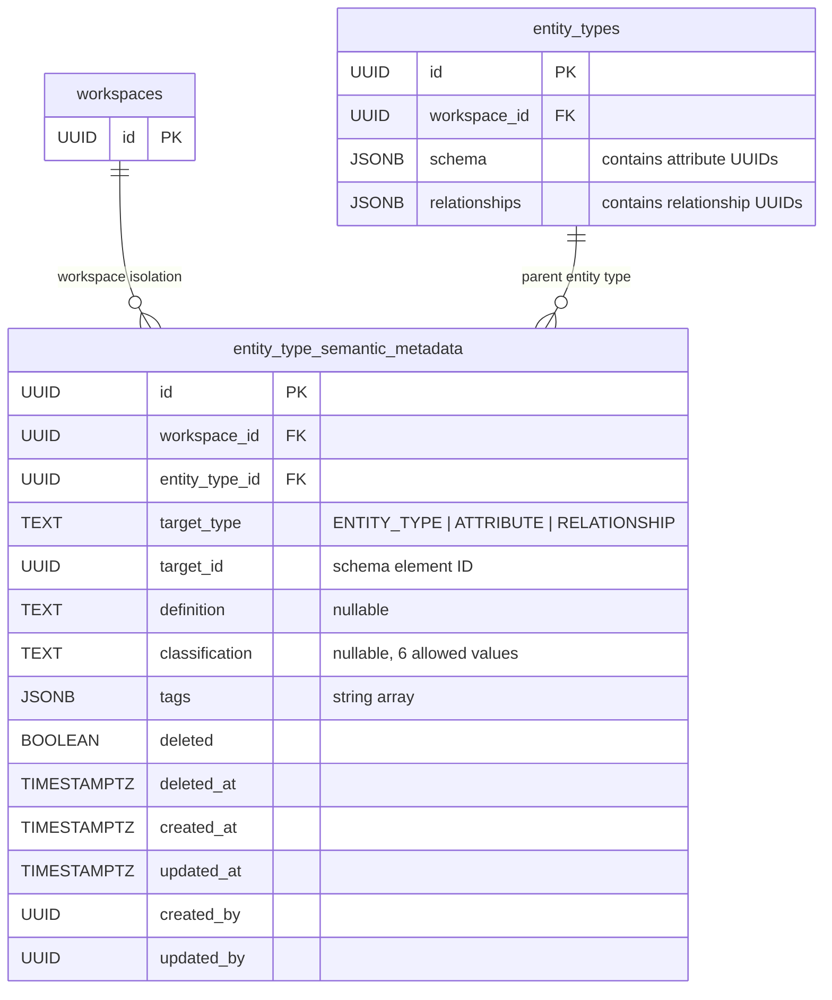
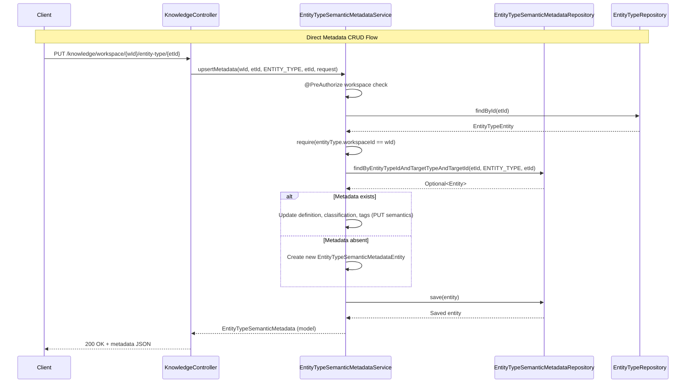
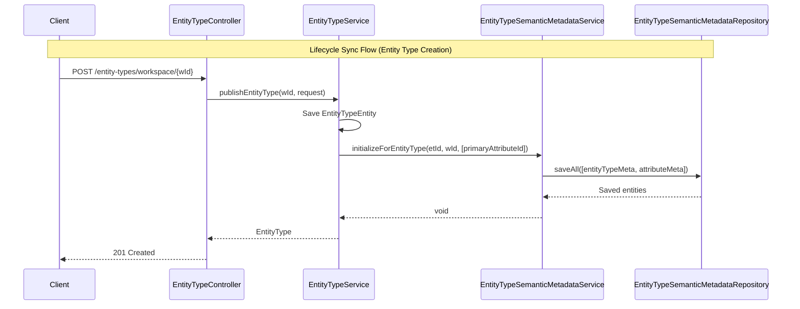

---
tags:
  - status/designed
  - priority/high
  - architecture/design
  - architecture/feature
Created: 2026-02-18
Domains:
  - "[[Entities]]"
  - "[[Knowledge]]"
Sub-Domain: "[[Knowledge Layer]]"
---
# Feature: Semantic Metadata Foundation

---

## 1. Overview

### Problem Statement

Entity types, attributes, and relationships in the existing system carry structural information -- names, data types, cardinality, JSON schemas -- but no semantic meaning. The system can tell you that an attribute is a "text field named `arr_usd`" but not that it represents "Annual Recurring Revenue in US dollars." Without semantic context, the downstream [[Enrichment Pipeline]] (Phase 3 of the [[Knowledge Layer]]) cannot construct meaningful text for embedding. It would produce low-quality embeddings that cluster on field names rather than business concepts, rendering vector similarity search ineffective for business-meaningful retrieval.

This gap also prevents future capabilities like prompt construction, agentic reasoning, and schema-aware intelligence from understanding what the data actually means in a business context. The absence of semantic metadata is the single blocking dependency for every downstream Knowledge Layer feature.

### Proposed Solution

Add a separate `entity_type_semantic_metadata` table using a single-table discriminator pattern covering entity types, attributes, and relationships. Expose semantic metadata CRUD via a new `KnowledgeController` at `/api/v1/knowledge/` with 8 dedicated endpoints, and add an opt-in `?include=semantics` query parameter to existing [[EntityTypeController]] endpoints. Wire lifecycle hooks into [[EntityTypeService]], [[EntityTypeAttributeService]], and [[EntityTypeRelationshipService]] to auto-create and auto-delete metadata records when entity types, attributes, or relationships change, guaranteeing 1:1 consistency between the entity schema and its semantic metadata.

Register the pgvector PostgreSQL extension as an infrastructure prerequisite for Phase 3, and switch integration tests to a pgvector-enabled Docker image.

### Success Criteria

- [ ] A user can set a natural language semantic definition on an entity type via the API and retrieve it back without affecting existing entity CRUD operations
- [ ] A user can assign a semantic type classification (`identifier`, `categorical`, `quantitative`, `temporal`, `freetext`, `relational_reference`) and natural language description to an attribute, and the system validates known classification values
- [ ] A user can set a semantic context string on a relationship definition describing the nature of the connection
- [ ] All semantic metadata endpoints reject requests from users who do not have access to the target workspace
- [ ] Semantic metadata is stored in a separate table from `entity_types` so that existing entity type queries are unchanged

---

## 2. Data Model

### New Entities

#### `entity_type_semantic_metadata` Table

A single table stores semantic metadata for all three target types (entity types, attributes, relationships) using a `target_type` discriminator column. This avoids three separate tables while the locked decision confirms one metadata shape for all targets.

| Column | Type | Constraints | Default | Purpose |
|--------|------|-------------|---------|---------|
| `id` | `UUID` | PK | `uuid_generate_v4()` | Row identifier |
| `workspace_id` | `UUID` | `NOT NULL`, FK to `workspaces(id)` ON DELETE CASCADE | -- | Workspace isolation |
| `entity_type_id` | `UUID` | `NOT NULL`, FK to `entity_types(id)` ON DELETE CASCADE | -- | Parent entity type (for cascade operations) |
| `target_type` | `TEXT` | `NOT NULL`, CHECK IN (`ENTITY_TYPE`, `ATTRIBUTE`, `RELATIONSHIP`) | -- | Discriminator: which kind of schema element this metadata describes |
| `target_id` | `UUID` | `NOT NULL` | -- | ID of the target element. For `ENTITY_TYPE`, equals `entity_type_id`. For `ATTRIBUTE`, the attribute UUID key from the schema JSONB. For `RELATIONSHIP`, the relationship definition UUID. |
| `definition` | `TEXT` | Nullable | `NULL` | Natural language description of what this element represents in the business model |
| `classification` | `TEXT` | Nullable, CHECK IN 6 values or NULL | `NULL` | Semantic type classification (attributes only in practice; nullable for entity types and relationships) |
| `tags` | `JSONB` | `NOT NULL` | `'[]'::jsonb` | Free-form string array for tagging and categorization |
| `deleted` | `BOOLEAN` | `NOT NULL` | `FALSE` | Soft-delete flag |
| `deleted_at` | `TIMESTAMPTZ` | Nullable | `NULL` | Soft-delete timestamp |
| `created_at` | `TIMESTAMPTZ` | -- | `CURRENT_TIMESTAMP` | Audit: creation time |
| `updated_at` | `TIMESTAMPTZ` | -- | `CURRENT_TIMESTAMP` | Audit: last update time |
| `created_by` | `UUID` | Nullable | `NULL` | Audit: creating user |
| `updated_by` | `UUID` | Nullable | `NULL` | Audit: last updating user |

**Constraints:**
- `UNIQUE (entity_type_id, target_type, target_id)` -- guarantees exactly one metadata record per schema element

**Indexes:**
- `idx_entity_semantic_metadata_workspace` on `(workspace_id)` -- workspace-scoped queries
- `idx_entity_semantic_metadata_entity_type` on `(entity_type_id) WHERE deleted = false` -- partial index for active metadata lookups
- `idx_entity_semantic_metadata_target` on `(target_type, target_id) WHERE deleted = false` -- partial index for discriminated lookups

**Classification CHECK constraint values:** `identifier`, `categorical`, `quantitative`, `temporal`, `freetext`, `relational_reference`. The constraint allows NULL -- users can set definition and tags first and classify later.

### Entity Modifications

None. This feature is purely additive. No columns are added to `entity_types`, `entities`, or any other existing table. This satisfies INFRA-06.

### Data Ownership

`EntityTypeSemanticMetadataService` is the sole writer to the `entity_type_semantic_metadata` table. No other service writes to this table directly. Lifecycle hooks in [[EntityTypeService]], [[EntityTypeAttributeService]], and [[EntityTypeRelationshipService]] delegate to `EntityTypeSemanticMetadataService` methods for metadata creation and deletion.

### Relationships



Note: `target_id` is not a foreign key to a separate table. For `ATTRIBUTE` targets, it references a UUID key inside the `entity_types.schema` JSONB. For `RELATIONSHIP` targets, it references a UUID inside the `entity_types.relationships` JSONB. The `entity_type_id` FK ensures the parent entity type exists. Attribute and relationship metadata records are hard-deleted when the corresponding JSONB entry is removed, preventing orphans.

### Data Lifecycle

1. **Created** -- automatically when entity types are published (via `EntityTypeService.publishEntityType`), when new attributes are added (via `EntityTypeAttributeService.saveAttributeDefinition`), or when new relationships are added (via `EntityTypeRelationshipService`). Empty metadata records (null definition, null classification, empty tags) are created to guarantee the 1:1 relationship.
2. **Updated** -- via PUT endpoints on the `KnowledgeController`. Full replacement semantics: all fields (definition, classification, tags) are replaced on each update.
3. **Soft-deleted** -- when the parent entity type is soft-deleted. `EntityTypeSemanticMetadataService.softDeleteForEntityType` sets `deleted = true` and `deleted_at` on all metadata records for that entity type. If the entity type is later restored, metadata must also be restored (noted as a future concern -- requires native SQL to bypass `@SQLRestriction`).
4. **Hard-deleted** -- when an individual attribute or relationship is removed from an entity type schema. `EntityTypeSemanticMetadataService.deleteForTarget` performs a JPQL DELETE for the specific `(entity_type_id, target_type, target_id)` tuple.

### Consistency

Strong consistency via ACID transactions. Metadata operations execute within the same `@Transactional` scope as the entity type operations that trigger them. If metadata creation fails, the entity type save rolls back. If attribute removal succeeds but metadata deletion fails, the entire transaction rolls back. There is no eventual consistency window.

---

## 3. Component Design

### New Components

| Component | Package | Type | Purpose |
|-----------|---------|------|---------|
| `EntityTypeSemanticMetadataService` | `riven.core.service.entity` | Service | CRUD operations for semantic metadata, lifecycle hooks for auto-create/delete, workspace verification |
| `KnowledgeController` | `riven.core.controller.knowledge` | Controller | REST endpoints for semantic metadata CRUD at `/api/v1/knowledge/` |
| `EntityTypeSemanticMetadataEntity` | `riven.core.entity.entity` | JPA Entity | Database mapping, extends `AuditableSoftDeletableEntity`, includes `toModel()` |
| `EntityTypeSemanticMetadata` | `riven.core.models.entity` | Domain Model | Immutable data class representing metadata in the service/API layer |
| `EntityTypeSemanticMetadataRepository` | `riven.core.repository.entity` | Repository | JPA repository with derived queries and custom JPQL for hard-delete/soft-delete |
| `SemanticMetadataTargetType` | `riven.core.enums.entity` | Enum | `ENTITY_TYPE`, `ATTRIBUTE`, `RELATIONSHIP` -- discriminator values |
| `SemanticAttributeClassification` | `riven.core.enums.entity` | Enum | `identifier`, `categorical`, `quantitative`, `temporal`, `freetext`, `relational_reference` -- lowercase constants matching wire format |
| `SaveSemanticMetadataRequest` | `riven.core.models.request.entity.type` | DTO | Request body for single-target metadata PUT: `definition`, `classification`, `tags` |
| `BulkSaveSemanticMetadataRequest` | `riven.core.models.request.entity.type` | DTO | Request body for bulk attribute metadata PUT: `targetId`, `definition`, `classification`, `tags` |
| `SemanticMetadataBundle` | `riven.core.models.response.entity.type` | Response Model | Bundles entity type metadata + attribute metadata map + relationship metadata map |
| `EntityTypeWithSemanticsResponse` | `riven.core.models.response.entity.type` | Response Model | Wraps `EntityType` with optional `SemanticMetadataBundle` for `?include=semantics` |

### Affected Existing Components

| Component | Change |
|-----------|--------|
| [[EntityTypeService]] | New constructor dependency on `EntityTypeSemanticMetadataService`. Lifecycle hook in `publishEntityType` to auto-create metadata for entity type + initial identifier attribute. Lifecycle hook in `deleteEntityType` to soft-delete all metadata for the entity type. |
| [[EntityTypeAttributeService]] | New constructor dependency on `EntityTypeSemanticMetadataService`. Lifecycle hook in `saveAttributeDefinition` to auto-create metadata for new attributes. Lifecycle hook in `removeAttributeDefinition` to hard-delete metadata when an attribute is removed. |
| [[EntityTypeRelationshipService]] | New constructor dependency on `EntityTypeSemanticMetadataService`. Lifecycle hook when adding a relationship to auto-create metadata. Lifecycle hook when removing a relationship to hard-delete metadata. |
| [[EntityTypeController]] | New constructor dependency on `EntityTypeSemanticMetadataService`. New `@RequestParam include: List<String>` on `getEntityTypesForWorkspace` and `getEntityTypeByKeyForWorkspace`. When `"semantics"` is in the include list, fetches and attaches `SemanticMetadataBundle`. |

### Component Interaction Diagram





---

## 4. API Design

### KnowledgeController Endpoints

All endpoints are prefixed with `/api/v1/knowledge`. The controller is tagged with `@Tag(name = "knowledge")` for OpenAPI grouping. All business logic and authorization is delegated to `EntityTypeSemanticMetadataService` -- the controller is thin.

#### 4.1 GET Entity Type Metadata

```
GET /api/v1/knowledge/workspace/{workspaceId}/entity-type/{entityTypeId}
```

**Response** `200 OK`:
```json
{
  "id": "a1b2c3d4-e5f6-7890-abcd-ef1234567890",
  "workspaceId": "f8b1c2d3-4e5f-6789-abcd-ef9876543210",
  "entityTypeId": "d4e5f6a7-b8c9-0123-4567-890abcdef012",
  "targetType": "ENTITY_TYPE",
  "targetId": "d4e5f6a7-b8c9-0123-4567-890abcdef012",
  "definition": "Represents a paying customer who has an active subscription to the platform",
  "classification": null,
  "tags": ["customer", "revenue"],
  "createdAt": "2026-02-18T10:30:00Z",
  "updatedAt": "2026-02-18T14:15:00Z",
  "createdBy": "f8b1c2d3-4e5f-6789-abcd-ef0123456789",
  "updatedBy": "f8b1c2d3-4e5f-6789-abcd-ef0123456789"
}
```

**Error Responses**: `403` (no workspace access), `404` (entity type not found or metadata not found)

#### 4.2 PUT Entity Type Metadata

```
PUT /api/v1/knowledge/workspace/{workspaceId}/entity-type/{entityTypeId}
```

**Request Body**:
```json
{
  "definition": "Represents a paying customer who has an active subscription to the platform",
  "classification": null,
  "tags": ["customer", "revenue"]
}
```

Full replacement semantics -- all three fields are set on every PUT. Omitting a field sets it to its default (null for definition/classification, empty list for tags).

**Response** `200 OK`: Same shape as GET response above.

**Error Responses**: `400` (invalid classification value), `403` (no workspace access), `404` (entity type not found)

#### 4.3 GET Attribute Metadata (All Attributes)

```
GET /api/v1/knowledge/workspace/{workspaceId}/entity-type/{entityTypeId}/attributes
```

**Response** `200 OK`:
```json
[
  {
    "id": "b2c3d4e5-f6a7-8901-bcde-f23456789012",
    "workspaceId": "f8b1c2d3-4e5f-6789-abcd-ef9876543210",
    "entityTypeId": "d4e5f6a7-b8c9-0123-4567-890abcdef012",
    "targetType": "ATTRIBUTE",
    "targetId": "c3d4e5f6-a7b8-9012-cdef-345678901234",
    "definition": "Annual Recurring Revenue in US dollars, calculated from subscription price times 12",
    "classification": "quantitative",
    "tags": ["revenue", "financial"],
    "createdAt": "2026-02-18T10:30:00Z",
    "updatedAt": "2026-02-18T14:15:00Z",
    "createdBy": "f8b1c2d3-4e5f-6789-abcd-ef0123456789",
    "updatedBy": "f8b1c2d3-4e5f-6789-abcd-ef0123456789"
  },
  {
    "id": "e5f6a7b8-c9d0-1234-5678-90abcdef0123",
    "workspaceId": "f8b1c2d3-4e5f-6789-abcd-ef9876543210",
    "entityTypeId": "d4e5f6a7-b8c9-0123-4567-890abcdef012",
    "targetType": "ATTRIBUTE",
    "targetId": "f6a7b8c9-d0e1-2345-6789-0abcdef01234",
    "definition": "Unique email address used for primary contact and login identity",
    "classification": "identifier",
    "tags": ["contact", "identity"],
    "createdAt": "2026-02-18T10:30:00Z",
    "updatedAt": "2026-02-18T10:30:00Z",
    "createdBy": null,
    "updatedBy": null
  }
]
```

#### 4.4 PUT Single Attribute Metadata

```
PUT /api/v1/knowledge/workspace/{workspaceId}/entity-type/{entityTypeId}/attribute/{attributeId}
```

**Request Body**:
```json
{
  "definition": "Annual Recurring Revenue in US dollars, calculated from subscription price times 12",
  "classification": "quantitative",
  "tags": ["revenue", "financial"]
}
```

**Response** `200 OK`: Single metadata object.

**Error Responses**: `400` (invalid classification value -- e.g., `"Quantitative"` or `"QUANTITATIVE"` rejected because Jackson requires exact lowercase match), `403`, `404`

#### 4.5 PUT Bulk Attribute Metadata

```
PUT /api/v1/knowledge/workspace/{workspaceId}/entity-type/{entityTypeId}/attributes/bulk
```

**Request Body**:
```json
[
  {
    "targetId": "c3d4e5f6-a7b8-9012-cdef-345678901234",
    "definition": "Annual Recurring Revenue in US dollars",
    "classification": "quantitative",
    "tags": ["revenue", "financial"]
  },
  {
    "targetId": "f6a7b8c9-d0e1-2345-6789-0abcdef01234",
    "definition": "Unique email address for primary contact",
    "classification": "identifier",
    "tags": ["contact", "identity"]
  }
]
```

**Response** `200 OK`: List of metadata objects.

This endpoint is designed for Phase 2 template installation, which needs to set metadata on all attributes of an entity type in one request.

#### 4.6 GET Relationship Metadata (All Relationships)

```
GET /api/v1/knowledge/workspace/{workspaceId}/entity-type/{entityTypeId}/relationships
```

**Response** `200 OK`: List of metadata objects with `targetType: "RELATIONSHIP"`. Same shape as attribute metadata list.

#### 4.7 PUT Single Relationship Metadata

```
PUT /api/v1/knowledge/workspace/{workspaceId}/entity-type/{entityTypeId}/relationship/{relationshipId}
```

**Request Body**:
```json
{
  "definition": "Customer purchased this product as part of a subscription, creating a recurring revenue relationship",
  "classification": null,
  "tags": ["purchase", "subscription"]
}
```

`classification` is nullable for relationships. In practice, classification is meaningful primarily for attributes, but the shared metadata shape includes it for all targets.

**Response** `200 OK`: Single metadata object.

#### 4.8 GET Full Metadata Bundle

```
GET /api/v1/knowledge/workspace/{workspaceId}/entity-type/{entityTypeId}/all
```

**Response** `200 OK`:
```json
{
  "entityType": {
    "id": "a1b2c3d4-e5f6-7890-abcd-ef1234567890",
    "workspaceId": "f8b1c2d3-4e5f-6789-abcd-ef9876543210",
    "entityTypeId": "d4e5f6a7-b8c9-0123-4567-890abcdef012",
    "targetType": "ENTITY_TYPE",
    "targetId": "d4e5f6a7-b8c9-0123-4567-890abcdef012",
    "definition": "Represents a paying customer",
    "classification": null,
    "tags": ["customer"],
    "createdAt": "2026-02-18T10:30:00Z",
    "updatedAt": "2026-02-18T14:15:00Z",
    "createdBy": "f8b1c2d3-4e5f-6789-abcd-ef0123456789",
    "updatedBy": "f8b1c2d3-4e5f-6789-abcd-ef0123456789"
  },
  "attributes": {
    "c3d4e5f6-a7b8-9012-cdef-345678901234": {
      "id": "b2c3d4e5-f6a7-8901-bcde-f23456789012",
      "targetType": "ATTRIBUTE",
      "targetId": "c3d4e5f6-a7b8-9012-cdef-345678901234",
      "definition": "Annual Recurring Revenue in US dollars",
      "classification": "quantitative",
      "tags": ["revenue"]
    }
  },
  "relationships": {
    "d4e5f6a7-b8c9-0123-4567-890abcdef345": {
      "id": "c3d4e5f6-a7b8-9012-cdef-f67890123456",
      "targetType": "RELATIONSHIP",
      "targetId": "d4e5f6a7-b8c9-0123-4567-890abcdef345",
      "definition": "Customer purchased product",
      "classification": null,
      "tags": ["purchase"]
    }
  }
}
```

The `attributes` and `relationships` maps are keyed by `targetId` (the attribute or relationship UUID) for efficient client-side lookup.

### `?include=semantics` on EntityTypeController

The existing entity type endpoints accept a new optional query parameter:

```
GET /api/v1/entity-types/workspace/{workspaceId}?include=semantics
GET /api/v1/entity-types/workspace/{workspaceId}/key/{entityTypeKey}?include=semantics
```

When `include=semantics` is present, the response wraps each entity type with its metadata bundle:

```json
[
  {
    "entityType": { /* standard EntityType object */ },
    "semantics": {
      "entityType": { /* metadata */ },
      "attributes": { /* targetId -> metadata map */ },
      "relationships": { /* targetId -> metadata map */ }
    }
  }
]
```

When `include` is absent or does not contain `"semantics"`, the response is unchanged (`semantics` is `null`). This preserves backward compatibility -- clients that do not pass the parameter see no change.

Implementation uses a separate `findByEntityTypeIdIn` batch query (not a join fetch) to avoid N+1 queries while keeping the entity type query path clean.

---

## 5. Failure Modes & Recovery

| Failure | Cause | HTTP Status | Recovery |
|---------|-------|-------------|----------|
| Entity type not found | `entityTypeId` does not exist or is soft-deleted | `404 Not Found` | `ServiceUtil.findOrThrow` throws `NotFoundException`, propagated via `@ControllerAdvice` |
| Entity type in wrong workspace | `entityTypeId` exists but belongs to a different workspace | `400 Bad Request` | `require(entityType.workspaceId == workspaceId)` throws `IllegalArgumentException`, caught by `@ControllerAdvice` |
| No workspace access | User JWT does not include the target workspace | `403 Forbidden` | `@PreAuthorize("@workspaceSecurity.hasWorkspace(#workspaceId)")` rejects before service logic executes |
| Invalid classification value | Client sends `"Quantitative"` or `"unknown"` instead of `"quantitative"` | `400 Bad Request` | Jackson enum deserialization throws `HttpMessageNotReadableException`, caught by `@ControllerAdvice` |
| Metadata not found for target | Auto-creation failed or metadata was orphaned | `404 Not Found` | `ServiceUtil.findOrThrow` on repository lookup. Upsert endpoints create metadata if absent, so this only affects GET. |
| Database write failure | Connection loss, constraint violation | `500 Internal Server Error` | Standard `@Transactional` rollback. The entire operation (including any parent entity type operation) rolls back. |
| Partial failure during lifecycle hook | Metadata creation fails within `publishEntityType` transaction | Transaction rollback | The entity type creation also rolls back. Metadata and entity type operations share the same `@Transactional` scope, so partial states are impossible. |
| Unique constraint violation | Duplicate `(entity_type_id, target_type, target_id)` | `500 Internal Server Error` | Should not occur in normal flow because upsert logic checks for existing records first. If it does occur due to a race condition, the transaction rolls back cleanly. |

### Blast Radius

If `EntityTypeSemanticMetadataService` fails entirely (e.g., repository is unavailable), entity type creation and deletion also fail because the lifecycle hooks execute within the same transaction. This is intentional -- metadata must be consistent with entity types. The alternative (fire-and-forget metadata creation) would create orphaned entity types without metadata, breaking the 1:1 guarantee that downstream features depend on.

Metadata CRUD operations via `KnowledgeController` are isolated -- a failure in metadata PUT does not affect entity type operations.

---

## 6. Security

### Workspace Access Control

- `@PreAuthorize("@workspaceSecurity.hasWorkspace(#workspaceId)")` is applied to every public service method on `EntityTypeSemanticMetadataService` that accepts a `workspaceId` parameter. This verifies the authenticated user has access to the target workspace.
- An additional inline check verifies the entity type belongs to the requested workspace: `require(entityType.workspaceId == workspaceId)`. This prevents cross-workspace access where a user supplies a valid `entityTypeId` from a workspace they do have access to but that does not match the `workspaceId` path parameter.
- Lifecycle hook methods (`initializeForEntityType`, `deleteForTarget`, `softDeleteForEntityType`) do not have `@PreAuthorize` because they are called from within already-authorized `@Transactional` methods on [[EntityTypeService]], [[EntityTypeAttributeService]], and [[EntityTypeRelationshipService]].

### Data Sensitivity

Semantic metadata is user-authored content (natural language descriptions, tags, classifications). It does not contain credentials, PII, or system secrets. No special encryption or masking is required beyond the existing workspace isolation.

### Row-Level Security

An RLS policy is needed on `entity_type_semantic_metadata` matching the existing workspace isolation pattern used on `entity_types` and `entities` tables. The policy should restrict row visibility to the authenticated workspace context.

### Authentication

Standard Supabase JWT authentication via the existing `AuthTokenService`. No changes to the authentication flow.

---

## 7. Performance & Scale

### Expected Load

Semantic metadata operations are **low frequency**. Metadata is set during entity type design and editing -- a workspace configuration activity, not a per-entity data operation. Expected volume is in the range of tens of writes per workspace per day during active schema design, dropping to near-zero during steady-state operation.

### Impact on Existing Queries

Zero. Semantic metadata is stored in a separate table (`entity_type_semantic_metadata`), not as additional columns on `entity_types`. Existing entity type CRUD queries (`findById`, `findByWorkspaceId`, etc.) execute unchanged -- no additional joins, no schema changes, no index modifications. This was a core design constraint (INFRA-06).

### Query Optimization

- **`?include=semantics` batch loading**: When the entity type list endpoint includes semantics, `findByEntityTypeIdIn(entityTypeIds)` fetches all metadata for all entity types in a single query. The controller groups results into per-entity-type bundles in memory. This avoids N+1 queries.
- **Partial indexes**: The `WHERE deleted = false` partial indexes on `entity_type_id` and `(target_type, target_id)` ensure that soft-deleted metadata does not bloat index scans.
- **No join fetch**: The `?include=semantics` implementation uses a separate query rather than a LEFT JOIN on the entity type query. A join would produce N rows per entity type (one per metadata record), complicating result mapping and potentially degrading entity type query performance.

### Index Summary

| Index | Columns | Condition | Purpose |
|-------|---------|-----------|---------|
| `idx_entity_semantic_metadata_workspace` | `workspace_id` | -- | Workspace-scoped queries |
| `idx_entity_semantic_metadata_entity_type` | `entity_type_id` | `WHERE deleted = false` | Lookups by entity type (most common query pattern) |
| `idx_entity_semantic_metadata_target` | `target_type, target_id` | `WHERE deleted = false` | Discriminated target lookups |

---

## 8. Observability

### Logging

- `KLogger` debug-level logging on all metadata CRUD operations (create, update, delete).
- `KLogger` debug-level logging on lifecycle hook invocations: "Initialized semantic metadata for entity type {entityTypeId} with {count} attributes".
- `KLogger` warn-level logging on workspace mismatch: "Entity type {entityTypeId} does not belong to workspace {workspaceId}".
- `KLogger` error-level logging is handled by the global `@ControllerAdvice` exception handler for unhandled exceptions.

### Activity Logging

Activity logging is deliberately skipped for metadata mutations. Semantic metadata edits are frequent during entity type setup and low-impact -- they do not represent business-significant state changes. This is a locked decision. Activity logging may be reconsidered when usage patterns are clearer.

### Error Tracking

All errors propagate to the `@ControllerAdvice` exception handler, which logs at error level and returns structured error responses. No custom error tracking is needed beyond the existing infrastructure.

---

## 9. Testing Strategy

### Unit Tests

**`EntityTypeSemanticMetadataServiceTest`** -- minimum 12 test cases using the established `@SpringBootTest` + `@WithUserPersona` + `@MockitoBean` pattern.

**Read operations:**
- `getForEntityType` - returns metadata when entity type exists and has metadata
- `getForEntityType` - throws `NotFoundException` when entity type not found
- `getForEntityType` - throws `IllegalArgumentException` when entity type belongs to a different workspace
- `getAttributeMetadata` - returns all attribute metadata for an entity type
- `getRelationshipMetadata` - returns all relationship metadata for an entity type

**Mutations:**
- `upsertMetadata` - creates new metadata when none exists for the target
- `upsertMetadata` - updates existing metadata with full replacement (PUT semantics)
- `upsertMetadata` - rejects when entity type is not in the specified workspace
- `bulkUpsertAttributeMetadata` - creates and updates multiple attribute metadata records in one call
- `bulkUpsertAttributeMetadata` - handles empty request list gracefully

**Lifecycle hooks:**
- `initializeForEntityType` - creates metadata records for entity type and all provided attribute IDs
- `initializeForTarget` - creates a single metadata record for a new attribute or relationship
- `deleteForTarget` - calls `hardDeleteByTarget` on the repository with correct arguments
- `softDeleteForEntityType` - calls `softDeleteByEntityTypeId` on the repository

### Integration Tests

Integration tests use Testcontainers with the `pgvector/pgvector:pg16` Docker image (replacing `postgres:16-alpine` in `EntityQueryIntegrationTestBase`). This satisfies INFRA-04 and ensures the `CREATE EXTENSION IF NOT EXISTS vector` statement executes successfully in the test environment.

### Existing Test Updates

The new constructor dependency on `EntityTypeSemanticMetadataService` in `EntityTypeService`, `EntityTypeAttributeService`, and `EntityTypeRelationshipService` requires adding `@MockitoBean` declarations for `EntityTypeSemanticMetadataService` in all test classes that mock those services. Specifically:
- Tests for `EntityTypeService`
- Tests for `EntityTypeAttributeService`
- `EntityTypeRelationshipServiceTest`
- Any other test that instantiates or mocks these three services

### Test Conventions

- Use `whenever` from `mockito-kotlin` (not `Mockito.when` static calls)
- Use backtick function names for test methods per existing convention
- Create factory methods for building test `EntityTypeSemanticMetadataEntity` and `EntityTypeEntity` instances in test helper classes

---

## 10. Migration & Rollout

### Database Migration

Two SQL files:

1. **`db/schema/00_extensions/extensions.sql`** -- Append `CREATE EXTENSION IF NOT EXISTS vector;` after the existing `uuid-ossp` line. This registers the pgvector extension even though embeddings are Phase 3 -- it is an infrastructure prerequisite (INFRA-01).

2. **`db/schema/01_tables/entity_semantic_metadata.sql`** -- New file with the full `CREATE TABLE`, constraints, and indexes as specified in the Data Model section.

Both files follow the existing append-only schema management pattern documented in `db/schema/README.md`. No Flyway or Liquibase -- raw SQL files executed in order by directory number.

### Data Backfill

None required. This is a new table with no existing data to migrate. Metadata records are created on-demand as entity types are published and attributes/relationships are added. Existing entity types that were created before this feature will not have metadata records until they are explicitly enriched via the API or until a future backfill migration is run (not in scope for this phase).

### Feature Flags

None needed. This is a purely additive change:
- The new `KnowledgeController` endpoints do not conflict with existing routes
- The `?include=semantics` parameter is opt-in and defaults to no-op
- Lifecycle hooks create metadata silently alongside existing operations
- No existing API contracts or response shapes change

### Rollout Sequence

1. Deploy database schema changes (extensions.sql, entity_semantic_metadata.sql)
2. Deploy application code (all new + modified components)
3. No additional configuration or environment variables required
4. No staged rollout needed -- the feature is passive until clients begin calling the new endpoints

---

## 11. Open Questions

None for Phase 1. All design decisions were locked during the context gathering and research phases. The three open questions identified during research (bundle shape for `?include=semantics`, hard-delete hook location for attributes, `entity_type_id` semantics for relationship targets) were all resolved:

1. `?include=semantics` returns a full bundle (entity type metadata + attribute map + relationship map)
2. Hard-delete hooks are placed in `EntityTypeAttributeService.removeAttributeDefinition` and the relationship removal path in `EntityTypeRelationshipService`
3. For relationship metadata, `entity_type_id` references the owning (source) entity type; `target_id` references the relationship definition's UUID

---

## 12. Decisions Log

| Date | Decision | Rationale | Reference |
|------|----------|-----------|-----------|
| 2026-02-18 | Separate table over inline JSONB for metadata storage | Avoids polluting entity_types CRUD hot path; zero changes to existing entity read/write flows; clean separation of concerns | [[ADR-002 Separate Table for Semantic Metadata]] |
| 2026-02-18 | Single discriminator table over multiple tables | All three target types share identical field shapes (locked decision); simpler service code, single repository, one set of indexes | [[ADR-003 Single Discriminator Table for Metadata Targets]] |
| 2026-02-18 | PUT semantics over PATCH for metadata updates | Full replacement is simpler to implement and reason about; metadata has few fields (definition, classification, tags); partial updates add complexity without proportional value |
| 2026-02-18 | No activity logging for metadata mutations | Metadata edits are frequent during entity type setup and low-impact; would add noise to the audit trail without business-meaningful signal |
| 2026-02-18 | Lowercase enum constants matching wire format | The project's `ObjectMapperConfig` does not enable `ACCEPT_CASE_INSENSITIVE_ENUMS`; Jackson requires exact match between enum constant names and JSON values; lowercase constants match the API contract directly |
| 2026-02-18 | Classification is optional (nullable) | Users can set definition and tags first and classify later; not all targets benefit from classification (entity types and relationships typically do not use it) |
| 2026-02-18 | Tags are free-form string arrays | No workspace-level vocabulary management in this phase; tags are stored as JSONB arrays using the existing `@Type(JsonBinaryType::class)` pattern |
| 2026-02-18 | pgvector extension registered in Phase 1 | Infrastructure prerequisite for Phase 3 (Enrichment Pipeline); registering early allows integration tests to validate the extension is available |
| 2026-02-18 | `?include=semantics` via separate query, not join fetch | Entity type list query returns cleanly; a LEFT JOIN would produce N rows per entity type (one per metadata record), complicating result mapping |
| 2026-02-18 | Hard-delete for attribute/relationship metadata, soft-delete for entity type metadata | Removed attributes and relationships do not exist in the schema JSONB anymore -- their metadata serves no purpose. Entity type soft-delete is reversible, so metadata must survive for potential restoration. |

---

## 13. Implementation Tasks

Implementation is split into three sequential plans, each building on the artifacts of the previous:

### Plan 01-01: Database + Data Layer
**Scope:** SQL schema, pgvector extension, enums, JPA entity, domain model, repository, Testcontainers image switch

- [ ] Append `CREATE EXTENSION IF NOT EXISTS vector` to `db/schema/00_extensions/extensions.sql`
- [ ] Create `db/schema/01_tables/entity_semantic_metadata.sql` with full table DDL, constraints, and indexes
- [ ] Create `SemanticMetadataTargetType` enum (`ENTITY_TYPE`, `ATTRIBUTE`, `RELATIONSHIP`)
- [ ] Create `SemanticAttributeClassification` enum (6 lowercase values)
- [ ] Create `EntityTypeSemanticMetadataEntity` JPA data class extending `AuditableSoftDeletableEntity` with `toModel()`
- [ ] Create `EntityTypeSemanticMetadata` domain model data class
- [ ] Create `EntityTypeSemanticMetadataRepository` with derived queries and custom JPQL (hard-delete, soft-delete cascade)
- [ ] Switch Testcontainers image from `postgres:16-alpine` to `pgvector/pgvector:pg16`

### Plan 01-02: Service + Lifecycle Hooks + Tests
**Scope:** Service with CRUD and lifecycle methods, request DTOs, lifecycle hooks in existing services, unit tests

- [ ] Create `SaveSemanticMetadataRequest` and `BulkSaveSemanticMetadataRequest` DTOs
- [ ] Create `EntityTypeSemanticMetadataService` with public read operations, public mutations, lifecycle hooks, and private helpers
- [ ] Wire lifecycle hook in `EntityTypeService.publishEntityType` to auto-create metadata
- [ ] Wire lifecycle hook in `EntityTypeService.deleteEntityType` to soft-delete metadata
- [ ] Wire lifecycle hook in `EntityTypeAttributeService.saveAttributeDefinition` to auto-create metadata for new attributes
- [ ] Wire lifecycle hook in `EntityTypeAttributeService.removeAttributeDefinition` to hard-delete metadata
- [ ] Wire lifecycle hooks in `EntityTypeRelationshipService` for relationship add (auto-create) and remove (hard-delete)
- [ ] Add `@MockitoBean` for `EntityTypeSemanticMetadataService` in all affected test classes
- [ ] Create `EntityTypeSemanticMetadataServiceTest` with 12+ test cases covering reads, mutations, lifecycle hooks, and workspace verification

### Plan 01-03: Controller + ?include=semantics + E2E Verification
**Scope:** KnowledgeController endpoints, response models, EntityTypeController modification, full test verification

- [ ] Create `SemanticMetadataBundle` and `EntityTypeWithSemanticsResponse` response models
- [ ] Create `KnowledgeController` with 8 endpoints, all with `@Operation` and `@ApiResponses` annotations
- [ ] Add `?include=semantics` query parameter to `EntityTypeController.getEntityTypesForWorkspace`
- [ ] Add `?include=semantics` query parameter to `EntityTypeController.getEntityTypeByKeyForWorkspace`
- [ ] Add bundle-building helper method for grouping flat metadata into `SemanticMetadataBundle`
- [ ] Run full test suite (`./gradlew test`) and fix any compilation failures from new constructor dependencies
- [ ] Run full build (`./gradlew build`) to confirm clean compilation

---

## Related Documents

- [[ADR-002 Separate Table for Semantic Metadata]] -- Architecture decision for storing metadata in a dedicated table
- [[ADR-003 Single Discriminator Table for Metadata Targets]] -- Architecture decision for single-table discriminator vs. multiple tables
- [[Flow - Semantic Metadata Lifecycle Sync]] -- Detailed flow documentation for metadata auto-creation and deletion
- [[Knowledge Layer]] -- Sub-domain plan covering all four phases of the Knowledge Layer
- [[Entity Semantics]] -- Sub-domain overview for entity semantic metadata
- [[Entities]] -- Parent domain providing entity types, attributes, and relationships
- [[Knowledge]] -- Knowledge domain overview
- [[EntityTypeService]] -- Service modified with lifecycle hooks for metadata creation and soft-deletion
- [[EntityTypeAttributeService]] -- Service modified with lifecycle hooks for attribute metadata creation and hard-deletion
- [[EntityTypeRelationshipService]] -- Service modified with lifecycle hooks for relationship metadata creation and hard-deletion
- [[EntityTypeController]] -- Controller modified with `?include=semantics` query parameter support

---

## Changelog

| Date | Author | Change |
|------|--------|--------|
| 2026-02-18 | Claude | Initial design from Phase 1 planning documents -- full feature specification covering data model, 8 API endpoints, lifecycle hooks, testing strategy, and 3-plan implementation sequence |
