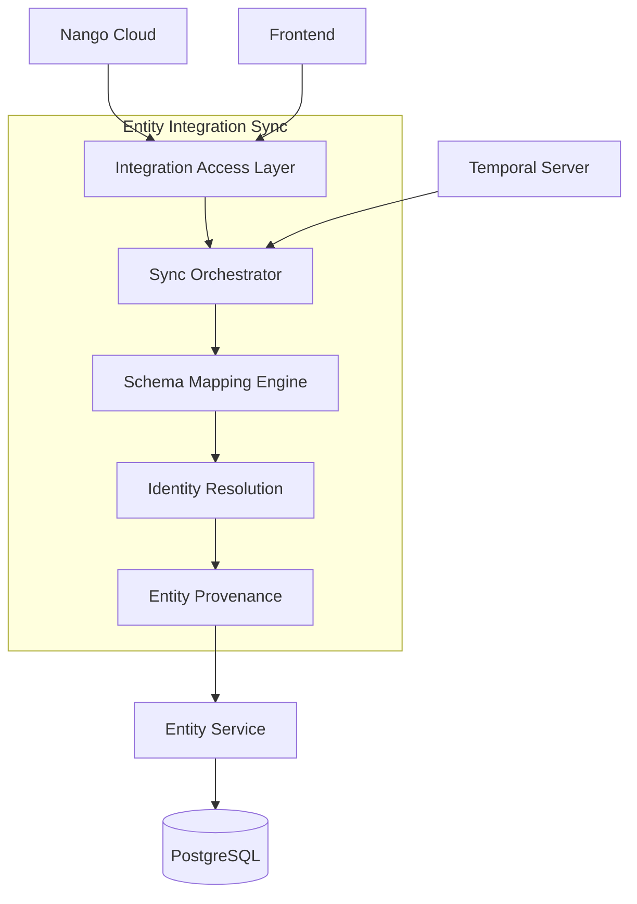
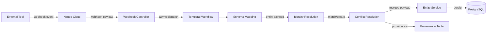
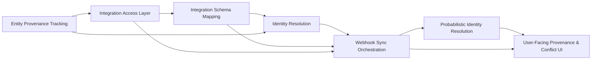

---
tags:
  - architecture/subdomain-plan
Created: 13-02-2026
Updated:
Domains:
  - "[[Integrations]]"
  - "[[Entities]]"
---
# Sub-Domain Plan: Syncing Integrations into Entity Ecosystem

---

> _Overarching design plan for the **Entity Integration Sync** sub-domain. Groups related feature designs, defines architecture and data flows, and sets the implementation sequence._

---

## 1. Vision & Purpose

### What This Sub-Domain Covers

The Entity Integration Sync sub-domain connects third-party SaaS tools via Nango and syncs their data into the Riven entity ecosystem. It provides platform-defined schema mappings to convert external data into entity types, a confidence-based identity resolution system to link incoming records to existing entities, and full provenance tracking at both entity and attribute level — enabling cross-domain intelligence across a team's entire tooling environment.

### Why It Exists as a Distinct Area

Integration sync is a cohesive sub-domain because all its components share a common concern: bringing external data into the entity ecosystem reliably and intelligently. The pipeline stages (connection management → schema mapping → identity resolution → conflict resolution → provenance-tracked persistence) are tightly coupled and must evolve together. Schema mapping changes affect identity resolution signal extraction; provenance tracking enables conflict resolution; connection status drives sync orchestration. No individual stage delivers value alone — they form a coherent data pipeline.

### Boundaries

- **Owns:** Integration connection management, Nango API communication, schema mapping definitions and transformation, identity resolution (all tiers), entity-level and attribute-level provenance tracking, sync pipeline orchestration, conflict resolution rules, webhook ingestion
- **Does NOT own:** Entity type definitions and schema ([[Entities]] domain), entity CRUD operations (EntityService), workflow execution engine ([[Workflows]] domain), user authentication (Workspaces & Users domain), file storage, UI components

---

## 2. Architecture Overview

### System Context



### Core Components

| Component | Responsibility | Status |
|-----------|---------------|--------|
| NangoClientWrapper | REST API client for Nango (OAuth, connections, webhooks) | Planned (Phase 1) |
| IntegrationDefinitionService | Integration catalog queries (by slug, category, active) | Planned (Phase 1) |
| IntegrationConnectionService | Connection lifecycle management with 10-state machine | Planned (Phase 1) |
| SchemaMappingService | Transform external JSON payloads to entity attribute payloads | Planned (Phase 2) |
| IdentityResolutionService | Tiered matching: explicit → deterministic → probabilistic | Planned (Phase 3/5) |
| EntityProvenanceService | Conflict resolution, attribute-level source tracking | Planned (Phase 4) |
| IntegrationSyncOrchestrator | End-to-end pipeline coordination via Temporal | Planned (Phase 4) |
| IntegrationWebhookController | Nango webhook ingestion, signature verification | Planned (Phase 4) |

### Key Design Decisions

| Decision | Rationale | Alternatives Rejected |
|----------|-----------|----------------------|
| Nango as integration infrastructure | Handles OAuth, token refresh, rate limits for 600+ providers — avoids building integration plumbing | Custom OAuth, Merge.dev unified API, Paragon |
| Platform-defined schema mappings | Ensures data quality, simplifies v1 — no mapping editor UI needed | User-configurable mappings (deferred to v2) |
| Tiered identity resolution | Balances automation (high-confidence auto-links) with accuracy (uncertain matches surfaced for review) | Binary match/no-match, ML-only resolution |
| User overrides always win | Respects user intent — manual edits are never silently overwritten by integration syncs | Most-recent-wins for all sources, source priority only |
| Attribute-level provenance in separate table | Supports multi-source entities without bloating entity payload, enables fine-grained conflict resolution | JSONB metadata column on entities, entity-level only |
| 10-state connection lifecycle | Provides precise UX feedback — users see exactly what's happening with each connection | 3-state (connected/disconnected/error), 5-state simplified |

---

## 3. Data Flow

### Primary Flow



### Secondary Flows

- **Error/retry flow:** Failed sync events are retried via Temporal retry policies with exponential backoff. After max retries, connection status transitions to DEGRADED or FAILED.
- **User override flow:** When a user manually edits an integration-synced attribute, override_by_user is set on the attribute provenance. Future sync attempts for that attribute check this flag and preserve the user's value, logging a conflict for review.
- **Reconnection flow:** When a DISCONNECTED or FAILED connection is reconnected (PENDING_AUTHORIZATION → AUTHORIZING → CONNECTED), stale entities get refreshed and identity resolution re-runs on new data.

---

## 4. Feature Map

> Features belonging to this sub-domain and their current pipeline status.

```dataviewjs
const base = "2. Areas/2.1 Startup & Business/Riven/2. System Design/feature-design";
const pages = dv.pages(`"${base}"`)
  .where(p => p.file.name !== "feature-design")
  .where(p => {
    const sd = p["Sub-Domain"];
    if (!sd) return false;
    const items = Array.isArray(sd) ? sd : [sd];
    return items.some(s => String(s).includes(dv.current().file.name));
  });

const getPriority = (p) => {
  const t = (p.tags || []).map(String);
  if (t.some(tag => tag.includes("priority/high"))) return ["High", 1];
  if (t.some(tag => tag.includes("priority/medium"))) return ["Med", 2];
  if (t.some(tag => tag.includes("priority/low"))) return ["Low", 3];
  return ["\u2014", 4];
};

const getDesign = (p) => {
  const t = (p.tags || []).map(String);
  if (t.some(tag => tag.includes("status/implemented"))) return "Implemented";
  if (t.some(tag => tag.includes("status/designed"))) return "Designed";
  if (t.some(tag => tag.includes("status/draft"))) return "Draft";
  return "\u2014";
};

if (pages.length > 0) {
  const rows = pages
    .sort((a, b) => getPriority(a)[1] - getPriority(b)[1])
    .map(p => [
      p.file.link,
      p.file.folder.replace(/.*\//, ""),
      getPriority(p)[0],
      getDesign(p),
      p["blocked-by"] ? "Yes" : ""
    ]);
  dv.table(["Feature", "Stage", "P", "Design", "Blocked"], rows);
} else {
  dv.paragraph("*No features linked yet. Add `Sub-Domain: \"[[" + dv.current().file.name + "]]\"` to feature frontmatter to link them here.*");
}
```

---

## 5. Feature Dependencies



### Implementation Sequence

| Phase | Features | Rationale |
|-------|----------|-----------|
| 1 | [[Entity Provenance Tracking]], [[Integration Access Layer]] | Foundation — provenance schema and integration infrastructure unblock everything else |
| 2 | [[Integration Schema Mapping]] | Core capability — transform external data into entity payloads |
| 3 | [[Integration Identity Resolution System]] (deterministic only) | Match incoming records to existing entities with high confidence |
| 4 | Webhook Integration + Sync Orchestration | End-to-end pipeline connecting all prior components |
| 5 | Probabilistic Identity Resolution | Enhanced matching with fuzzy signals and confidence scoring |
| 6 | User-Facing Provenance + Conflict Management | UI for match review, conflict resolution, provenance transparency |

---

## 6. Domain Interactions

### Depends On

| Domain / Sub-Domain | What We Need | Integration Point |
|---------------------|-------------|-------------------|
| [[Entities]] | Entity storage, type definitions, schema validation, relationships | Direct service calls (EntityService, EntityTypeService) |
| [[Workflows]] | Temporal workflow orchestration for async sync pipeline | Temporal SDK — dedicated task queue for sync workflows |
| Workspaces & Users | Workspace scoping, user authentication, role-based authorization | JWT auth, @PreAuthorize, workspace_members for RLS |

### Consumed By

| Domain / Sub-Domain | What They Need | Integration Point |
|---------------------|---------------|-------------------|
| Frontend UI | Connection status, provenance display, match review interface | REST API (controllers in later phases) |
| [[Workflows]] | Integration actions — trigger syncs, query integration data | WorkflowActionType.INTEGRATION_REQUEST (existing enum, not yet implemented) |

### Cross-Cutting Concerns

- Workspace scoping: all integration data (connections, mappings, sync events) is workspace-scoped with RLS policies matching the existing entity pattern
- Audit logging: connection lifecycle events and sync operations logged via ActivityService
- Soft delete: follows existing pattern for entity-related data
- JSONB payload storage: integration metadata uses the same Hypersistence Utils JsonBinaryType pattern as entity payloads

---

## 7. Design Constraints

- **Tech Stack:** Must integrate within existing Kotlin/Spring Boot architecture using established patterns (layered architecture, JPA entities, DTOs, workspace-scoped repositories)
- **Integration Infrastructure:** Nango is the chosen integration layer — no alternative integration platforms
- **Multi-tenancy:** All integration data must be workspace-scoped and respect existing RLS policies
- **Schema Compatibility:** Entity provenance fields must not break existing entity creation/update flows — user-created entities work exactly as before with sensible defaults
- **Database:** PostgreSQL with Flyway migrations; new tables follow established conventions (soft delete, audit fields, workspace FK)

---

## 8. Open Questions

> [!warning] Unresolved
>
> - [ ] Nango webhook payload structure needs verification during Phase 4 implementation — documentation was incomplete during research
> - [ ] Exact Nango provider keys for each target integration (hubspot vs hubspot-crm) need validation against Nango's current catalog
> - [ ] Attribute provenance tracking trigger mechanism — application code vs database trigger (recommendation: application code for v1, evaluate trigger if performance issues arise)
> - [ ] Schema mapping versioning strategy — how to handle external API schema changes over time (field renames, deprecations)

---

## 9. Decisions Log

| Date | Decision | Rationale | Alternatives Considered |
|------|----------|-----------|------------------------|
| 2026-02-13 | Nango as integration infrastructure | Handles OAuth, token refresh, rate limits — avoids building integration plumbing | Custom OAuth, Merge.dev, Paragon |
| 2026-02-13 | Database-stored integration catalog | Enables future admin management without code deployments | Code-defined enum, config files |
| 2026-02-13 | 10-state connection lifecycle | Precise UX feedback for connection health visibility | 3-state or 5-state simplified models |
| 2026-02-13 | Five fixed source types (enum) | Clean taxonomy covers all entity creation paths | Extensible string-based types, per-integration types |
| 2026-02-13 | Attribute-level provenance in separate table | Supports multi-source entities, enables fine-grained conflict resolution | JSONB metadata on entity, entity-level provenance only |

---

## 10. Related Documents

- [[Integration Access Layer]]
- [[Entity Provenance Tracking]]
- [[Integration Schema Mapping]]
- [[Integration Identity Resolution System]]
- [[ADR-001 Nango as Integration Infrastructure]]
- [[Flow Integration Connection Lifecycle]]
- [[Entities]]
- [[Workflows]]

---

## 11. Changelog

| Date | Author | Change |
|------|--------|--------|
| 2026-02-13 | Claude | Populated from GSD Phase 1 planning documents |
